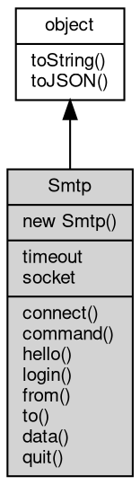

# Object Smtp
A minimal SMTP client that talks to a mail server command by command

Smtp speaks the SMTP protocol over a TCP or TLS connection and exposes the
protocol step by step: connect reads the server greeting, hello identifies the
client, login authenticates, from/to build the envelope and data transfers the
message text. The [object](object.md) does not build MIME messages and does not manage a
queue; it is the protocol layer, so the caller decides the header text and the
command order (the raw command member covers servers that need a custom
sequence).

Concepts:
- **Session order**: after connect the server has already sent its greeting;
  the usual order is hello, login (when the server requires authentication),
  from, one or more to calls, data and quit. Each member returns when the
  corresponding server answer has been read, and throws when the answer
  carries a 5xx code, so an error surfaces at the command that caused it.
- **Transport and TLS**: connect accepts `tcp://host:port` and
  `ssl://host:port`. With `tcp://` the client also offers STARTTLS after the
  greeting and upgrades the connection when the server accepts; `ssl://`
  starts the TLS handshake immediately.
- **[Message](Message.md) text**: data sends the given text and terminates it with the
  `CRLF.CRLF` sequence; the headers (From, To, Subject, ...) are part of that
  text. Make sure the text uses CRLF line endings yourself.
- **timeout**: milliseconds; 0 (the default) means no timeout. It is used for
  the connection and stored on the socket.

Obtained from:
- `new [net.Smtp](../../module/ifs/net.md#Smtp)()` — an unconnected client;
- `net.openSmtp([url](../../module/ifs/url.md), timeout)` — creates the client and connects, returning it
  ready for the protocol commands;
- `net.Smtp` — the class entry point exposed by the [net](../../module/ifs/net.md) [module](../../module/ifs/module.md).

Example 1 — a complete session:

```JavaScript
// requires: network
const net = require('net');

const smtp = new net.Smtp();
smtp.timeout = 10000;
smtp.connect('tcp://smtp.example.com:25');
smtp.hello('client.example.com');
smtp.login('sender@example.com', 'password');
smtp.from('sender@example.com');
smtp.to('first@example.com');
smtp.to('second@example.com');
smtp.data('Subject: hello\r\n\r\nThis is the message body.');
smtp.quit();
```

Example 2 — [net.openSmtp](../../module/ifs/net.md#openSmtp) and a raw command:

```JavaScript
// requires: network
const net = require('net');

const smtp = net.openSmtp('ssl://smtp.example.com:465', 10000);
const caps = smtp.command('EHLO', 'client.example.com');
console.log(caps.split('\r\n')[0].slice(0, 3)); // the status code, e.g. 250
smtp.quit();
```

## Inheritance


## Constructors
        
### Smtp
**Smtp [object](object.md) constructor**

```JavaScript
new Smtp();
```

Creates an unconnected client with no timeout (0 means no timeout) and no
socket; connect must be called before any protocol member. The [object](object.md) is
normally built through `new [net.Smtp](../../module/ifs/net.md#Smtp)()` or [net.openSmtp](../../module/ifs/net.md#openSmtp), which connects it
immediately; see the class description for the session order and the
accepted transports.

## Properties
        
### timeout
**Integer, Queries and sets the timeout in milliseconds**

```JavaScript
Integer Smtp.timeout;
```

The value bounds the connection attempt and is applied to the socket;
0 (the default) means no timeout. Set it before connect.

Example — no connection is needed to use the property:

```JavaScript
const net = require('net');

const smtp = new net.Smtp();
smtp.timeout = 5000;
console.log(smtp.timeout); // 5000

// no connection has been made yet
console.log(smtp.socket); // null
```

--------------------------
### socket
**[Stream](Stream.md), Queries the [Socket](Socket.md) currently connected to the Smtp [object](object.md)**

```JavaScript
readonly Stream Smtp.socket;
```

Returns the underlying stream, a [net.Socket](../../module/ifs/net.md#Socket) or a [TLSSocket](TLSSocket.md) depending on
the protocol, or null before connect (and after the connection has been
closed by the peer). The stream can be used for the transport level
operations that the command members do not cover; a null value is the
reliable [test](../../module/ifs/test.md) for "not connected".

## Methods
        
### connect
**Establishes a connection to the specified server**

```JavaScript
Smtp.connect(String url) async;
```

Parameters:
* url: String, the connection protocol, which can be: tcp://host:port or ssl://host:port

Parses [url](../../module/ifs/url.md) and opens the connection, then reads the server greeting. The
[url](../../module/ifs/url.md) must contain the protocol and the port: `tcp://host:port` or
`ssl://host:port`. For a `tcp://` [url](../../module/ifs/url.md) the client also offers STARTTLS
after the greeting and switches to TLS when the server accepts, so a
server that refuses it (or a plain-text session) continues unencrypted.

Throws when the [object](object.md) is already connected and on connection or URL
errors; the timeout member bounds the connection attempt.

--------------------------
### command
**Sends a command and returns the response; a 5xx answer throws**

```JavaScript
String Smtp.command(String cmd,
    String arg) async;
```

Parameters:
* cmd: String, command name
* arg: String, parameter

Returns:
* String, returns the server response on success

Sends `cmd` and `arg` separated by a space and terminated with CRLF, then
reads the whole response: a multi-line reply is returned with the lines
joined by CRLF. A reply whose first line starts with `5` (a permanent
error) throws with the server line as the message; 2xx, 3xx and 4xx
replies are returned to the caller.

Example — identify the client with the extended hello:

```JavaScript
// requires: network
const net = require('net');

const smtp = new net.Smtp();
smtp.connect('tcp://smtp.example.com:25');
const response = smtp.command('EHLO', 'client.example.com');
console.log(response.split('\r\n')[0].slice(0, 3)); // e.g. 250
smtp.quit();
```

--------------------------
### hello
**Sends the HELO command; throws an error if the server reports an error**

```JavaScript
Smtp.hello(String hostname = "localhost") async;
```

Parameters:
* hostname: String, host name, default is "localhost"

Sends `HELO <hostname>` and reads the answer. For a `tcp://` connection
the member also performs the STARTTLS offer, so it is normally the first
command after connect; the default hostname is "localhost". Use command
with EHLO when the server only advertises its extensions through the
extended hello.

--------------------------
### login
**Logs in with the specified user and password; a 5xx answer throws**

```JavaScript
Smtp.login(String username,
    String password) async;
```

Parameters:
* username: String, user name
* password: String, password

Runs the AUTH LOGIN exchange: the user name and the password are sent
[base64](../../module/ifs/base64.md)-encoded in two steps, exactly as the server requests them. A
permanent error answer (5xx, for example wrong credentials) throws.

Example — authenticate before building the envelope:

```JavaScript
// requires: network
const net = require('net');

const smtp = new net.Smtp();
smtp.connect('tcp://smtp.example.com:25');
smtp.hello();
smtp.login('sender@example.com', 'password');
smtp.quit();
```

--------------------------
### from
**Specifies the sender mailbox; throws an error if the server reports an error**

```JavaScript
Smtp.from(String address) async;
```

Parameters:
* address: String, sender mailbox

Sends `MAIL FROM:<address>`; the angle brackets are added when the given
address does not already contain `<`. The member must be called before to.

--------------------------
### to
**Specifies the recipient mailbox; throws an error if the server reports an error**

```JavaScript
Smtp.to(String address) async;
```

Parameters:
* address: String, recipient mailbox

Sends `RCPT TO:<address>`; the angle brackets are added when the given
address does not already contain `<`. The member may be called several
times, once per recipient, and requires from before it.

--------------------------
### data
**Sends text to the recipient; throws an error if the server reports an error**

```JavaScript
Smtp.data(String txt) async;
```

Parameters:
* txt: String, the text to send

Sends DATA, waits for the intermediate answer and transfers the text
followed by the terminating `CRLF.CRLF` line. The text is sent as given —
headers and body — so use CRLF line endings and separate the headers from
the body with an empty line.

--------------------------
### quit
**Quits and closes the connection; throws an error if the server reports an error**

```JavaScript
Smtp.quit() async;
```

Sends QUIT and reads the answer; the server normally closes the
connection afterwards. Call it at the end of a session to release the
socket promptly.

--------------------------
### toString
**Returns the string form of the [object](object.md)**

```JavaScript
String Smtp.toString();
```

Returns:
* String, returns the string form of the [object](object.md)

The base implementation reports an error: a native [object](object.md) has no implicit
text form, and only the classes whose value can be written as a string
override the member. [Buffer](Buffer.md) returns its content decoded with the given
[encoding](../../module/ifs/encoding.md), [HttpCookie](HttpCookie.md) returns "name=value", and so on; an override commonly
accepts optional arguments ([Buffer.toString](Buffer.md#toString) takes [encoding](../../module/ifs/encoding.md), start and
end) that are not part of this declaration.

Calling the member on a class that does not override it throws
"<Class>: the [object](object.md) can not be converted to string.", which is the
behavior to rely on when probing whether a value has a string form. See
toJSON for the serialization hook.

--------------------------
### toJSON
**Returns the JSON representation of the [object](object.md)**

```JavaScript
Value Smtp.toJSON(String key = "");
```

Parameters:
* key: String, the property name of the value being serialized

Returns:
* Value, returns the JSON-serializable value

JSON.stringify(value) calls value.toJSON(key) when the member exists and
serializes the returned value in its place; the key argument carries the
property name of the value inside its parent [object](object.md) (an empty string at
the top level) and may be used to build a keyed form. The base
implementation returns a plain [object](object.md) holding the readable properties of
the instance, so a native [object](object.md) serializes without per-class code; a
class with a portable shape such as [Buffer](Buffer.md) overrides it, and a JavaScript
class may override it in the same way.

The member is normally reached through JSON.stringify rather than called
directly; calling it returns the same value JSON.stringify would
serialize.

