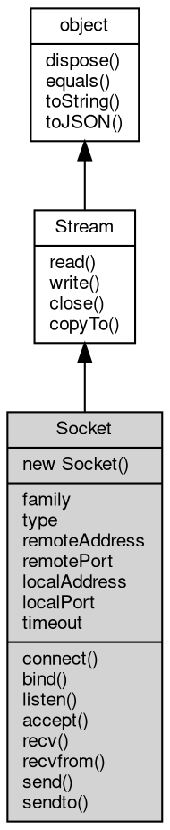

# 对象 Socket
网络套接口对象

Socket 属于 [net](../../module/ifs/net.md) 模块，创建方法

```JavaScript
var s = new net.Socket();
```

## 继承关系


## 构造函数
        
### Socket
**Socket 构造函数，创建一个新的 Socket 对象**

```JavaScript
new Socket(Integer family = net.AF_INET,
    Integer type = net.SOCK_STREAM);
```

调用参数:
* family: Integer, 指定地址集，缺省为 AF_INET，ipv4
* type: Integer, 指定协议族，缺省为 SOCK_STREAM，tcp

## 成员属性
        
### family
**Integer, 查询当前 Socket 对象的地址集**

```JavaScript
readonly Integer Socket.family;
```

--------------------------
### type
**Integer, 查询当前 Socket 对象的协议族**

```JavaScript
readonly Integer Socket.type;
```

--------------------------
### remoteAddress
**String, 查询当前连接的对方地址**

```JavaScript
readonly String Socket.remoteAddress;
```

--------------------------
### remotePort
**Integer, 查询当前连接的对方端口**

```JavaScript
readonly Integer Socket.remotePort;
```

--------------------------
### localAddress
**String, 查询当前连接的本地地址**

```JavaScript
readonly String Socket.localAddress;
```

--------------------------
### localPort
**Integer, 查询当前连接的本地端口**

```JavaScript
readonly Integer Socket.localPort;
```

--------------------------
### timeout
**Integer, 查询和设置超时时间 单位毫秒**

```JavaScript
Integer Socket.timeout;
```

## 成员函数
        
### connect
**建立一个 tcp 连接**

```JavaScript
Socket.connect(String host,
    Integer port) async;
```

调用参数:
* host: String, 指定对方地址或主机名
* port: Integer, 指定对方端口

--------------------------
### bind
**将当前 Socket 绑定至本地所有地址的指定端口**

```JavaScript
Socket.bind(Integer port,
    Boolean allowIPv4 = true);
```

调用参数:
* port: Integer, 指定绑定的端口
* allowIPv4: Boolean, 指定是否接受 ipv4 连接，缺省为 true。本参数在 ipv6 时有效，并依赖于操作系统

--------------------------
**将当前 Socket 绑定至指定地址的指定端口**

```JavaScript
Socket.bind(String addr,
    Integer port,
    Boolean allowIPv4 = true);
```

调用参数:
* addr: String, 指定绑定的地址
* port: Integer, 指定绑定的端口
* allowIPv4: Boolean, 指定是否接受 ipv4 连接，缺省为 true。本参数在 ipv6 时有效，并依赖于操作系统

--------------------------
### listen
**开始监听连接请求**

```JavaScript
Socket.listen(Integer backlog = 120);
```

调用参数:
* backlog: Integer, 指定请求队列长度，超出的请求将被拒绝，缺省为 120

--------------------------
### accept
**等待并接受一个连接**

```JavaScript
Socket Socket.accept() async;
```

返回结果:
* Socket, 返回接收到得连接对象

--------------------------
### recv
**从连接读取指定大小的数据，不同于 read 方法，recv 并不保证读完要求的数据，而是在读取到数据后立即返回**

```JavaScript
Buffer Socket.recv(Integer bytes = -1) async;
```

调用参数:
* bytes: Integer, 指定要读取的数据量，缺省读取任意尺寸的数据

返回结果:
* [Buffer](Buffer.md), 返回从连接读取的数据

--------------------------
### recvfrom
**读取一个 UDP 包**

```JavaScript
NObject Socket.recvfrom(Integer bytes = -1) async;
```

调用参数:
* bytes: Integer, 指定要读取的数据量，缺省读取任意尺寸的数据

返回结果:
* NObject, 返回从连接读取的数据包

recvfrom 返回结果中包含以下内容：
  - data: 接收到的二进制数据块
  - address: 发送方的地址
  - port: 发送方的端口

--------------------------
### send
**将给定的数据写入连接，此方法等效于 write 方法**

```JavaScript
Socket.send(Buffer data) async;
```

调用参数:
* data: [Buffer](Buffer.md), 给定要写入的数据

--------------------------
### sendto
**向给定 ip:port 发送一个 UDP 包**

```JavaScript
Socket.sendto(Buffer data,
    String host,
    Integer port) async;
```

调用参数:
* data: [Buffer](Buffer.md), 给定要写入的数据
* host: String, 指定目标 ip 或主机名
* port: Integer, 指定目标端口

--------------------------
### read
**从流内读取指定大小的数据**

```JavaScript
Buffer Socket.read(Integer bytes = -1) async;
```

调用参数:
* bytes: Integer, 指定要读取的数据量，缺省为读取随机大小的数据块，读出的数据尺寸取决于设备

返回结果:
* [Buffer](Buffer.md), 返回从流内读取的数据，若无数据可读，或者连接中断，则返回 null

--------------------------
### write
**将给定的数据写入流**

```JavaScript
Socket.write(Buffer data) async;
```

调用参数:
* data: [Buffer](Buffer.md), 给定要写入的数据

--------------------------
### close
**关闭当前流对象**

```JavaScript
Socket.close() async;
```

--------------------------
### copyTo
**复制流数据到目标流中**

```JavaScript
Long Socket.copyTo(Stream stm,
    Long bytes = -1) async;
```

调用参数:
* stm: [Stream](Stream.md), 目标流对象
* bytes: Long, 复制的字节数

返回结果:
* Long, 返回复制的字节数

--------------------------
### dispose
**强制回收对象，调用此方法后，对象资源将立即释放**

```JavaScript
Socket.dispose();
```

--------------------------
### equals
**比较当前对象与给定的对象是否相等**

```JavaScript
Boolean Socket.equals(object expected);
```

调用参数:
* expected: [object](object.md), 制定比较的目标对象

返回结果:
* Boolean, 返回对象比较的结果

--------------------------
### toString
**返回对象的字符串表示，一般返回 "[Native Object]"，对象可以根据自己的特性重新实现**

```JavaScript
String Socket.toString();
```

返回结果:
* String, 返回对象的字符串表示

--------------------------
### toJSON
**返回对象的 JSON 格式表示，一般返回对象定义的可读属性集合**

```JavaScript
Value Socket.toJSON(String key = "");
```

调用参数:
* key: String, 未使用

返回结果:
* Value, 返回包含可 JSON 序列化的值

