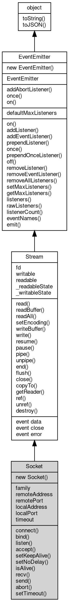

# 对象 Socket
网络套接口对象

Socket 属于 [net](../../module/ifs/net.md) 模块，提供 TCP、unix socket 与 Windows pipe 的连接、监听与收发能力，创建方法：

```JavaScript
var s = new net.Socket();
```

Socket 继承自 [Stream](Stream.md)，具备流式读写能力，并提供以下网络特性：

- **连接**：`connect` 以多种形式建立连接，连接成功后可用 `send`/`recv` 收发数据；
- **服务端**：`bind` 绑定地址与端口，`listen` 开始监听，`accept` 接受连接；
- **调优**：`setKeepAlive` 保持活动机制、`setNoDelay` 禁用 Nagle 算法、`setTimeout`/`timeout` 超时控制；
- **状态**：`remoteAddress`/`remotePort`/`localAddress`/`localPort` 查询连接地址信息，`isAlive` 检查连接可用性。

## 继承关系

```dot
digraph {
    node [fontname="Helvetica,sans-Serif", fontsize=10, shape="record", style="filled", fillcolor="white"];

    object [tooltip="object", URL="object.md", label="{object|toString()\ltoJSON()\l}"];
    EventEmitter [tooltip="EventEmitter", URL="EventEmitter.md", label="{EventEmitter|new EventEmitter()\l|EventEmitter\l|addAbortListener()\lonce()\lon()\l|defaultMaxListeners\l|on()\laddListener()\laddEventListener()\lprependListener()\lonce()\lprependOnceListener()\loff()\lremoveListener()\lremoveEventListener()\lremoveAllListeners()\lsetMaxListeners()\lgetMaxListeners()\llisteners()\lrawListeners()\llistenerCount()\leventNames()\lemit()\l}"];
    Stream [tooltip="Stream", URL="Stream.md", label="{Stream|fd\lwritable\lreadable\l_readableState\l_writableState\l|read()\lreadBuffer()\lreadAll()\lsetEncoding()\lwriteBuffer()\lwrite()\lresume()\lpause()\lpipe()\lunpipe()\lend()\lflush()\lclose()\lcopyTo()\lgetReader()\lref()\lunref()\ldestroy()\l|event data\levent close\levent error\l}"];
    Socket [tooltip="Socket", fillcolor="lightgray", id="me", label="{Socket|new Socket()\l|family\lremoteAddress\lremotePort\llocalAddress\llocalPort\ltimeout\l|connect()\lbind()\llisten()\laccept()\lsetKeepAlive()\lsetNoDelay()\lisAlive()\lrecv()\lsend()\labort()\lsetTimeout()\l}"];

    object -> EventEmitter [dir=back];
    EventEmitter -> Stream [dir=back];
    Stream -> Socket [dir=back];
}
```

## 构造函数
        
### Socket
**Socket 构造函数，创建一个新的 Socket 对象**

```JavaScript
new Socket(Integer family = net.AF_INET);
```

调用参数:
* family: Integer, 指定地址集，缺省为 AF_INET，ipv4

## 静态函数
        
### addAbortListener
**监听一个 [AbortSignal](AbortSignal.md) 的 abort 事件，返回一个可释放的对象**

```JavaScript
static Object Socket.addAbortListener(EventEmitter signal,
    Function func);
```

调用参数:
* signal: [EventEmitter](EventEmitter.md), 要监听的 [AbortSignal](AbortSignal.md) 对象
* func: Function, abort 事件的处理函数

返回结果:
* Object, 返回一个包含 `[Symbol.dispose]` 方法的 Disposable 对象

返回的对象包含 `[Symbol.dispose]()` 方法，调用后将移除监听器。如果信号已中止，则监听器会被立即调用。

--------------------------
### once
**创建一个 Promise，等待指定事件触发一次后解析**

```JavaScript
static Object Socket.once(EventEmitter emitter,
    Value ev,
    Object options = {});
```

调用参数:
* emitter: [EventEmitter](EventEmitter.md), 要监听的事件触发器对象
* ev: Value, 指定事件的名称
* options: Object, 可选参数对象

返回结果:
* Object, 返回 Promise，以事件参数数组解析

返回一个 Promise，当目标事件触发时以事件参数数组解析。如果在此期间触发 'error' 事件（且监听的不是 'error' 事件本身），Promise 将被拒绝。

options 参数可包含：
- signal: [AbortSignal](AbortSignal.md)，用于取消等待

--------------------------
### on
**创建一个异步迭代器，持续监听指定事件**

```JavaScript
static Object Socket.on(EventEmitter emitter,
    Value ev,
    Object options = {});
```

调用参数:
* emitter: [EventEmitter](EventEmitter.md), 要监听的事件触发器对象
* ev: Value, 指定事件的名称
* options: Object, 可选参数对象

返回结果:
* Object, 返回 AsyncIterator 对象

返回一个 AsyncIterator，每次事件触发时产出事件参数数组。如果触发 'error' 事件，迭代器将抛出错误。

options 参数可包含：
- signal: [AbortSignal](AbortSignal.md)，用于取消迭代
- close: 字符串数组，指定结束迭代的事件名称

## 静态属性
        
### defaultMaxListeners
**Integer, 默认全局最大监听器数**

```JavaScript
static Integer Socket.defaultMaxListeners;
```

## 成员属性
        
### family
**Integer, 查询当前 Socket 对象的地址集**

```JavaScript
readonly Integer Socket.family;
```

--------------------------
### remoteAddress
**String, 查询当前连接的对方地址**

```JavaScript
readonly String Socket.remoteAddress;
```

--------------------------
### remotePort
**Integer, 查询当前连接的对方端口**

```JavaScript
readonly Integer Socket.remotePort;
```

--------------------------
### localAddress
**String, 查询当前连接的本地地址**

```JavaScript
readonly String Socket.localAddress;
```

--------------------------
### localPort
**Integer, 查询当前连接的本地端口**

```JavaScript
readonly Integer Socket.localPort;
```

--------------------------
### timeout
**Integer, 查询和设置超时时间 单位毫秒**

```JavaScript
Integer Socket.timeout;
```

--------------------------
### fd
**Integer, 查询 [Stream](Stream.md) 对应的文件描述符值, 由子类实现**

```JavaScript
readonly Integer Socket.fd;
```

--------------------------
### writable
**Boolean, 查询流是否可写**

```JavaScript
readonly Boolean Socket.writable;
```

--------------------------
### readable
**Boolean, 查询流是否可读**

```JavaScript
readonly Boolean Socket.readable;
```

--------------------------
### _readableState
**Object, 查询流的可读状态对象**

```JavaScript
readonly Object Socket._readableState;
```

--------------------------
### _writableState
**Object, 查询流的可写状态对象**

```JavaScript
readonly Object Socket._writableState;
```

## 成员函数
        
### connect
**建立一个 tcp 连接**

```JavaScript
Stream Socket.connect(Integer port,
    String host = "localhost",
    Integer timeout = 0) async;
```

调用参数:
* port: Integer, 指定对方端口
* host: String, 指定对方地址或主机名，缺省为 localhost
* timeout: Integer, 指定超时时间，单位是毫秒，默认为 0

返回结果:
* [Stream](Stream.md), 返回连接的 Socket 对象

--------------------------
**建立一个 unix socket 或 Windows pipe 连接**

```JavaScript
Stream Socket.connect(String path,
    Integer timeout = 0) async;
```

调用参数:
* path: String, 指定 unix socket 或 Windows pipe 路径
* timeout: Integer, 指定超时时间，单位是毫秒，默认为 0

返回结果:
* [Stream](Stream.md), 返回连接的 Socket 对象

--------------------------
**建立一个连接**

```JavaScript
Stream Socket.connect(Object options) async;
```

调用参数:
* options: Object, 指定连接选项对象

返回结果:
* [Stream](Stream.md), 返回连接的 Socket 对象

options 参数可以包含以下属性：
 - port: 指定对方端口
 - host: 指定对方地址或主机名
 - timeout: 指定超时时间，单位是毫秒，默认为 0

--------------------------
**建立一个连接，并在连接建立后触发 connect 事件**

```JavaScript
Stream Socket.connect(Integer port,
    Function connectListener) async;
```

调用参数:
* port: Integer, 指定对方端口
* connectListener: Function, 指定 once 的 connect 事件监听器

返回结果:
* [Stream](Stream.md), 返回连接的 Socket 对象

--------------------------
**建立一个连接，并在连接建立后触发 connect 事件**

```JavaScript
Stream Socket.connect(Integer port,
    String host,
    Function connectListener) async;
```

调用参数:
* port: Integer, 指定对方端口
* host: String, 指定对方地址或主机名，缺省为 localhost
* connectListener: Function, 指定 once 的 connect 事件监听器

返回结果:
* [Stream](Stream.md), 返回连接的 Socket 对象

--------------------------
**建立一个连接，并在连接建立后触发 connect 事件**

```JavaScript
Stream Socket.connect(Integer port,
    String host,
    Integer timeout,
    Function connectListener) async;
```

调用参数:
* port: Integer, 指定对方端口
* host: String, 指定对方地址或主机名，缺省为 localhost
* timeout: Integer, 指定超时时间，单位是毫秒，默认为 0
* connectListener: Function, 指定 once 的 connect 事件监听器

返回结果:
* [Stream](Stream.md), 返回连接的 Socket 对象

--------------------------
**建立一个连接，并在连接建立后触发 connect 事件**

```JavaScript
Stream Socket.connect(String path,
    Function connectListener) async;
```

调用参数:
* path: String, 指定 unix socket 或 Windows pipe 路径
* connectListener: Function, 指定 once 的 connect 事件监听器

返回结果:
* [Stream](Stream.md), 返回连接的 Socket 对象

--------------------------
**建立一个连接，并在连接建立后触发 connect 事件**

```JavaScript
Stream Socket.connect(String path,
    Integer timeout,
    Function connectListener) async;
```

调用参数:
* path: String, 指定 unix socket 或 Windows pipe 路径
* timeout: Integer, 指定超时时间，单位是毫秒，默认为 0
* connectListener: Function, 指定 once 的 connect 事件监听器

返回结果:
* [Stream](Stream.md), 返回连接的 Socket 对象

--------------------------
**建立一个连接，并在连接建立后触发 connect 事件**

```JavaScript
Stream Socket.connect(Object options,
    Function connectListener) async;
```

调用参数:
* options: Object, 指定连接选项对象，可以包含以下属性：
* connectListener: Function, 指定 once 的 connect 事件监听器

返回结果:
* [Stream](Stream.md), 返回连接的 Socket 对象

--------------------------
### bind
**将当前 Socket 绑定至本地所有地址的指定端口**

```JavaScript
Socket.bind(Integer port,
    Boolean allowIPv4 = true);
```

调用参数:
* port: Integer, 指定绑定的端口
* allowIPv4: Boolean, 指定是否接受 ipv4 连接，缺省为 true。本参数在 ipv6 时有效，并依赖于操作系统

--------------------------
**将当前 Socket 绑定至指定地址的指定端口**

```JavaScript
Socket.bind(String addr,
    Integer port = 0,
    Boolean allowIPv4 = true);
```

调用参数:
* addr: String, 指定绑定的地址，也可以指向 unix socket 和 Windows pipe 路径
* port: Integer, 指定绑定的端口，绑定 unix socket 和 Windows pipe 时，忽略此参数
* allowIPv4: Boolean, 指定是否接受 ipv4 连接，缺省为 true。本参数在 ipv6 时有效，并依赖于操作系统

--------------------------
### listen
**开始监听连接请求**

```JavaScript
Socket.listen(Integer backlog = 120);
```

调用参数:
* backlog: Integer, 指定请求队列长度，超出的请求将被拒绝，缺省为 120

--------------------------
### accept
**等待并接受一个连接**

```JavaScript
Socket Socket.accept() async;
```

返回结果:
* Socket, 返回接收到得连接对象

--------------------------
### setKeepAlive
**启用或禁用 TCP 保持活动机制**

```JavaScript
Socket.setKeepAlive(Boolean enable = false,
    Integer initialDelay = 0);
```

调用参数:
* enable: Boolean, 指定是否启用保持活动机制，缺省为 false
* initialDelay: Integer, 指定初始延迟时间，单位为秒，缺省为 0

--------------------------
### setNoDelay
**启用或禁用 Nagle 算法**

```JavaScript
Socket.setNoDelay(Boolean noDelay = true);
```

调用参数:
* noDelay: Boolean, 指定是否禁用 Nagle 算法，缺省为 true

--------------------------
### isAlive
**检查 socket 当前看起来是否仍然可用**

```JavaScript
Boolean Socket.isAlive();
```

返回结果:
* Boolean, 返回 socket 当前看起来是否仍然可用

此方法执行一次尽力而为的非阻塞检测，不会消耗已收到的数据。
返回 false 表示 socket 已明确不可用，返回 true 只表示当前没有检测到关闭状态。

--------------------------
### recv
**从连接读取指定大小的数据，不同于 read 方法，recv 并不保证读完要求的数据，而是在读取到数据后立即返回**

```JavaScript
Buffer Socket.recv(Integer bytes = -1) async;
```

调用参数:
* bytes: Integer, 指定要读取的数据量，缺省读取任意尺寸的数据

返回结果:
* [Buffer](Buffer.md), 返回从连接读取的数据

--------------------------
### send
**将给定的数据写入连接，此方法等效于 write 方法**

```JavaScript
Integer Socket.send(Buffer data) async;
```

调用参数:
* data: [Buffer](Buffer.md), 给定要写入的数据

返回结果:
* Integer, 返回实际写入的字节数

--------------------------
### abort
**中止当前 socket 上所有正在进行的操作**

```JavaScript
Socket.abort();
```

此方法会取消所有正在等待的异步操作（connect, recv, send 等），
被取消的操作会返回错误。socket 本身不会被关闭，可以继续使用。

--------------------------
### setTimeout
**设置 socket 超时时间**

```JavaScript
Socket Socket.setTimeout(Integer timeout);
```

调用参数:
* timeout: Integer, 超时时间（毫秒）。设置为 0 则禁用超时。

返回结果:
* Socket, 返回当前 Socket 对象

--------------------------
**设置 socket 超时时间，并注册一次性 'timeout' 事件监听器**

```JavaScript
Socket Socket.setTimeout(Integer timeout,
    Function callback);
```

调用参数:
* timeout: Integer, 超时时间（毫秒）。设置为 0 则禁用超时。
* callback: Function, 回调函数，当 socket 超时时被调用一次

返回结果:
* Socket, 返回当前 Socket 对象

--------------------------
### read
**从流内读取指定大小的数据**

```JavaScript
Variant Socket.read(Integer bytes = -1) async;
```

调用参数:
* bytes: Integer, 指定要读取的数据量，缺省为读取随机大小的数据块，读出的数据尺寸取决于设备

返回结果:
* Variant, 返回从流内读取的数据。若设置了编码则返回字符串，否则返回 [Buffer](Buffer.md)。若无数据可读，或者连接中断，则返回 null

--------------------------
### readBuffer
**从流内读取指定大小的数据，以 [Buffer](Buffer.md) 形式返回**

```JavaScript
Buffer Socket.readBuffer(Integer bytes = -1) async;
```

调用参数:
* bytes: Integer, 指定要读取的数据量，缺省为读取随机大小的数据块，读出的数据尺寸取决于设备

返回结果:
* [Buffer](Buffer.md), 返回从流内读取的 [Buffer](Buffer.md) 数据，若无数据可读，或者连接中断，则返回 null

--------------------------
### readAll
**从流内读取剩余的全部数据**

```JavaScript
Buffer Socket.readAll() async;
```

返回结果:
* [Buffer](Buffer.md), 返回从流内读取的数据，若无数据可读，或者连接中断，则返回 null

--------------------------
### setEncoding
**设置流的编码方式。设置后 read() 将返回字符串而非 [Buffer](Buffer.md) 对象**

```JavaScript
Stream Socket.setEncoding(String encoding);
```

调用参数:
* encoding: String, 要使用的编码，如 'utf8'、'ascii'、'[hex](../../module/ifs/hex.md)' 等。传入 null 恢复为 [Buffer](Buffer.md) 模式

返回结果:
* [Stream](Stream.md), 返回当前流对象

--------------------------
### writeBuffer
**将给定的二进制数据写入流**

```JavaScript
Socket.writeBuffer(Buffer data) async;
```

调用参数:
* data: [Buffer](Buffer.md), 给定要写入的 [Buffer](Buffer.md) 数据

--------------------------
### write
**将给定的数据写入流**

```JavaScript
Boolean Socket.write(Buffer data) async;
```

调用参数:
* data: [Buffer](Buffer.md), 给定要写入的数据

返回结果:
* Boolean, 如果流希望调用代码在继续写入其他数据之前等待 'drain' 事件，则返回 true；否则返回 false

--------------------------
**将给定的数据写入流**

```JavaScript
Boolean Socket.write(Buffer data,
    String encoding) async;
```

调用参数:
* data: [Buffer](Buffer.md), 给定要写入的数据
* encoding: String, 指定的编码方式，因为 data 为 [Buffer](Buffer.md) 类型，此参数将被忽略

返回结果:
* Boolean, 如果流希望调用代码在继续写入其他数据之前等待 'drain' 事件，则返回 true；否则返回 false

--------------------------
**将给定的字符串写入流**

```JavaScript
Boolean Socket.write(String data,
    String encoding = "utf8") async;
```

调用参数:
* data: String, 给定要写入的字符串数据
* encoding: String, 指定字符串的编码方式，缺省为 "utf8"

返回结果:
* Boolean, 如果流希望调用代码在继续写入其他数据之前等待 'drain' 事件，则返回 true；否则返回 false

--------------------------
### resume
**将流切换到流动读取模式。在 fibjs 下，切换到流动读取模式是不可逆的，不能再切换回非流动读取模式。**

```JavaScript
Stream Socket.resume();
```

返回结果:
* [Stream](Stream.md), 返回当前流对象

--------------------------
### pause
**暂停流的自动读取模式。此方法仅为兼容，目前调用此方法不会有任何效果**

```JavaScript
Stream Socket.pause();
```

返回结果:
* [Stream](Stream.md), 返回当前流对象

--------------------------
### pipe
**将流数据管道传输到目标流。数据通过事件驱动方式从源流传输到目标流，支持背压控制**

```JavaScript
Value Socket.pipe(Value destination,
    Object options = {});
```

调用参数:
* destination: Value, 目标流对象
* options: Object, 管道选项，可选

返回结果:
* Value, 返回目标流对象，支持链式调用

--------------------------
### unpipe
**移除所有管道目标，或仅移除指定的目标。此方法仅为兼容，目前调用此方法不会有任何效果**

```JavaScript
Socket.unpipe(Stream destination = NULL);
```

调用参数:
* destination: [Stream](Stream.md), 要取消管道的特定可写目标

--------------------------
### end
**结束流操作，可选择性地写入最后的数据**

```JavaScript
Integer Socket.end() async;
```

返回结果:
* Integer, 返回一个异步对象

--------------------------
**将给定的文件缓冲区写入流并结束流操作**

```JavaScript
Integer Socket.end(Buffer data) async;
```

调用参数:
* data: [Buffer](Buffer.md), 给定要写入的文件缓冲区数据

返回结果:
* Integer, 返回一个异步对象

--------------------------
**将给定的文件缓冲区写入流并结束流操作**

```JavaScript
Integer Socket.end(Buffer data,
    String encoding) async;
```

调用参数:
* data: [Buffer](Buffer.md), 给定要写入的文件缓冲区数据
* encoding: String, 指定的编码方式，因为 data 为 [Buffer](Buffer.md) 类型，此参数将被忽略

返回结果:
* Integer, 返回一个异步对象

--------------------------
**将给定的字符串写入流并结束流操作**

```JavaScript
Integer Socket.end(String data,
    String encoding = "utf8") async;
```

调用参数:
* data: String, 给定要写入的字符串数据
* encoding: String, 指定字符串的编码方式，缺省为 "utf8"

返回结果:
* Integer, 返回一个异步对象

--------------------------
### flush
**将文件缓冲区内容写入物理设备**

```JavaScript
Socket.flush() async;
```

--------------------------
### close
**关闭当前流对象**

```JavaScript
Socket.close() async;
```

--------------------------
### copyTo
**复制流数据到目标流中**

```JavaScript
Long Socket.copyTo(Stream stm,
    Long bytes = -1) async;
```

调用参数:
* stm: [Stream](Stream.md), 目标流对象
* bytes: Long, 复制的字节数

返回结果:
* Long, 返回复制的字节数

--------------------------
### getReader
**获取流的读取器，兼容 WHATWG ReadableStreamDefaultReader 接口**

```JavaScript
StreamReader Socket.getReader();
```

返回结果:
* [StreamReader](StreamReader.md), 返回 [StreamReader](StreamReader.md) 对象

--------------------------
### ref
**维持 fibjs 进程不退出，在对象绑定期间阻止 fibjs 进程退出**

```JavaScript
Stream Socket.ref();
```

返回结果:
* [Stream](Stream.md), 返回当前对象

--------------------------
### unref
**允许 fibjs 进程退出，在对象绑定期间允许 fibjs 进程退出**

```JavaScript
Stream Socket.unref();
```

返回结果:
* [Stream](Stream.md), 返回当前对象

--------------------------
### destroy
**销毁流。可选地触发 'error' 事件，并触发 'close' 事件。**

```JavaScript
Stream Socket.destroy(Value err = undefined) async;
```

调用参数:
* err: Value, 可选的错误对象，将作为 'error' 事件触发

返回结果:
* [Stream](Stream.md), 返回当前对象

调用后，流将不再可用。

--------------------------
### on
**绑定一个事件处理函数到对象**

```JavaScript
Object Socket.on(Value ev,
    Function func);
```

调用参数:
* ev: Value, 指定事件的名称
* func: Function, 指定事件处理函数

返回结果:
* Object, 返回事件对象本身，便于链式调用

--------------------------
**绑定一个事件处理函数到对象**

```JavaScript
Object Socket.on(Object map);
```

调用参数:
* map: Object, 指定事件映射关系，对象属性名称将作为事件名称，属性的值将作为事件处理函数

返回结果:
* Object, 返回事件对象本身，便于链式调用

--------------------------
### addListener
**绑定一个事件处理函数到对象**

```JavaScript
Object Socket.addListener(Value ev,
    Function func);
```

调用参数:
* ev: Value, 指定事件的名称
* func: Function, 指定事件处理函数

返回结果:
* Object, 返回事件对象本身，便于链式调用

--------------------------
**绑定一个事件处理函数到对象**

```JavaScript
Object Socket.addListener(Object map);
```

调用参数:
* map: Object, 指定事件映射关系，对象属性名称将作为事件名称，属性的值将作为事件处理函数

返回结果:
* Object, 返回事件对象本身，便于链式调用

--------------------------
### addEventListener
**绑定一个事件处理函数到对象**

```JavaScript
Object Socket.addEventListener(Value ev,
    Function func,
    Object options = {});
```

调用参数:
* ev: Value, 指定事件的名称
* func: Function, 指定事件处理函数
* options: Object, 指定事件处理函数的选项

返回结果:
* Object, 返回事件对象本身，便于链式调用

options 参数是一个对象，它可以包含以下属性：
- once: 如果为 true，则事件处理函数只会触发一次，触发后会被移除

--------------------------
### prependListener
**绑定一个事件处理函数到对象起始**

```JavaScript
Object Socket.prependListener(Value ev,
    Function func);
```

调用参数:
* ev: Value, 指定事件的名称
* func: Function, 指定事件处理函数

返回结果:
* Object, 返回事件对象本身，便于链式调用

--------------------------
**绑定一个事件处理函数到对象起始**

```JavaScript
Object Socket.prependListener(Object map);
```

调用参数:
* map: Object, 指定事件映射关系，对象属性名称将作为事件名称，属性的值将作为事件处理函数

返回结果:
* Object, 返回事件对象本身，便于链式调用

--------------------------
### once
**绑定一个一次性事件处理函数到对象，一次性处理函数只会触发一次**

```JavaScript
Object Socket.once(Value ev,
    Function func);
```

调用参数:
* ev: Value, 指定事件的名称
* func: Function, 指定事件处理函数

返回结果:
* Object, 返回事件对象本身，便于链式调用

--------------------------
**绑定一个一次性事件处理函数到对象，一次性处理函数只会触发一次**

```JavaScript
Object Socket.once(Object map);
```

调用参数:
* map: Object, 指定事件映射关系，对象属性名称将作为事件名称，属性的值将作为事件处理函数

返回结果:
* Object, 返回事件对象本身，便于链式调用

--------------------------
### prependOnceListener
**绑定一个事件处理函数到对象起始**

```JavaScript
Object Socket.prependOnceListener(Value ev,
    Function func);
```

调用参数:
* ev: Value, 指定事件的名称
* func: Function, 指定事件处理函数

返回结果:
* Object, 返回事件对象本身，便于链式调用

--------------------------
**绑定一个事件处理函数到对象起始**

```JavaScript
Object Socket.prependOnceListener(Object map);
```

调用参数:
* map: Object, 指定事件映射关系，对象属性名称将作为事件名称，属性的值将作为事件处理函数

返回结果:
* Object, 返回事件对象本身，便于链式调用

--------------------------
### off
**从对象处理队列中取消指定函数**

```JavaScript
Object Socket.off(Value ev,
    Function func);
```

调用参数:
* ev: Value, 指定事件的名称
* func: Function, 指定事件处理函数

返回结果:
* Object, 返回事件对象本身，便于链式调用

--------------------------
**取消对象处理队列中的全部函数**

```JavaScript
Object Socket.off(Value ev);
```

调用参数:
* ev: Value, 指定事件的名称

返回结果:
* Object, 返回事件对象本身，便于链式调用

--------------------------
**从对象处理队列中取消指定函数**

```JavaScript
Object Socket.off(Object map);
```

调用参数:
* map: Object, 指定事件映射关系，对象属性名称作为事件名称，属性的值作为事件处理函数

返回结果:
* Object, 返回事件对象本身，便于链式调用

--------------------------
### removeListener
**从对象处理队列中取消指定函数**

```JavaScript
Object Socket.removeListener(Value ev,
    Function func);
```

调用参数:
* ev: Value, 指定事件的名称
* func: Function, 指定事件处理函数

返回结果:
* Object, 返回事件对象本身，便于链式调用

--------------------------
**取消对象处理队列中的全部函数**

```JavaScript
Object Socket.removeListener(Value ev);
```

调用参数:
* ev: Value, 指定事件的名称

返回结果:
* Object, 返回事件对象本身，便于链式调用

--------------------------
**从对象处理队列中取消指定函数**

```JavaScript
Object Socket.removeListener(Object map);
```

调用参数:
* map: Object, 指定事件映射关系，对象属性名称作为事件名称，属性的值作为事件处理函数

返回结果:
* Object, 返回事件对象本身，便于链式调用

--------------------------
### removeEventListener
**从对象处理队列中取消指定函数**

```JavaScript
Object Socket.removeEventListener(Value ev,
    Function func,
    Object options = {});
```

调用参数:
* ev: Value, 指定事件的名称
* func: Function, 指定事件处理函数
* options: Object, 指定事件处理函数的选项

返回结果:
* Object, 返回事件对象本身，便于链式调用

--------------------------
### removeAllListeners
**从对象处理队列中取消所有事件的所有监听器， 如果指定事件，则移除指定事件的所有监听器。**

```JavaScript
Object Socket.removeAllListeners(Value ev);
```

调用参数:
* ev: Value, 指定事件的名称

返回结果:
* Object, 返回事件对象本身，便于链式调用

--------------------------
**从对象处理队列中取消所有事件的所有监听器， 如果指定事件，则移除指定事件的所有监听器。**

```JavaScript
Object Socket.removeAllListeners(Array evs = []);
```

调用参数:
* evs: Array, 指定事件的名称

返回结果:
* Object, 返回事件对象本身，便于链式调用

--------------------------
### setMaxListeners
**监听器的默认限制的数量，仅用于兼容**

```JavaScript
Socket.setMaxListeners(Integer n);
```

调用参数:
* n: Integer, 指定事件的数量

--------------------------
### getMaxListeners
**获取监听器的默认限制的数量，仅用于兼容**

```JavaScript
Integer Socket.getMaxListeners();
```

返回结果:
* Integer, 返回默认限制数量

--------------------------
### listeners
**查询对象指定事件的监听器数组**

```JavaScript
Array Socket.listeners(Value ev);
```

调用参数:
* ev: Value, 指定事件的名称

返回结果:
* Array, 返回指定事件的监听器数组

--------------------------
### rawListeners
**查询对象指定事件的监听器数组，包含 once 包装函数**

```JavaScript
Array Socket.rawListeners(Value ev);
```

调用参数:
* ev: Value, 指定事件的名称

返回结果:
* Array, 返回指定事件的监听器数组

--------------------------
### listenerCount
**查询对象指定事件的监听器数量**

```JavaScript
Integer Socket.listenerCount(Value ev);
```

调用参数:
* ev: Value, 指定事件的名称

返回结果:
* Integer, 返回指定事件的监听器数量

--------------------------
**查询对象指定事件的监听器数量**

```JavaScript
Integer Socket.listenerCount(Value o,
    Value ev);
```

调用参数:
* o: Value, 指定查询的对象
* ev: Value, 指定事件的名称

返回结果:
* Integer, 返回指定事件的监听器数量

--------------------------
### eventNames
**查询监听器事件名称**

```JavaScript
Array Socket.eventNames();
```

返回结果:
* Array, 返回事件名称数组

--------------------------
### emit
**主动触发一个事件**

```JavaScript
Boolean Socket.emit(Value ev,
    ...args);
```

调用参数:
* ev: Value, 事件名称
* args: ..., 事件参数，将会传递给事件处理函数

返回结果:
* Boolean, 返回事件触发状态，有响应事件返回 true，否则返回 false

--------------------------
### toString
**返回对象的字符串表示，一般返回 "[Native Object]"，对象可以根据自己的特性重新实现**

```JavaScript
String Socket.toString();
```

返回结果:
* String, 返回对象的字符串表示

--------------------------
### toJSON
**返回对象的 JSON 格式表示，一般返回对象定义的可读属性集合**

```JavaScript
Value Socket.toJSON(String key = "");
```

调用参数:
* key: String, 未使用

返回结果:
* Value, 返回包含可 JSON 序列化的值

## 事件
        
### data
**查询和绑定流数据事件，相当于 on("data", func);**

```JavaScript
event Socket.data(Buffer data);
```

调用参数:
* data: [Buffer](Buffer.md), 读取到的数据

--------------------------
### close
**查询和绑定流关闭事件，相当于 on("close", func);**

```JavaScript
event Socket.close();
```

--------------------------
### error
**查询和绑定流错误事件，相当于 on("error", func);**

```JavaScript
event Socket.error(Integer code);
```

调用参数:
* code: Integer, 错误码

