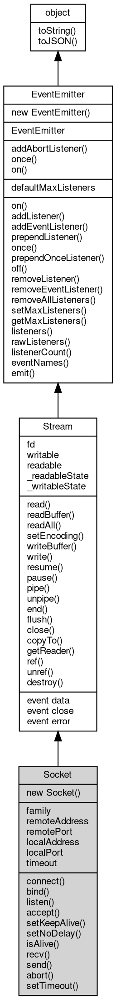

# Object Socket
A network socket: a TCP, unix socket or Windows pipe endpoint used to connect, listen and transfer data

Socket is the concrete stream endpoint behind [net.connect](../../module/ifs/net.md#connect) and [TcpServer](TcpServer.md). It plays three roles:
- **client**: `connect` establishes a connection, then `send`/`recv` or the inherited stream
  methods move data;
- **server**: `bind`, `listen` and `accept` implement a listening socket that hands out one
  connected Socket per client ([TcpServer](TcpServer.md) is the higher-level wrapper with a per-connection fiber);
- **accepted connection**: the objects delivered to a [TcpServer](TcpServer.md) handler and returned by accept
  are Sockets.

Socket inherits the read/write/end/close/destroy methods and the 'data', 'end', 'close' and
'error' events of [Stream](Stream.md); send/recv, isAlive, abort and the address properties are the
socket-specific additions.

Concepts:

- **Data flow**: a connected socket is a byte stream. read(n) waits for exactly n bytes (or
  returns null at the end of file) while recv(n) returns as soon as some bytes arrive (at most n,
  or null at the end of file); both throw when the configured timeout expires. Register 'data'
  listeners (or call resume()) to consume data in flowing mode; write/send queue the whole buffer
  and apply back-pressure when the peer does not read.
- **Connecting**: connect without a listener blocks the fiber and throws on failure; with a
  connectListener it returns immediately and reports the result through 'connect'/'error'. The
  timeout argument is the connect timer, while the `timeout` property applies to every later
  operation.
- **Timeouts**: an expired operation throws error number 20021 and the socket stays open, so the
  caller can retry with the same or another timeout. Node.js instead emits 'timeout' for an idle
  socket; in fibjs the callback passed to setTimeout is registered as a once 'timeout' listener
  but the current implementation reports the timeout as an operation error and does not emit it.
- **Closing**: the peer closing its side makes read/recv return null and emits 'end'; with the
  default auto-destroy the write side is finished and 'close' follows. close() shuts both
  directions down and aborts pending operations; abort() only cancels the pending operations
  (error 20022) and leaves the socket usable.
- **Address information**: remoteAddress/remotePort describe the peer and localAddress/localPort
  the local endpoint. Before the socket is connected or bound they throw or return
  backend-specific placeholders, see the property descriptions.
- **Node.js differences**: Node.js returns from connect immediately and never throws, accepts a
  [path](../../module/ifs/path.md) and many options in connect and has an idle 'timeout' event; fibjs blocks by default,
  accepts only host/port/timeout in the options [object](object.md) and reports timeouts as operation errors.
  Node.js also has no send/recv/isAlive/abort/family members; its address properties return
  undefined after a disconnect instead of throwing.

Obtained from:
- `new [net.Socket](../../module/ifs/net.md#Socket)(family)` — an unconnected socket of the given family (AF_INET by default);
- `net.connect(...)` — a connected socket, or a [TLSSocket](TLSSocket.md) for an ssl:// URL;
- `socket.accept()` or a `TcpServer` handler — a socket accepted from a listening endpoint.

Example 1 — the synchronous role of a client against a local server:

```JavaScript
const net = require('net');

const server = net.createServer((conn) => {
    conn.send(conn.recv());
    conn.close();
});
server.listen(0, '127.0.0.1');

const socket = new net.Socket();
socket.connect(server.address().port, '127.0.0.1');
socket.send('hello');
console.log(socket.recv().toString()); // hello
console.log(socket.remotePort === server.address().port); // true

socket.close();
server.stop();
```

Example 2 — the event-driven form with the data and close events:

```JavaScript
const net = require('net');

const server = net.createServer((conn) => {
    conn.write('welcome');
    conn.close();
});
server.listen(0, '127.0.0.1');

const socket = new net.Socket();
const chunks = [];
socket.on('data', (data) => chunks.push(data.toString()));
socket.on('close', () => {
    console.log(chunks.join('')); // welcome
    server.stop();
});
socket.connect(server.address().port, '127.0.0.1', () => {
    socket.resume();
});
```

Example 3 — a timeout fails the operation, not the connection:

```JavaScript
const net = require('net');

const server = net.createServer((conn) => {
    conn.recv(); // wait for the request and never answer
    conn.close();
});
server.listen(0, '127.0.0.1');

const socket = net.connect(server.address().port, '127.0.0.1');
socket.timeout = 100; // milliseconds, applies to the next operation
try {
    socket.recv();
} catch (err) {
    console.log(err.number); // 20021 (CALL_E_TIMEOUT)
}

socket.timeout = 0; // disable the timer and reuse the socket
socket.send('ping'); // unblocks the handler, which closes the connection
socket.close();
server.stop();
```

## Inheritance

```dot
digraph {
    node [fontname="Helvetica,sans-Serif", fontsize=10, shape="record", style="filled", fillcolor="white"];

    object [tooltip="object", URL="object.md", label="{object|toString()\ltoJSON()\l}"];
    EventEmitter [tooltip="EventEmitter", URL="EventEmitter.md", label="{EventEmitter|new EventEmitter()\l|EventEmitter\l|addAbortListener()\lonce()\lon()\l|defaultMaxListeners\l|on()\laddListener()\laddEventListener()\lprependListener()\lonce()\lprependOnceListener()\loff()\lremoveListener()\lremoveEventListener()\lremoveAllListeners()\lsetMaxListeners()\lgetMaxListeners()\llisteners()\lrawListeners()\llistenerCount()\leventNames()\lemit()\l}"];
    Stream [tooltip="Stream", URL="Stream.md", label="{Stream|fd\lwritable\lreadable\l_readableState\l_writableState\l|read()\lreadBuffer()\lreadAll()\lsetEncoding()\lwriteBuffer()\lwrite()\lresume()\lpause()\lpipe()\lunpipe()\lend()\lflush()\lclose()\lcopyTo()\lgetReader()\lref()\lunref()\ldestroy()\l|event data\levent close\levent error\l}"];
    Socket [tooltip="Socket", fillcolor="lightgray", id="me", label="{Socket|new Socket()\l|family\lremoteAddress\lremotePort\llocalAddress\llocalPort\ltimeout\l|connect()\lbind()\llisten()\laccept()\lsetKeepAlive()\lsetNoDelay()\lisAlive()\lrecv()\lsend()\labort()\lsetTimeout()\l}"];

    object -> EventEmitter [dir=back];
    EventEmitter -> Stream [dir=back];
    Stream -> Socket [dir=back];
}
```

## Constructors
        
### Socket
**Socket constructor, creates a new unconnected Socket [object](object.md) of the given address family**

```JavaScript
new Socket(Integer family = net.AF_INET);
```

Parameters:
* family: Integer, specifies the address family, default is AF_INET, ipv4

The socket is created but neither connected nor bound; call connect, or bind and listen to
make it a listening socket. The family is fixed for the lifetime of the [object](object.md): [net.AF_INET](../../module/ifs/net.md#AF_INET)
and [net.AF_INET6](../../module/ifs/net.md#AF_INET6) select TCP over IPv4/IPv6 and [net.AF_UNIX](../../module/ifs/net.md#AF_UNIX) (the same value as [net.AF_PIPE](../../module/ifs/net.md#AF_PIPE))
selects a unix socket or Windows named pipe. An invalid family throws an invalid-argument
error. Node.js takes an options [object](object.md) here (fd, allowHalfOpen, noDelay, ...) and has no
family argument; use new [net.Socket](../../module/ifs/net.md#Socket)([net.AF_INET6](../../module/ifs/net.md#AF_INET6)) to build an IPv6 endpoint.

## Static Methods
        
### addAbortListener
**Registers a one-shot abort handler on an [AbortSignal](AbortSignal.md)**

```JavaScript
static Object Socket.addAbortListener(EventEmitter signal,
    Function(Object ev) func);
```

Parameters:
* signal: [EventEmitter](EventEmitter.md), the [AbortSignal](AbortSignal.md) [object](object.md) to listen to
* func: Function(Object ev), the handler for the abort event

Returns:
* Object, returns a Disposable [object](object.md) containing a `[Symbol.dispose]` method

The handler is called at most once when the signal is aborted, and it is removed from the
signal afterwards. If the signal is already aborted the handler is invoked synchronously.
The returned [object](object.md) has a `[Symbol.dispose]()` method that removes the handler, so it can be
released before the abort happens.

Example — abort handling with automatic cleanup:

```JavaScript
const events = require('events');

const controller = new AbortController();
const disposable = events.addAbortListener(controller.signal,
    () => console.log('aborted'));

controller.abort(); // aborted
disposable[Symbol.dispose](); // safe to call after the listener fired
console.log(controller.signal.listenerCount('abort')); // 0
```

--------------------------
### once
**Creates a Promise resolved by the next occurrence of an event**

```JavaScript
static Object Socket.once(EventEmitter emitter,
    Value ev,
    Object options = {});
```

Parameters:
* emitter: [EventEmitter](EventEmitter.md), the event emitter [object](object.md) to listen to
* ev: Value, the event name to listen for
* options: Object, optional parameter [object](object.md)

Returns:
* Object, returns a Promise that resolves with the array of event parameters

The Promise resolves with the array of the emit arguments when the event fires; it rejects
when `error` is emitted while waiting, unless the waited event is `error` itself, or when
the signal option aborts. The temporary listeners are removed when the Promise settles.

options supports the following option:

```JavaScript
// fragment: options
({
    "signal": null // AbortSignal; aborting rejects the Promise with an AbortError
});
```

Example — awaiting the next occurrence of an event:

```JavaScript
const EventEmitter = require('events');

(async () => {
    const emitter = new EventEmitter();
    const waiting = EventEmitter.once(emitter, 'ready');

    emitter.emit('ready', 200, 'ok');
    console.log(JSON.stringify(await waiting)); // [200,"ok"]
})();
```

--------------------------
### on
**Creates an async iterator that yields event occurrences**

```JavaScript
static Object Socket.on(EventEmitter emitter,
    Value ev,
    Object options = {});
```

Parameters:
* emitter: [EventEmitter](EventEmitter.md), the event emitter [object](object.md) to listen to
* ev: Value, the event name to listen for
* options: Object, optional parameter [object](object.md)

Returns:
* Object, returns an AsyncIterator [object](object.md)

Each next() resolves with `{ value: [args...], done: false }` when the event fires and with
`{ done: true }` after an event named in the `close` option fires or the signal aborts; an
`error` event rejects the pending call. The listeners are registered when the iterator is
created and removed when the iteration ends or the signal aborts.

options supports the following options:

```JavaScript
// fragment: options
({
    "signal": null, // AbortSignal; aborting rejects pending and future next() calls
    "close": [] // event names; the first one to fire ends the iteration
});
```

Example — iterating the occurrences of an event:

```JavaScript
const EventEmitter = require('events');

(async () => {
    const emitter = new EventEmitter();
    const iterator = EventEmitter.on(emitter, 'data', {
        close: ['end']
    });

    emitter.emit('data', 1);
    emitter.emit('data', 2);
    emitter.emit('end');

    for await (const args of iterator)
    console.log(JSON.stringify(args)); // [1] then [2]
})();
```

## Static Properties
        
### defaultMaxListeners
**Integer, The [process](../../module/ifs/process.md)-wide default listener limit reported by getMaxListeners()**

```JavaScript
static Integer Socket.defaultMaxListeners;
```

Defaults to 10. Assigning a value changes getMaxListeners() for every emitter that never
called setMaxListeners(); an emitter with an explicit limit keeps it. The limit is
informational: fibjs never warns when the number of listeners exceeds it.

## Properties
        
### family
**Integer, Queries the address family of the current Socket [object](object.md)**

```JavaScript
readonly Integer Socket.family;
```

One of [net.AF_INET](../../module/ifs/net.md#AF_INET), [net.AF_INET6](../../module/ifs/net.md#AF_INET6) or [net.AF_UNIX](../../module/ifs/net.md#AF_UNIX), as passed to the constructor. The property
throws when the socket has no valid descriptor, for example after close. Node.js exposes the
connection family as the strings remoteFamily/localFamily instead.

--------------------------
### remoteAddress
**String, Queries the remote address of the current connection**

```JavaScript
readonly String Socket.remoteAddress;
```

For a TCP connection it is the peer IP address; for a unix socket or Windows pipe it is the
peer [path](../../module/ifs/path.md). The property throws with syscall 'getpeername' when the socket is not connected
and also after close, so guard accesses when the state is uncertain. Node.js returns the
peer address as a string and undefined after a disconnect instead of throwing.

--------------------------
### remotePort
**Integer, Queries the remote port of the current connection**

```JavaScript
readonly Integer Socket.remotePort;
```

The peer port of a TCP connection; it is 0 for a unix socket or Windows pipe. Like
remoteAddress it throws (syscall 'getpeername') when the socket is not connected.

--------------------------
### localAddress
**String, Queries the local address of the current connection or binding**

```JavaScript
readonly String Socket.localAddress;
```

The local IP address of a TCP socket, or the bound [path](../../module/ifs/path.md) of a unix socket/pipe. On a socket
that is not connected or bound the result is backend dependent: the platform engine returns
a placeholder ('0.0.0.0' or '::') with localPort 0 while the libuv backend throws EBADF, see
[net.use_uv_socket](../../module/ifs/net.md#use_uv_socket). Node.js reports the local address of a connection and undefined after a
disconnect.

--------------------------
### localPort
**Integer, Queries the local port of the current connection or binding**

```JavaScript
readonly Integer Socket.localPort;
```

After bind (including port 0) and listen this is the port assigned by the operating system,
which is how the ephemeral port of a listening socket is discovered. It is 0 when the socket
is neither connected nor bound and for a unix socket or pipe, where ports do not apply.

--------------------------
### timeout
**Integer, Queries and sets the timeout in milliseconds**

```JavaScript
Integer Socket.timeout;
```

The value is applied to each connect, read/recv and write/send operation started after the
assignment; 0 (the default) disables the timer. An expired operation throws error number
20021 but the socket stays open and usable, so a retry with another timeout is possible. A
[TcpServer](TcpServer.md) copies its timeout to each accepted connection before invoking the handler.
Node.js uses an idle timeout that emits 'timeout' without failing the pending operation.

--------------------------
### fd
**Integer, Queries the file descriptor value of the [Stream](Stream.md)**

```JavaScript
readonly Integer Socket.fd;
```

Only streams backed by an operating-system handle implement it:
[FileStream](FileStream.md) (and the streams returned by [fs.openFile](../../module/ifs/fs.md#openFile), [fs.createReadStream](../../module/ifs/fs.md#createReadStream)
and [fs.createWriteStream](../../module/ifs/fs.md#createWriteStream)) reports the file descriptor, [net.Socket](../../module/ifs/net.md#Socket) and
[TLSSocket](TLSSocket.md) the socket descriptor and the [process](../../module/ifs/process.md) standard streams 0/1/2.
Streams without a handle ([MemoryStream](MemoryStream.md), [RangeStream](RangeStream.md), [BufferedStream](BufferedStream.md)) throw
[20009] when the property is read. Node.js exposes `fd` on file streams
only and returns undefined elsewhere.

--------------------------
### writable
**Boolean, Queries whether the stream is writable**

```JavaScript
readonly Boolean Socket.writable;
```

Kept for Node compatibility: this reports whether the stream has not
ended, not whether the device accepts writes. It stays true after end()
and close() and turns false only when the flowing read loop reaches the
end of the stream or destroy() is called. Test the results of write()
and end() and watch the events instead of relying on this flag.

--------------------------
### readable
**Boolean, Queries whether the stream is readable**

```JavaScript
readonly Boolean Socket.readable;
```

Node-compatible flag with the same caveats as `writable`: true until the
flowing read loop reaches the end of the stream or destroy() is called.
It does not track pause(), close(), or pull-mode reads that reached the
end of the stream.

--------------------------
### _readableState
**Object, Queries the readable state [object](object.md) of the stream**

```JavaScript
readonly Object Socket._readableState;
```

A minimal Node-compatible view: an [object](object.md) with one `ended` property that
mirrors the internal ended flag, which becomes true when the flowing read
loop finishes or the stream is destroyed. It is not a full Node
ReadableState, and the other Node fields are absent.

--------------------------
### _writableState
**Object, Queries the writable state [object](object.md) of the stream**

```JavaScript
readonly Object Socket._writableState;
```

Compatibility stub: fibjs returns an empty [object](object.md) and keeps no Node
WritableState. Use the return value of write() and the `drain` event for
back pressure instead.

## Methods
        
### connect
**Establishes a connection on this socket (blocking form)**

```JavaScript
Stream Socket.connect(Object options) async;
```

Parameters:
* options: Object, specifies the connection options [object](object.md)

Returns:
* [Stream](Stream.md), returns the connected Socket [object](object.md)

The fiber waits until the connection is established and the method returns this same socket,
or throws. options supports:

```JavaScript
// fragment: options
({
    "port": 80, // the remote port, required
    "host": "localhost", // the remote address or host name
    "timeout": 0 // the connect timeout in milliseconds, 0 disables the fibjs timer
})
```

Only these three keys are read; the Node.js option keys ([path](../../module/ifs/path.md), family, lookup, localAddress,
localPort, signal, noDelay, keepAlive, ...) are not supported, pass a [path](../../module/ifs/path.md) to the [path](../../module/ifs/path.md)
overload instead. With timeout 0 the operating system connect timeout applies. A refused or
unreachable peer throws an Error with syscall 'connect' and a code such as ECONNREFUSED; an
expired timer throws error number 20021.

--------------------------
**Establishes a connection and triggers the connect event after the connection is established (non-blocking form)**

```JavaScript
Stream Socket.connect(Object options,
    Function(Object ev) connectListener) async;
```

Parameters:
* options: Object, specifies the connection options [object](object.md), which can contain the following properties:
* connectListener: Function(Object ev), specifies the once connect event listener

Returns:
* [Stream](Stream.md), returns the connected Socket [object](object.md)

The method returns immediately and the connection continues in the background;
connectListener is registered as a once 'connect' listener whose `this` is the socket. A
failure is delivered to the 'error' event as an event [object](object.md) carrying errno/code, syscall,
hostname and args, not as an Error, and no exception is thrown; see the [net](../../module/ifs/net.md) [module](../../module/ifs/module.md). This
listener form exists for the options [object](object.md) only; the port/host/[path](../../module/ifs/path.md) overloads have their own
listener signatures.

--------------------------
**Establishes a connection and triggers the connect event after the connection is established**

```JavaScript
Stream Socket.connect(Integer port,
    Function(Object ev) connectListener) async;
```

Parameters:
* port: Integer, specifies the remote port
* connectListener: Function(Object ev), specifies the once connect event listener

Returns:
* [Stream](Stream.md), returns the connected Socket [object](object.md)

The non-blocking form with the default host 'localhost' and no fibjs connect timer.

--------------------------
**Establishes a connection and triggers the connect event after the connection is established**

```JavaScript
Stream Socket.connect(Integer port,
    String host,
    Function(Object ev) connectListener) async;
```

Parameters:
* port: Integer, specifies the remote port
* host: String, specifies the remote address or host name, default is localhost
* connectListener: Function(Object ev), specifies the once connect event listener

Returns:
* [Stream](Stream.md), returns the connected Socket [object](object.md)

The non-blocking form of connect(port, host, 0, listener).

--------------------------
**Establishes a connection and triggers the connect event after the connection is established**

```JavaScript
Stream Socket.connect(Integer port,
    String host,
    Integer timeout,
    Function(Object ev) connectListener) async;
```

Parameters:
* port: Integer, specifies the remote port
* host: String, specifies the remote address or host name, default is localhost
* timeout: Integer, specifies the timeout in milliseconds, default is 0
* connectListener: Function(Object ev), specifies the once connect event listener

Returns:
* [Stream](Stream.md), returns the connected Socket [object](object.md)

The non-blocking form with a connect timer: an expired attempt is delivered to 'error' as the
event [object](object.md) instead of being thrown. The timeout here bounds the connection attempt; the
`timeout` property of the socket governs the data operations that follow.

--------------------------
**Establishes a TCP connection (blocking form)**

```JavaScript
Stream Socket.connect(Integer port,
    String host = "localhost",
    Integer timeout = 0) async;
```

Parameters:
* port: Integer, specifies the remote port
* host: String, specifies the remote address or host name, default is localhost
* timeout: Integer, specifies the timeout in milliseconds, default is 0

Returns:
* [Stream](Stream.md), returns the connected Socket [object](object.md)

The fiber waits (bounded by timeout when it is greater than 0) and the method returns this
socket already connected. The host may be an IPv4/IPv6 literal or a name resolved as part of
the connection; with timeout 0 the operating system timeout is in charge and can be minutes
on an unreachable address. Equivalent to connect({port, host, timeout}). See [net.connect](../../module/ifs/net.md#connect) for
the resolution and error details.

--------------------------
**Establishes a unix socket or Windows pipe connection (blocking form)**

```JavaScript
Stream Socket.connect(String path,
    Integer timeout = 0) async;
```

Parameters:
* path: String, specifies the unix socket or Windows pipe [path](../../module/ifs/path.md)
* timeout: Integer, specifies the timeout in milliseconds, default is 0

Returns:
* [Stream](Stream.md), returns the connected Socket [object](object.md)

Unlike the [module](../../module/ifs/module.md)-level [net.connect](../../module/ifs/net.md#connect), the [path](../../module/ifs/path.md) is taken literally and no scheme is required:
'/tmp/app.sock' connects a unix socket and '\\\\.\\pipe\\name' a Windows named pipe. timeout
is in milliseconds, 0 disables the timer. The method blocks the fiber and returns this
socket; failures carry syscall 'connect' (for example ENOENT for a missing socket file).

--------------------------
**Establishes a connection and triggers the connect event after the connection is established**

```JavaScript
Stream Socket.connect(String path,
    Function(Object ev) connectListener) async;
```

Parameters:
* path: String, specifies the unix socket or Windows pipe [path](../../module/ifs/path.md)
* connectListener: Function(Object ev), specifies the once connect event listener

Returns:
* [Stream](Stream.md), returns the connected Socket [object](object.md)

The non-blocking [path](../../module/ifs/path.md) form without a fibjs connect timer.

--------------------------
**Establishes a connection and triggers the connect event after the connection is established**

```JavaScript
Stream Socket.connect(String path,
    Integer timeout,
    Function(Object ev) connectListener) async;
```

Parameters:
* path: String, specifies the unix socket or Windows pipe [path](../../module/ifs/path.md)
* timeout: Integer, specifies the timeout in milliseconds, default is 0
* connectListener: Function(Object ev), specifies the once connect event listener

Returns:
* [Stream](Stream.md), returns the connected Socket [object](object.md)

The non-blocking [path](../../module/ifs/path.md) form with a connect timer; the result arrives through 'connect'/'error'.

--------------------------
### bind
**Binds the current Socket to the specified port on all local addresses**

```JavaScript
Socket.bind(Integer port,
    Boolean allowIPv4 = true);
```

Parameters:
* port: Integer, specifies the port to bind
* allowIPv4: Boolean, specifies whether to accept ipv4 connections, default is true. This parameter is effective for ipv6 and depends on the operating system

Prepares a listening socket: call listen and accept afterwards. SO_REUSEADDR is enabled on
non-Windows platforms. For an AF_INET6 socket allowIPv4 controls dual stack: true (the
default) accepts IPv4-mapped connections by clearing IPV6_V6ONLY, false keeps the socket
IPv6-only; on some operating systems this parameter has no effect. Errors such as EADDRINUSE
carry syscall 'bind'. Pass port 0 to let the operating system assign a port, then read it
from localPort after listen.

--------------------------
**Binds the current Socket to the specified port on the specified address**

```JavaScript
Socket.bind(String addr,
    Integer port = 0,
    Boolean allowIPv4 = true);
```

Parameters:
* addr: String, specifies the address to bind, which can also refer to a unix socket or Windows pipe [path](../../module/ifs/path.md)
* port: Integer, specifies the port to bind; this parameter is ignored when binding a unix socket or Windows pipe
* allowIPv4: Boolean, specifies whether to accept ipv4 connections, default is true. This parameter is effective for ipv6 and depends on the operating system

addr is an IP literal for a TCP socket, or a [path](../../module/ifs/path.md) for an AF_UNIX/AF_PIPE socket (the port is
then ignored and comes back as 0). The remaining behavior matches the port-only overload:
SO_REUSEADDR, the dual-stack flag and the 'bind' syscall in errors. bind("", port) is
equivalent to bind(port).

--------------------------
### listen
**Starts listening for connection requests**

```JavaScript
Socket.listen(Integer backlog = 120);
```

Parameters:
* backlog: Integer, specifies the request queue length; requests beyond it will be rejected, default is 120

The socket must be bound first with bind; listen on an invalid descriptor or an unbound socket
fails with an invalid-call error. backlog is passed to the operating system as the queued
connection limit; requests beyond it may be rejected. After listen, accept returns client
connections and localPort holds the port assigned to the socket. Node.js does not listen on a
Socket directly, it wraps one in net.Server.

--------------------------
### accept
**Waits for and accepts a connection**

```JavaScript
Socket Socket.accept() async;
```

Returns:
* Socket, returns the accepted connection [object](object.md)

Blocking: the fiber waits for the next client and returns a connected Socket of the same
family; the caller owns it and must close it. Several fibers may accept concurrently. When the
listening socket is closed by another fiber the pending accept fails (EBADF on the platform
engine, CALL_E_CLOSED_SOCKET on the libuv backend). [TcpServer](TcpServer.md) builds this loop in and hands
each accepted socket to the listener in its own fiber.

--------------------------
### setKeepAlive
**Enables or disables the TCP keep-alive mechanism**

```JavaScript
Socket.setKeepAlive(Boolean enable = false,
    Integer initialDelay = 0);
```

Parameters:
* enable: Boolean, specifies whether to enable the keep-alive mechanism, default is false
* initialDelay: Integer, specifies the initial delay in seconds, default is 0

Sets SO_KEEPALIVE and, on the platforms that support it, the idle delay before the first
probe (TCP_KEEPIDLE on Linux, SIO_KEEPALIVE_VALS on Windows). initialDelay is in seconds,
differing from Node.js whose keepAliveInitialDelay is in milliseconds; Node.js also accepts
the interval and probe-count parameters while fibjs uses the system defaults for those. The
socket must have a valid descriptor, otherwise an invalid-call error is thrown.

--------------------------
### setNoDelay
**Enables or disables the Nagle algorithm**

```JavaScript
Socket.setNoDelay(Boolean noDelay = true);
```

Parameters:
* noDelay: Boolean, specifies whether to disable the Nagle algorithm, default is true

Called without arguments it disables Nagle's algorithm, trading throughput for latency, which
is what request/response protocols usually want; pass false to re-enable it. The default of
the noDelay parameter matches Node.js setNoDelay. The socket must have a valid descriptor.

--------------------------
### isAlive
**Checks whether the socket currently appears to be still usable**

```JavaScript
Boolean Socket.isAlive();
```

Returns:
* Boolean, returns whether the socket currently appears to be still usable

This method performs a best-effort non-blocking check and does not consume any received data.
Returning false means the socket is definitely unusable; returning true only means no closed
state has been detected so far, a peer that just disconnected can still be reported as alive
for a moment. It returns false before connect, after close, after destroy and after the end
of file has been observed. Node.js has no equivalent; its destroyed flag is related but is
not the same check.

Example — the flag follows the state of the peer connection:

```JavaScript
const net = require('net');
const coroutine = require('coroutine');

const server = net.createServer((conn) => {
    conn.close(); // close immediately after accepting
});
server.listen(0, '127.0.0.1');

const socket = net.connect(server.address().port, '127.0.0.1');
console.log(socket.isAlive()); // true
coroutine.sleep(50); // let the peer close arrive
console.log(socket.isAlive()); // false

socket.close();
server.stop();
```

--------------------------
### recv
**Reads the specified amount of data from the connection; unlike the read method, recv does not guarantee reading all the requested data, but returns immediately after data is read**

```JavaScript
Buffer Socket.recv(Integer bytes = -1) async;
```

Parameters:
* bytes: Integer, specifies the amount of data to read; by default any size of data is read

Returns:
* [Buffer](Buffer.md), returns the data read from the connection

Returns as soon as at least one byte is available, with at most bytes bytes (the default -1
means no limit), and returns null once the peer has closed and all buffered data has been
consumed. The timeout property applies while waiting. This is the fibjs-native counterpart of
a stream read; Node.js only has read()/stream events and no recv.

--------------------------
### send
**Writes the given data to the connection, equivalent to the write method; a string data is encoded as utf8**

```JavaScript
Integer Socket.send(Buffer | String data) async;
```

Parameters:
* data: [Buffer](Buffer.md) | String, the data to send

Returns:
* Integer, returns the number of bytes actually written

data may be a [Buffer](Buffer.md) or a string; a string is encoded as utf8. The method queues the whole
buffer and returns its byte length (the utf8 length for strings), unlike write which reports
whether the stream accepted the data with a boolean. It waits when the peer does not read and
throws the timeout error (20021) or a closed-socket error when it cannot complete. Node.js
has no send; its write() returns a boolean and never reports a byte count.

--------------------------
### abort
**Aborts all ongoing operations on the current socket**

```JavaScript
Socket.abort();
```

This method cancels all pending asynchronous operations (connect, accept, recv, send, ...) and
the canceled operations fail with error number 20022; if no operation is pending the call has
no effect. The socket itself is not closed and can continue to be used, so a later recv/send
starts a new operation. Use it to interrupt a blocking read from another fiber. Node.js has
no equivalent, its destroy() would also close the connection.

--------------------------
### setTimeout
**Sets the socket timeout**

```JavaScript
Socket Socket.setTimeout(Integer timeout);
```

Parameters:
* timeout: Integer, the timeout in milliseconds. Setting it to 0 disables the timeout.

Returns:
* Socket, returns the current Socket [object](object.md)

Assigns the timeout property and returns this socket, so calls can be chained. Equivalent to
`socket.timeout = timeout`, and also usable on an accepted socket to change its inherited
timeout.

--------------------------
**Sets the socket timeout and registers a one-time 'timeout' event listener**

```JavaScript
Socket Socket.setTimeout(Integer timeout,
    Function() callback);
```

Parameters:
* timeout: Integer, the timeout in milliseconds. Setting it to 0 disables the timeout.
* callback: Function(), the callback function, called once when the socket times out

Returns:
* Socket, returns the current Socket [object](object.md)

Sets the timeout property and registers callback as a once 'timeout' listener. Note: the
current [net](../../module/ifs/net.md) implementation reports an expired operation as error number 20021 from the
pending call and does not emit the 'timeout' event, so the callback is registered but never
invoked; handle the timeout with try/catch around the operation. This differs from Node.js,
whose idle timeout emits 'timeout' and keeps the connection open.

--------------------------
### read
**Reads data of the specified size from the stream**

```JavaScript
Variant Socket.read(Integer bytes = -1) async;
```

Parameters:
* bytes: Integer, the amount of data to read; by default one chunk sized by the device

Returns:
* Variant, the data read from the stream; a string when an [encoding](../../module/ifs/encoding.md) is set,

In pull mode (no data/readable listener and no resume) the call asks the
device for one chunk: file and socket streams wait until `bytes` bytes are
available or the stream ends, while [MemoryStream](MemoryStream.md) returns the bytes it holds
(fewer than `bytes` is possible) without blocking. In flowing mode the data
has already been read ahead, so the call returns from the internal queue:
with `bytes` <= 0 all buffered data is merged into one [Buffer](Buffer.md), with
`bytes` > 0 exactly `bytes` are required, otherwise null. The result is a
[Buffer](Buffer.md), or a string when setEncoding was called; null is returned at the
end of the stream, on a broken connection or when a flowing read cannot be
satisfied. read(0) returns null. The call styles are `stm.read(4)`,
`stm.read(4, (err, data) => {})` and `await stm.read(4)`.

Example — read by size until the stream ends:

```JavaScript
const io = require('io');

const stm = new io.MemoryStream();
stm.write(Buffer.from('0123456789'));
stm.rewind();

console.log(stm.read(4).toString()); // 0123
console.log(stm.read(4).toString()); // 4567
console.log(stm.read(4).toString()); // 89: the stream ends first
console.log(stm.read()); // null at the end of the stream
```

--------------------------
### readBuffer
**Reads data of the specified size from the stream, returned as a [Buffer](Buffer.md)**

```JavaScript
Buffer Socket.readBuffer(Integer bytes = -1) async;
```

Parameters:
* bytes: Integer, the amount of data to read; by default one chunk sized by the device

Returns:
* [Buffer](Buffer.md), returns the [Buffer](Buffer.md) data read from the stream; null when there is no data to read

Identical to `read` except that the result is always a [Buffer](Buffer.md): setEncoding
and the text decoder do not apply. Use it when the consumer needs binary
data regardless of the stream [encoding](../../module/ifs/encoding.md).

--------------------------
### readAll
**Reads all remaining data from the stream**

```JavaScript
Buffer Socket.readAll() async;
```

Returns:
* [Buffer](Buffer.md), the data read from the stream; null when nothing was read or the

Reads until the end of the stream and returns everything in one [Buffer](Buffer.md), or
null when no byte could be read (an empty stream is already at its end).
setEncoding is ignored. For a live socket the call waits until the peer
closes the connection; in flowing mode the read loop is already consuming
the device, so collect the `data` chunks instead.

Example — read a whole stream and detect its end:

```JavaScript
const io = require('io');

const stm = new io.MemoryStream();
stm.write(Buffer.from('all at once'));
stm.rewind();
stm.setEncoding('utf8'); // readAll ignores the encoding

const all = stm.readAll();
console.log(Buffer.isBuffer(all), all.toString()); // true all at once
console.log(stm.readAll()); // null: the stream is at its end
```

--------------------------
### setEncoding
**Sets the [encoding](../../module/ifs/encoding.md) of the stream; subsequent read() calls return strings**

```JavaScript
Stream Socket.setEncoding(String encoding);
```

Parameters:
* encoding: String, the [encoding](../../module/ifs/encoding.md) to use, such as 'utf8', 'ascii', 'latin1' or 'utf16le'

Returns:
* [Stream](Stream.md), returns the current stream [object](object.md)

Installs a streaming decoder used by `read` and by the `data` event, so
incomplete multi-byte sequences that straddle two chunks decode correctly.
`readBuffer`, `readAll` and [StreamReader](StreamReader.md) keep returning Buffers. The
decoder understands the text labels 'utf8', 'ascii', 'latin1' and
'utf16le' (and their aliases); other names, including '[hex](../../module/ifs/hex.md)', '[base64](../../module/ifs/base64.md)' and
'ucs2', are accepted here but decode to empty strings, and null or a
non-string throws [20005]. Node.js rejects an unknown name with
ERR_UNKNOWN_ENCODING. Returns the stream itself for chaining.

Example — switch to text reads, then back to binary:

```JavaScript
const io = require('io');

const stm = new io.MemoryStream();
stm.write(Buffer.from('hello'));
stm.rewind();
stm.setEncoding('utf8');

console.log(stm.read()); // hello: read returns a string
stm.rewind();
console.log(stm.readBuffer().toString()); // hello: readBuffer stays binary
```

--------------------------
### writeBuffer
**Writes the given binary data to the stream**

```JavaScript
Socket.writeBuffer(Buffer data) async;
```

Parameters:
* data: [Buffer](Buffer.md), the [Buffer](Buffer.md) data to write

Queues the buffer and returns undefined (unlike `write`, no back-pressure
flag is reported); the direct call waits for the chunk to be written. The
string overload encodes the text as utf8, with no [encoding](../../module/ifs/encoding.md) argument.

--------------------------
**Writes the given binary data to the stream; a string data is encoded as utf8**

```JavaScript
Socket.writeBuffer(String data) async;
```

Parameters:
* data: String, the [Buffer](Buffer.md) data to write

String form of `writeBuffer`: the text is encoded with utf8 and queued as
binary data.

--------------------------
### write
**Writes the given data to the stream**

```JavaScript
Boolean Socket.write(Buffer data) async;
```

Parameters:
* data: [Buffer](Buffer.md), the data to write

Returns:
* Boolean, false when the caller should wait for the 'drain' event before

Queues the data and reports back pressure, mirroring Node.js: returns
false when the queued bytes reach the write high-water mark (16384 bytes)
and the caller should wait for the 'drain' event before writing more;
returns true while the queue has room. Writes are queued in FIFO order and
flushed one at a time. The direct call returns as soon as the chunk is
queued, a trailing callback receives the flag as its second argument, and
`await stm.write(data)` resolves to it. The [encoding](../../module/ifs/encoding.md) argument of the
[Buffer](Buffer.md) overload is ignored.

Example — stop writing when the queue is full and wait for drain:

```JavaScript
const io = require('io');
const coroutine = require('coroutine');

const stm = new io.MemoryStream();
const full = stm.write(Buffer.alloc(16384)); // false: wait for 'drain'
let drained = false;
stm.on('drain', () => {
    drained = true;
});
coroutine.sleep(20);

console.log(full, drained, stm.write('more')); // false true true
```

--------------------------
**Writes the given data to the stream**

```JavaScript
Boolean Socket.write(Buffer data,
    String encoding) async;
```

Parameters:
* data: [Buffer](Buffer.md), the data to write
* encoding: String, the [encoding](../../module/ifs/encoding.md); this parameter is ignored because data is of type [Buffer](Buffer.md)

Returns:
* Boolean, false when the caller should wait for the 'drain' event before

[Buffer](Buffer.md) overload kept for Node compatibility: the [encoding](../../module/ifs/encoding.md) argument is
accepted and ignored, because [Buffer](Buffer.md) data is already binary.

--------------------------
**Writes the given string to the stream**

```JavaScript
Boolean Socket.write(String data,
    String encoding = "utf8") async;
```

Parameters:
* data: String, the string data to write
* encoding: String, the [encoding](../../module/ifs/encoding.md) of the string, default is "utf8"

Returns:
* Boolean, false when the caller should wait for the 'drain' event before

Encodes the text with the given [encoding](../../module/ifs/encoding.md) (utf8 by default) and applies the
same queue and back-pressure rules as the [Buffer](Buffer.md) overload.

--------------------------
### resume
**Switches the stream to flowing read mode**

```JavaScript
Stream Socket.resume();
```

Returns:
* [Stream](Stream.md), returns the current stream [object](object.md)

Starts the internal read loop: chunks are emitted through the `data`
event, or buffered and announced through `readable`. The switch is
permanent — pause() stops delivery, but the stream never returns to pull
mode. Registering a data/readable listener starts the loop as well, so
resume is only needed to restart delivery after pause. Returns the stream
itself.

--------------------------
### pause
**Pauses the automatic read mode of the stream**

```JavaScript
Stream Socket.pause();
```

Returns:
* [Stream](Stream.md), returns the current stream [object](object.md)

Stops the flowing read loop after the current chunk: no further `data` or
`readable` events are delivered until resume(). Data already buffered is
kept. It has no effect in pull mode (before resume or a data/readable
listener) and does not undo flowing mode. Returns the stream itself.
Node.js pauses in the same way but exposes the state through isPaused().

--------------------------
### pipe
**Pipes stream data to the destination stream**

```JavaScript
Value Socket.pipe(Value destination,
    Object options = {});
```

Parameters:
* destination: Value, the destination stream [object](object.md)
* options: Object, pipe options, optional; only `end` is read (default true,

Returns:
* Value, returns the destination stream [object](object.md), supporting chained calls

[Event](Event.md)-driven copy with back pressure: every `data` chunk of the source is
written to the destination; when write() reports a full queue the source
is paused until the destination emits `drain`. At the end of the source
the destination is ended (unless options.end is false); a source error is
re-emitted on the destination, and a source close that is not an end
destroys the destination. The destination receives a `pipe` event with the
source as its argument. Only the `end` option is read; the other Node.js
pipe options are ignored. Returns the destination for chaining, while the
copy itself continues in the background — wait for the destination
`finish`/`close` before reading its result. See copyTo for a bounded
synchronous copy.

Example — pipe one stream into another:

```JavaScript
const io = require('io');
const coroutine = require('coroutine');

const src = new io.MemoryStream();
src.write(Buffer.from('piped data'));
src.rewind();

const dst = new io.MemoryStream();
const returned = src.pipe(dst);
coroutine.sleep(20);
dst.rewind();

console.log(returned === dst); // true: pipe returns the destination
console.log(dst.readAll().toString()); // piped data
```

--------------------------
### unpipe
**Removes all pipe destinations, or only the specified destination**

```JavaScript
Socket.unpipe(Stream destination = NULL);
```

Parameters:
* destination: [Stream](Stream.md), the specific writable destination to unpipe

Compatibility no-op in fibjs: a piped copy stops by itself when the source
ends/errors/closes or the destination closes, and there is no way to
detach one destination from an active pipe. The argument is accepted and
ignored; Node.js also emits an `unpipe` event, which fibjs does not.

--------------------------
### end
**Ends the stream operation**

```JavaScript
Integer Socket.end() async;
```

Returns:
* Integer, returns 0 after the stream has been ended

Flushes the queued writes so far and closes the write side, emitting
`finish`; when the read side has ended as well the stream closes and emits
`close`. The direct call returns 0 after the stream has been ended, the
callback form receives null as its error argument, and `await stm.end()`
resolves to the same 0. Writing after end is not meaningful, because the
stream is being closed. The end(data) and end(data, [encoding](../../module/ifs/encoding.md)) overloads
write one last chunk, utf8 encoded by default, before the same shutdown.

Example — end a write stream and observe its events:

```JavaScript
const fs = require('fs');
const os = require('os');
const path = require('path');

const dir = fs.mkdtempSync(path.join(os.tmpdir(), 'fibjs-end-'));
const file = path.join(dir, 'out.txt');

const stm = fs.createWriteStream(file);
const events = [];
stm.on('finish', () => events.push('finish'));
stm.on('close', () => events.push('close'));
stm.end('final data');

console.log(events.join(',')); // finish,close
console.log(fs.readFile(file, 'utf8')); // final data
fs.rmSync(dir, {
    recursive: true,
    force: true
});
```

--------------------------
**Writes the given file buffer to the stream and ends the stream operation**

```JavaScript
Integer Socket.end(Buffer data) async;
```

Parameters:
* data: [Buffer](Buffer.md), the file buffer data to write

Returns:
* Integer, returns 0 after the stream has been ended

Writes the buffer as the final chunk and then ends the stream, with the
same events and return value as `end()`.

--------------------------
**Writes the given file buffer to the stream and ends the stream operation**

```JavaScript
Integer Socket.end(Buffer data,
    String encoding) async;
```

Parameters:
* data: [Buffer](Buffer.md), the file buffer data to write
* encoding: String, the [encoding](../../module/ifs/encoding.md); this parameter is ignored because data is of type [Buffer](Buffer.md)

Returns:
* Integer, returns 0 after the stream has been ended

[Buffer](Buffer.md) overload kept for Node compatibility: the [encoding](../../module/ifs/encoding.md) argument is
accepted and ignored.

--------------------------
**Writes the given string to the stream and ends the stream operation**

```JavaScript
Integer Socket.end(String data,
    String encoding = "utf8") async;
```

Parameters:
* data: String, the string data to write
* encoding: String, the [encoding](../../module/ifs/encoding.md) of the string, default is "utf8"

Returns:
* Integer, returns 0 after the stream has been ended

Encodes the text with the given [encoding](../../module/ifs/encoding.md) (utf8 by default), writes it as
the final chunk and then ends the stream.

--------------------------
### flush
**Writes the file buffer content to the physical device**

```JavaScript
Socket.flush() async;
```

Compatibility call: [MemoryStream](MemoryStream.md) and Socket return immediately, and for a
[FileStream](FileStream.md) the implementation only checks that the handle is still open
(the underlying fflush is disabled), so it does not force data to disk.
Buffered transports such as the [process](../../module/ifs/process.md) standard streams wait for their
queued writes to be handed to the device. On a file stream whose handle is
already closed it throws [20009] with "[FileStream](FileStream.md): file is closed.".

--------------------------
### close
**Closes the current stream [object](object.md)**

```JavaScript
Socket.close() async;
```

Releases the operating-system handle or the transport. A successful call
does not emit 'close' by itself: the event comes from the auto-close after
the read flow ends, from destroy() or from the runtime. Reading or writing
a stream backed by a closed handle throws [20009]; [MemoryStream](MemoryStream.md) and
Socket tolerate a second close(), while a [FileStream](FileStream.md) rejects later
operations.

--------------------------
### copyTo
**Copies stream data to the destination stream**

```JavaScript
Long Socket.copyTo(Stream stm,
    Long bytes = -1) async;
```

Parameters:
* stm: [Stream](Stream.md), the destination stream [object](object.md)
* bytes: Long, the number of bytes to copy

Returns:
* Long, returns the number of bytes copied

Copies at most `bytes` bytes (all remaining data by default) and returns
the number of bytes actually copied; a count of 0 copies nothing. The copy
runs in the current fiber and waits for the source to end when `bytes` is
-1, which makes it a simple way to move a whole stream. The destination is
not closed at the end (call end/close yourself), and a closed source or
destination throws [20009]. Node.js has no direct equivalent; use pipe or
stream.pipeline for the event-driven form.

Example — copy the first four bytes into another stream:

```JavaScript
const io = require('io');

const src = new io.MemoryStream();
src.write(Buffer.from('0123456789'));
src.rewind();

const dst = new io.MemoryStream();
console.log(src.copyTo(dst, 4)); // 4
dst.rewind();
console.log(dst.readAll().toString()); // 0123
```

--------------------------
### getReader
**Gets a reader for the stream, compatible with ReadableStreamDefaultReader**

```JavaScript
StreamReader Socket.getReader();
```

Returns:
* [StreamReader](StreamReader.md), returns a [StreamReader](StreamReader.md) [object](object.md)

Returns a new [StreamReader](StreamReader.md) that pulls chunks with read(). Each call creates
an independent reader; fibjs does not enforce the single-reader lock of
the Web Streams API, so coordinate access yourself. Creating a reader does
not switch the stream to flowing mode. See [StreamReader](StreamReader.md) for the reader
lifecycle.

Example — pull the chunks of a stream with a reader:

```JavaScript
const io = require('io');

(async () => {
    const stm = new io.MemoryStream();
    stm.write(Buffer.from('chunk'));
    stm.rewind();

    const reader = stm.getReader();
    console.log((await reader.read()).value.toString()); // chunk
    console.log((await reader.read()).done); // true
})();
```

--------------------------
### ref
**Keeps the fibjs [process](../../module/ifs/process.md) alive, preventing it from exiting while the [object](object.md) is bound**

```JavaScript
Stream Socket.ref();
```

Returns:
* [Stream](Stream.md), returns the current [object](object.md)

The runtime references the isolate while a stream reader is active; unref
(or pause) allows the [process](../../module/ifs/process.md) to exit even when the stream has pending
work. Returns the stream itself for chaining.

--------------------------
### unref
**Allows the fibjs [process](../../module/ifs/process.md) to exit while the [object](object.md) is bound**

```JavaScript
Stream Socket.unref();
```

Returns:
* [Stream](Stream.md), returns the current [object](object.md)

Counterpart of ref: drops the [process](../../module/ifs/process.md)-liveness reference held by the
stream. The data flow is not stopped; it just no longer prevents the
[process](../../module/ifs/process.md) from exiting. Returns the stream itself for chaining.

--------------------------
### destroy
**Destroys the stream. Optionally emits the 'error' event and emits the 'close' event.**

```JavaScript
Stream Socket.destroy(Value err = undefined) async;
```

Parameters:
* err: Value, optional error [object](object.md), emitted as the 'error' event

Returns:
* [Stream](Stream.md), returns the current [object](object.md)

Marks the stream unusable, emits 'error' with the supplied value when err
is not null/undefined, then closes the stream and emits 'close'. It is
idempotent: destroying an already destroyed stream is a no-op. Concrete
classes react differently afterwards — [MemoryStream](MemoryStream.md) keeps buffered data
readable, a [FileStream](FileStream.md) rejects later operations with [20009] — so do not
use a destroyed stream.

Example — destroy with an error and watch the events:

```JavaScript
const io = require('io');
const coroutine = require('coroutine');

const stm = new io.MemoryStream();
stm.write(Buffer.from('data'));
stm.rewind();
stm.on('error', (err) => console.log('error:', err.message)); // error: broken
stm.on('close', () => console.log('closed')); // closed

stm.destroy(new Error('broken'));
coroutine.sleep(20);
```

--------------------------
### on
**Appends an event handler to the emitter**

```JavaScript
Object Socket.on(Value ev,
    Function(...args) func);
```

Parameters:
* ev: Value, the event name to bind
* func: Function(...args), the event handler function, called with the emit arguments

Returns:
* Object, returns the event [object](object.md) itself for chaining

The listener is called with the arguments of emit() and `this` set to the emitter; the
emitter itself is returned so registrations can be chained. The same function may be
registered several times for one event and each copy is called. See the class documentation
for the dispatch order.

--------------------------
**Appends several event handlers to the emitter**

```JavaScript
Object Socket.on(Object map);
```

Parameters:
* map: Object, the event mapping; [object](object.md) property names are used as event names

Returns:
* Object, returns the event [object](object.md) itself for chaining

Every enumerable property of the map whose value is a function is registered under its
property name. Properties are processed in order; a value that is not a function makes the
call fail with an invalid-type error while entries processed before it stay registered.

Example — registering several handlers at once:

```JavaScript
const EventEmitter = require('events');

const emitter = new EventEmitter();
emitter.on({
    connect: () => console.log('connect'),
    close: () => console.log('close')
});

emitter.emit('connect'); // connect
emitter.emit('close'); // close
```

--------------------------
### addListener
**Appends an event handler to the emitter**

```JavaScript
Object Socket.addListener(Value ev,
    Function(...args) func);
```

Parameters:
* ev: Value, the event name to bind
* func: Function(...args), the event handler function

Returns:
* Object, returns the event [object](object.md) itself for chaining

Alias of on(ev, func), provided for Node.js compatibility.

--------------------------
**Appends several event handlers to the emitter**

```JavaScript
Object Socket.addListener(Object map);
```

Parameters:
* map: Object, the event mapping; [object](object.md) property names are used as event names

Returns:
* Object, returns the event [object](object.md) itself for chaining

Alias of on(map), provided for Node.js compatibility.

--------------------------
### addEventListener
**Appends an event handler to the emitter with an options [object](object.md)**

```JavaScript
Object Socket.addEventListener(Value ev,
    Function(...args) func,
    Object options = {});
```

Parameters:
* ev: Value, the event name to bind
* func: Function(...args), the event handler function, called with the emit arguments
* options: Object, the options of the event handler

Returns:
* Object, returns the event [object](object.md) itself for chaining

Web-style alias of on(); the only supported option is `once`, which registers a one-shot
handler exactly like once(). The listener receives the plain emit arguments and not an [Event](Event.md)
[object](object.md); see the [DOMEvent](DOMEvent.md) class for the DOM-style event [object](object.md) used by [AbortSignal](AbortSignal.md) and
fetch-style APIs.

options supports the following option:

```JavaScript
// fragment: options
({
    "once": false // when true, the handler is removed before its single invocation
});
```

Example — a one-shot DOM-style registration:

```JavaScript
const EventEmitter = require('events');

const emitter = new EventEmitter();
emitter.addEventListener('ping', () => console.log('ping'), {
    once: true
});

emitter.emit('ping'); // ping
console.log(emitter.emit('ping')); // false
console.log(emitter.listenerCount('ping')); // 0
```

--------------------------
### prependListener
**Inserts an event handler at the front of the queue**

```JavaScript
Object Socket.prependListener(Value ev,
    Function(...args) func);
```

Parameters:
* ev: Value, the event name to bind
* func: Function(...args), the event handler function

Returns:
* Object, returns the event [object](object.md) itself for chaining

The listener is called before the listeners registered with on()/addListener() the next time
the event is emitted. When several prependListener() calls are made, the last one registered
is called first, because every call inserts at the same position.

Example — insertion at the front of the queue:

```JavaScript
const EventEmitter = require('events');

const emitter = new EventEmitter();
emitter.on('order', () => console.log('on'));
emitter.prependListener('order', () => console.log('prepend'));

emitter.emit('order'); // prepend, then on
```

--------------------------
**Inserts several event handlers at the front of the queue**

```JavaScript
Object Socket.prependListener(Object map);
```

Parameters:
* map: Object, the event mapping; [object](object.md) property names are used as event names

Returns:
* Object, returns the event [object](object.md) itself for chaining

Map form of prependListener(); every function property is inserted at the front, so the
properties of the map are called in reverse order.

--------------------------
### once
**Appends a one-shot event handler to the emitter**

```JavaScript
Object Socket.once(Value ev,
    Function(...args) func);
```

Parameters:
* ev: Value, the event name to bind
* func: Function(...args), the event handler function

Returns:
* Object, returns the event [object](object.md) itself for chaining

The handler is wrapped and removes itself from the queue before it is called, so it runs at
most once. off() removes it when passed the original function, listeners() returns the
original function, and rawListeners() returns the internal wrapper whose `_func` property
holds the original. See Example 2 in the class documentation.

--------------------------
**Appends several one-shot event handlers to the emitter**

```JavaScript
Object Socket.once(Object map);
```

Parameters:
* map: Object, the event mapping; [object](object.md) property names are used as event names

Returns:
* Object, returns the event [object](object.md) itself for chaining

Map form of once(); every function property is registered as a one-shot listener under its
property name.

--------------------------
### prependOnceListener
**Inserts a one-shot event handler at the front of the queue**

```JavaScript
Object Socket.prependOnceListener(Value ev,
    Function(...args) func);
```

Parameters:
* ev: Value, the event name to bind
* func: Function(...args), the event handler function

Returns:
* Object, returns the event [object](object.md) itself for chaining

Combines prependListener() and once(): the handler is called first and only once, and it is
removed before its invocation.

--------------------------
**Inserts several one-shot event handlers at the front of the queue**

```JavaScript
Object Socket.prependOnceListener(Object map);
```

Parameters:
* map: Object, the event mapping; [object](object.md) property names are used as event names

Returns:
* Object, returns the event [object](object.md) itself for chaining

Map form of prependOnceListener(); every function property is inserted as a one-shot
listener, and the properties of the map are called in reverse order.

--------------------------
### off
**Removes an event handler from the emitter**

```JavaScript
Object Socket.off(Value ev,
    Function(...args) func);
```

Parameters:
* ev: Value, the event name to unbind
* func: Function(...args), the event handler function

Returns:
* Object, returns the event [object](object.md) itself for chaining

The first matching listener is removed; when the same function was registered several times
only one copy is removed per call, so repeat the call to remove the others. A once() wrapper
is matched by its original function as well. Removing a listener emits the `removeListener`
meta event after the removal.

--------------------------
**Removes all event handlers of one event**

```JavaScript
Object Socket.off(Value ev);
```

Parameters:
* ev: Value, the event name to unbind

Returns:
* Object, returns the event [object](object.md) itself for chaining

Every listener of the event is removed and `removeListener` is emitted once per removed
listener. The call succeeds when the event has no listener.

Example — removing every listener of one event:

```JavaScript
const EventEmitter = require('events');

const emitter = new EventEmitter();
emitter.on('data', () => console.log('first'));
emitter.on('data', () => console.log('second'));

emitter.off('data');
console.log(emitter.emit('data')); // false
```

--------------------------
**Removes several event handlers from the emitter**

```JavaScript
Object Socket.off(Object map);
```

Parameters:
* map: Object, the event mapping; [object](object.md) property names are used as event names

Returns:
* Object, returns the event [object](object.md) itself for chaining

Every enumerable property of the map whose value is a function names an event from which
that function is removed (one copy per event). A value that is not a function makes the call
fail with an invalid-type error.

--------------------------
### removeListener
**Removes an event handler from the emitter**

```JavaScript
Object Socket.removeListener(Value ev,
    Function(...args) func);
```

Parameters:
* ev: Value, the event name to unbind
* func: Function(...args), the event handler function

Returns:
* Object, returns the event [object](object.md) itself for chaining

Alias of off(ev, func), provided for Node.js compatibility.

--------------------------
**Removes all event handlers of one event**

```JavaScript
Object Socket.removeListener(Value ev);
```

Parameters:
* ev: Value, the event name to unbind

Returns:
* Object, returns the event [object](object.md) itself for chaining

Alias of off(ev), provided for Node.js compatibility.

--------------------------
**Removes several event handlers from the emitter**

```JavaScript
Object Socket.removeListener(Object map);
```

Parameters:
* map: Object, the event mapping; [object](object.md) property names are used as event names

Returns:
* Object, returns the event [object](object.md) itself for chaining

Alias of off(map), provided for Node.js compatibility.

--------------------------
### removeEventListener
**Removes an event handler with an options [object](object.md)**

```JavaScript
Object Socket.removeEventListener(Value ev,
    Function(...args) func,
    Object options = {});
```

Parameters:
* ev: Value, the event name to unbind
* func: Function(...args), the event handler function
* options: Object, the options of the event handler, ignored

Returns:
* Object, returns the event [object](object.md) itself for chaining

Web-style alias of off(ev, func); the options [object](object.md) is accepted and ignored, and a once()
wrapper is matched by its original function like off().

--------------------------
### removeAllListeners
**Removes all listeners of one event**

```JavaScript
Object Socket.removeAllListeners(Value ev);
```

Parameters:
* ev: Value, the event name to remove

Returns:
* Object, returns the event [object](object.md) itself for chaining

Equivalent to off(ev): every listener of the event is removed, including once() wrappers
matched by their original function, and `removeListener` is emitted once per removal.

--------------------------
**Removes all listeners of the given events, or of the whole emitter**

```JavaScript
Object Socket.removeAllListeners(Array evs = []);
```

Parameters:
* evs: Array, the event names to remove

Returns:
* Object, returns the event [object](object.md) itself for chaining

An empty array — including the no-argument call, because the parameter defaults to [] —
clears every string-keyed event; symbol-keyed listeners are left in place, unlike Node.js
which removes them too. A non-empty array clears each named event as
removeAllListeners(ev) does.

Example — clearing selected events and the whole emitter:

```JavaScript
const EventEmitter = require('events');

const emitter = new EventEmitter();
emitter.on('a', () => {});
emitter.on('b', () => {});
emitter.on('c', () => {});

emitter.removeAllListeners(['a', 'b']);
console.log(emitter.listenerCount('a'), emitter.listenerCount('c')); // 0 1

emitter.removeAllListeners();
console.log(emitter.eventNames().length); // 0
```

--------------------------
### setMaxListeners
**Stores a per-emitter listener limit**

```JavaScript
Socket.setMaxListeners(Integer n);
```

Parameters:
* n: Integer, the number of events

The value is reported by getMaxListeners() and is otherwise informational: fibjs never warns
when the number of listeners exceeds it. This member exists for Node.js compatibility. A
negative value throws; 0 is accepted and stored as-is, while Node.js treats 0 as unlimited.

--------------------------
### getMaxListeners
**Returns the listener limit of the emitter**

```JavaScript
Integer Socket.getMaxListeners();
```

Returns:
* Integer, returns the default limit

Returns the value set by setMaxListeners(), or the [process](../../module/ifs/process.md)-wide defaultMaxListeners (10)
when no explicit value was set.

--------------------------
### listeners
**Returns a copy of the listener array of an event**

```JavaScript
Array Socket.listeners(Value ev);
```

Parameters:
* ev: Value, the event name to query

Returns:
* Array, returns the listener array of the specified event

One-shot wrappers are unwrapped, so the result contains the functions passed to
on()/once() and can be passed to off(); an unknown event produces an empty array.

Example — once() listeners are returned unwrapped:

```JavaScript
const EventEmitter = require('events');

const emitter = new EventEmitter();

function onTick() {
    console.log('tick');
}

emitter.once('tick', onTick);
console.log(emitter.listeners('tick')[0] === onTick); // true
console.log(emitter.rawListeners('tick')[0] === onTick); // false
```

--------------------------
### rawListeners
**Returns the internal listener array of an event**

```JavaScript
Array Socket.rawListeners(Value ev);
```

Parameters:
* ev: Value, the event name to query

Returns:
* Array, returns the listener array of the specified event

The array is not unwrapped: a listener registered with once() appears as the internal
wrapper function whose `_func` property holds the original function. An unknown event
produces an empty array.

--------------------------
### listenerCount
**Returns the number of listeners of an event**

```JavaScript
Integer Socket.listenerCount(Value ev);
```

Parameters:
* ev: Value, the event name to query

Returns:
* Integer, returns the number of listeners of the specified event

One-shot listeners count as one and an unknown event returns 0.

--------------------------
**Returns the number of listeners of an event on another [object](object.md)**

```JavaScript
Integer Socket.listenerCount(Value o,
    Value ev);
```

Parameters:
* o: Value, the [object](object.md) to query
* ev: Value, the event name to query

Returns:
* Integer, returns the number of listeners of the specified event

Counts without requiring the target to be an [EventEmitter](EventEmitter.md): any [object](object.md) with registered
events can be queried. The call is normally written as
`EventEmitter.listenerCount(target, 'data')`.

Example — counting the listeners of another [object](object.md):

```JavaScript
const EventEmitter = require('events');

const emitter = new EventEmitter();
emitter.on('data', () => {});
emitter.on('data', () => {});

console.log(EventEmitter.listenerCount(emitter, 'data')); // 2
```

--------------------------
### eventNames
**Returns the names of the events with at least one listener**

```JavaScript
Array Socket.eventNames();
```

Returns:
* Array, returns the array of event names

Only string-keyed events are reported; symbol-keyed events are omitted and numeric event
names are returned as numbers (Node.js also reports symbol events).

--------------------------
### emit
**Emits an event and returns whether a listener was called**

```JavaScript
Boolean Socket.emit(Value ev,
    ...args);
```

Parameters:
* ev: Value, event name
* args: ..., event parameters, which are passed to the event handler

Returns:
* Boolean, returns whether the event had a listener to respond to it

Listeners are called as described by the dispatch model in the class documentation: the
first one runs synchronously on the current fiber, the remaining ones run in parallel
fibers, and the call returns after all of them finish; an exception raised by a listener is
thrown back to the caller. Emitting `error` with no listener throws instead of returning
false: an Error argument is thrown as-is and any other value is wrapped in
`Error("Unhandled error. (...)")`. [Event](Event.md) names are strings or symbols; `emit()` does not
match a listener registered with a numeric name.

--------------------------
### toString
**Returns the string form of the [object](object.md)**

```JavaScript
String Socket.toString();
```

Returns:
* String, returns the string form of the [object](object.md)

The base implementation reports an error: a native [object](object.md) has no implicit
text form, and only the classes whose value can be written as a string
override the member. [Buffer](Buffer.md) returns its content decoded with the given
[encoding](../../module/ifs/encoding.md), [HttpCookie](HttpCookie.md) returns "name=value", and so on; an override commonly
accepts optional arguments ([Buffer.toString](Buffer.md#toString) takes [encoding](../../module/ifs/encoding.md), start and
end) that are not part of this declaration.

Calling the member on a class that does not override it throws
"<Class>: the [object](object.md) can not be converted to string.", which is the
behavior to rely on when probing whether a value has a string form. See
toJSON for the serialization hook.

--------------------------
### toJSON
**Returns the JSON representation of the [object](object.md)**

```JavaScript
Value Socket.toJSON(String key = "");
```

Parameters:
* key: String, the property name of the value being serialized

Returns:
* Value, returns the JSON-serializable value

JSON.stringify(value) calls value.toJSON(key) when the member exists and
serializes the returned value in its place; the key argument carries the
property name of the value inside its parent [object](object.md) (an empty string at
the top level) and may be used to build a keyed form. The base
implementation returns a plain [object](object.md) holding the readable properties of
the instance, so a native [object](object.md) serializes without per-class code; a
class with a portable shape such as [Buffer](Buffer.md) overrides it, and a JavaScript
class may override it in the same way.

The member is normally reached through JSON.stringify rather than called
directly; calling it returns the same value JSON.stringify would
serialize.

## Events
        
### data
**Queries and binds the stream data event, equivalent to on("data", func);**

```JavaScript
event Socket.data(Buffer data);
```

Parameters:
* data: [Buffer](Buffer.md), the data read

Emitted for every chunk once the stream is in flowing mode; attaching this
listener switches the stream to that mode. The payload is a [Buffer](Buffer.md), or a
string when setEncoding was called (the parameter is declared as [Buffer](Buffer.md) for
the binary case). A `readable` workflow consumes the same data through
read() and emits no data events. Node.js has the same flowing-mode
semantics.

--------------------------
### close
**Queries and binds the stream close event, equivalent to on("close", func);**

```JavaScript
event Socket.close();
```

Emitted once after the stream has been closed: at the end of a flowing
read (auto destroy), after destroy(), or when the runtime closes the
stream. A plain close() call releases the handle without emitting it.
Node.js emits close for the same destroy/autoDestroy cases.

--------------------------
### error
**Queries and binds the stream error event, equivalent to on("error", func);**

```JavaScript
event Socket.error(Integer code);
```

Parameters:
* code: Integer, the error value, usually an Error [object](object.md)

Emitted when a read or write fails and by destroy(err). The payload is the
error value, usually an Error [object](object.md) with `number` and `description`; the
declared Integer parameter name is historical (destroy(err) emits exactly
the value it was given, even a non-Error one). Node.js also emits Error
objects.

