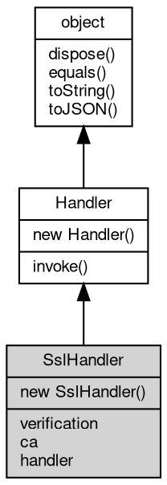

# 对象 SslHandler
[ssl](../../module/ifs/ssl.md) 协议转换处理器

用以将数据流转换为 [ssl](../../module/ifs/ssl.md) 流协议。SslHandler 是对 [SslSocket](SslSocket.md) 的封装，用于构建服务器，逻辑上相当于：

```JavaScript
var ss = new ssl.Socket(crt, key);

function(s) {
    var s1 = ss.accept(s);
    hdlr.invoke(s1);
    s1.close();
}
```

## 继承关系


## 构造函数
        
### SslHandler
**SslHandler 构造函数，创建一个新的 SslHandler 对象**

```JavaScript
new SslHandler(Array certs,
    Handler hdlr);
```

调用参数:
* certs: Array, 服务器证书列表
* hdlr: [Handler](Handler.md), 内置消息处理器，处理函数，链式处理数组，路由对象，详见 [mq.Handler](../../module/ifs/mq.md#Handler)

certs 格式为：

```JavaScript
[{
        crt: [X509Cert object],
        key: [PKey object]
    },
    {
        crt: [X509Cert object],
        key: [PKey object]
    }
]
```

--------------------------
**SslHandler 构造函数，创建一个新的 SslHandler 对象**

```JavaScript
new SslHandler(X509Cert crt,
    PKey key,
    Handler hdlr);
```

调用参数:
* crt: [X509Cert](X509Cert.md), [X509Cert](X509Cert.md) 证书，用于客户端验证服务器
* key: [PKey](PKey.md), [PKey](PKey.md) 私钥，用于与客户端会话
* hdlr: [Handler](Handler.md), 内置消息处理器，处理函数，链式处理数组，路由对象，详见 [mq.Handler](../../module/ifs/mq.md#Handler)

## 成员属性
        
### verification
**Integer, 设定证书验证模式，缺省为 VERIFY_NONE**

```JavaScript
Integer SslHandler.verification;
```

--------------------------
### ca
**[X509Cert](X509Cert.md), 客户端证书验证证书链**

```JavaScript
readonly X509Cert SslHandler.ca;
```

--------------------------
### handler
**[Handler](Handler.md), [ssl](../../module/ifs/ssl.md) 协议转换处理器当前事件处理接口对象**

```JavaScript
Handler SslHandler.handler;
```

## 成员函数
        
### invoke
**处理一个消息或对象**

```JavaScript
Handler SslHandler.invoke(object v) async;
```

调用参数:
* v: [object](object.md), 指定处理的消息或对象

返回结果:
* [Handler](Handler.md), 返回下一步的处理器

--------------------------
### dispose
**强制回收对象，调用此方法后，对象资源将立即释放**

```JavaScript
SslHandler.dispose();
```

--------------------------
### equals
**比较当前对象与给定的对象是否相等**

```JavaScript
Boolean SslHandler.equals(object expected);
```

调用参数:
* expected: [object](object.md), 制定比较的目标对象

返回结果:
* Boolean, 返回对象比较的结果

--------------------------
### toString
**返回对象的字符串表示，一般返回 "[Native Object]"，对象可以根据自己的特性重新实现**

```JavaScript
String SslHandler.toString();
```

返回结果:
* String, 返回对象的字符串表示

--------------------------
### toJSON
**返回对象的 JSON 格式表示，一般返回对象定义的可读属性集合**

```JavaScript
Value SslHandler.toJSON(String key = "");
```

调用参数:
* key: String, 未使用

返回结果:
* Value, 返回包含可 JSON 序列化的值

