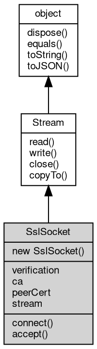

# 对象 SslSocket
[ssl](../../module/ifs/ssl.md) 网络套接口对象

SslSocket 属于 [ssl](../../module/ifs/ssl.md) 模块，创建方法

```JavaScript
var s = new ssl.Socket();
```

## 继承关系


## 构造函数
        
### SslSocket
**SslSocket 构造函数，创建一个新的 SslSocket 对象**

```JavaScript
new SslSocket(Array certs = []);
```

调用参数:
* certs: Array, 服务器证书列表

certs 格式为：

```JavaScript
[{
        crt: [X509Cert object],
        key: [PKey object]
    },
    {
        crt: [X509Cert object],
        key: [PKey object]
    }
]
```

--------------------------
**SslSocket 构造函数，创建一个新的 SslSocket 对象**

```JavaScript
new SslSocket(X509Cert crt,
    PKey key);
```

调用参数:
* crt: [X509Cert](X509Cert.md), [X509Cert](X509Cert.md) 证书，用于客户端验证服务器
* key: [PKey](PKey.md), [PKey](PKey.md) 私钥，用于与客户端会话

## 成员属性
        
### verification
**Integer, 设定证书验证模式，缺省为 VERIFY_REQUIRED**

```JavaScript
Integer SslSocket.verification;
```

--------------------------
### ca
**[X509Cert](X509Cert.md), 证书链，客户端模式 connect 时自动引用 [ssl.ca](../../module/ifs/ssl.md#ca)，服务器模式 accept 生成 SslSocket 自动引用当前 SslSocket 的 ca**

```JavaScript
readonly X509Cert SslSocket.ca;
```

--------------------------
### peerCert
**[X509Cert](X509Cert.md), 连接对方的证书**

```JavaScript
readonly X509Cert SslSocket.peerCert;
```

--------------------------
### stream
**[Stream](Stream.md), 查询消息 [ssl](../../module/ifs/ssl.md) 建立时的下层流对象**

```JavaScript
readonly Stream SslSocket.stream;
```

## 成员函数
        
### connect
**在给定的连接上连接 [ssl](../../module/ifs/ssl.md) 连接，客户端模式**

```JavaScript
Integer SslSocket.connect(Stream s,
    String server_name = "") async;
```

调用参数:
* s: [Stream](Stream.md), 给定的底层连接
* server_name: String, 指定服务器名称，可缺省

返回结果:
* Integer, 连接成功返回 0，证书可选验证时，验证不成功则返回非 0，详细错误见 [ssl](../../module/ifs/ssl.md) 模块

--------------------------
### accept
**在给定的连接上接收一个 [ssl](../../module/ifs/ssl.md) 连接，并生成一个新的 SslSocket**

```JavaScript
SslSocket SslSocket.accept(Stream s) async;
```

调用参数:
* s: [Stream](Stream.md), 给定的底层连接

返回结果:
* SslSocket, 返回新建立的 SslSocket 对象

--------------------------
### read
**从流内读取指定大小的数据**

```JavaScript
Buffer SslSocket.read(Integer bytes = -1) async;
```

调用参数:
* bytes: Integer, 指定要读取的数据量，缺省为读取随机大小的数据块，读出的数据尺寸取决于设备

返回结果:
* [Buffer](Buffer.md), 返回从流内读取的数据，若无数据可读，或者连接中断，则返回 null

--------------------------
### write
**将给定的数据写入流**

```JavaScript
SslSocket.write(Buffer data) async;
```

调用参数:
* data: [Buffer](Buffer.md), 给定要写入的数据

--------------------------
### close
**关闭当前流对象**

```JavaScript
SslSocket.close() async;
```

--------------------------
### copyTo
**复制流数据到目标流中**

```JavaScript
Long SslSocket.copyTo(Stream stm,
    Long bytes = -1) async;
```

调用参数:
* stm: [Stream](Stream.md), 目标流对象
* bytes: Long, 复制的字节数

返回结果:
* Long, 返回复制的字节数

--------------------------
### dispose
**强制回收对象，调用此方法后，对象资源将立即释放**

```JavaScript
SslSocket.dispose();
```

--------------------------
### equals
**比较当前对象与给定的对象是否相等**

```JavaScript
Boolean SslSocket.equals(object expected);
```

调用参数:
* expected: [object](object.md), 制定比较的目标对象

返回结果:
* Boolean, 返回对象比较的结果

--------------------------
### toString
**返回对象的字符串表示，一般返回 "[Native Object]"，对象可以根据自己的特性重新实现**

```JavaScript
String SslSocket.toString();
```

返回结果:
* String, 返回对象的字符串表示

--------------------------
### toJSON
**返回对象的 JSON 格式表示，一般返回对象定义的可读属性集合**

```JavaScript
Value SslSocket.toJSON(String key = "");
```

调用参数:
* key: String, 未使用

返回结果:
* Value, 返回包含可 JSON 序列化的值

