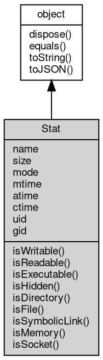

# 对象 Stat
文件的基础信息对象

Stat 对象通过 [fs.stat](../../module/ifs/fs.md#stat), [File.stat](File.md#stat), [fs.readdir](../../module/ifs/fs.md#readdir) 查询，不可独立创建

## 继承关系


## 成员属性
        
### name
**String, 文件名称**

```JavaScript
readonly String Stat.name;
```

--------------------------
### size
**Long, 文件尺寸**

```JavaScript
readonly Long Stat.size;
```

--------------------------
### mode
**Integer, 文件权限，Windows 不支持此属性**

```JavaScript
readonly Integer Stat.mode;
```

--------------------------
### mtime
**Date, 文件最后修改时间**

```JavaScript
readonly Date Stat.mtime;
```

--------------------------
### atime
**Date, 文件最后访问时间**

```JavaScript
readonly Date Stat.atime;
```

--------------------------
### ctime
**Date, 文件创建时间**

```JavaScript
readonly Date Stat.ctime;
```

--------------------------
### uid
**Integer, 文件拥有者的id**

```JavaScript
readonly Integer Stat.uid;
```

--------------------------
### gid
**Integer, 文件所属的组id**

```JavaScript
readonly Integer Stat.gid;
```

## 成员函数
        
### isWritable
**查询文件是否有写入权限**

```JavaScript
Boolean Stat.isWritable();
```

返回结果:
* Boolean, 为 true 则有写入权限

--------------------------
### isReadable
**查询文件是否有读权限**

```JavaScript
Boolean Stat.isReadable();
```

返回结果:
* Boolean, 为 true 则有读权限

--------------------------
### isExecutable
**查询文件是否有执行权限**

```JavaScript
Boolean Stat.isExecutable();
```

返回结果:
* Boolean, 为 true 则有执行权限

--------------------------
### isHidden
**查询文件是否隐藏**

```JavaScript
Boolean Stat.isHidden();
```

返回结果:
* Boolean, 为 true 则隐藏

--------------------------
### isDirectory
**查询文件是否是目录**

```JavaScript
Boolean Stat.isDirectory();
```

返回结果:
* Boolean, 为 true 则是目录

--------------------------
### isFile
**查询文件是否是文件**

```JavaScript
Boolean Stat.isFile();
```

返回结果:
* Boolean, 为 true 则是文件

--------------------------
### isSymbolicLink
**查询文件是否是符号链接**

```JavaScript
Boolean Stat.isSymbolicLink();
```

返回结果:
* Boolean, 为 true 则是符号链接

--------------------------
### isMemory
**查询文件是否是内存文件**

```JavaScript
Boolean Stat.isMemory();
```

返回结果:
* Boolean, 为 true 则是内存文件

--------------------------
### isSocket
**查询文件是否是 [Socket](Socket.md)**

```JavaScript
Boolean Stat.isSocket();
```

返回结果:
* Boolean, 为 true 则是 [Socket](Socket.md)

--------------------------
### dispose
**强制回收对象，调用此方法后，对象资源将立即释放**

```JavaScript
Stat.dispose();
```

--------------------------
### equals
**比较当前对象与给定的对象是否相等**

```JavaScript
Boolean Stat.equals(object expected);
```

调用参数:
* expected: [object](object.md), 制定比较的目标对象

返回结果:
* Boolean, 返回对象比较的结果

--------------------------
### toString
**返回对象的字符串表示，一般返回 "[Native Object]"，对象可以根据自己的特性重新实现**

```JavaScript
String Stat.toString();
```

返回结果:
* String, 返回对象的字符串表示

--------------------------
### toJSON
**返回对象的 JSON 格式表示，一般返回对象定义的可读属性集合**

```JavaScript
Value Stat.toJSON(String key = "");
```

调用参数:
* key: String, 未使用

返回结果:
* Value, 返回包含可 JSON 序列化的值

