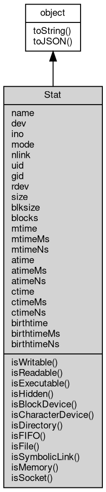

# Object Stat
[File](File.md) status information [object](object.md)

 A Stat describes one file system entry: its type, size, permissions, owner and timestamps. It
 is returned by [fs.stat](../../module/ifs/fs.md#stat), [fs.lstat](../../module/ifs/fs.md#lstat) and [fs.fstat](../../module/ifs/fs.md#fstat) (synchronous, callback or fs.promises forms) and
 is passed to the [fs.watchFile](../../module/ifs/fs.md#watchFile) callback; it cannot be created with `new`.

Concepts:

- **Followed or not**: [fs.stat](../../module/ifs/fs.md#stat) describes the target of a symbolic link, [fs.lstat](../../module/ifs/fs.md#lstat) describes the
  link itself (`isSymbolicLink()` is true); the isXxx() predicates all [test](../../module/ifs/test.md) the mode of the
  described entry, so a link reported by lstat is neither a file nor a directory.
- **Timestamps**: mtime is the last modification time, atime the last access time, ctime the
  last status (inode) change time and birthtime the creation time. Each timestamp is exposed as
  a Date, as milliseconds since the Unix epoch (mtimeMs) and as the nanosecond part of the
  timestamp (mtimeNs, 0-999999999). The Node.js `bigint` option is not implemented, so the Ns
  properties are always numbers and no epoch-nanosecond values are produced.
- **name**: the base name of the queried [path](../../module/ifs/path.md) (a fibjs extension, Node.js Stats has no name);
  it is empty for objects that are not bound to a [path](../../module/ifs/path.md).
- **Permissions**: isReadable/isWritable/isExecutable [test](../../module/ifs/test.md) the owner permission bits of mode,
  not the effective access of the current user. isHidden/isMemory/isSocket are fibjs extensions;
  isMemory is true for entries served by the [zip](../../module/ifs/zip.md) VFS, whose mode-based type predicates are not
  populated.

Obtained from:
- `fs.stat([path](../../module/ifs/path.md))` / `fs.stat([path](../../module/ifs/path.md), options)` — the target of a symbolic link;
- `fs.lstat([path](../../module/ifs/path.md))` — the link itself;
- `fs.fstat(fd)` — an open file descriptor or [FileHandle](FileHandle.md);
- the `fs.watchFile` callback — the status before and after a detected change.

Example 1 — inspect a file created in a temporary directory:

```JavaScript
const fs = require('fs');
const os = require('os');
const path = require('path');

const dir = fs.mkdtempSync(path.join(os.tmpdir(), 'fibjs-stat-'));
const file = path.join(dir, 'data.txt');
fs.writeFile(file, 'hello');

const st = fs.stat(file);
console.log(st.name, st.size, st.isFile(), st.isDirectory());
console.log(st.mtime instanceof Date, typeof st.mtimeMs, st.mtimeNs >= 0);

fs.rmSync(dir, {
    recursive: true,
    force: true
});
```

Example 2 — compare stat and lstat on a symbolic link:

```JavaScript
const fs = require('fs');
const os = require('os');
const path = require('path');

const dir = fs.mkdtempSync(path.join(os.tmpdir(), 'fibjs-stat-'));
const target = path.join(dir, 'target.txt');
const link = path.join(dir, 'link.txt');
fs.writeFile(target, 'hello');
fs.symlink(target, link);

console.log(fs.stat(link).isFile()); // true, the link is followed
console.log(fs.lstat(link).isSymbolicLink()); // true, the link itself

fs.rmSync(dir, {
    recursive: true,
    force: true
});
```

Example 3 — fstat an open file descriptor:

```JavaScript
const fs = require('fs');
const os = require('os');
const path = require('path');

const dir = fs.mkdtempSync(path.join(os.tmpdir(), 'fibjs-stat-'));
const file = path.join(dir, 'open.txt');
fs.writeFile(file, 'content');

const handle = fs.open(file);
const st = fs.fstat(handle);
console.log(st.isFile(), st.size); // true 7

fs.close(handle);
fs.rmSync(dir, {
    recursive: true,
    force: true
});
```

The Date and millisecond representations are independent: changing one is not reflected in the
others. On platforms where birthtime is not available the birthtime fields may hold the ctime
value or the Unix epoch.

## Inheritance

```dot
digraph {
    node [fontname="Helvetica,sans-Serif", fontsize=10, shape="record", style="filled", fillcolor="white"];

    object [tooltip="object", URL="object.md", label="{object|toString()\ltoJSON()\l}"];
    Stat [tooltip="Stat", fillcolor="lightgray", id="me", label="{Stat|name\ldev\lino\lmode\lnlink\luid\lgid\lrdev\lsize\lblksize\lblocks\lmtime\lmtimeMs\lmtimeNs\latime\latimeMs\latimeNs\lctime\lctimeMs\lctimeNs\lbirthtime\lbirthtimeMs\lbirthtimeNs\l|isWritable()\lisReadable()\lisExecutable()\lisHidden()\lisBlockDevice()\lisCharacterDevice()\lisDirectory()\lisFIFO()\lisFile()\lisSymbolicLink()\lisMemory()\lisSocket()\l}"];

    object -> Stat [dir=back];
}
```

## Properties
        
### name
**String, [File](File.md) name**

```JavaScript
readonly String Stat.name;
```

The base name of the queried [path](../../module/ifs/path.md), for example 'report.txt' for '/data/report.txt'; empty
when the [object](object.md) was not created from a [path](../../module/ifs/path.md). Not provided by Node.js Stats (fibjs extension).

--------------------------
### dev
**Integer, Device ID containing the file**

```JavaScript
readonly Integer Stat.dev;
```

Numeric identifier of the device that holds the entry, as reported by the operating system;
together with ino it identifies the file on the system.

--------------------------
### ino
**Integer, Number of Inodes in the file**

```JavaScript
readonly Integer Stat.ino;
```

[File](File.md) system specific inode number; it stays stable while the entry exists and may be reused
after removal.

--------------------------
### mode
**Integer, [File](File.md) permission; not supported on Windows**

```JavaScript
readonly Integer Stat.mode;
```

Bit field holding the file type in the S_IFMT bits and the permission bits used by the isXxx
predicates; only the write bit is meaningful on Windows.

--------------------------
### nlink
**Integer, Number of hard links associated with this file**

```JavaScript
readonly Integer Stat.nlink;
```

A regular file with one name reports 1; directories report the number of contained
subdirectories plus two.

--------------------------
### uid
**Integer, Owner id of the file**

```JavaScript
readonly Integer Stat.uid;
```

Numeric user id of the owner (POSIX); 0 on platforms without POSIX ownership.

--------------------------
### gid
**Integer, Group id of the file**

```JavaScript
readonly Integer Stat.gid;
```

Numeric group id of the owner (POSIX); 0 on platforms without POSIX ownership.

--------------------------
### rdev
**Integer, For special file [types](../../module/ifs/types.md), the device ID containing the file**

```JavaScript
readonly Integer Stat.rdev;
```

Device identifier for character or block special files; 0 for regular files and directories.

--------------------------
### size
**Number, [File](File.md) size**

```JavaScript
readonly Number Stat.size;
```

Size in bytes; 0 for directories and for file systems that do not report it. The value is
exposed as a Number, so files larger than 2^53 bytes lose precision.

Example — check the size of a file with known content:

```JavaScript
const fs = require('fs');
const os = require('os');
const path = require('path');

const dir = fs.mkdtempSync(path.join(os.tmpdir(), 'fibjs-size-'));
const file = path.join(dir, 'size.txt');
fs.writeFile(file, '12345');
console.log(fs.stat(file).size); // 5

fs.rmSync(dir, {
    recursive: true,
    force: true
});
```

--------------------------
### blksize
**Integer, [File](File.md) system block size for I/O operations**

```JavaScript
readonly Integer Stat.blksize;
```

Preferred block size reported by the file system, in bytes; typically 4096 on modern
systems.

--------------------------
### blocks
**Integer, Number of blocks allocated to the file**

```JavaScript
readonly Integer Stat.blocks;
```

Count of 512-byte blocks actually allocated, which may be larger than size/512 because of
pre-allocation; 0 on Windows.

--------------------------
### mtime
**Date, Last modification time of the file**

```JavaScript
readonly Date Stat.mtime;
```

Time of the last content change as a Date, usually updated by write, truncate and utimes.

--------------------------
### mtimeMs
**Number, Last modification time of the file (ms)**

```JavaScript
readonly Number Stat.mtimeMs;
```

The same instant as mtime, expressed in milliseconds since the Unix epoch; the two
representations are independent objects and updating one does not change the other.

--------------------------
### mtimeNs
**Long, Nanosecond part of the last modification time**

```JavaScript
readonly Long Stat.mtimeNs;
```

Holds the sub-second nanosecond part (0-999999999) of the timestamp. Unlike Node.js this
property is always available; the bigint option that would produce epoch-nanosecond values
is not implemented.

--------------------------
### atime
**Date, Last access time of the file**

```JavaScript
readonly Date Stat.atime;
```

Time of the last access as a Date, updated by reads depending on the file system mount
options (some systems mount with noatime).

--------------------------
### atimeMs
**Number, Last access time of the file (ms)**

```JavaScript
readonly Number Stat.atimeMs;
```

The same instant as atime, expressed in milliseconds since the Unix epoch.

--------------------------
### atimeNs
**Long, Nanosecond part of the last access time**

```JavaScript
readonly Long Stat.atimeNs;
```

Holds the sub-second nanosecond part (0-999999999) of the timestamp; always present, the
bigint option is not implemented (see mtimeNs).

--------------------------
### ctime
**Date, [File](File.md) status change time**

```JavaScript
readonly Date Stat.ctime;
```

Time of the last inode change as a Date; updated by operations that modify the status such
as chmod, chown, link, rename and unlink, not only by writes.

--------------------------
### ctimeMs
**Number, [File](File.md) status change time (ms)**

```JavaScript
readonly Number Stat.ctimeMs;
```

The same instant as ctime, expressed in milliseconds since the Unix epoch.

--------------------------
### ctimeNs
**Long, Nanosecond part of the status change time**

```JavaScript
readonly Long Stat.ctimeNs;
```

Holds the sub-second nanosecond part (0-999999999) of the timestamp; always present, the
bigint option is not implemented (see mtimeNs).

--------------------------
### birthtime
**Date, [File](File.md) creation time**

```JavaScript
readonly Date Stat.birthtime;
```

Creation time as a Date; file systems that do not record it may report the ctime value or
the Unix epoch instead.

--------------------------
### birthtimeMs
**Number, [File](File.md) creation time (ms)**

```JavaScript
readonly Number Stat.birthtimeMs;
```

The same instant as birthtime, expressed in milliseconds since the Unix epoch.

--------------------------
### birthtimeNs
**Long, Nanosecond part of the creation time**

```JavaScript
readonly Long Stat.birthtimeNs;
```

Holds the sub-second nanosecond part (0-999999999) of the timestamp; always present, the
bigint option is not implemented (see mtimeNs).

## Methods
        
### isWritable
**Queries whether the file is writable**

```JavaScript
Boolean Stat.isWritable();
```

Returns:
* Boolean, true if it is writable

Tests the owner write bit (S_IWUSR) of mode, not the effective access of the current user;
Node.js Stats has no such method.

--------------------------
### isReadable
**Queries whether the file is readable**

```JavaScript
Boolean Stat.isReadable();
```

Returns:
* Boolean, true if it is readable

Tests the owner read bit (S_IRUSR) of mode, not the effective access of the current user;
Node.js Stats has no such method.

--------------------------
### isExecutable
**Queries whether the file is executable**

```JavaScript
Boolean Stat.isExecutable();
```

Returns:
* Boolean, true if it is executable

Tests the owner execute/search bit (S_IXUSR) of mode, not the effective access of the
current user; Node.js Stats has no such method.

--------------------------
### isHidden
**Queries whether the file is hidden**

```JavaScript
Boolean Stat.isHidden();
```

Returns:
* Boolean, true if it is hidden

Hidden-file flag; on POSIX the flag is not populated, so dotfiles report false. fibjs
extension, Node.js Stats has no such method.

--------------------------
### isBlockDevice
**Queries whether the Stat describes a block device**

```JavaScript
Boolean Stat.isBlockDevice();
```

Returns:
* Boolean, true if it describes a block device

Tests the S_IFBLK type bits of mode; always false on Windows.

--------------------------
### isCharacterDevice
**Queries whether the Stat describes a character device**

```JavaScript
Boolean Stat.isCharacterDevice();
```

Returns:
* Boolean, true if it describes a character device

Tests the S_IFCHR type bits of mode; character devices include terminals and serial ports.

--------------------------
### isDirectory
**Queries whether the file is a directory**

```JavaScript
Boolean Stat.isDirectory();
```

Returns:
* Boolean, true if it is a directory

Tests the S_IFDIR type bits of mode. For a symbolic link described by lstat this is false,
because the link itself is not a directory.

Example — distinguish a file from a directory:

```JavaScript
const fs = require('fs');
const os = require('os');
const path = require('path');

const dir = fs.mkdtempSync(path.join(os.tmpdir(), 'fibjs-dir-'));
const file = path.join(dir, 'a.txt');
fs.writeFile(file, 'a');

console.log(fs.stat(dir).isDirectory()); // true
console.log(fs.stat(file).isDirectory()); // false

fs.rmSync(dir, {
    recursive: true,
    force: true
});
```

--------------------------
### isFIFO
**Queries whether the Stat describes a FIFO pipe**

```JavaScript
Boolean Stat.isFIFO();
```

Returns:
* Boolean, true if it describes a FIFO pipe

Tests the S_IFIFO type bits of mode; always false on Windows.

--------------------------
### isFile
**Queries whether the file is a file**

```JavaScript
Boolean Stat.isFile();
```

Returns:
* Boolean, true if it is a file

Tests the S_IFREG type bits of mode; directories and links reported by lstat are not files.

--------------------------
### isSymbolicLink
**Queries whether the file is a symbolic link**

```JavaScript
Boolean Stat.isSymbolicLink();
```

Returns:
* Boolean, true if it is a symbolic link

Tests the S_IFLNK type bits of mode; only lstat results are expected to report it, since
stat follows the link and describes its target.

Example — lstat reports a link, stat reports its target:

```JavaScript
const fs = require('fs');
const os = require('os');
const path = require('path');

const dir = fs.mkdtempSync(path.join(os.tmpdir(), 'fibjs-link-'));
const target = path.join(dir, 'target.txt');
const link = path.join(dir, 'link.txt');
fs.writeFile(target, 'x');
fs.symlink(target, link);

console.log(fs.lstat(link).isSymbolicLink()); // true
console.log(fs.stat(link).isSymbolicLink()); // false

fs.rmSync(dir, {
    recursive: true,
    force: true
});
```

--------------------------
### isMemory
**Queries whether the file is a memory file**

```JavaScript
Boolean Stat.isMemory();
```

Returns:
* Boolean, true if it is a memory file

True when the entry is served by the [zip](../../module/ifs/zip.md) virtual file system ([fs.setZipFS](../../module/ifs/fs.md#setZipFS)) instead of the
real file system; such entries have no populated type bits, so the other predicates report
false. fibjs extension, Node.js Stats has no such method.

--------------------------
### isSocket
**Queries whether the file is a [Socket](Socket.md)**

```JavaScript
Boolean Stat.isSocket();
```

Returns:
* Boolean, true if it is a [Socket](Socket.md)

Tests the S_IFSOCK type bits of mode (the flag copied from another Stat); always false on
Windows.

--------------------------
### toString
**Returns the string form of the [object](object.md)**

```JavaScript
String Stat.toString();
```

Returns:
* String, returns the string form of the [object](object.md)

The base implementation reports an error: a native [object](object.md) has no implicit
text form, and only the classes whose value can be written as a string
override the member. [Buffer](Buffer.md) returns its content decoded with the given
[encoding](../../module/ifs/encoding.md), [HttpCookie](HttpCookie.md) returns "name=value", and so on; an override commonly
accepts optional arguments ([Buffer.toString](Buffer.md#toString) takes [encoding](../../module/ifs/encoding.md), start and
end) that are not part of this declaration.

Calling the member on a class that does not override it throws
"<Class>: the [object](object.md) can not be converted to string.", which is the
behavior to rely on when probing whether a value has a string form. See
toJSON for the serialization hook.

--------------------------
### toJSON
**Returns the JSON representation of the [object](object.md)**

```JavaScript
Value Stat.toJSON(String key = "");
```

Parameters:
* key: String, the property name of the value being serialized

Returns:
* Value, returns the JSON-serializable value

JSON.stringify(value) calls value.toJSON(key) when the member exists and
serializes the returned value in its place; the key argument carries the
property name of the value inside its parent [object](object.md) (an empty string at
the top level) and may be used to build a keyed form. The base
implementation returns a plain [object](object.md) holding the readable properties of
the instance, so a native [object](object.md) serializes without per-class code; a
class with a portable shape such as [Buffer](Buffer.md) overrides it, and a JavaScript
class may override it in the same way.

The member is normally reached through JSON.stringify rather than called
directly; calling it returns the same value JSON.stringify would
serialize.

