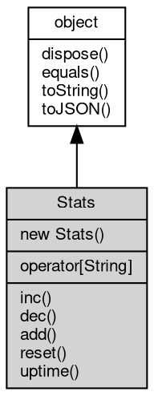

# 对象 Stats
数据统计对象，用以构建应用运行时数据收集

创建方法：

```JavaScript
var util = require("util");
var stats = new util.Stats(["begin", "end", "error"]);
```

一些内部对象会提供预先定义的的统计对象

## 继承关系


## 构造函数
        
### Stats
**数据统计对象构造方法**

```JavaScript
new Stats(Array keys);
```

调用参数:
* keys: Array, 指定计数器的名称

--------------------------
**数据统计对象构造方法**

```JavaScript
new Stats(Array staticKeys,
    Array keys);
```

调用参数:
* staticKeys: Array, 指定静态计数器的名称，静态计数器不会被 reset
* keys: Array, 指定计数器的名称

## 下标操作
        
**允许使用键值下标直接访问数值**

```JavaScript
readonly Integer Stats[String];
```

## 成员函数
        
### inc
**指定的计数器增一**

```JavaScript
Stats.inc(String key);
```

调用参数:
* key: String, 指定计数器名称

--------------------------
### dec
**指定的计数器减一**

```JavaScript
Stats.dec(String key);
```

调用参数:
* key: String, 指定计数器名称

--------------------------
### add
**指定的计数器加指定值**

```JavaScript
Stats.add(String key,
    Integer value);
```

调用参数:
* key: String, 指定计数器名称
* value: Integer, 指定数值

--------------------------
### reset
**初始化计数器，除 staticKeys 指定的计数器全部清零**

```JavaScript
Stats.reset();
```

--------------------------
### uptime
**查询上次 reset 到现在的运行时间**

```JavaScript
Integer Stats.uptime();
```

返回结果:
* Integer, 返回上次 reset 到现在的运行时间

--------------------------
### dispose
**强制回收对象，调用此方法后，对象资源将立即释放**

```JavaScript
Stats.dispose();
```

--------------------------
### equals
**比较当前对象与给定的对象是否相等**

```JavaScript
Boolean Stats.equals(object expected);
```

调用参数:
* expected: [object](object.md), 制定比较的目标对象

返回结果:
* Boolean, 返回对象比较的结果

--------------------------
### toString
**返回对象的字符串表示，一般返回 "[Native Object]"，对象可以根据自己的特性重新实现**

```JavaScript
String Stats.toString();
```

返回结果:
* String, 返回对象的字符串表示

--------------------------
### toJSON
**返回对象的 JSON 格式表示，一般返回对象定义的可读属性集合**

```JavaScript
Value Stats.toJSON(String key = "");
```

调用参数:
* key: String, 未使用

返回结果:
* Value, 返回包含可 JSON 序列化的值

