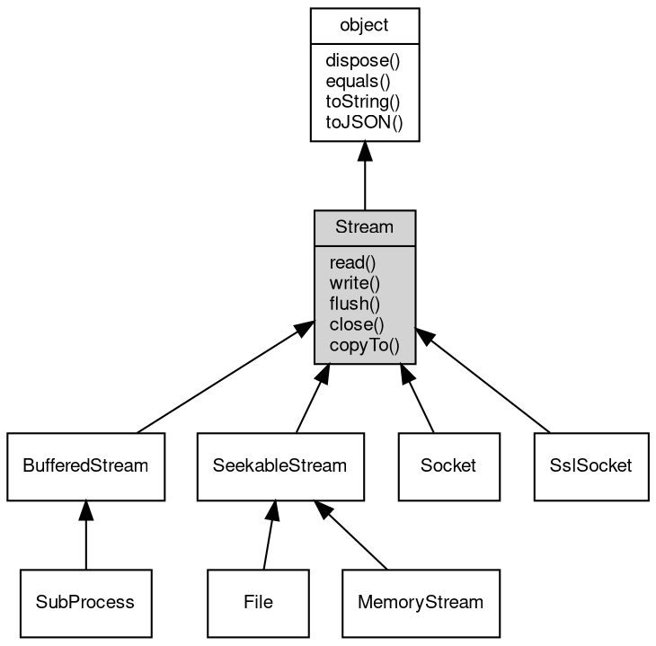

# 对象 Stream
流操作对象，用于二进制数据流读写

Stream 为基础对象，用于为流处理定义标准借口，不能独立创建

## 继承关系


## 成员函数
        
### read
**从流内读取指定大小的数据**

```JavaScript
Buffer Stream.read(Integer bytes = -1) async;
```

调用参数:
* bytes: Integer, 指定要读取的数据量，缺省为读取随机大小的数据块，读出的数据尺寸取决于设备

返回结果:
* [Buffer](Buffer.md), 返回从流内读取的数据，若无数据可读，或者连接中断，则返回 null

--------------------------
### write
**将给定的数据写入流**

```JavaScript
Stream.write(Buffer data) async;
```

调用参数:
* data: [Buffer](Buffer.md), 给定要写入的数据

--------------------------
### flush
**将文件缓冲区内容写入物理设备**

```JavaScript
Stream.flush() async;
```

--------------------------
### close
**关闭当前流对象**

```JavaScript
Stream.close() async;
```

--------------------------
### copyTo
**复制流数据到目标流中**

```JavaScript
Long Stream.copyTo(Stream stm,
    Long bytes = -1) async;
```

调用参数:
* stm: Stream, 目标流对象
* bytes: Long, 复制的字节数

返回结果:
* Long, 返回复制的字节数

--------------------------
### dispose
**强制回收对象，调用此方法后，对象资源将立即释放**

```JavaScript
Stream.dispose();
```

--------------------------
### equals
**比较当前对象与给定的对象是否相等**

```JavaScript
Boolean Stream.equals(object expected);
```

调用参数:
* expected: [object](object.md), 制定比较的目标对象

返回结果:
* Boolean, 返回对象比较的结果

--------------------------
### toString
**返回对象的字符串表示，一般返回 "[Native Object]"，对象可以根据自己的特性重新实现**

```JavaScript
String Stream.toString();
```

返回结果:
* String, 返回对象的字符串表示

--------------------------
### toJSON
**返回对象的 JSON 格式表示，一般返回对象定义的可读属性集合**

```JavaScript
Value Stream.toJSON(String key = "");
```

调用参数:
* key: String, 未使用

返回结果:
* Value, 返回包含可 JSON 序列化的值

