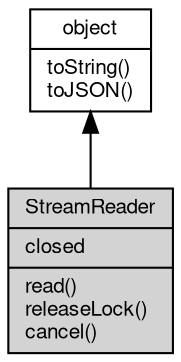

# 对象 StreamReader
StreamReader 对象，兼容 WHATWG ReadableStreamDefaultReader 接口的轻量级读取器

StreamReader 将 fibjs 的 [Stream](Stream.md) 封装为兼容 Web Streams API 的 read() 方法。
可以通过 [Stream.getReader](Stream.md#getReader)() 获取。

```JavaScript
const response = await fetch('http://example.com');
const reader = response.body.getReader();
while (true) {
    const {
        done,
        value
    } = await reader.read();
    if (done) break;
    console.log(value);
}
```

## 继承关系


## 成员属性
        
### closed
**Promise, 流关闭时解析的 Promise**

```JavaScript
readonly Promise StreamReader.closed;
```

## 成员函数
        
### read
**从流中读取下一个数据块**

```JavaScript
(Boolean done, Buffer value) StreamReader.read() promise;
```

返回结果:
* (Boolean done, [Buffer](Buffer.md) value), 返回一个包含 `done`（布尔值）和 `value`（[Buffer](Buffer.md) 数据或 undefined）属性的对象

--------------------------
### releaseLock
**释放对流的锁定**

```JavaScript
StreamReader.releaseLock();
```

--------------------------
### cancel
**取消流并释放锁定**

```JavaScript
StreamReader.cancel(String reason = "") promise;
```

调用参数:
* reason: String, 可选的取消原因

返回结果:
* 返回一个 Promise，在取消完成时解析

--------------------------
### toString
**返回对象的字符串表示，一般返回 "[Native Object]"，对象可以根据自己的特性重新实现**

```JavaScript
String StreamReader.toString();
```

返回结果:
* String, 返回对象的字符串表示

--------------------------
### toJSON
**返回对象的 JSON 格式表示，一般返回对象定义的可读属性集合**

```JavaScript
Value StreamReader.toJSON(String key = "");
```

调用参数:
* key: String, 未使用

返回结果:
* Value, 返回包含可 JSON 序列化的值

