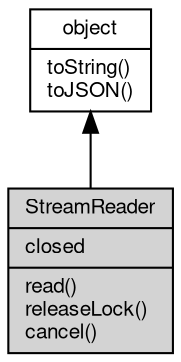

# Object StreamReader
A lightweight reader over a fibjs [Stream](Stream.md), shaped like a WHATWG reader

It is compatible with the WHATWG ReadableStreamDefaultReader: read() pulls
one chunk at a time from the stream behind it and resolves to an [object](object.md) with
`done` and `value` properties, the async counterpart of [Stream](Stream.md)#read. It cannot
be constructed directly; create it with [Stream](Stream.md)#getReader() and release it when
done.

Obtained from:
- `stream.getReader()` — any concrete [Stream](Stream.md): [MemoryStream](MemoryStream.md), the streams
  returned by [fs.createReadStream](../../module/ifs/fs.md#createReadStream)/createWriteStream, [net.Socket](../../module/ifs/net.md#Socket), [zlib](../../module/ifs/zlib.md) codec
  streams, HTTP bodies, and so on. [Stream](Stream.md) itself is abstract.

Concepts:

- **Pull reading**: each read() awaits one chunk from the underlying stream
  (the chunk size is chosen by the device; a [MemoryStream](MemoryStream.md) hands back all its
  remaining data). At the end of the stream it resolves `done: true` with an
  empty [Buffer](Buffer.md) as the value, and later reads keep resolving the same way.
- **No lock**: unlike the Web Streams API, getReader() can be called more than
  once — every call creates an independent reader over the same stream and
  there is no `locked` property. The readers share the data, so the first one
  to read consumes it.
- **Encoding**: read() always resolves Buffers; [Stream](Stream.md)#setEncoding is not
  applied to it.
- **Release**: releaseLock() detaches the reader, and cancel([reason]) closes
  the underlying stream (the reason string is accepted and ignored); after
  either call read() throws [20009]. The direct calls of read() and cancel()
  return promises.
- **closed**: a Promise resolved with undefined when read() observes the end
  of the stream or cancel() completes. It can only resolve if it was read
  before the reader finished: one created after the stream was drained never
  settles. This differs from the Web Streams API, where closed rejects on
  error and value is undefined at end of stream.

Example 1 — read all the chunks of an in-memory stream:

```JavaScript
const io = require('io');

(async () => {
    const stm = new io.MemoryStream();
    stm.write(Buffer.from('reader data'));
    stm.rewind();

    const reader = stm.getReader();
    let all = '';
    while (true) {
        const result = await reader.read();
        if (result.done) break;
        all += result.value.toString();
    }
    console.log(all); // reader data
})();
```

Example 2 — cancel a reader and wait for its closed promise:

```JavaScript
const io = require('io');

(async () => {
    const stm = new io.MemoryStream();
    stm.write(Buffer.from('cancel me'));
    stm.rewind();

    const reader = stm.getReader();
    let closed = false;
    reader.closed.then(() => {
        closed = true;
    });

    console.log((await reader.read()).value.toString()); // cancel me
    await reader.cancel(); // closes the underlying stream
    console.log(closed); // true
})();
```

## Inheritance

```dot
digraph {
    node [fontname="Helvetica,sans-Serif", fontsize=10, shape="record", style="filled", fillcolor="white"];

    object [tooltip="object", URL="object.md", label="{object|toString()\ltoJSON()\l}"];
    StreamReader [tooltip="StreamReader", fillcolor="lightgray", id="me", label="{StreamReader|closed\l|read()\lreleaseLock()\lcancel()\l}"];

    object -> StreamReader [dir=back];
}
```

## Properties
        
### closed
**Promise, A Promise that resolves when the stream closes**

```JavaScript
readonly Promise StreamReader.closed;
```

Resolves with undefined once read() observes the end of the stream or
cancel() finishes. Read it before the stream is drained: a promise created
after the reader already finished never settles. A stream error rejects
read() but neither resolves nor rejects this promise.

Example — wait for the end of the stream through closed:

```JavaScript
const io = require('io');

(async () => {
    const stm = new io.MemoryStream();
    stm.write(Buffer.from('x'));
    stm.rewind();

    const reader = stm.getReader();
    let closed = false;
    reader.closed.then(() => {
        closed = true;
    });

    while (!(await reader.read()).done);
    console.log(closed); // true
})();
```

## Methods
        
### read
**Reads the next chunk of data from the stream**

```JavaScript
(Boolean done, Buffer value) StreamReader.read() promise;
```

Returns:
* (Boolean done, [Buffer](Buffer.md) value), returns a Promise resolving to an [object](object.md) with `done` (boolean)

The promise resolves with `{ done, value }`: `value` is a [Buffer](Buffer.md) with the
chunk, and at the end of the stream `done` is true with an empty [Buffer](Buffer.md) as
the value; further reads resolve the same way. The call has no parameters
and therefore no callback form — use it with await or `.then()`. After
releaseLock() or cancel() it throws [20009].

Example — observe a chunk and then the end of the stream:

```JavaScript
const io = require('io');

(async () => {
    const stm = new io.MemoryStream();
    stm.write(Buffer.from('ab'));
    stm.rewind();

    const reader = stm.getReader();
    const first = await reader.read();
    console.log(first.done, first.value.toString()); // false ab
    const second = await reader.read();
    console.log(second.done, second.value.length); // true 0
})();
```

--------------------------
### releaseLock
**Releases the lock on the stream**

```JavaScript
StreamReader.releaseLock();
```

Detaches the reader from the stream; calling it again is harmless. A
subsequent read() throws [20009]. Buffered data stays in the stream and can
be read by another reader or by [Stream](Stream.md)#read; the stream itself is not
closed. Node/Web comparison: the Web Streams API also exposes the lock state
through `locked`, which fibjs does not have.

Example — release a reader and observe the detached read:

```JavaScript
const io = require('io');

(async () => {
    const stm = new io.MemoryStream();
    stm.write(Buffer.from('lock'));
    stm.rewind();

    const reader = stm.getReader();
    console.log((await reader.read()).value.toString()); // lock
    reader.releaseLock();
    try {
        await reader.read();
    } catch (err) {
        console.log('read rejected:', err.number); // read rejected: 20009
    }
})();
```

--------------------------
### cancel
**Cancels the stream and releases the lock**

```JavaScript
StreamReader.cancel(String reason = "") promise;
```

Parameters:
* reason: String, optional cancellation reason, currently ignored

Closes the underlying stream (like [Stream](Stream.md)#close) and resolves the `closed`
promise; a [MemoryStream](MemoryStream.md) keeps its buffered data readable because its close
is a no-op. The reason argument is accepted as a string and ignored. After
cancel, read() throws [20009]; if the reader was already released, cancel
resolves without touching the stream. Node/Web comparison: the Web Streams
API cancel(reason) passes the reason to the underlying source and rejects
the closed promise on failure, neither of which fibjs does.

--------------------------
### toString
**Returns the string form of the [object](object.md)**

```JavaScript
String StreamReader.toString();
```

Returns:
* String, returns the string form of the [object](object.md)

The base implementation reports an error: a native [object](object.md) has no implicit
text form, and only the classes whose value can be written as a string
override the member. [Buffer](Buffer.md) returns its content decoded with the given
[encoding](../../module/ifs/encoding.md), [HttpCookie](HttpCookie.md) returns "name=value", and so on; an override commonly
accepts optional arguments ([Buffer.toString](Buffer.md#toString) takes [encoding](../../module/ifs/encoding.md), start and
end) that are not part of this declaration.

Calling the member on a class that does not override it throws
"<Class>: the [object](object.md) can not be converted to string.", which is the
behavior to rely on when probing whether a value has a string form. See
toJSON for the serialization hook.

--------------------------
### toJSON
**Returns the JSON representation of the [object](object.md)**

```JavaScript
Value StreamReader.toJSON(String key = "");
```

Parameters:
* key: String, the property name of the value being serialized

Returns:
* Value, returns the JSON-serializable value

JSON.stringify(value) calls value.toJSON(key) when the member exists and
serializes the returned value in its place; the key argument carries the
property name of the value inside its parent [object](object.md) (an empty string at
the top level) and may be used to build a keyed form. The base
implementation returns a plain [object](object.md) holding the readable properties of
the instance, so a native [object](object.md) serializes without per-class code; a
class with a portable shape such as [Buffer](Buffer.md) overrides it, and a JavaScript
class may override it in the same way.

The member is normally reached through JSON.stringify rather than called
directly; calling it returns the same value JSON.stringify would
serialize.

