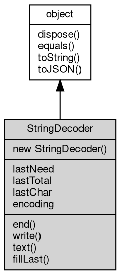

# 对象 StringDecoder
流解码对象

## 继承关系


## 构造函数
        
### StringDecoder
**解码器构造函数**

```JavaScript
new StringDecoder(String encoding = "utf8");
```

调用参数:
* encoding: String, 解码编码. 默认 'utf8'.

## 成员属性
        
### lastNeed
**Integer, 内部使用。**

```JavaScript
Integer StringDecoder.lastNeed;
```

--------------------------
### lastTotal
**Integer, 内部使用。**

```JavaScript
Integer StringDecoder.lastTotal;
```

--------------------------
### lastChar
**[Buffer](Buffer.md), 内部使用。**

```JavaScript
Buffer StringDecoder.lastChar;
```

--------------------------
### encoding
**String, 解码编码.内部使用。**

```JavaScript
String StringDecoder.encoding;
```

## 成员函数
        
### end
**将内部存留的 buffer 作为字符返回。不完整的 UTF-8 和 UTF-16 字节会尝试补全。**

```JavaScript
String StringDecoder.end();
```

返回结果:
* String, 解码后的字符串.

--------------------------
**将内部存留的 buffer 作为字符返回。不完整的 UTF-8 和 UTF-16 字节会尝试补全。**

```JavaScript
String StringDecoder.end(Buffer buf);
```

调用参数:
* buf: [Buffer](Buffer.md), 需要解码的 [Buffer](Buffer.md). 在执行 end 之前，会先调用 write 将 buffer 写入。

返回结果:
* String, 解码后的字符串.

--------------------------
### write
**返回一个解码后的字符串, 确保任何非完整的末尾字符被省略此次不返回，并被存储在内部供下一次的 write 或者 end 方法使用。**

```JavaScript
String StringDecoder.write(Buffer buf);
```

调用参数:
* buf: [Buffer](Buffer.md), 需要解码的 [Buffer](Buffer.md)。

返回结果:
* String, 解码后的字符串.

--------------------------
### text
**内部使用。.**

```JavaScript
String StringDecoder.text(Buffer buf,
    Integer offset);
```

调用参数:
* buf: [Buffer](Buffer.md), 需要解码的 [Buffer](Buffer.md)。
* offset: Integer, 解码偏移量

返回结果:
* String, 解码后的字符串.

--------------------------
### fillLast
**内部使用。.**

```JavaScript
String StringDecoder.fillLast(Buffer buf);
```

调用参数:
* buf: [Buffer](Buffer.md), A [Buffer](Buffer.md) containing the bytes to decode.

返回结果:
* String, 解码后的字符串.

--------------------------
### dispose
**强制回收对象，调用此方法后，对象资源将立即释放**

```JavaScript
StringDecoder.dispose();
```

--------------------------
### equals
**比较当前对象与给定的对象是否相等**

```JavaScript
Boolean StringDecoder.equals(object expected);
```

调用参数:
* expected: [object](object.md), 制定比较的目标对象

返回结果:
* Boolean, 返回对象比较的结果

--------------------------
### toString
**返回对象的字符串表示，一般返回 "[Native Object]"，对象可以根据自己的特性重新实现**

```JavaScript
String StringDecoder.toString();
```

返回结果:
* String, 返回对象的字符串表示

--------------------------
### toJSON
**返回对象的 JSON 格式表示，一般返回对象定义的可读属性集合**

```JavaScript
Value StringDecoder.toJSON(String key = "");
```

调用参数:
* key: String, 未使用

返回结果:
* Value, 返回包含可 JSON 序列化的值

