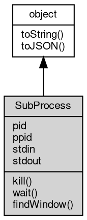

# 对象 SubProcess
子进程对象

```JavaScript
var process = require("process");
var sub = process.open("ls");
```

## 继承关系


## 成员属性
        
### pid
**Integer, 读取当前对象指向的进程的 id**

```JavaScript
readonly Integer SubProcess.pid;
```

--------------------------
### ppid
**Integer, 读取当前对象指向的父进程的 id**

```JavaScript
readonly Integer SubProcess.ppid;
```

--------------------------
### stdin
**[BufferedStream](BufferedStream.md), 读取当前对象指向的进程的标准输入对象**

```JavaScript
readonly BufferedStream SubProcess.stdin;
```

--------------------------
### stdout
**[BufferedStream](BufferedStream.md), 读取当前对象指向的进程的标准输出对象**

```JavaScript
readonly BufferedStream SubProcess.stdout;
```

## 成员函数
        
### kill
**杀掉当前对象指向的进程，并传递信号**

```JavaScript
SubProcess.kill(Integer signal);
```

调用参数:
* signal: Integer, 传递的信号

--------------------------
### wait
**等待当前对象指向的进程结束，并返回进程结束代码**

```JavaScript
Integer SubProcess.wait() async;
```

返回结果:
* Integer, 进程的结束代码

--------------------------
### findWindow
**查询当前对象所指向的进程是否存在指定名称的窗口，仅限 windows**

```JavaScript
Value SubProcess.findWindow(String name);
```

调用参数:
* name: String, 窗口名称

返回结果:
* Value, 窗口存在则返回窗口的 rect，否则返回 undefined

--------------------------
### toString
**返回对象的字符串表示，一般返回 "[Native Object]"，对象可以根据自己的特性重新实现**

```JavaScript
String SubProcess.toString();
```

返回结果:
* String, 返回对象的字符串表示

--------------------------
### toJSON
**返回对象的 JSON 格式表示，一般返回对象定义的可读属性集合**

```JavaScript
Value SubProcess.toJSON(String key = "");
```

调用参数:
* key: String, 未使用

返回结果:
* Value, 返回包含可 JSON 序列化的值

