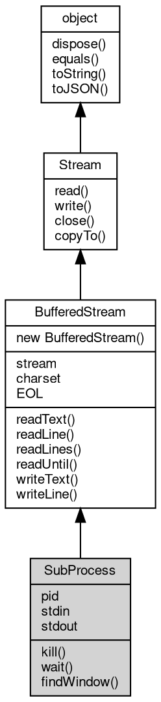

# 对象 SubProcess
子进程对象

```JavaScript
var process = require("process");
var sub = process.open("ls");
```

## 继承关系


## 成员属性
        
### pid
**Integer, 读取当前对象指向的进程的 id**

```JavaScript
readonly Integer SubProcess.pid;
```

--------------------------
### stdin
**[BufferedStream](BufferedStream.md), 读取当前对象指向的进程的标准输入对象**

```JavaScript
readonly BufferedStream SubProcess.stdin;
```

--------------------------
### stdout
**[BufferedStream](BufferedStream.md), 读取当前对象指向的进程的标准输出对象**

```JavaScript
readonly BufferedStream SubProcess.stdout;
```

--------------------------
### stream
**[Stream](Stream.md), 查询创建缓存对象时的流对象**

```JavaScript
readonly Stream SubProcess.stream;
```

--------------------------
### charset
**String, 查询和设置当前对象处理文本时的字符集，缺省为 utf-8**

```JavaScript
String SubProcess.charset;
```

--------------------------
### EOL
**String, 查询和设置行结尾标识，缺省时，posix:\"\\n\"；windows:\"\\r\\n\"**

```JavaScript
String SubProcess.EOL;
```

## 成员函数
        
### kill
**杀掉当前对象指向的进程，并传递信号**

```JavaScript
SubProcess.kill(Integer signal);
```

调用参数:
* signal: Integer, 传递的信号

--------------------------
### wait
**等待当前对象指向的进程结束，并返回进程结束代码**

```JavaScript
Integer SubProcess.wait() async;
```

返回结果:
* Integer, 进程的结束代码

--------------------------
### findWindow
**查询当前对象所指向的进程是否存在指定名称的窗口，仅限 windows**

```JavaScript
Value SubProcess.findWindow(String name);
```

调用参数:
* name: String, 窗口名称

返回结果:
* Value, 窗口存在则返回窗口的 rect，否则返回 undefined

--------------------------
### readText
**读取指定字符的文本**

```JavaScript
String SubProcess.readText(Integer size) async;
```

调用参数:
* size: Integer, 指定读取的文本字符个数，以 utf8 或者指定的编码字节数为准

返回结果:
* String, 返回读取的文本字符串，若无数据可读，或者连接中断，则返回 null

--------------------------
### readLine
**读取一行文本，行结尾标识基于 EOL 属性的设置，缺省时，posix:\"\\n\"；windows:\"\\r\\n\"**

```JavaScript
String SubProcess.readLine(Integer maxlen = -1) async;
```

调用参数:
* maxlen: Integer, 指定此次读取的最大字符串，以 utf8 编码字节数为准，缺省不限制字符数

返回结果:
* String, 返回读取的文本字符串，若无数据可读，或者连接中断，则返回 null

--------------------------
### readLines
**以数组方式读取一组文本行，行结尾标识基于 EOL 属性的设置，缺省时，posix:\"\\n\"；windows:\"\\r\\n\"**

```JavaScript
Array SubProcess.readLines(Integer maxlines = -1);
```

调用参数:
* maxlines: Integer, 指定此次读取的最大行数，缺省读取全部文本行

返回结果:
* Array, 返回读取的文本行数组，若无数据可读，或者连接中断，空数组

--------------------------
### readUntil
**读取一个文本字符串，以指定的字节为结尾**

```JavaScript
String SubProcess.readUntil(String mk,
    Integer maxlen = -1) async;
```

调用参数:
* mk: String, 指定结尾的字符串
* maxlen: Integer, 指定此次读取的最大字符串，以 utf8 编码字节数为准，缺省不限制字符数

返回结果:
* String, 返回读取的文本字符串，若无数据可读，或者连接中断，则返回 null

--------------------------
### writeText
**写入一个字符串**

```JavaScript
SubProcess.writeText(String txt) async;
```

调用参数:
* txt: String, 指定写入的字符串

--------------------------
### writeLine
**写入一个字符串，并写入换行符**

```JavaScript
SubProcess.writeLine(String txt) async;
```

调用参数:
* txt: String, 指定写入的字符串

--------------------------
### read
**从流内读取指定大小的数据**

```JavaScript
Buffer SubProcess.read(Integer bytes = -1) async;
```

调用参数:
* bytes: Integer, 指定要读取的数据量，缺省为读取随机大小的数据块，读出的数据尺寸取决于设备

返回结果:
* [Buffer](Buffer.md), 返回从流内读取的数据，若无数据可读，或者连接中断，则返回 null

--------------------------
### write
**将给定的数据写入流**

```JavaScript
SubProcess.write(Buffer data) async;
```

调用参数:
* data: [Buffer](Buffer.md), 给定要写入的数据

--------------------------
### close
**关闭当前流对象**

```JavaScript
SubProcess.close() async;
```

--------------------------
### copyTo
**复制流数据到目标流中**

```JavaScript
Long SubProcess.copyTo(Stream stm,
    Long bytes = -1) async;
```

调用参数:
* stm: [Stream](Stream.md), 目标流对象
* bytes: Long, 复制的字节数

返回结果:
* Long, 返回复制的字节数

--------------------------
### dispose
**强制回收对象，调用此方法后，对象资源将立即释放**

```JavaScript
SubProcess.dispose();
```

--------------------------
### equals
**比较当前对象与给定的对象是否相等**

```JavaScript
Boolean SubProcess.equals(object expected);
```

调用参数:
* expected: [object](object.md), 制定比较的目标对象

返回结果:
* Boolean, 返回对象比较的结果

--------------------------
### toString
**返回对象的字符串表示，一般返回 "[Native Object]"，对象可以根据自己的特性重新实现**

```JavaScript
String SubProcess.toString();
```

返回结果:
* String, 返回对象的字符串表示

--------------------------
### toJSON
**返回对象的 JSON 格式表示，一般返回对象定义的可读属性集合**

```JavaScript
Value SubProcess.toJSON(String key = "");
```

调用参数:
* key: String, 未使用

返回结果:
* Value, 返回包含可 JSON 序列化的值

