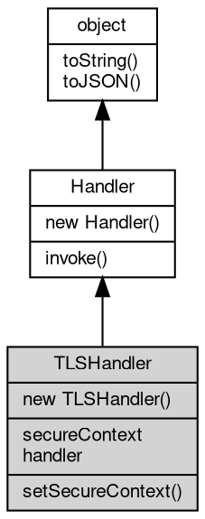

# 对象 TLSHandler
[tls](../../module/ifs/tls.md)/ssl 协议转换处理器

用以将数据流转换为 [tls](../../module/ifs/tls.md)/ssl 流协议。TLSHandler 是对 [TLSSocket](TLSSocket.md) 的封装，用于构建服务器，逻辑上相当于：

```JavaScript
function(s) {
    var s1 = new tls.TLSSocket(ctx);
    s1.accept(s);
    hdlr.invoke(s1);
    s1.close();
}
```

## 继承关系


## 构造函数
        
### TLSHandler
**创建一个新的 TLSHandler 对象**

```JavaScript
new TLSHandler(SecureContext context,
    Handler handler);
```

调用参数:
* context: [SecureContext](SecureContext.md), 指定创建 TLSHandler 使用的安全上下文
* handler: [Handler](Handler.md), 事件处理接口对象

--------------------------
**创建一个新的 TLSHandler 对象**

```JavaScript
new TLSHandler(Object options,
    Handler handler);
```

调用参数:
* options: Object, 使用 [tls.createSecureContext](../../module/ifs/tls.md#createSecureContext) 创建安全上下文需要的选项
* handler: [Handler](Handler.md), 事件处理接口对象

## 成员属性
        
### secureContext
**[SecureContext](SecureContext.md), 查询当前 TLSHandler 使用的 [SecureContext](SecureContext.md)**

```JavaScript
readonly SecureContext TLSHandler.secureContext;
```

--------------------------
### handler
**[Handler](Handler.md), ssl 协议转换处理器当前事件处理接口对象**

```JavaScript
Handler TLSHandler.handler;
```

## 成员函数
        
### setSecureContext
**设置当前 TLSHandler 使用的 [SecureContext](SecureContext.md)**

```JavaScript
TLSHandler.setSecureContext(SecureContext context);
```

调用参数:
* context: [SecureContext](SecureContext.md), 指定新的 [SecureContext](SecureContext.md)

--------------------------
**设置当前 TLSHandler 使用的 [SecureContext](SecureContext.md)**

```JavaScript
TLSHandler.setSecureContext(Object options);
```

调用参数:
* options: Object, 使用 [tls.createSecureContext](../../module/ifs/tls.md#createSecureContext) 创建安全上下文需要的选项

--------------------------
### invoke
**处理一个消息或对象**

```JavaScript
Handler TLSHandler.invoke(object v) async;
```

调用参数:
* v: [object](object.md), 指定处理的消息或对象

返回结果:
* [Handler](Handler.md), 返回下一步的处理器

--------------------------
### toString
**返回对象的字符串表示，一般返回 "[Native Object]"，对象可以根据自己的特性重新实现**

```JavaScript
String TLSHandler.toString();
```

返回结果:
* String, 返回对象的字符串表示

--------------------------
### toJSON
**返回对象的 JSON 格式表示，一般返回对象定义的可读属性集合**

```JavaScript
Value TLSHandler.toJSON(String key = "");
```

调用参数:
* key: String, 未使用

返回结果:
* Value, 返回包含可 JSON 序列化的值

