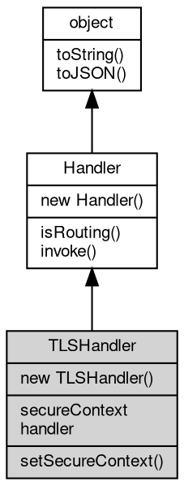

# Object TLSHandler
A TLS protocol handler: it upgrades each accepted raw stream to TLS and invokes the wrapped handler with the resulting [TLSSocket](TLSSocket.md)

TLSHandler is the bridge between a plain stream server and TLS. Use it where a connection
handler is expected - [net.createServer](../../module/ifs/net.md#createServer), new [net.TcpServer](../../module/ifs/net.md#TcpServer)(...) or another stream server - and it
performs the handshake of every connection before the handoff. It is logically equivalent to:

```JavaScript
// fragment: logical equivalent of invoking with a TLS context
const invoke = (stream, hdlr, ctx) => {
    const socket = new tls.TLSSocket(ctx);
    socket.accept(stream);
    hdlr.invoke(socket);
    socket.close();
};
```

[TLSServer](TLSServer.md) is the higher-level combination of a TCP server and this handler; use TLSHandler when
the server already exists (a custom TCP server, a shared port, an existing listener) and
[TLSServer](TLSServer.md) when a complete TLS server is wanted.

Concepts:

- **Invoke flow**: for every stream passed to invoke(), the handler performs the server-side
  handshake with its context, calls the wrapped handler with the [TLSSocket](TLSSocket.md) and closes the TLS
  socket when the handler returns. A handshake failure aborts the connection and is reported to
  the caller - the owning TCP server logs it and closes the raw stream - so the wrapped handler
  simply never runs.
- **Context**: the same [SecureContext](SecureContext.md) (with its certificates, ALPN list, verification flags and
  SNI table) is used for all connections. setSecureContext() swaps it for connections accepted
  afterwards without restarting the listener.
- **[Handler](Handler.md) forms**: the wrapped handler accepts a function, an array of handlers, a routing map
  [object](object.md) or a [path](../../module/ifs/path.md)/address string, normalized exactly like the [net.TcpServer](../../module/ifs/net.md#TcpServer) listener. [Routing](Routing.md)
  is not supported at the TLS layer (isRouting() is false), because a raw stream has no message
  to route.
- **Node.js differences**: Node.js has no standalone equivalent; it wraps connections manually
  with `new [tls.TLSSocket](../../module/ifs/tls.md#TLSSocket)(socket, { isServer: true })` or uses [tls.createServer](../../module/ifs/tls.md#createServer)()/https.Server.
  The class is exported as [tls.Handler](../../module/ifs/tls.md#Handler) (there is no tls.TLSHandler).

Obtained from:
- `tls.Handler` — the class alias of the [tls](../../module/ifs/tls.md) [module](../../module/ifs/module.md);
- `new [tls.Handler](../../module/ifs/tls.md#Handler)(context|options, handler)` — an explicit instance.

Example 1 — wrapping a [net](../../module/ifs/net.md) server with a [SecureContext](SecureContext.md):

```JavaScript
const tls = require('tls');
const net = require('net');
const crypto = require('crypto');

const pk = crypto.generateKeyPair('ec', {
    namedCurve: 'secp256r1'
});
const cert = crypto.createCertificateRequest({
    key: pk.privateKey,
    subject: {
        CN: 'localhost'
    }
}).issue({
    key: pk.privateKey,
    issuer: {
        CN: 'localhost'
    },
    validFrom: new Date(Date.now() - 1000),
    days: 1
});
const ctx = tls.createSecureContext({
    key: pk.privateKey,
    cert
}, true);

const server = net.createServer(new tls.Handler(ctx, (conn) => {
    conn.write(conn.read());
    conn.close();
}));
server.listen(0, '127.0.0.1');

const client = tls.connect(server.address().port, 'localhost', {
    ca: cert.pem
});
client.write('handler');
console.log(client.read().toString()); // handler

client.close();
server.stop();
```

Example 2 — wrapping the port constructor of [net.TcpServer](../../module/ifs/net.md#TcpServer):

```JavaScript
const tls = require('tls');
const net = require('net');
const crypto = require('crypto');

const pk = crypto.generateKeyPair('ec', {
    namedCurve: 'secp256r1'
});
const cert = crypto.createCertificateRequest({
    key: pk.privateKey,
    subject: {
        CN: 'localhost'
    }
}).issue({
    key: pk.privateKey,
    issuer: {
        CN: 'localhost'
    },
    validFrom: new Date(Date.now() - 1000),
    days: 1
});

// the port constructor binds immediately, start() begins accepting
const server = new net.TcpServer(0, new tls.Handler({
    key: pk.privateKey,
    cert
}, (conn) => {
    conn.write(conn.read());
    conn.close();
}));
server.start();

const client = tls.connect(server.socket.localPort, 'localhost', {
    ca: cert.pem
});
client.write('wrapped');
console.log(client.read().toString()); // wrapped

client.close();
server.stop();
```

## Inheritance

```dot
digraph {
    node [fontname="Helvetica,sans-Serif", fontsize=10, shape="record", style="filled", fillcolor="white"];

    object [tooltip="object", URL="object.md", label="{object|toString()\ltoJSON()\l}"];
    Handler [tooltip="Handler", URL="Handler.md", label="{Handler|new Handler()\l|isRouting()\linvoke()\l}"];
    TLSHandler [tooltip="TLSHandler", fillcolor="lightgray", id="me", label="{TLSHandler|new TLSHandler()\l|secureContext\lhandler\l|setSecureContext()\l}"];

    object -> Handler [dir=back];
    Handler -> TLSHandler [dir=back];
}
```

## Constructors
        
### TLSHandler
**Creates a TLSHandler around the given [SecureContext](SecureContext.md)**

```JavaScript
new TLSHandler(SecureContext context,
    Function(TLSSocket socket) => Value handler);
```

Parameters:
* context: [SecureContext](SecureContext.md), specifies the secure context used to create TLSHandler
* handler: [Handler](Handler.md) | [Handler](Handler.md)[] | Function([TLSSocket](TLSSocket.md) socket) => Value | Object | String, the connection handler

The context is used as it is for the server-side handshake, so it normally carries the
certificate and key; a context without them makes every handshake fail. The handler forms
are described on the class page: a function, an array of handlers, a routing map [object](object.md) or
a [path](../../module/ifs/path.md)/address string.

--------------------------
**Creates a TLSHandler from the options of [tls.createSecureContext](../../module/ifs/tls.md#createSecureContext)**

```JavaScript
new TLSHandler(Object options,
    Function(TLSSocket socket) => Value handler);
```

Parameters:
* options: Object, the options needed to create a secure context with [tls.createSecureContext](../../module/ifs/tls.md#createSecureContext)
* handler: [Handler](Handler.md) | [Handler](Handler.md)[] | Function([TLSSocket](TLSSocket.md) socket) => Value | Object | String, the connection handler

The options build a server context (isServer true) immediately, so invalid or incomplete
material fails here instead of at handshake time; this is equivalent to building the
context yourself and passing it to the other overload. The handler forms are described on
the class page.

## Properties
        
### secureContext
**[SecureContext](SecureContext.md), The [SecureContext](SecureContext.md) used for the connections handled by this TLSHandler**

```JavaScript
readonly SecureContext TLSHandler.secureContext;
```

It is shared by every [TLSSocket](TLSSocket.md) this handler accepts and carries the certificates, the SNI
table, the ALPN list and the verification flags; replace it through setSecureContext() to
affect the connections accepted afterwards.

--------------------------
### handler
**[Handler](Handler.md), The wrapped handler invoked once per established TLS connection**

```JavaScript
Handler TLSHandler.handler;
```

A function, an array of handlers, a routing map [object](object.md) or a [path](../../module/ifs/path.md)/address string, normalized
when it is assigned or passed to the constructor. Replacing it affects the next connections
only; the current connections keep running their own invocation.

Example — swapping the wrapped handler between two connections:

```JavaScript
const tls = require('tls');
const net = require('net');
const crypto = require('crypto');

const pk = crypto.generateKeyPair('ec', {
    namedCurve: 'secp256r1'
});
const cert = crypto.createCertificateRequest({
    key: pk.privateKey,
    subject: {
        CN: 'localhost'
    }
}).issue({
    key: pk.privateKey,
    issuer: {
        CN: 'localhost'
    },
    validFrom: new Date(Date.now() - 1000),
    days: 1
});

// the handler converts every accepted raw stream into a TLS stream and then
// invokes the wrapped handler with it
const handler = new tls.Handler({
    key: pk.privateKey,
    cert
}, (conn) => {
    conn.write('first');
    conn.close();
});
const server = net.createServer(handler);
server.listen(0, '127.0.0.1');

let client = tls.connect(server.address().port, '127.0.0.1', {
    requestCert: false
});
console.log(client.read().toString()); // first

// replace the wrapped handler: the next connection is served by the new one
handler.handler = (conn) => {
    conn.write('second');
    conn.close();
};
client = tls.connect(server.address().port, '127.0.0.1', {
    requestCert: false
});
console.log(client.read().toString()); // second

client.close();
server.stop();
```

## Methods
        
### setSecureContext
**Replaces the [SecureContext](SecureContext.md) used for the connections accepted afterwards**

```JavaScript
TLSHandler.setSecureContext(SecureContext context);
```

Parameters:
* context: [SecureContext](SecureContext.md), specifies the new [SecureContext](SecureContext.md)

A connection that is already handshaking keeps the context it started with; the new context
applies to the next invoke(). Equivalent to [TLSServer](TLSServer.md)#setSecureContext on the server that
owns this handler.

--------------------------
**Replaces the [SecureContext](SecureContext.md) from a fresh options [object](object.md)**

```JavaScript
TLSHandler.setSecureContext(Object options);
```

Parameters:
* options: Object, the options needed to create a secure context with [tls.createSecureContext](../../module/ifs/tls.md#createSecureContext)

The options are passed to [tls.createSecureContext](../../module/ifs/tls.md#createSecureContext) with isServer true and validated on the
spot; the resulting context is used for the connections accepted afterwards.

--------------------------
### isRouting
**Queries whether the current handler supports routing**

```JavaScript
Boolean TLSHandler.isRouting();
```

Returns:
* Boolean, returns whether the current handler supports routing

A routing handler matches messages by itself and is used for the message
as it is; a non-routing handler is a terminal stage of a chain or a
function. [Routing](Routing.md), [HttpRepeater](HttpRepeater.md) and file handlers return true, while
JavaScript handlers and chains made only of them return false. [Chain](Chain.md)
returns true when at least one of its elements routes; [Routing.append](Routing.md#append)
reads the flag to decide whether the remaining [path](../../module/ifs/path.md) must be handed to the
handler as a sub-route.

Example — the flag of the concrete classes:

```JavaScript
const mq = require('mq');

console.log(new mq.Routing({
    '/a': () => {}
}).isRouting()); // true
console.log(new mq.Chain([() => {}]).isRouting()); // false

const repeater = new mq.Handler('http://127.0.0.1:8080/');
console.log(repeater.isRouting()); // true
```

--------------------------
### invoke
**Processes a message or [object](object.md)**

```JavaScript
Handler TLSHandler.invoke(object v) async;
```

Parameters:
* v: [object](object.md), the message or [object](object.md) to [process](../../module/ifs/process.md)

Returns:
* [Handler](Handler.md), returns the next handler

The call is a single stage of the pipeline: the handler processes v and
the returned value is the next handler to run, or null when the message
processing is finished. For a JavaScript handler this is the value the
function returned (converted to a handler); for a routing it is the
handler of the matched rule; for a chain it is the handler that should run
next. The method is asynchronous and blocks the current fiber until the
stage completes; [mq.invoke](../../module/ifs/mq.md#invoke) is the loop that keeps invoking the returned
handler until null.

Example — run one stage and continue with the returned handler:

```JavaScript
const mq = require('mq');

const step = new mq.Handler((v) => {
    console.log('stage: ' + v.value);
    return new mq.Handler((v) => console.log('returned handler ran'));
});

const msg = new mq.Message();
msg.value = 'x';
const next = step.invoke(msg);
console.log(next instanceof mq.Handler); // true
next.invoke(msg);
```

--------------------------
### toString
**Returns the string form of the [object](object.md)**

```JavaScript
String TLSHandler.toString();
```

Returns:
* String, returns the string form of the [object](object.md)

The base implementation reports an error: a native [object](object.md) has no implicit
text form, and only the classes whose value can be written as a string
override the member. [Buffer](Buffer.md) returns its content decoded with the given
[encoding](../../module/ifs/encoding.md), [HttpCookie](HttpCookie.md) returns "name=value", and so on; an override commonly
accepts optional arguments ([Buffer.toString](Buffer.md#toString) takes [encoding](../../module/ifs/encoding.md), start and
end) that are not part of this declaration.

Calling the member on a class that does not override it throws
"<Class>: the [object](object.md) can not be converted to string.", which is the
behavior to rely on when probing whether a value has a string form. See
toJSON for the serialization hook.

--------------------------
### toJSON
**Returns the JSON representation of the [object](object.md)**

```JavaScript
Value TLSHandler.toJSON(String key = "");
```

Parameters:
* key: String, the property name of the value being serialized

Returns:
* Value, returns the JSON-serializable value

JSON.stringify(value) calls value.toJSON(key) when the member exists and
serializes the returned value in its place; the key argument carries the
property name of the value inside its parent [object](object.md) (an empty string at
the top level) and may be used to build a keyed form. The base
implementation returns a plain [object](object.md) holding the readable properties of
the instance, so a native [object](object.md) serializes without per-class code; a
class with a portable shape such as [Buffer](Buffer.md) overrides it, and a JavaScript
class may override it in the same way.

The member is normally reached through JSON.stringify rather than called
directly; calling it returns the same value JSON.stringify would
serialize.

