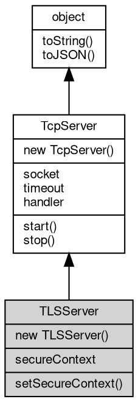

# 对象 TLSServer
[tls](../../module/ifs/tls.md) 服务器对象，可方便创建一个标准多纤程 [tls](../../module/ifs/tls.md)/ssl 服务器

TLSServer 对象是将 [TcpServer](TcpServer.md) 和 [TLSHandler](TLSHandler.md) 组合封装的对象，方便快速搭建服务器，逻辑上相当于：

```JavaScript
var svr = new net.TLSServer(addr, port, new tls.Handler(ctx, function(conn) {
    ...
}));
```

创建方法：

```JavaScript
var tls = require("tls");
var svr = new tls.Server(ctx, function(conn) {
    ...
});
```

## 继承关系


## 构造函数
        
### TLSServer
**创建一个新的 TLSServer 对象**

```JavaScript
new TLSServer(SecureContext context,
    Integer port,
    Handler listener);
```

调用参数:
* context: [SecureContext](SecureContext.md), 指定创建 TLSServer 使用的安全上下文
* port: Integer, 指定监听的端口
* listener: [Handler](Handler.md), 事件处理接口对象

--------------------------
**创建一个新的 TLSServer 对象**

```JavaScript
new TLSServer(SecureContext context,
    String addr,
    Integer port,
    Handler listener);
```

调用参数:
* context: [SecureContext](SecureContext.md), 指定创建 TLSServer 使用的安全上下文
* addr: String, 指定监听的地址
* port: Integer, 指定监听的端口
* listener: [Handler](Handler.md), 事件处理接口对象

--------------------------
**创建一个新的 TLSServer 对象**

```JavaScript
new TLSServer(Object options,
    Handler listener);
```

调用参数:
* options: Object, 使用 [tls.createSecureContext](../../module/ifs/tls.md#createSecureContext) 创建安全上下文需要的选项
* listener: [Handler](Handler.md), 事件处理接口对象

options 除用于创建 [SecureContext](SecureContext.md) 的属性之外，还需提供以下属性：
- address: 指定监听的地址，可选，默认在所有地址监听
- port: 指定监听的端口，必须提供

## 成员属性
        
### secureContext
**[SecureContext](SecureContext.md), 查询当前 TLSServer 使用的 [SecureContext](SecureContext.md)**

```JavaScript
readonly SecureContext TLSServer.secureContext;
```

--------------------------
### socket
**[Socket](Socket.md), 服务器当前侦听的 [Socket](Socket.md) 对象**

```JavaScript
readonly Socket TLSServer.socket;
```

--------------------------
### timeout
**Integer, 查询和设置超时时间，单位毫秒，此超时时间用于设置接收到的新连接**

```JavaScript
Integer TLSServer.timeout;
```

--------------------------
### handler
**[Handler](Handler.md), 服务器当前事件处理接口对象**

```JavaScript
Handler TLSServer.handler;
```

## 成员函数
        
### setSecureContext
**设置当前 TLSServer 使用的 [SecureContext](SecureContext.md)**

```JavaScript
TLSServer.setSecureContext(SecureContext context);
```

调用参数:
* context: [SecureContext](SecureContext.md), 指定新的 [SecureContext](SecureContext.md)

--------------------------
**设置当前 TLSServer 使用的 [SecureContext](SecureContext.md)**

```JavaScript
TLSServer.setSecureContext(Object options);
```

调用参数:
* options: Object, 使用 [tls.createSecureContext](../../module/ifs/tls.md#createSecureContext) 创建安全上下文需要的选项

--------------------------
### start
**启动当前服务器**

```JavaScript
TLSServer.start();
```

--------------------------
### stop
**关闭 socket中止正在运行的服务器**

```JavaScript
TLSServer.stop() async;
```

--------------------------
### toString
**返回对象的字符串表示，一般返回 "[Native Object]"，对象可以根据自己的特性重新实现**

```JavaScript
String TLSServer.toString();
```

返回结果:
* String, 返回对象的字符串表示

--------------------------
### toJSON
**返回对象的 JSON 格式表示，一般返回对象定义的可读属性集合**

```JavaScript
Value TLSServer.toJSON(String key = "");
```

调用参数:
* key: String, 未使用

返回结果:
* Value, 返回包含可 JSON 序列化的值

