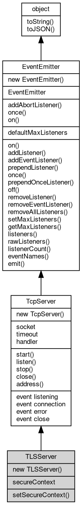

# Object TLSServer
A TLS server: a fiber-per-connection TCP server whose listener receives an encrypted [TLSSocket](TLSSocket.md)

TLSServer combines [net.TcpServer](../../module/ifs/net.md#TcpServer) with a [TLSHandler](TLSHandler.md): it owns the secure context and the listener,
binds the port, performs the handshake of every accepted connection and then invokes the
listener with the resulting [TLSSocket](TLSSocket.md). It is logically equivalent to:

```JavaScript
// fragment: logical equivalent of the class
const tls = require('tls');
const net = require('net');

const server = new net.TcpServer(port, new tls.Handler(ctx, (conn) => {
    // conn is a TLSSocket
}));
server.start();
```

Concepts:

- **Context**: the TLS configuration comes either from a ready [SecureContext](SecureContext.md) or from an options
  [object](object.md) passed to [tls.createSecureContext](../../module/ifs/tls.md#createSecureContext) with isServer true; the constructor options [object](object.md)
  additionally reads `address` and `port` for the bind. setSecureContext() replaces the
  configuration used by the connections accepted afterwards.
- **Lifecycle**: the constructors with a port bind immediately and start() begins accepting,
  while the forms without a port only store the listener and need listen(). stop()/close()
  closes the listening socket, emits 'close' immediately and leaves the accepted connections in
  their handler fibers untouched.
- **Handshake and errors**: every connection performs the handshake before the listener runs, so
  the listener always receives a connected [TLSSocket](TLSSocket.md). A failed handshake is logged by the server
  and the raw connection is closed; it is not thrown to the caller, and the remaining
  connections continue to be served.
- **Events**: inherited from [net.TcpServer](../../module/ifs/net.md#TcpServer) - 'listening' after start()/listen(), 'connection'
  with the raw accepted [Socket](Socket.md) before the handshake, 'error' with a message string and 'close'
  on stop(). Node.js [tls.Server](../../module/ifs/tls.md#Server) reports the established session through 'secureConnection'
  instead and passes an Error to 'error'.
- **Node.js differences**: the class is exported as [tls.Server](../../module/ifs/tls.md#Server) (not tls.TLSServer), the
  constructor may bind the port, SNI is configured on the context (setSNIContext) instead of
  server.addContext(), and there is no getTicketKeys/setTicketKeys, maxConnections or unref.

Obtained from:
- `tls.createServer(context|options, listener)` — the factory form, no port bound;
- `new [tls.Server](../../module/ifs/tls.md#Server)(context|options, [addr,] port, listener)` — binds the port immediately;
- `new [tls.Server](../../module/ifs/tls.md#Server)(context|options, listener)` — deferred, call listen() to bind.

Example 1 — createServer() plus listen() on an OS-assigned port:

```JavaScript
const tls = require('tls');
const crypto = require('crypto');

const pk = crypto.generateKeyPair('ec', {
    namedCurve: 'secp256r1'
});
const cert = crypto.createCertificateRequest({
    key: pk.privateKey,
    subject: {
        CN: 'localhost'
    }
}).issue({
    key: pk.privateKey,
    issuer: {
        CN: 'localhost'
    },
    validFrom: new Date(Date.now() - 1000),
    days: 1
});

// createServer() only stores the options and the listener: listen() binds the
// port, and port 0 asks the operating system for a free one
const server = tls.createServer({
    key: pk.privateKey,
    cert
}, (conn) => {
    conn.write(conn.read());
    conn.close();
});
server.listen(0, '127.0.0.1');
console.log(server.address().port > 0); // true

const client = tls.connect(server.address().port, 'localhost', {
    ca: cert.pem
});
client.write('hello server');
console.log(client.read().toString()); // hello server

client.close();
server.stop();
```

Example 2 — the deferred class form with lifecycle events:

```JavaScript
const tls = require('tls');
const crypto = require('crypto');

const pk = crypto.generateKeyPair('ec', {
    namedCurve: 'secp256r1'
});
const cert = crypto.createCertificateRequest({
    key: pk.privateKey,
    subject: {
        CN: 'localhost'
    }
}).issue({
    key: pk.privateKey,
    issuer: {
        CN: 'localhost'
    },
    validFrom: new Date(Date.now() - 1000),
    days: 1
});
const ctx = tls.createSecureContext({
    key: pk.privateKey,
    cert
}, true);

// the deferred class form: no port is bound until listen(), so lifecycle
// events can be registered first
const server = new tls.Server(ctx, (conn) => {
    conn.write(conn.read());
    conn.close();
});
server.on('listening', () => console.log('listening'));
server.on('connection', () => console.log('connection'));
server.on('close', () => console.log('closed'));
server.listen(0, '127.0.0.1');

const client = tls.connect(server.address().port, 'localhost', {
    ca: cert.pem
});
client.write('events');
console.log(client.read().toString()); // events

client.close();
server.stop(); // closed
```

## Inheritance

```dot
digraph {
    node [fontname="Helvetica,sans-Serif", fontsize=10, shape="record", style="filled", fillcolor="white"];

    object [tooltip="object", URL="object.md", label="{object|toString()\ltoJSON()\l}"];
    EventEmitter [tooltip="EventEmitter", URL="EventEmitter.md", label="{EventEmitter|new EventEmitter()\l|EventEmitter\l|addAbortListener()\lonce()\lon()\l|defaultMaxListeners\l|on()\laddListener()\laddEventListener()\lprependListener()\lonce()\lprependOnceListener()\loff()\lremoveListener()\lremoveEventListener()\lremoveAllListeners()\lsetMaxListeners()\lgetMaxListeners()\llisteners()\lrawListeners()\llistenerCount()\leventNames()\lemit()\l}"];
    TcpServer [tooltip="TcpServer", URL="TcpServer.md", label="{TcpServer|new TcpServer()\l|socket\ltimeout\lhandler\l|start()\llisten()\lstop()\lclose()\laddress()\l|event listening\levent connection\levent error\levent close\l}"];
    TLSServer [tooltip="TLSServer", fillcolor="lightgray", id="me", label="{TLSServer|new TLSServer()\l|secureContext\l|setSecureContext()\l}"];

    object -> EventEmitter [dir=back];
    EventEmitter -> TcpServer [dir=back];
    TcpServer -> TLSServer [dir=back];
}
```

## Constructors
        
### TLSServer
**Creates a TLS server and binds a port on all local addresses**

```JavaScript
new TLSServer(SecureContext context,
    Integer port,
    Function(TLSSocket socket) => Value listener);
```

Parameters:
* context: [SecureContext](SecureContext.md), specifies the secure context used to create TLSServer
* port: Integer, specifies the listening port
* listener: [Handler](Handler.md) | [Handler](Handler.md)[] | Function([TLSSocket](TLSSocket.md) socket) => Value | Object | String, the connection handler

The port is bound during construction and start() begins accepting; port 0 asks the
operating system for a free one, read it from address() or socket.localPort afterwards. The
listener forms are described on the class page; a listener function receives one [TLSSocket](TLSSocket.md)
per accepted connection in its own fiber.

--------------------------
**Creates a TLS server bound to the given address and port**

```JavaScript
new TLSServer(SecureContext context,
    String addr,
    Integer port,
    Function(TLSSocket socket) => Value listener);
```

Parameters:
* context: [SecureContext](SecureContext.md), specifies the secure context used to create TLSServer
* addr: String, specifies the listening address
* port: Integer, specifies the listening port
* listener: [Handler](Handler.md) | [Handler](Handler.md)[] | Function([TLSSocket](TLSSocket.md) socket) => Value | Object | String, the connection handler

addr is an IP literal such as '127.0.0.1'; an empty string listens on all local addresses.
The port is bound during construction and start() begins accepting.

--------------------------
**Creates a TLS server from an options [object](object.md), binding when it carries a port**

```JavaScript
new TLSServer(Object options,
    Function(TLSSocket socket) => Value listener);
```

Parameters:
* options: Object, the options needed to create a secure context with [tls.createSecureContext](../../module/ifs/tls.md#createSecureContext)
* listener: [Handler](Handler.md) | [Handler](Handler.md)[] | Function([TLSSocket](TLSSocket.md) socket) => Value | Object | String, the connection handler

The TLS keys are passed to [tls.createSecureContext](../../module/ifs/tls.md#createSecureContext) with isServer true, so cert and key are
usually required for a usable server; in addition `address` (default all local addresses)
and `port` are read for the bind. With a port the server binds immediately and start()
begins accepting; without one it only stores the listener and listen() must be called. The
listener forms are described on the class page.

--------------------------
**Creates a TLS server without binding a port; listen() must be called to start**

```JavaScript
new TLSServer(SecureContext context,
    Function(TLSSocket socket) => Value listener);
```

Parameters:
* context: [SecureContext](SecureContext.md), specifies the secure context used to create TLSServer
* listener: [Handler](Handler.md) | [Handler](Handler.md)[] | Function([TLSSocket](TLSSocket.md) socket) => Value | Object | String, the connection handler

The deferred form stores the context and the listener, so lifecycle events can be registered
before listen(port[, addr[, backlog]]) binds and starts. address() throws until the server
is bound.

## Static Methods
        
### addAbortListener
**Registers a one-shot abort handler on an [AbortSignal](AbortSignal.md)**

```JavaScript
static Object TLSServer.addAbortListener(EventEmitter signal,
    Function(Object ev) func);
```

Parameters:
* signal: [EventEmitter](EventEmitter.md), the [AbortSignal](AbortSignal.md) [object](object.md) to listen to
* func: Function(Object ev), the handler for the abort event

Returns:
* Object, returns a Disposable [object](object.md) containing a `[Symbol.dispose]` method

The handler is called at most once when the signal is aborted, and it is removed from the
signal afterwards. If the signal is already aborted the handler is invoked synchronously.
The returned [object](object.md) has a `[Symbol.dispose]()` method that removes the handler, so it can be
released before the abort happens.

Example — abort handling with automatic cleanup:

```JavaScript
const events = require('events');

const controller = new AbortController();
const disposable = events.addAbortListener(controller.signal,
    () => console.log('aborted'));

controller.abort(); // aborted
disposable[Symbol.dispose](); // safe to call after the listener fired
console.log(controller.signal.listenerCount('abort')); // 0
```

--------------------------
### once
**Creates a Promise resolved by the next occurrence of an event**

```JavaScript
static Object TLSServer.once(EventEmitter emitter,
    Value ev,
    Object options = {});
```

Parameters:
* emitter: [EventEmitter](EventEmitter.md), the event emitter [object](object.md) to listen to
* ev: Value, the event name to listen for
* options: Object, optional parameter [object](object.md)

Returns:
* Object, returns a Promise that resolves with the array of event parameters

The Promise resolves with the array of the emit arguments when the event fires; it rejects
when `error` is emitted while waiting, unless the waited event is `error` itself, or when
the signal option aborts. The temporary listeners are removed when the Promise settles.

options supports the following option:

```JavaScript
// fragment: options
({
    "signal": null // AbortSignal; aborting rejects the Promise with an AbortError
});
```

Example — awaiting the next occurrence of an event:

```JavaScript
const EventEmitter = require('events');

(async () => {
    const emitter = new EventEmitter();
    const waiting = EventEmitter.once(emitter, 'ready');

    emitter.emit('ready', 200, 'ok');
    console.log(JSON.stringify(await waiting)); // [200,"ok"]
})();
```

--------------------------
### on
**Creates an async iterator that yields event occurrences**

```JavaScript
static Object TLSServer.on(EventEmitter emitter,
    Value ev,
    Object options = {});
```

Parameters:
* emitter: [EventEmitter](EventEmitter.md), the event emitter [object](object.md) to listen to
* ev: Value, the event name to listen for
* options: Object, optional parameter [object](object.md)

Returns:
* Object, returns an AsyncIterator [object](object.md)

Each next() resolves with `{ value: [args...], done: false }` when the event fires and with
`{ done: true }` after an event named in the `close` option fires or the signal aborts; an
`error` event rejects the pending call. The listeners are registered when the iterator is
created and removed when the iteration ends or the signal aborts.

options supports the following options:

```JavaScript
// fragment: options
({
    "signal": null, // AbortSignal; aborting rejects pending and future next() calls
    "close": [] // event names; the first one to fire ends the iteration
});
```

Example — iterating the occurrences of an event:

```JavaScript
const EventEmitter = require('events');

(async () => {
    const emitter = new EventEmitter();
    const iterator = EventEmitter.on(emitter, 'data', {
        close: ['end']
    });

    emitter.emit('data', 1);
    emitter.emit('data', 2);
    emitter.emit('end');

    for await (const args of iterator)
    console.log(JSON.stringify(args)); // [1] then [2]
})();
```

## Static Properties
        
### defaultMaxListeners
**Integer, The [process](../../module/ifs/process.md)-wide default listener limit reported by getMaxListeners()**

```JavaScript
static Integer TLSServer.defaultMaxListeners;
```

Defaults to 10. Assigning a value changes getMaxListeners() for every emitter that never
called setMaxListeners(); an emitter with an explicit limit keeps it. The limit is
informational: fibjs never warns when the number of listeners exceeds it.

## Properties
        
### secureContext
**[SecureContext](SecureContext.md), The [SecureContext](SecureContext.md) used by the server**

```JavaScript
readonly SecureContext TLSServer.secureContext;
```

The same [object](object.md) as the context of the internal handler; it applies to the connections
accepted from now on, so replacing it through setSecureContext() affects the next
connections only.

--------------------------
### socket
**[Socket](Socket.md), the [Socket](Socket.md) [object](object.md) the server is currently listening on**

```JavaScript
readonly Socket TLSServer.socket;
```

The underlying listening [Socket](Socket.md) exposes the bound family/localAddress/localPort; it is useful
for diagnostics, but do not call accept on it because the server owns the accept loop. It
throws when the server was created by the handler-only constructor and is not bound yet.
Node.js hides the listening handle.

--------------------------
### timeout
**Integer, Queries and sets the timeout in milliseconds; this timeout is used for newly accepted connections**

```JavaScript
Integer TLSServer.timeout;
```

The default 0 means no timeout. The value is copied to each accepted [Socket](Socket.md) when the server
accepts it, before the handler runs, so it bounds every recv/send of the handler unless the
handler changes it. It does not apply to the listening socket itself.

--------------------------
### handler
**[Handler](Handler.md), the current event handling interface [object](object.md) of the server**

```JavaScript
Handler TLSServer.handler;
```

The normalized [Handler](Handler.md) invoked for every connection. Assigning a value runs it through the
[Handler](Handler.md) constructor: a function becomes a message handler wrapper, an array becomes a [Chain](Chain.md)
and a [path](../../module/ifs/path.md)/address string or routing map is converted accordingly (see [net.createServer](../../module/ifs/net.md#createServer) for
the accepted forms). The getter returns the last assigned [object](object.md).

## Methods
        
### setSecureContext
**Replaces the [SecureContext](SecureContext.md) used for the connections accepted afterwards**

```JavaScript
TLSServer.setSecureContext(SecureContext context);
```

Parameters:
* context: [SecureContext](SecureContext.md), specifies the new [SecureContext](SecureContext.md)

Connections that already started their handshake keep the context they began with; the new
context applies to the next accepted connection, which makes certificate rotation possible
without restarting the listener.

Example — rotating the certificate between two connections:

```JavaScript
const tls = require('tls');
const crypto = require('crypto');

// two certificates with different subjects, served in turn
function selfSigned(cn) {
    const pk = crypto.generateKeyPair('ec', {
        namedCurve: 'secp256r1'
    });
    const cert = crypto.createCertificateRequest({
        key: pk.privateKey,
        subject: {
            CN: cn
        }
    }).issue({
        key: pk.privateKey,
        issuer: {
            CN: cn
        },
        validFrom: new Date(Date.now() - 1000),
        days: 1
    });
    return {
        pk,
        cert
    };
}
const first = selfSigned('localhost');
const second = selfSigned('other.local');

const server = tls.createServer({
    key: first.pk.privateKey,
    cert: first.cert
}, (conn) => {
    conn.write(conn.secureContext.cert.subject);
    conn.close();
});
server.listen(0, '127.0.0.1');

// setSecureContext() replaces the context used by the connections accepted
// afterwards; existing connections keep the context they started with
let client = tls.connect(server.address().port, '127.0.0.1', {
    requestCert: false
});
console.log(client.read().toString()); // CN=localhost

server.setSecureContext({
    key: second.pk.privateKey,
    cert: second.cert
});
client = tls.connect(server.address().port, '127.0.0.1', {
    requestCert: false
});
console.log(client.read().toString()); // CN=other.local

client.close();
server.stop();
```

--------------------------
**Replaces the [SecureContext](SecureContext.md) from a fresh options [object](object.md)**

```JavaScript
TLSServer.setSecureContext(Object options);
```

Parameters:
* options: Object, the options needed to create a secure context with [tls.createSecureContext](../../module/ifs/tls.md#createSecureContext)

The options are passed to [tls.createSecureContext](../../module/ifs/tls.md#createSecureContext) with isServer true, validated immediately
and then used for the connections accepted afterwards; equivalent to building a context
with createSecureContext and passing it to the other overload.

--------------------------
### start
**Starts the current server**

```JavaScript
TLSServer.start();
```

Begins the accept loop and emits 'listening'. The server must already be bound: the
constructors with a port/address bind in the constructor while the handler-only form needs
listen(). Calling start on an unbound server or a second time fails with an invalid-call
error. Each accepted client is passed to the 'connection' listeners and then to the handler.

--------------------------
### listen
**Binds the address and port and starts listening for connections**

```JavaScript
TLSServer.listen(Integer port,
    String addr = "",
    Integer backlog = -1) async;
```

Parameters:
* port: Integer, specifies the TCP server listening port
* addr: String, specifies the TCP server listening address; "" means listening on all local addresses
* backlog: Integer, specifies the maximum length of the connection queue, -1 means using the system default

 Binds and starts the accept loop in one call, emitting 'listening'. Port 0 asks the operating
 system for an ephemeral port, read it from address(). backlog -1 passes the system default to
 the operating system. A second listen on the same server throws ERR_SERVER_ALREADY_LISTEN,
 and a failed bind (for example EADDRINUSE) carries syscall 'listen' like Node.js.

--------------------------
### stop
**Closes the socket and aborts the running server**

```JavaScript
TLSServer.stop() async;
```

Closes the listening socket and emits 'close' immediately; the accepted connections are not
closed and keep running in their handler fibers (the handler owns them). Stopping a server
that was never bound is a no-op. Node.js server.close() instead waits for the active
connections to end before emitting 'close'.

--------------------------
### close
**Closes the socket and aborts the running server; an alias of stop()**

```JavaScript
TLSServer.close() async;
```

Identical to stop(), provided for the Node.js naming; both are awaitable.

--------------------------
### address
**Returns an [object](object.md) containing the server bound address, address family and port. Used to look up the actual port when the OS assigns the address.**

```JavaScript
(String address, String family, Integer port) TLSServer.address();
```

Returns:
* (String address, String family, Integer port), returns the address, address family and port bound by the server

The result has the shape { address, family, port }, where family is 'IPv4' or 'IPv6' and port
is the real port after listen(0). For a unix socket or Windows pipe the address is the bound
[path](../../module/ifs/path.md) while family/port are placeholders ('IPv4'/0). The method throws before the server is
bound (number 20009); Node.js returns null instead and returns the [path](../../module/ifs/path.md) string for pipe
servers.

Example — discovering the port assigned to listen(0):

```JavaScript
const net = require('net');

const server = net.createServer((conn) => conn.close());
server.listen(0, '127.0.0.1');

const addr = server.address();
console.log(addr.address, addr.family, addr.port > 0); // 127.0.0.1 IPv4 true

server.stop();
```

--------------------------
### on
**Appends an event handler to the emitter**

```JavaScript
Object TLSServer.on(Value ev,
    Function(...args) func);
```

Parameters:
* ev: Value, the event name to bind
* func: Function(...args), the event handler function, called with the emit arguments

Returns:
* Object, returns the event [object](object.md) itself for chaining

The listener is called with the arguments of emit() and `this` set to the emitter; the
emitter itself is returned so registrations can be chained. The same function may be
registered several times for one event and each copy is called. See the class documentation
for the dispatch order.

--------------------------
**Appends several event handlers to the emitter**

```JavaScript
Object TLSServer.on(Object map);
```

Parameters:
* map: Object, the event mapping; [object](object.md) property names are used as event names

Returns:
* Object, returns the event [object](object.md) itself for chaining

Every enumerable property of the map whose value is a function is registered under its
property name. Properties are processed in order; a value that is not a function makes the
call fail with an invalid-type error while entries processed before it stay registered.

Example — registering several handlers at once:

```JavaScript
const EventEmitter = require('events');

const emitter = new EventEmitter();
emitter.on({
    connect: () => console.log('connect'),
    close: () => console.log('close')
});

emitter.emit('connect'); // connect
emitter.emit('close'); // close
```

--------------------------
### addListener
**Appends an event handler to the emitter**

```JavaScript
Object TLSServer.addListener(Value ev,
    Function(...args) func);
```

Parameters:
* ev: Value, the event name to bind
* func: Function(...args), the event handler function

Returns:
* Object, returns the event [object](object.md) itself for chaining

Alias of on(ev, func), provided for Node.js compatibility.

--------------------------
**Appends several event handlers to the emitter**

```JavaScript
Object TLSServer.addListener(Object map);
```

Parameters:
* map: Object, the event mapping; [object](object.md) property names are used as event names

Returns:
* Object, returns the event [object](object.md) itself for chaining

Alias of on(map), provided for Node.js compatibility.

--------------------------
### addEventListener
**Appends an event handler to the emitter with an options [object](object.md)**

```JavaScript
Object TLSServer.addEventListener(Value ev,
    Function(...args) func,
    Object options = {});
```

Parameters:
* ev: Value, the event name to bind
* func: Function(...args), the event handler function, called with the emit arguments
* options: Object, the options of the event handler

Returns:
* Object, returns the event [object](object.md) itself for chaining

Web-style alias of on(); the only supported option is `once`, which registers a one-shot
handler exactly like once(). The listener receives the plain emit arguments and not an [Event](Event.md)
[object](object.md); see the [DOMEvent](DOMEvent.md) class for the DOM-style event [object](object.md) used by [AbortSignal](AbortSignal.md) and
fetch-style APIs.

options supports the following option:

```JavaScript
// fragment: options
({
    "once": false // when true, the handler is removed before its single invocation
});
```

Example — a one-shot DOM-style registration:

```JavaScript
const EventEmitter = require('events');

const emitter = new EventEmitter();
emitter.addEventListener('ping', () => console.log('ping'), {
    once: true
});

emitter.emit('ping'); // ping
console.log(emitter.emit('ping')); // false
console.log(emitter.listenerCount('ping')); // 0
```

--------------------------
### prependListener
**Inserts an event handler at the front of the queue**

```JavaScript
Object TLSServer.prependListener(Value ev,
    Function(...args) func);
```

Parameters:
* ev: Value, the event name to bind
* func: Function(...args), the event handler function

Returns:
* Object, returns the event [object](object.md) itself for chaining

The listener is called before the listeners registered with on()/addListener() the next time
the event is emitted. When several prependListener() calls are made, the last one registered
is called first, because every call inserts at the same position.

Example — insertion at the front of the queue:

```JavaScript
const EventEmitter = require('events');

const emitter = new EventEmitter();
emitter.on('order', () => console.log('on'));
emitter.prependListener('order', () => console.log('prepend'));

emitter.emit('order'); // prepend, then on
```

--------------------------
**Inserts several event handlers at the front of the queue**

```JavaScript
Object TLSServer.prependListener(Object map);
```

Parameters:
* map: Object, the event mapping; [object](object.md) property names are used as event names

Returns:
* Object, returns the event [object](object.md) itself for chaining

Map form of prependListener(); every function property is inserted at the front, so the
properties of the map are called in reverse order.

--------------------------
### once
**Appends a one-shot event handler to the emitter**

```JavaScript
Object TLSServer.once(Value ev,
    Function(...args) func);
```

Parameters:
* ev: Value, the event name to bind
* func: Function(...args), the event handler function

Returns:
* Object, returns the event [object](object.md) itself for chaining

The handler is wrapped and removes itself from the queue before it is called, so it runs at
most once. off() removes it when passed the original function, listeners() returns the
original function, and rawListeners() returns the internal wrapper whose `_func` property
holds the original. See Example 2 in the class documentation.

--------------------------
**Appends several one-shot event handlers to the emitter**

```JavaScript
Object TLSServer.once(Object map);
```

Parameters:
* map: Object, the event mapping; [object](object.md) property names are used as event names

Returns:
* Object, returns the event [object](object.md) itself for chaining

Map form of once(); every function property is registered as a one-shot listener under its
property name.

--------------------------
### prependOnceListener
**Inserts a one-shot event handler at the front of the queue**

```JavaScript
Object TLSServer.prependOnceListener(Value ev,
    Function(...args) func);
```

Parameters:
* ev: Value, the event name to bind
* func: Function(...args), the event handler function

Returns:
* Object, returns the event [object](object.md) itself for chaining

Combines prependListener() and once(): the handler is called first and only once, and it is
removed before its invocation.

--------------------------
**Inserts several one-shot event handlers at the front of the queue**

```JavaScript
Object TLSServer.prependOnceListener(Object map);
```

Parameters:
* map: Object, the event mapping; [object](object.md) property names are used as event names

Returns:
* Object, returns the event [object](object.md) itself for chaining

Map form of prependOnceListener(); every function property is inserted as a one-shot
listener, and the properties of the map are called in reverse order.

--------------------------
### off
**Removes an event handler from the emitter**

```JavaScript
Object TLSServer.off(Value ev,
    Function(...args) func);
```

Parameters:
* ev: Value, the event name to unbind
* func: Function(...args), the event handler function

Returns:
* Object, returns the event [object](object.md) itself for chaining

The first matching listener is removed; when the same function was registered several times
only one copy is removed per call, so repeat the call to remove the others. A once() wrapper
is matched by its original function as well. Removing a listener emits the `removeListener`
meta event after the removal.

--------------------------
**Removes all event handlers of one event**

```JavaScript
Object TLSServer.off(Value ev);
```

Parameters:
* ev: Value, the event name to unbind

Returns:
* Object, returns the event [object](object.md) itself for chaining

Every listener of the event is removed and `removeListener` is emitted once per removed
listener. The call succeeds when the event has no listener.

Example — removing every listener of one event:

```JavaScript
const EventEmitter = require('events');

const emitter = new EventEmitter();
emitter.on('data', () => console.log('first'));
emitter.on('data', () => console.log('second'));

emitter.off('data');
console.log(emitter.emit('data')); // false
```

--------------------------
**Removes several event handlers from the emitter**

```JavaScript
Object TLSServer.off(Object map);
```

Parameters:
* map: Object, the event mapping; [object](object.md) property names are used as event names

Returns:
* Object, returns the event [object](object.md) itself for chaining

Every enumerable property of the map whose value is a function names an event from which
that function is removed (one copy per event). A value that is not a function makes the call
fail with an invalid-type error.

--------------------------
### removeListener
**Removes an event handler from the emitter**

```JavaScript
Object TLSServer.removeListener(Value ev,
    Function(...args) func);
```

Parameters:
* ev: Value, the event name to unbind
* func: Function(...args), the event handler function

Returns:
* Object, returns the event [object](object.md) itself for chaining

Alias of off(ev, func), provided for Node.js compatibility.

--------------------------
**Removes all event handlers of one event**

```JavaScript
Object TLSServer.removeListener(Value ev);
```

Parameters:
* ev: Value, the event name to unbind

Returns:
* Object, returns the event [object](object.md) itself for chaining

Alias of off(ev), provided for Node.js compatibility.

--------------------------
**Removes several event handlers from the emitter**

```JavaScript
Object TLSServer.removeListener(Object map);
```

Parameters:
* map: Object, the event mapping; [object](object.md) property names are used as event names

Returns:
* Object, returns the event [object](object.md) itself for chaining

Alias of off(map), provided for Node.js compatibility.

--------------------------
### removeEventListener
**Removes an event handler with an options [object](object.md)**

```JavaScript
Object TLSServer.removeEventListener(Value ev,
    Function(...args) func,
    Object options = {});
```

Parameters:
* ev: Value, the event name to unbind
* func: Function(...args), the event handler function
* options: Object, the options of the event handler, ignored

Returns:
* Object, returns the event [object](object.md) itself for chaining

Web-style alias of off(ev, func); the options [object](object.md) is accepted and ignored, and a once()
wrapper is matched by its original function like off().

--------------------------
### removeAllListeners
**Removes all listeners of one event**

```JavaScript
Object TLSServer.removeAllListeners(Value ev);
```

Parameters:
* ev: Value, the event name to remove

Returns:
* Object, returns the event [object](object.md) itself for chaining

Equivalent to off(ev): every listener of the event is removed, including once() wrappers
matched by their original function, and `removeListener` is emitted once per removal.

--------------------------
**Removes all listeners of the given events, or of the whole emitter**

```JavaScript
Object TLSServer.removeAllListeners(Array evs = []);
```

Parameters:
* evs: Array, the event names to remove

Returns:
* Object, returns the event [object](object.md) itself for chaining

An empty array — including the no-argument call, because the parameter defaults to [] —
clears every string-keyed event; symbol-keyed listeners are left in place, unlike Node.js
which removes them too. A non-empty array clears each named event as
removeAllListeners(ev) does.

Example — clearing selected events and the whole emitter:

```JavaScript
const EventEmitter = require('events');

const emitter = new EventEmitter();
emitter.on('a', () => {});
emitter.on('b', () => {});
emitter.on('c', () => {});

emitter.removeAllListeners(['a', 'b']);
console.log(emitter.listenerCount('a'), emitter.listenerCount('c')); // 0 1

emitter.removeAllListeners();
console.log(emitter.eventNames().length); // 0
```

--------------------------
### setMaxListeners
**Stores a per-emitter listener limit**

```JavaScript
TLSServer.setMaxListeners(Integer n);
```

Parameters:
* n: Integer, the number of events

The value is reported by getMaxListeners() and is otherwise informational: fibjs never warns
when the number of listeners exceeds it. This member exists for Node.js compatibility. A
negative value throws; 0 is accepted and stored as-is, while Node.js treats 0 as unlimited.

--------------------------
### getMaxListeners
**Returns the listener limit of the emitter**

```JavaScript
Integer TLSServer.getMaxListeners();
```

Returns:
* Integer, returns the default limit

Returns the value set by setMaxListeners(), or the [process](../../module/ifs/process.md)-wide defaultMaxListeners (10)
when no explicit value was set.

--------------------------
### listeners
**Returns a copy of the listener array of an event**

```JavaScript
Array TLSServer.listeners(Value ev);
```

Parameters:
* ev: Value, the event name to query

Returns:
* Array, returns the listener array of the specified event

One-shot wrappers are unwrapped, so the result contains the functions passed to
on()/once() and can be passed to off(); an unknown event produces an empty array.

Example — once() listeners are returned unwrapped:

```JavaScript
const EventEmitter = require('events');

const emitter = new EventEmitter();

function onTick() {
    console.log('tick');
}

emitter.once('tick', onTick);
console.log(emitter.listeners('tick')[0] === onTick); // true
console.log(emitter.rawListeners('tick')[0] === onTick); // false
```

--------------------------
### rawListeners
**Returns the internal listener array of an event**

```JavaScript
Array TLSServer.rawListeners(Value ev);
```

Parameters:
* ev: Value, the event name to query

Returns:
* Array, returns the listener array of the specified event

The array is not unwrapped: a listener registered with once() appears as the internal
wrapper function whose `_func` property holds the original function. An unknown event
produces an empty array.

--------------------------
### listenerCount
**Returns the number of listeners of an event**

```JavaScript
Integer TLSServer.listenerCount(Value ev);
```

Parameters:
* ev: Value, the event name to query

Returns:
* Integer, returns the number of listeners of the specified event

One-shot listeners count as one and an unknown event returns 0.

--------------------------
**Returns the number of listeners of an event on another [object](object.md)**

```JavaScript
Integer TLSServer.listenerCount(Value o,
    Value ev);
```

Parameters:
* o: Value, the [object](object.md) to query
* ev: Value, the event name to query

Returns:
* Integer, returns the number of listeners of the specified event

Counts without requiring the target to be an [EventEmitter](EventEmitter.md): any [object](object.md) with registered
events can be queried. The call is normally written as
`EventEmitter.listenerCount(target, 'data')`.

Example — counting the listeners of another [object](object.md):

```JavaScript
const EventEmitter = require('events');

const emitter = new EventEmitter();
emitter.on('data', () => {});
emitter.on('data', () => {});

console.log(EventEmitter.listenerCount(emitter, 'data')); // 2
```

--------------------------
### eventNames
**Returns the names of the events with at least one listener**

```JavaScript
Array TLSServer.eventNames();
```

Returns:
* Array, returns the array of event names

Only string-keyed events are reported; symbol-keyed events are omitted and numeric event
names are returned as numbers (Node.js also reports symbol events).

--------------------------
### emit
**Emits an event and returns whether a listener was called**

```JavaScript
Boolean TLSServer.emit(Value ev,
    ...args);
```

Parameters:
* ev: Value, event name
* args: ..., event parameters, which are passed to the event handler

Returns:
* Boolean, returns whether the event had a listener to respond to it

Listeners are called as described by the dispatch model in the class documentation: the
first one runs synchronously on the current fiber, the remaining ones run in parallel
fibers, and the call returns after all of them finish; an exception raised by a listener is
thrown back to the caller. Emitting `error` with no listener throws instead of returning
false: an Error argument is thrown as-is and any other value is wrapped in
`Error("Unhandled error. (...)")`. [Event](Event.md) names are strings or symbols; `emit()` does not
match a listener registered with a numeric name.

--------------------------
### toString
**Returns the string form of the [object](object.md)**

```JavaScript
String TLSServer.toString();
```

Returns:
* String, returns the string form of the [object](object.md)

The base implementation reports an error: a native [object](object.md) has no implicit
text form, and only the classes whose value can be written as a string
override the member. [Buffer](Buffer.md) returns its content decoded with the given
[encoding](../../module/ifs/encoding.md), [HttpCookie](HttpCookie.md) returns "name=value", and so on; an override commonly
accepts optional arguments ([Buffer.toString](Buffer.md#toString) takes [encoding](../../module/ifs/encoding.md), start and
end) that are not part of this declaration.

Calling the member on a class that does not override it throws
"<Class>: the [object](object.md) can not be converted to string.", which is the
behavior to rely on when probing whether a value has a string form. See
toJSON for the serialization hook.

--------------------------
### toJSON
**Returns the JSON representation of the [object](object.md)**

```JavaScript
Value TLSServer.toJSON(String key = "");
```

Parameters:
* key: String, the property name of the value being serialized

Returns:
* Value, returns the JSON-serializable value

JSON.stringify(value) calls value.toJSON(key) when the member exists and
serializes the returned value in its place; the key argument carries the
property name of the value inside its parent [object](object.md) (an empty string at
the top level) and may be used to build a keyed form. The base
implementation returns a plain [object](object.md) holding the readable properties of
the instance, so a native [object](object.md) serializes without per-class code; a
class with a portable shape such as [Buffer](Buffer.md) overrides it, and a JavaScript
class may override it in the same way.

The member is normally reached through JSON.stringify rather than called
directly; calling it returns the same value JSON.stringify would
serialize.

## Events
        
### listening
**Emitted after start() is called and binding completes**

```JavaScript
event TLSServer.listening();
```

Emitted synchronously by start()/listen(), after the socket is listening and before the first
accept; observe it with on('listening') or the onlistening shorthand. Node.js emits
'listening' asynchronously once the bind completes.

--------------------------
### connection
**Emitted when a new TCP connection is established**

```JavaScript
event TLSServer.connection(Socket socket);
```

Parameters:
* socket: [Socket](Socket.md), the newly established [Socket](Socket.md) connection [object](object.md)

Emitted before the handler is invoked for the same [Socket](Socket.md), on the accepting fiber; a long
listener delays further accepts, so offload work to the handler or to a new fiber. Node.js
emits 'connection' with its socket in the same way.

--------------------------
### error
**Emitted when an error occurs**

```JavaScript
event TLSServer.error(String msg);
```

Parameters:
* msg: String, the error message

Emitted for accept-loop failures with a plain message string, not with an Error [object](object.md) as in
Node.js. An exception thrown by the handler does not emit this event: it is logged and the
connection is closed.

--------------------------
### close
**Emitted after the server is closed**

```JavaScript
event TLSServer.close();
```

Emitted by stop()/close() immediately after the listening socket is closed, even when
connections are still open. Node.js emits 'close' only after the server has stopped
accepting and all connections have ended.

