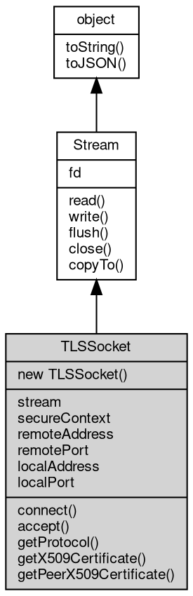

# 对象 TLSSocket
[tls](../../module/ifs/tls.md)/ssl 网络套接口对象

TLSSocket 属于 [tls](../../module/ifs/tls.md) 模块，创建方法

```JavaScript
var s = new tls.TLSSocket();
```

## 继承关系


## 构造函数
        
### TLSSocket
**创建一个新的 TLSSocket 对象，使用当前缺省 [SecureContext](SecureContext.md)**

```JavaScript
new TLSSocket();
```

--------------------------
**根据 context 创建一个新的 TLSSocket 对象**

```JavaScript
new TLSSocket(SecureContext context);
```

调用参数:
* context: [SecureContext](SecureContext.md), 指定创建 TLSSocket 使用的安全上下文

--------------------------
**根据 options 创建一个新的 TLSSocket 对象**

```JavaScript
new TLSSocket(Object options,
    Boolean isServer = false);
```

调用参数:
* options: Object, 使用 [tls.createSecureContext](../../module/ifs/tls.md#createSecureContext) 创建安全上下文需要的选项
* isServer: Boolean, 是否是服务端模式

## 成员属性
        
### stream
**[Stream](Stream.md), 查询消息 [tls](../../module/ifs/tls.md)/ssl 建立时的下层流对象**

```JavaScript
readonly Stream TLSSocket.stream;
```

--------------------------
### secureContext
**[SecureContext](SecureContext.md), 查询当前 TLSSocket 使用的 [SecureContext](SecureContext.md)**

```JavaScript
readonly SecureContext TLSSocket.secureContext;
```

--------------------------
### remoteAddress
**String, 查询当前连接的对方地址**

```JavaScript
readonly String TLSSocket.remoteAddress;
```

--------------------------
### remotePort
**Integer, 查询当前连接的对方端口**

```JavaScript
readonly Integer TLSSocket.remotePort;
```

--------------------------
### localAddress
**String, 查询当前连接的本地地址**

```JavaScript
readonly String TLSSocket.localAddress;
```

--------------------------
### localPort
**Integer, 查询当前连接的本地端口**

```JavaScript
readonly Integer TLSSocket.localPort;
```

--------------------------
### fd
**Integer, 查询 [Stream](Stream.md) 对应的文件描述符值, 由子类实现**

```JavaScript
readonly Integer TLSSocket.fd;
```

## 成员函数
        
### connect
**在给定的连接上连接 [tls](../../module/ifs/tls.md)/ssl 连接，客户端模式**

```JavaScript
TLSSocket.connect(Stream socket,
    String server_name = "") async;
```

调用参数:
* socket: [Stream](Stream.md), 给定的底层连接
* server_name: String, 服务端名称，用于验证服务端证书

--------------------------
### accept
**在给定的连接上连接 [tls](../../module/ifs/tls.md)/ssl 连接，服务端模式**

```JavaScript
TLSSocket.accept(Stream socket) async;
```

调用参数:
* socket: [Stream](Stream.md), 给定的底层连接

--------------------------
### getProtocol
**当前连接协商的 [tls](../../module/ifs/tls.md)/ssl 协议版本**

```JavaScript
String TLSSocket.getProtocol();
```

返回结果:
* String, 返回 [tls](../../module/ifs/tls.md)/ssl 协议版本

--------------------------
### getX509Certificate
**当前连接协商的本地证书**

```JavaScript
X509Certificate TLSSocket.getX509Certificate();
```

返回结果:
* [X509Certificate](X509Certificate.md), 返回本地证书

--------------------------
### getPeerX509Certificate
**当前连接协商的对等证书**

```JavaScript
X509Certificate TLSSocket.getPeerX509Certificate();
```

返回结果:
* [X509Certificate](X509Certificate.md), 返回对等证书

--------------------------
### read
**从流内读取指定大小的数据**

```JavaScript
Buffer TLSSocket.read(Integer bytes = -1) async;
```

调用参数:
* bytes: Integer, 指定要读取的数据量，缺省为读取随机大小的数据块，读出的数据尺寸取决于设备

返回结果:
* [Buffer](Buffer.md), 返回从流内读取的数据，若无数据可读，或者连接中断，则返回 null

--------------------------
### write
**将给定的数据写入流**

```JavaScript
TLSSocket.write(Buffer data) async;
```

调用参数:
* data: [Buffer](Buffer.md), 给定要写入的数据

--------------------------
### flush
**将文件缓冲区内容写入物理设备**

```JavaScript
TLSSocket.flush() async;
```

--------------------------
### close
**关闭当前流对象**

```JavaScript
TLSSocket.close() async;
```

--------------------------
### copyTo
**复制流数据到目标流中**

```JavaScript
Long TLSSocket.copyTo(Stream stm,
    Long bytes = -1) async;
```

调用参数:
* stm: [Stream](Stream.md), 目标流对象
* bytes: Long, 复制的字节数

返回结果:
* Long, 返回复制的字节数

--------------------------
### toString
**返回对象的字符串表示，一般返回 "[Native Object]"，对象可以根据自己的特性重新实现**

```JavaScript
String TLSSocket.toString();
```

返回结果:
* String, 返回对象的字符串表示

--------------------------
### toJSON
**返回对象的 JSON 格式表示，一般返回对象定义的可读属性集合**

```JavaScript
Value TLSSocket.toJSON(String key = "");
```

调用参数:
* key: String, 未使用

返回结果:
* Value, 返回包含可 JSON 序列化的值

