# Object TTYOutputStream
The writable side of a terminal: window size, resize events and ANSI cursor control

TTYOutputStream wraps a terminal descriptor. In a [process](../../module/ifs/process.md) attached to a terminal, [process.stdout](../../module/ifs/process.md#stdout)
and [process.stderr](../../module/ifs/process.md#stderr) are instances of this class, and any terminal descriptor or [FileHandle](FileHandle.md) can be
wrapped explicitly with `new [tty.WriteStream](../../module/ifs/tty.md#WriteStream)(fd[, opts])`. The class extends [Stream](Stream.md), so write,
flush, close and the event interface behave as documented there; the output side adds the terminal
dimensions (columns, rows, getWindowSize), the control members (clearLine, clearScreenDown,
cursorTo, moveCursor) and the `'resize'` event.

Concepts:

- **Window size and resize**: the terminal has a number of columns and rows, read through columns,
  rows or getWindowSize; the values are re-read from the device on every access. When the user
  resizes the window the [process](../../module/ifs/process.md) receives SIGWINCH and the stream emits `'resize'` with no
  arguments, after which the properties report the new size.
- **Control sequences**: clearLine, clearScreenDown, cursorTo and moveCursor write ANSI CSI
  sequences to the terminal, which interprets them instead of displaying them. fibjs emits the
  same sequences as Node.js; the members return nothing and write straight to the terminal
  device, bypassing the JavaScript write override and the stream back pressure.
- **Positions**: columns and the x arguments are 0-based; cursorTo(x) moves to column x of the
  current row, cursorTo(x, y) moves to the 0-based row y, and moveCursor(dx, dy) is relative.
  Each non-zero component is written as its own sequence.
- **Color depth**: Node.js hasColors/getColorDepth are not implemented; use [util.colors](../../module/ifs/util.md#colors).hasColors
  to [test](../../module/ifs/test.md) whether the terminal supports color (see the [colors](../../module/ifs/colors.md) [module](../../module/ifs/module.md)).

Obtained from:
- `process.stdout` and `process.stderr` — when the matching standard stream is a terminal;
- `new [tty.WriteStream](../../module/ifs/tty.md#WriteStream)(fd[, opts])` — wrap any terminal descriptor or [FileHandle](FileHandle.md);
- the standard output of a child started with `stdio: 'pty'`.

Example 1 — the window size of a pseudo terminal:

```JavaScript
const child_process = require('child_process');
const io = require('io');

// The pty is created with the size given by the cols/rows options (80x24 by
// default); the child reads it from its own terminal stream, while the
// parent side is a plain Stream without the terminal members.
const code = 'process.stdout.write(process.stdout.getWindowSize().join("x") + "\\n");';
const bs = child_process.spawn(process.execPath, ['-e', code], {
    stdio: 'pty',
    cols: 100,
    rows: 40
});

console.log(new io.BufferedStream(bs.stdout).readLine()); // 100x40
console.log(bs.stdout.isTTY); // undefined
bs.join();
```

Example 2 — escape sequences produced by the control members:

```JavaScript
const child_process = require('child_process');
const io = require('io');

// The child clears the line, writes x, moves the cursor to column 5 and
// writes y; the parent captures the raw bytes that travel through the pty.
const code = [
    'process.stdout.clearLine(0);',
    'process.stdout.write("x");',
    'process.stdout.cursorTo(4);',
    'process.stdout.write("y");',
    'process.stdout.write("\\n");'
].join('');

const bs = child_process.spawn(process.execPath, ['-e', code], {
    stdio: 'pty'
});
const line = new io.BufferedStream(bs.stdout).readLine();
console.log(JSON.stringify(line)); // "\u001b[2Kx\u001b[5Gy"
console.log(line.includes('\x1b[2K')); // true
bs.join();
```

Example 3 — overwrite a status line in place:

```JavaScript
// On a terminal the same line is overwritten; when the output is piped the
// branches print one step per line instead.
if (process.stdout.isTTY) {
    process.stdout.clearLine(0);
    process.stdout.cursorTo(0);
    process.stdout.write('step 1/2');
    process.stdout.clearLine(0);
    process.stdout.cursorTo(0);
    process.stdout.write('step 2/2\n');
} else {
    console.log('step 1/2');
    console.log('step 2/2');
}
```

## Inheritance

```dot
digraph {
    node [fontname="Helvetica,sans-Serif", fontsize=10, shape="record", style="filled", fillcolor="white"];

    object [tooltip="object", URL="object.md", label="{object|toString()\ltoJSON()\l}"];
    EventEmitter [tooltip="EventEmitter", URL="EventEmitter.md", label="{EventEmitter|new EventEmitter()\l|EventEmitter\l|addAbortListener()\lonce()\lon()\l|defaultMaxListeners\l|on()\laddListener()\laddEventListener()\lprependListener()\lonce()\lprependOnceListener()\loff()\lremoveListener()\lremoveEventListener()\lremoveAllListeners()\lsetMaxListeners()\lgetMaxListeners()\llisteners()\lrawListeners()\llistenerCount()\leventNames()\lemit()\l}"];
    Stream [tooltip="Stream", URL="Stream.md", label="{Stream|fd\lwritable\lreadable\l_readableState\l_writableState\l|read()\lreadBuffer()\lreadAll()\lsetEncoding()\lwriteBuffer()\lwrite()\lresume()\lpause()\lpipe()\lunpipe()\lend()\lflush()\lclose()\lcopyTo()\lgetReader()\lref()\lunref()\ldestroy()\l|event data\levent close\levent error\l}"];
    TTYOutputStream [tooltip="TTYOutputStream", fillcolor="lightgray", id="me", label="{TTYOutputStream|new TTYOutputStream()\l|isTTY\lcolumns\lrows\l|clearLine()\lclearScreenDown()\lcursorTo()\lmoveCursor()\lgetWindowSize()\l|event resize\l}"];

    object -> EventEmitter [dir=back];
    EventEmitter -> Stream [dir=back];
    Stream -> TTYOutputStream [dir=back];
}
```


## Constructors
        
### TTYOutputStream
**Creates a TTYOutputStream wrapping a terminal descriptor**

```JavaScript
new TTYOutputStream(Integer | FileHandle fd,
    Object opts = {});
```

Parameters:
* fd: Integer | [FileHandle](FileHandle.md), the file descriptor; an integer descriptor or a [FileHandle](FileHandle.md) [object](object.md)
* opts: Object, options [object](object.md), accepted for compatibility and ignored

The descriptor must already be a terminal: any other descriptor (a pipe, a file, a closed
[FileHandle](FileHandle.md)) throws `TypeError: fd N is not a TTY.` ([20004]), and a negative descriptor
throws [20009]. A [FileHandle](FileHandle.md), a numeric string and a fractional number are accepted (the
last two are coerced to an integer descriptor), and the direction of the descriptor is not
checked, so a terminal descriptor opened for input can be wrapped as well.

opts is accepted for interface compatibility and ignored: it is not forwarded to the [Stream](Stream.md)
base. Node.js has no options parameter on [tty.WriteStream](../../module/ifs/tty.md#WriteStream) at all.

Example — construct a second write stream for the terminal of a pty child:

```JavaScript
const child_process = require('child_process');
const io = require('io');

const code = [
    'const tty = require("tty");',
    'const out = new tty.WriteStream(1);',
    'process.stdout.write("isTTY: " + out.isTTY + "\\n");',
    'out.clearLine(0);',
    'process.stdout.write("cleared\\n");'
].join('\n');

const bs = child_process.spawn(process.execPath, ['-e', code], {
    stdio: 'pty'
});
const reader = new io.BufferedStream(bs.stdout);
console.log(reader.readLine()); // isTTY: true
console.log(JSON.stringify(reader.readLine())); // "\u001b[2Kcleared"
bs.join();
```

## Static Methods
        
### addAbortListener
**Registers a one-shot abort handler on an [AbortSignal](AbortSignal.md)**

```JavaScript
static Object TTYOutputStream.addAbortListener(EventEmitter signal,
    Function(Object ev) func);
```

Parameters:
* signal: [EventEmitter](EventEmitter.md), the [AbortSignal](AbortSignal.md) [object](object.md) to listen to
* func: Function(Object ev), the handler for the abort event

Returns:
* Object, returns a Disposable [object](object.md) containing a `[Symbol.dispose]` method

The handler is called at most once when the signal is aborted, and it is removed from the
signal afterwards. If the signal is already aborted the handler is invoked synchronously.
The returned [object](object.md) has a `[Symbol.dispose]()` method that removes the handler, so it can be
released before the abort happens.

Example — abort handling with automatic cleanup:

```JavaScript
const events = require('events');

const controller = new AbortController();
const disposable = events.addAbortListener(controller.signal,
    () => console.log('aborted'));

controller.abort(); // aborted
disposable[Symbol.dispose](); // safe to call after the listener fired
console.log(controller.signal.listenerCount('abort')); // 0
```

--------------------------
### once
**Creates a Promise resolved by the next occurrence of an event**

```JavaScript
static Object TTYOutputStream.once(EventEmitter emitter,
    Value ev,
    Object options = {});
```

Parameters:
* emitter: [EventEmitter](EventEmitter.md), the event emitter [object](object.md) to listen to
* ev: Value, the event name to listen for
* options: Object, optional parameter [object](object.md)

Returns:
* Object, returns a Promise that resolves with the array of event parameters

The Promise resolves with the array of the emit arguments when the event fires; it rejects
when `error` is emitted while waiting, unless the waited event is `error` itself, or when
the signal option aborts. The temporary listeners are removed when the Promise settles.

options supports the following option:

```JavaScript
// fragment: options
({
    "signal": null // AbortSignal; aborting rejects the Promise with an AbortError
});
```

Example — awaiting the next occurrence of an event:

```JavaScript
const EventEmitter = require('events');

(async () => {
    const emitter = new EventEmitter();
    const waiting = EventEmitter.once(emitter, 'ready');

    emitter.emit('ready', 200, 'ok');
    console.log(JSON.stringify(await waiting)); // [200,"ok"]
})();
```

--------------------------
### on
**Creates an async iterator that yields event occurrences**

```JavaScript
static Object TTYOutputStream.on(EventEmitter emitter,
    Value ev,
    Object options = {});
```

Parameters:
* emitter: [EventEmitter](EventEmitter.md), the event emitter [object](object.md) to listen to
* ev: Value, the event name to listen for
* options: Object, optional parameter [object](object.md)

Returns:
* Object, returns an AsyncIterator [object](object.md)

Each next() resolves with `{ value: [args...], done: false }` when the event fires and with
`{ done: true }` after an event named in the `close` option fires or the signal aborts; an
`error` event rejects the pending call. The listeners are registered when the iterator is
created and removed when the iteration ends or the signal aborts.

options supports the following options:

```JavaScript
// fragment: options
({
    "signal": null, // AbortSignal; aborting rejects pending and future next() calls
    "close": [] // event names; the first one to fire ends the iteration
});
```

Example — iterating the occurrences of an event:

```JavaScript
const EventEmitter = require('events');

(async () => {
    const emitter = new EventEmitter();
    const iterator = EventEmitter.on(emitter, 'data', {
        close: ['end']
    });

    emitter.emit('data', 1);
    emitter.emit('data', 2);
    emitter.emit('end');

    for await (const args of iterator)
    console.log(JSON.stringify(args)); // [1] then [2]
})();
```

## Static Properties
        
### defaultMaxListeners
**Integer, The [process](../../module/ifs/process.md)-wide default listener limit reported by getMaxListeners()**

```JavaScript
static Integer TTYOutputStream.defaultMaxListeners;
```

Defaults to 10. Assigning a value changes getMaxListeners() for every emitter that never
called setMaxListeners(); an emitter with an explicit limit keeps it. The limit is
informational: fibjs never warns when the number of listeners exceeds it.

## Properties
        
### isTTY
**Boolean, Always true: a TTYOutputStream is only created for a terminal descriptor**

```JavaScript
readonly Boolean TTYOutputStream.isTTY;
```

The property is fixed to true by the class; the real check happens when the stream is created.
When stdout is a pipe or a file, [process.stdout](../../module/ifs/process.md#stdout) is a plain [Stream](Stream.md) instead and its isTTY is
undefined. Use [tty.isatty](../../module/ifs/tty.md#isatty)(fd) to [test](../../module/ifs/test.md) an arbitrary descriptor.

--------------------------
### columns
**Integer, The current number of columns of the terminal**

```JavaScript
readonly Integer TTYOutputStream.columns;
```

The value is read from the terminal device on every access, so it follows a resize; it is the
first element of getWindowSize and matches Node.js. A pty created with `stdio: 'pty'` starts
at the cols option of [child_process](../../module/ifs/child_process.md) (80 by default).

--------------------------
### rows
**Integer, The current number of rows of the terminal**

```JavaScript
readonly Integer TTYOutputStream.rows;
```

The value is read from the terminal device on every access, so it follows a resize; it is the
second element of getWindowSize and matches Node.js. A pty created with `stdio: 'pty'` starts
at the rows option of [child_process](../../module/ifs/child_process.md) (24 by default).

--------------------------
### fd
**Integer, Queries the file descriptor value of the [Stream](Stream.md)**

```JavaScript
readonly Integer TTYOutputStream.fd;
```

Only streams backed by an operating-system handle implement it:
[FileStream](FileStream.md) (and the streams returned by [fs.openFile](../../module/ifs/fs.md#openFile), [fs.createReadStream](../../module/ifs/fs.md#createReadStream)
and [fs.createWriteStream](../../module/ifs/fs.md#createWriteStream)) reports the file descriptor, [net.Socket](../../module/ifs/net.md#Socket) and
[TLSSocket](TLSSocket.md) the socket descriptor and the [process](../../module/ifs/process.md) standard streams 0/1/2.
Streams without a handle ([MemoryStream](MemoryStream.md), [RangeStream](RangeStream.md), [BufferedStream](BufferedStream.md)) throw
[20009] when the property is read. Node.js exposes `fd` on file streams
only and returns undefined elsewhere.

--------------------------
### writable
**Boolean, Queries whether the stream is writable**

```JavaScript
readonly Boolean TTYOutputStream.writable;
```

Kept for Node compatibility: this reports whether the stream has not
ended, not whether the device accepts writes. It stays true after end()
and close() and turns false only when the flowing read loop reaches the
end of the stream or destroy() is called. Test the results of write()
and end() and watch the events instead of relying on this flag.

--------------------------
### readable
**Boolean, Queries whether the stream is readable**

```JavaScript
readonly Boolean TTYOutputStream.readable;
```

Node-compatible flag with the same caveats as `writable`: true until the
flowing read loop reaches the end of the stream or destroy() is called.
It does not track pause(), close(), or pull-mode reads that reached the
end of the stream.

--------------------------
### _readableState
**Object, Queries the readable state [object](object.md) of the stream**

```JavaScript
readonly Object TTYOutputStream._readableState;
```

A minimal Node-compatible view: an [object](object.md) with one `ended` property that
mirrors the internal ended flag, which becomes true when the flowing read
loop finishes or the stream is destroyed. It is not a full Node
ReadableState, and the other Node fields are absent.

--------------------------
### _writableState
**Object, Queries the writable state [object](object.md) of the stream**

```JavaScript
readonly Object TTYOutputStream._writableState;
```

Compatibility stub: fibjs returns an empty [object](object.md) and keeps no Node
WritableState. Use the return value of write() and the `drain` event for
back pressure instead.

## Methods
        
### clearLine
**Clears the current line in the direction given by dir**

```JavaScript
TTYOutputStream.clearLine(Integer dir = 0);
```

Parameters:
* dir: Integer, clearing direction: -1, 0 (default) or 1

dir selects the part of the line to clear: -1 clears from the cursor to the beginning of the
line, 0 the whole line and 1 from the cursor to the end of the line (the default is 0). Each
direction writes the corresponding CSI sequence: `\x1b[1K`, `\x1b[2K` or `\x1b[0K`. Any other
value throws [20004] ("clearLine: invalid direction"), where Node.js writes `\x1b[0K` instead.

Example — the three directions produce three different sequences:

```JavaScript
const child_process = require('child_process');
const io = require('io');

const code = [
    'process.stdout.clearLine(-1);',
    'process.stdout.clearLine(0);',
    'process.stdout.clearLine(1);',
    'process.stdout.write("end\\n");'
].join('');

const bs = child_process.spawn(process.execPath, ['-e', code], {
    stdio: 'pty'
});
const line = new io.BufferedStream(bs.stdout).readLine();
console.log(JSON.stringify(line)); // "\u001b[1K\u001b[2K\u001b[0Kend"
bs.join();
```

--------------------------
### clearScreenDown
**Clears the terminal from the cursor down to the end of the screen**

```JavaScript
TTYOutputStream.clearScreenDown();
```

Writes the CSI sequence `\x1b[0J`; the cursor itself does not move. Node.js emits the same
sequence from its synchronous form.

--------------------------
### cursorTo
**Moves the cursor to an absolute position**

```JavaScript
TTYOutputStream.cursorTo(Integer x,
    Integer y = -1) async;
```

Parameters:
* x: Integer, the column number, 0-based
* y: Integer, the row number, 0-based; omitted or negative leaves the row unchanged

x is the 0-based column to move to. When y is omitted or negative the row is left unchanged
and the member writes `\x1b[(x+1)G`; otherwise y is the 0-based row and the member writes
`\x1b[(y+1);(x+1)H`. A negative x throws [20004] ("cursorTo: x must be non-negative") where
Node.js writes `\x1b[0G`, and a negative y means "do not change the row" where Node.js emits
a negative row number.

The member is declared async, so it also has a callback form and the cursorToSync/cursorToAsync
aliases; all of them write the sequence when they run. Node.js emits the same bytes from its
synchronous form.

Example — absolute row/column addressing:

```JavaScript
const child_process = require('child_process');
const io = require('io');

const code = [
    'process.stdout.cursorTo(5);',
    'process.stdout.cursorTo(5, 3);',
    'process.stdout.write("\\n");'
].join('');

const bs = child_process.spawn(process.execPath, ['-e', code], {
    stdio: 'pty'
});
console.log(JSON.stringify(new io.BufferedStream(bs.stdout).readLine()));
// "\u001b[6G\u001b[4;6H"
bs.join();
```

--------------------------
### moveCursor
**Moves the cursor by a relative offset**

```JavaScript
TTYOutputStream.moveCursor(Integer dx,
    Integer dy) async;
```

Parameters:
* dx: Integer, the column offset; positive moves right, negative moves left
* dy: Integer, the row offset; positive moves down, negative moves up

Each non-zero component is written as its own CSI sequence: dx > 0 emits `\x1b[dxC` (right)
and dx < 0 emits `\x1b[|dx|D` (left); dy > 0 emits `\x1b[dyB` (down) and dy < 0 emits
`\x1b[|dy|A` (up). moveCursor(0, 0) writes nothing. Node.js emits the same sequences from its
synchronous form; the explicit moveCursorSync/moveCursorAsync aliases are fibjs extensions.

Example — relative moves in all four directions:

```JavaScript
const child_process = require('child_process');
const io = require('io');

const code = [
    'process.stdout.moveCursor(1, 1);',
    'process.stdout.moveCursor(-3, 2);',
    'process.stdout.moveCursor(0, -4);',
    'process.stdout.write("\\n");'
].join('');

const bs = child_process.spawn(process.execPath, ['-e', code], {
    stdio: 'pty'
});
console.log(JSON.stringify(new io.BufferedStream(bs.stdout).readLine()));
// "\u001b[1C\u001b[1B\u001b[3D\u001b[2B\u001b[4A"
bs.join();
```

--------------------------
### getWindowSize
**Returns the size of the terminal as [numColumns, numRows]**

```JavaScript
Number TTYOutputStream.getWindowSize();
```

Returns:
* Number, returns the array [numColumns, numRows] of the terminal

The pair is read from the terminal device on every call, so it follows a resize; it is
equivalent to reading columns and rows and has the same Number[] shape as Node.js (the members
are numbers, not integers).

--------------------------
### read
**Reads data of the specified size from the stream**

```JavaScript
Variant TTYOutputStream.read(Integer bytes = -1) async;
```

Parameters:
* bytes: Integer, the amount of data to read; by default one chunk sized by the device

Returns:
* Variant, the data read from the stream; a string when an [encoding](../../module/ifs/encoding.md) is set,

In pull mode (no data/readable listener and no resume) the call asks the
device for one chunk: file and socket streams wait until `bytes` bytes are
available or the stream ends, while [MemoryStream](MemoryStream.md) returns the bytes it holds
(fewer than `bytes` is possible) without blocking. In flowing mode the data
has already been read ahead, so the call returns from the internal queue:
with `bytes` <= 0 all buffered data is merged into one [Buffer](Buffer.md), with
`bytes` > 0 exactly `bytes` are required, otherwise null. The result is a
[Buffer](Buffer.md), or a string when setEncoding was called; null is returned at the
end of the stream, on a broken connection or when a flowing read cannot be
satisfied. read(0) returns null. The call styles are `stm.read(4)`,
`stm.read(4, (err, data) => {})` and `await stm.read(4)`.

Example — read by size until the stream ends:

```JavaScript
const io = require('io');

const stm = new io.MemoryStream();
stm.write(Buffer.from('0123456789'));
stm.rewind();

console.log(stm.read(4).toString()); // 0123
console.log(stm.read(4).toString()); // 4567
console.log(stm.read(4).toString()); // 89: the stream ends first
console.log(stm.read()); // null at the end of the stream
```

--------------------------
### readBuffer
**Reads data of the specified size from the stream, returned as a [Buffer](Buffer.md)**

```JavaScript
Buffer TTYOutputStream.readBuffer(Integer bytes = -1) async;
```

Parameters:
* bytes: Integer, the amount of data to read; by default one chunk sized by the device

Returns:
* [Buffer](Buffer.md), returns the [Buffer](Buffer.md) data read from the stream; null when there is no data to read

Identical to `read` except that the result is always a [Buffer](Buffer.md): setEncoding
and the text decoder do not apply. Use it when the consumer needs binary
data regardless of the stream [encoding](../../module/ifs/encoding.md).

--------------------------
### readAll
**Reads all remaining data from the stream**

```JavaScript
Buffer TTYOutputStream.readAll() async;
```

Returns:
* [Buffer](Buffer.md), the data read from the stream; null when nothing was read or the

Reads until the end of the stream and returns everything in one [Buffer](Buffer.md), or
null when no byte could be read (an empty stream is already at its end).
setEncoding is ignored. For a live socket the call waits until the peer
closes the connection; in flowing mode the read loop is already consuming
the device, so collect the `data` chunks instead.

Example — read a whole stream and detect its end:

```JavaScript
const io = require('io');

const stm = new io.MemoryStream();
stm.write(Buffer.from('all at once'));
stm.rewind();
stm.setEncoding('utf8'); // readAll ignores the encoding

const all = stm.readAll();
console.log(Buffer.isBuffer(all), all.toString()); // true all at once
console.log(stm.readAll()); // null: the stream is at its end
```

--------------------------
### setEncoding
**Sets the [encoding](../../module/ifs/encoding.md) of the stream; subsequent read() calls return strings**

```JavaScript
Stream TTYOutputStream.setEncoding(String encoding);
```

Parameters:
* encoding: String, the [encoding](../../module/ifs/encoding.md) to use, such as 'utf8', 'ascii', 'latin1' or 'utf16le'

Returns:
* [Stream](Stream.md), returns the current stream [object](object.md)

Installs a streaming decoder used by `read` and by the `data` event, so
incomplete multi-byte sequences that straddle two chunks decode correctly.
`readBuffer`, `readAll` and [StreamReader](StreamReader.md) keep returning Buffers. The
decoder understands the text labels 'utf8', 'ascii', 'latin1' and
'utf16le' (and their aliases); other names, including '[hex](../../module/ifs/hex.md)', '[base64](../../module/ifs/base64.md)' and
'ucs2', are accepted here but decode to empty strings, and null or a
non-string throws [20005]. Node.js rejects an unknown name with
ERR_UNKNOWN_ENCODING. Returns the stream itself for chaining.

Example — switch to text reads, then back to binary:

```JavaScript
const io = require('io');

const stm = new io.MemoryStream();
stm.write(Buffer.from('hello'));
stm.rewind();
stm.setEncoding('utf8');

console.log(stm.read()); // hello: read returns a string
stm.rewind();
console.log(stm.readBuffer().toString()); // hello: readBuffer stays binary
```

--------------------------
### writeBuffer
**Writes the given binary data to the stream**

```JavaScript
TTYOutputStream.writeBuffer(Buffer data) async;
```

Parameters:
* data: [Buffer](Buffer.md), the [Buffer](Buffer.md) data to write

Queues the buffer and returns undefined (unlike `write`, no back-pressure
flag is reported); the direct call waits for the chunk to be written. The
string overload encodes the text as utf8, with no [encoding](../../module/ifs/encoding.md) argument.

--------------------------
**Writes the given binary data to the stream; a string data is encoded as utf8**

```JavaScript
TTYOutputStream.writeBuffer(String data) async;
```

Parameters:
* data: String, the [Buffer](Buffer.md) data to write

String form of `writeBuffer`: the text is encoded with utf8 and queued as
binary data.

--------------------------
### write
**Writes the given data to the stream**

```JavaScript
Boolean TTYOutputStream.write(Buffer data) async;
```

Parameters:
* data: [Buffer](Buffer.md), the data to write

Returns:
* Boolean, false when the caller should wait for the 'drain' event before

Queues the data and reports back pressure, mirroring Node.js: returns
false when the queued bytes reach the write high-water mark (16384 bytes)
and the caller should wait for the 'drain' event before writing more;
returns true while the queue has room. Writes are queued in FIFO order and
flushed one at a time. The direct call returns as soon as the chunk is
queued, a trailing callback receives the flag as its second argument, and
`await stm.write(data)` resolves to it. The [encoding](../../module/ifs/encoding.md) argument of the
[Buffer](Buffer.md) overload is ignored.

Example — stop writing when the queue is full and wait for drain:

```JavaScript
const io = require('io');
const coroutine = require('coroutine');

const stm = new io.MemoryStream();
const full = stm.write(Buffer.alloc(16384)); // false: wait for 'drain'
let drained = false;
stm.on('drain', () => {
    drained = true;
});
coroutine.sleep(20);

console.log(full, drained, stm.write('more')); // false true true
```

--------------------------
**Writes the given data to the stream**

```JavaScript
Boolean TTYOutputStream.write(Buffer data,
    String encoding) async;
```

Parameters:
* data: [Buffer](Buffer.md), the data to write
* encoding: String, the [encoding](../../module/ifs/encoding.md); this parameter is ignored because data is of type [Buffer](Buffer.md)

Returns:
* Boolean, false when the caller should wait for the 'drain' event before

[Buffer](Buffer.md) overload kept for Node compatibility: the [encoding](../../module/ifs/encoding.md) argument is
accepted and ignored, because [Buffer](Buffer.md) data is already binary.

--------------------------
**Writes the given string to the stream**

```JavaScript
Boolean TTYOutputStream.write(String data,
    String encoding = "utf8") async;
```

Parameters:
* data: String, the string data to write
* encoding: String, the [encoding](../../module/ifs/encoding.md) of the string, default is "utf8"

Returns:
* Boolean, false when the caller should wait for the 'drain' event before

Encodes the text with the given [encoding](../../module/ifs/encoding.md) (utf8 by default) and applies the
same queue and back-pressure rules as the [Buffer](Buffer.md) overload.

--------------------------
### resume
**Switches the stream to flowing read mode**

```JavaScript
Stream TTYOutputStream.resume();
```

Returns:
* [Stream](Stream.md), returns the current stream [object](object.md)

Starts the internal read loop: chunks are emitted through the `data`
event, or buffered and announced through `readable`. The switch is
permanent — pause() stops delivery, but the stream never returns to pull
mode. Registering a data/readable listener starts the loop as well, so
resume is only needed to restart delivery after pause. Returns the stream
itself.

--------------------------
### pause
**Pauses the automatic read mode of the stream**

```JavaScript
Stream TTYOutputStream.pause();
```

Returns:
* [Stream](Stream.md), returns the current stream [object](object.md)

Stops the flowing read loop after the current chunk: no further `data` or
`readable` events are delivered until resume(). Data already buffered is
kept. It has no effect in pull mode (before resume or a data/readable
listener) and does not undo flowing mode. Returns the stream itself.
Node.js pauses in the same way but exposes the state through isPaused().

--------------------------
### pipe
**Pipes stream data to the destination stream**

```JavaScript
Value TTYOutputStream.pipe(Value destination,
    Object options = {});
```

Parameters:
* destination: Value, the destination stream [object](object.md)
* options: Object, pipe options, optional; only `end` is read (default true,

Returns:
* Value, returns the destination stream [object](object.md), supporting chained calls

[Event](Event.md)-driven copy with back pressure: every `data` chunk of the source is
written to the destination; when write() reports a full queue the source
is paused until the destination emits `drain`. At the end of the source
the destination is ended (unless options.end is false); a source error is
re-emitted on the destination, and a source close that is not an end
destroys the destination. The destination receives a `pipe` event with the
source as its argument. Only the `end` option is read; the other Node.js
pipe options are ignored. Returns the destination for chaining, while the
copy itself continues in the background — wait for the destination
`finish`/`close` before reading its result. See copyTo for a bounded
synchronous copy.

Example — pipe one stream into another:

```JavaScript
const io = require('io');
const coroutine = require('coroutine');

const src = new io.MemoryStream();
src.write(Buffer.from('piped data'));
src.rewind();

const dst = new io.MemoryStream();
const returned = src.pipe(dst);
coroutine.sleep(20);
dst.rewind();

console.log(returned === dst); // true: pipe returns the destination
console.log(dst.readAll().toString()); // piped data
```

--------------------------
### unpipe
**Removes all pipe destinations, or only the specified destination**

```JavaScript
TTYOutputStream.unpipe(Stream destination = NULL);
```

Parameters:
* destination: [Stream](Stream.md), the specific writable destination to unpipe

Compatibility no-op in fibjs: a piped copy stops by itself when the source
ends/errors/closes or the destination closes, and there is no way to
detach one destination from an active pipe. The argument is accepted and
ignored; Node.js also emits an `unpipe` event, which fibjs does not.

--------------------------
### end
**Ends the stream operation**

```JavaScript
Integer TTYOutputStream.end() async;
```

Returns:
* Integer, returns 0 after the stream has been ended

Flushes the queued writes so far and closes the write side, emitting
`finish`; when the read side has ended as well the stream closes and emits
`close`. The direct call returns 0 after the stream has been ended, the
callback form receives null as its error argument, and `await stm.end()`
resolves to the same 0. Writing after end is not meaningful, because the
stream is being closed. The end(data) and end(data, [encoding](../../module/ifs/encoding.md)) overloads
write one last chunk, utf8 encoded by default, before the same shutdown.

Example — end a write stream and observe its events:

```JavaScript
const fs = require('fs');
const os = require('os');
const path = require('path');

const dir = fs.mkdtempSync(path.join(os.tmpdir(), 'fibjs-end-'));
const file = path.join(dir, 'out.txt');

const stm = fs.createWriteStream(file);
const events = [];
stm.on('finish', () => events.push('finish'));
stm.on('close', () => events.push('close'));
stm.end('final data');

console.log(events.join(',')); // finish,close
console.log(fs.readFile(file, 'utf8')); // final data
fs.rmSync(dir, {
    recursive: true,
    force: true
});
```

--------------------------
**Writes the given file buffer to the stream and ends the stream operation**

```JavaScript
Integer TTYOutputStream.end(Buffer data) async;
```

Parameters:
* data: [Buffer](Buffer.md), the file buffer data to write

Returns:
* Integer, returns 0 after the stream has been ended

Writes the buffer as the final chunk and then ends the stream, with the
same events and return value as `end()`.

--------------------------
**Writes the given file buffer to the stream and ends the stream operation**

```JavaScript
Integer TTYOutputStream.end(Buffer data,
    String encoding) async;
```

Parameters:
* data: [Buffer](Buffer.md), the file buffer data to write
* encoding: String, the [encoding](../../module/ifs/encoding.md); this parameter is ignored because data is of type [Buffer](Buffer.md)

Returns:
* Integer, returns 0 after the stream has been ended

[Buffer](Buffer.md) overload kept for Node compatibility: the [encoding](../../module/ifs/encoding.md) argument is
accepted and ignored.

--------------------------
**Writes the given string to the stream and ends the stream operation**

```JavaScript
Integer TTYOutputStream.end(String data,
    String encoding = "utf8") async;
```

Parameters:
* data: String, the string data to write
* encoding: String, the [encoding](../../module/ifs/encoding.md) of the string, default is "utf8"

Returns:
* Integer, returns 0 after the stream has been ended

Encodes the text with the given [encoding](../../module/ifs/encoding.md) (utf8 by default), writes it as
the final chunk and then ends the stream.

--------------------------
### flush
**Writes the file buffer content to the physical device**

```JavaScript
TTYOutputStream.flush() async;
```

Compatibility call: [MemoryStream](MemoryStream.md) and [Socket](Socket.md) return immediately, and for a
[FileStream](FileStream.md) the implementation only checks that the handle is still open
(the underlying fflush is disabled), so it does not force data to disk.
Buffered transports such as the [process](../../module/ifs/process.md) standard streams wait for their
queued writes to be handed to the device. On a file stream whose handle is
already closed it throws [20009] with "[FileStream](FileStream.md): file is closed.".

--------------------------
### close
**Closes the current stream [object](object.md)**

```JavaScript
TTYOutputStream.close() async;
```

Releases the operating-system handle or the transport. A successful call
does not emit 'close' by itself: the event comes from the auto-close after
the read flow ends, from destroy() or from the runtime. Reading or writing
a stream backed by a closed handle throws [20009]; [MemoryStream](MemoryStream.md) and
[Socket](Socket.md) tolerate a second close(), while a [FileStream](FileStream.md) rejects later
operations.

--------------------------
### copyTo
**Copies stream data to the destination stream**

```JavaScript
Long TTYOutputStream.copyTo(Stream stm,
    Long bytes = -1) async;
```

Parameters:
* stm: [Stream](Stream.md), the destination stream [object](object.md)
* bytes: Long, the number of bytes to copy

Returns:
* Long, returns the number of bytes copied

Copies at most `bytes` bytes (all remaining data by default) and returns
the number of bytes actually copied; a count of 0 copies nothing. The copy
runs in the current fiber and waits for the source to end when `bytes` is
-1, which makes it a simple way to move a whole stream. The destination is
not closed at the end (call end/close yourself), and a closed source or
destination throws [20009]. Node.js has no direct equivalent; use pipe or
stream.pipeline for the event-driven form.

Example — copy the first four bytes into another stream:

```JavaScript
const io = require('io');

const src = new io.MemoryStream();
src.write(Buffer.from('0123456789'));
src.rewind();

const dst = new io.MemoryStream();
console.log(src.copyTo(dst, 4)); // 4
dst.rewind();
console.log(dst.readAll().toString()); // 0123
```

--------------------------
### getReader
**Gets a reader for the stream, compatible with ReadableStreamDefaultReader**

```JavaScript
StreamReader TTYOutputStream.getReader();
```

Returns:
* [StreamReader](StreamReader.md), returns a [StreamReader](StreamReader.md) [object](object.md)

Returns a new [StreamReader](StreamReader.md) that pulls chunks with read(). Each call creates
an independent reader; fibjs does not enforce the single-reader lock of
the Web Streams API, so coordinate access yourself. Creating a reader does
not switch the stream to flowing mode. See [StreamReader](StreamReader.md) for the reader
lifecycle.

Example — pull the chunks of a stream with a reader:

```JavaScript
const io = require('io');

(async () => {
    const stm = new io.MemoryStream();
    stm.write(Buffer.from('chunk'));
    stm.rewind();

    const reader = stm.getReader();
    console.log((await reader.read()).value.toString()); // chunk
    console.log((await reader.read()).done); // true
})();
```

--------------------------
### ref
**Keeps the fibjs [process](../../module/ifs/process.md) alive, preventing it from exiting while the [object](object.md) is bound**

```JavaScript
Stream TTYOutputStream.ref();
```

Returns:
* [Stream](Stream.md), returns the current [object](object.md)

The runtime references the isolate while a stream reader is active; unref
(or pause) allows the [process](../../module/ifs/process.md) to exit even when the stream has pending
work. Returns the stream itself for chaining.

--------------------------
### unref
**Allows the fibjs [process](../../module/ifs/process.md) to exit while the [object](object.md) is bound**

```JavaScript
Stream TTYOutputStream.unref();
```

Returns:
* [Stream](Stream.md), returns the current [object](object.md)

Counterpart of ref: drops the [process](../../module/ifs/process.md)-liveness reference held by the
stream. The data flow is not stopped; it just no longer prevents the
[process](../../module/ifs/process.md) from exiting. Returns the stream itself for chaining.

--------------------------
### destroy
**Destroys the stream. Optionally emits the 'error' event and emits the 'close' event.**

```JavaScript
Stream TTYOutputStream.destroy(Value err = undefined) async;
```

Parameters:
* err: Value, optional error [object](object.md), emitted as the 'error' event

Returns:
* [Stream](Stream.md), returns the current [object](object.md)

Marks the stream unusable, emits 'error' with the supplied value when err
is not null/undefined, then closes the stream and emits 'close'. It is
idempotent: destroying an already destroyed stream is a no-op. Concrete
classes react differently afterwards — [MemoryStream](MemoryStream.md) keeps buffered data
readable, a [FileStream](FileStream.md) rejects later operations with [20009] — so do not
use a destroyed stream.

Example — destroy with an error and watch the events:

```JavaScript
const io = require('io');
const coroutine = require('coroutine');

const stm = new io.MemoryStream();
stm.write(Buffer.from('data'));
stm.rewind();
stm.on('error', (err) => console.log('error:', err.message)); // error: broken
stm.on('close', () => console.log('closed')); // closed

stm.destroy(new Error('broken'));
coroutine.sleep(20);
```

--------------------------
### on
**Appends an event handler to the emitter**

```JavaScript
Object TTYOutputStream.on(Value ev,
    Function(...args) func);
```

Parameters:
* ev: Value, the event name to bind
* func: Function(...args), the event handler function, called with the emit arguments

Returns:
* Object, returns the event [object](object.md) itself for chaining

The listener is called with the arguments of emit() and `this` set to the emitter; the
emitter itself is returned so registrations can be chained. The same function may be
registered several times for one event and each copy is called. See the class documentation
for the dispatch order.

--------------------------
**Appends several event handlers to the emitter**

```JavaScript
Object TTYOutputStream.on(Object map);
```

Parameters:
* map: Object, the event mapping; [object](object.md) property names are used as event names

Returns:
* Object, returns the event [object](object.md) itself for chaining

Every enumerable property of the map whose value is a function is registered under its
property name. Properties are processed in order; a value that is not a function makes the
call fail with an invalid-type error while entries processed before it stay registered.

Example — registering several handlers at once:

```JavaScript
const EventEmitter = require('events');

const emitter = new EventEmitter();
emitter.on({
    connect: () => console.log('connect'),
    close: () => console.log('close')
});

emitter.emit('connect'); // connect
emitter.emit('close'); // close
```

--------------------------
### addListener
**Appends an event handler to the emitter**

```JavaScript
Object TTYOutputStream.addListener(Value ev,
    Function(...args) func);
```

Parameters:
* ev: Value, the event name to bind
* func: Function(...args), the event handler function

Returns:
* Object, returns the event [object](object.md) itself for chaining

Alias of on(ev, func), provided for Node.js compatibility.

--------------------------
**Appends several event handlers to the emitter**

```JavaScript
Object TTYOutputStream.addListener(Object map);
```

Parameters:
* map: Object, the event mapping; [object](object.md) property names are used as event names

Returns:
* Object, returns the event [object](object.md) itself for chaining

Alias of on(map), provided for Node.js compatibility.

--------------------------
### addEventListener
**Appends an event handler to the emitter with an options [object](object.md)**

```JavaScript
Object TTYOutputStream.addEventListener(Value ev,
    Function(...args) func,
    Object options = {});
```

Parameters:
* ev: Value, the event name to bind
* func: Function(...args), the event handler function, called with the emit arguments
* options: Object, the options of the event handler

Returns:
* Object, returns the event [object](object.md) itself for chaining

Web-style alias of on(); the only supported option is `once`, which registers a one-shot
handler exactly like once(). The listener receives the plain emit arguments and not an [Event](Event.md)
[object](object.md); see the [DOMEvent](DOMEvent.md) class for the DOM-style event [object](object.md) used by [AbortSignal](AbortSignal.md) and
fetch-style APIs.

options supports the following option:

```JavaScript
// fragment: options
({
    "once": false // when true, the handler is removed before its single invocation
});
```

Example — a one-shot DOM-style registration:

```JavaScript
const EventEmitter = require('events');

const emitter = new EventEmitter();
emitter.addEventListener('ping', () => console.log('ping'), {
    once: true
});

emitter.emit('ping'); // ping
console.log(emitter.emit('ping')); // false
console.log(emitter.listenerCount('ping')); // 0
```

--------------------------
### prependListener
**Inserts an event handler at the front of the queue**

```JavaScript
Object TTYOutputStream.prependListener(Value ev,
    Function(...args) func);
```

Parameters:
* ev: Value, the event name to bind
* func: Function(...args), the event handler function

Returns:
* Object, returns the event [object](object.md) itself for chaining

The listener is called before the listeners registered with on()/addListener() the next time
the event is emitted. When several prependListener() calls are made, the last one registered
is called first, because every call inserts at the same position.

Example — insertion at the front of the queue:

```JavaScript
const EventEmitter = require('events');

const emitter = new EventEmitter();
emitter.on('order', () => console.log('on'));
emitter.prependListener('order', () => console.log('prepend'));

emitter.emit('order'); // prepend, then on
```

--------------------------
**Inserts several event handlers at the front of the queue**

```JavaScript
Object TTYOutputStream.prependListener(Object map);
```

Parameters:
* map: Object, the event mapping; [object](object.md) property names are used as event names

Returns:
* Object, returns the event [object](object.md) itself for chaining

Map form of prependListener(); every function property is inserted at the front, so the
properties of the map are called in reverse order.

--------------------------
### once
**Appends a one-shot event handler to the emitter**

```JavaScript
Object TTYOutputStream.once(Value ev,
    Function(...args) func);
```

Parameters:
* ev: Value, the event name to bind
* func: Function(...args), the event handler function

Returns:
* Object, returns the event [object](object.md) itself for chaining

The handler is wrapped and removes itself from the queue before it is called, so it runs at
most once. off() removes it when passed the original function, listeners() returns the
original function, and rawListeners() returns the internal wrapper whose `_func` property
holds the original. See Example 2 in the class documentation.

--------------------------
**Appends several one-shot event handlers to the emitter**

```JavaScript
Object TTYOutputStream.once(Object map);
```

Parameters:
* map: Object, the event mapping; [object](object.md) property names are used as event names

Returns:
* Object, returns the event [object](object.md) itself for chaining

Map form of once(); every function property is registered as a one-shot listener under its
property name.

--------------------------
### prependOnceListener
**Inserts a one-shot event handler at the front of the queue**

```JavaScript
Object TTYOutputStream.prependOnceListener(Value ev,
    Function(...args) func);
```

Parameters:
* ev: Value, the event name to bind
* func: Function(...args), the event handler function

Returns:
* Object, returns the event [object](object.md) itself for chaining

Combines prependListener() and once(): the handler is called first and only once, and it is
removed before its invocation.

--------------------------
**Inserts several one-shot event handlers at the front of the queue**

```JavaScript
Object TTYOutputStream.prependOnceListener(Object map);
```

Parameters:
* map: Object, the event mapping; [object](object.md) property names are used as event names

Returns:
* Object, returns the event [object](object.md) itself for chaining

Map form of prependOnceListener(); every function property is inserted as a one-shot
listener, and the properties of the map are called in reverse order.

--------------------------
### off
**Removes an event handler from the emitter**

```JavaScript
Object TTYOutputStream.off(Value ev,
    Function(...args) func);
```

Parameters:
* ev: Value, the event name to unbind
* func: Function(...args), the event handler function

Returns:
* Object, returns the event [object](object.md) itself for chaining

The first matching listener is removed; when the same function was registered several times
only one copy is removed per call, so repeat the call to remove the others. A once() wrapper
is matched by its original function as well. Removing a listener emits the `removeListener`
meta event after the removal.

--------------------------
**Removes all event handlers of one event**

```JavaScript
Object TTYOutputStream.off(Value ev);
```

Parameters:
* ev: Value, the event name to unbind

Returns:
* Object, returns the event [object](object.md) itself for chaining

Every listener of the event is removed and `removeListener` is emitted once per removed
listener. The call succeeds when the event has no listener.

Example — removing every listener of one event:

```JavaScript
const EventEmitter = require('events');

const emitter = new EventEmitter();
emitter.on('data', () => console.log('first'));
emitter.on('data', () => console.log('second'));

emitter.off('data');
console.log(emitter.emit('data')); // false
```

--------------------------
**Removes several event handlers from the emitter**

```JavaScript
Object TTYOutputStream.off(Object map);
```

Parameters:
* map: Object, the event mapping; [object](object.md) property names are used as event names

Returns:
* Object, returns the event [object](object.md) itself for chaining

Every enumerable property of the map whose value is a function names an event from which
that function is removed (one copy per event). A value that is not a function makes the call
fail with an invalid-type error.

--------------------------
### removeListener
**Removes an event handler from the emitter**

```JavaScript
Object TTYOutputStream.removeListener(Value ev,
    Function(...args) func);
```

Parameters:
* ev: Value, the event name to unbind
* func: Function(...args), the event handler function

Returns:
* Object, returns the event [object](object.md) itself for chaining

Alias of off(ev, func), provided for Node.js compatibility.

--------------------------
**Removes all event handlers of one event**

```JavaScript
Object TTYOutputStream.removeListener(Value ev);
```

Parameters:
* ev: Value, the event name to unbind

Returns:
* Object, returns the event [object](object.md) itself for chaining

Alias of off(ev), provided for Node.js compatibility.

--------------------------
**Removes several event handlers from the emitter**

```JavaScript
Object TTYOutputStream.removeListener(Object map);
```

Parameters:
* map: Object, the event mapping; [object](object.md) property names are used as event names

Returns:
* Object, returns the event [object](object.md) itself for chaining

Alias of off(map), provided for Node.js compatibility.

--------------------------
### removeEventListener
**Removes an event handler with an options [object](object.md)**

```JavaScript
Object TTYOutputStream.removeEventListener(Value ev,
    Function(...args) func,
    Object options = {});
```

Parameters:
* ev: Value, the event name to unbind
* func: Function(...args), the event handler function
* options: Object, the options of the event handler, ignored

Returns:
* Object, returns the event [object](object.md) itself for chaining

Web-style alias of off(ev, func); the options [object](object.md) is accepted and ignored, and a once()
wrapper is matched by its original function like off().

--------------------------
### removeAllListeners
**Removes all listeners of one event**

```JavaScript
Object TTYOutputStream.removeAllListeners(Value ev);
```

Parameters:
* ev: Value, the event name to remove

Returns:
* Object, returns the event [object](object.md) itself for chaining

Equivalent to off(ev): every listener of the event is removed, including once() wrappers
matched by their original function, and `removeListener` is emitted once per removal.

--------------------------
**Removes all listeners of the given events, or of the whole emitter**

```JavaScript
Object TTYOutputStream.removeAllListeners(Array evs = []);
```

Parameters:
* evs: Array, the event names to remove

Returns:
* Object, returns the event [object](object.md) itself for chaining

An empty array — including the no-argument call, because the parameter defaults to [] —
clears every string-keyed event; symbol-keyed listeners are left in place, unlike Node.js
which removes them too. A non-empty array clears each named event as
removeAllListeners(ev) does.

Example — clearing selected events and the whole emitter:

```JavaScript
const EventEmitter = require('events');

const emitter = new EventEmitter();
emitter.on('a', () => {});
emitter.on('b', () => {});
emitter.on('c', () => {});

emitter.removeAllListeners(['a', 'b']);
console.log(emitter.listenerCount('a'), emitter.listenerCount('c')); // 0 1

emitter.removeAllListeners();
console.log(emitter.eventNames().length); // 0
```

--------------------------
### setMaxListeners
**Stores a per-emitter listener limit**

```JavaScript
TTYOutputStream.setMaxListeners(Integer n);
```

Parameters:
* n: Integer, the number of events

The value is reported by getMaxListeners() and is otherwise informational: fibjs never warns
when the number of listeners exceeds it. This member exists for Node.js compatibility. A
negative value throws; 0 is accepted and stored as-is, while Node.js treats 0 as unlimited.

--------------------------
### getMaxListeners
**Returns the listener limit of the emitter**

```JavaScript
Integer TTYOutputStream.getMaxListeners();
```

Returns:
* Integer, returns the default limit

Returns the value set by setMaxListeners(), or the [process](../../module/ifs/process.md)-wide defaultMaxListeners (10)
when no explicit value was set.

--------------------------
### listeners
**Returns a copy of the listener array of an event**

```JavaScript
Array TTYOutputStream.listeners(Value ev);
```

Parameters:
* ev: Value, the event name to query

Returns:
* Array, returns the listener array of the specified event

One-shot wrappers are unwrapped, so the result contains the functions passed to
on()/once() and can be passed to off(); an unknown event produces an empty array.

Example — once() listeners are returned unwrapped:

```JavaScript
const EventEmitter = require('events');

const emitter = new EventEmitter();

function onTick() {
    console.log('tick');
}

emitter.once('tick', onTick);
console.log(emitter.listeners('tick')[0] === onTick); // true
console.log(emitter.rawListeners('tick')[0] === onTick); // false
```

--------------------------
### rawListeners
**Returns the internal listener array of an event**

```JavaScript
Array TTYOutputStream.rawListeners(Value ev);
```

Parameters:
* ev: Value, the event name to query

Returns:
* Array, returns the listener array of the specified event

The array is not unwrapped: a listener registered with once() appears as the internal
wrapper function whose `_func` property holds the original function. An unknown event
produces an empty array.

--------------------------
### listenerCount
**Returns the number of listeners of an event**

```JavaScript
Integer TTYOutputStream.listenerCount(Value ev);
```

Parameters:
* ev: Value, the event name to query

Returns:
* Integer, returns the number of listeners of the specified event

One-shot listeners count as one and an unknown event returns 0.

--------------------------
**Returns the number of listeners of an event on another [object](object.md)**

```JavaScript
Integer TTYOutputStream.listenerCount(Value o,
    Value ev);
```

Parameters:
* o: Value, the [object](object.md) to query
* ev: Value, the event name to query

Returns:
* Integer, returns the number of listeners of the specified event

Counts without requiring the target to be an [EventEmitter](EventEmitter.md): any [object](object.md) with registered
events can be queried. The call is normally written as
`EventEmitter.listenerCount(target, 'data')`.

Example — counting the listeners of another [object](object.md):

```JavaScript
const EventEmitter = require('events');

const emitter = new EventEmitter();
emitter.on('data', () => {});
emitter.on('data', () => {});

console.log(EventEmitter.listenerCount(emitter, 'data')); // 2
```

--------------------------
### eventNames
**Returns the names of the events with at least one listener**

```JavaScript
Array TTYOutputStream.eventNames();
```

Returns:
* Array, returns the array of event names

Only string-keyed events are reported; symbol-keyed events are omitted and numeric event
names are returned as numbers (Node.js also reports symbol events).

--------------------------
### emit
**Emits an event and returns whether a listener was called**

```JavaScript
Boolean TTYOutputStream.emit(Value ev,
    ...args);
```

Parameters:
* ev: Value, event name
* args: ..., event parameters, which are passed to the event handler

Returns:
* Boolean, returns whether the event had a listener to respond to it

Listeners are called as described by the dispatch model in the class documentation: the
first one runs synchronously on the current fiber, the remaining ones run in parallel
fibers, and the call returns after all of them finish; an exception raised by a listener is
thrown back to the caller. Emitting `error` with no listener throws instead of returning
false: an Error argument is thrown as-is and any other value is wrapped in
`Error("Unhandled error. (...)")`. [Event](Event.md) names are strings or symbols; `emit()` does not
match a listener registered with a numeric name.

--------------------------
### toString
**Returns the string form of the [object](object.md)**

```JavaScript
String TTYOutputStream.toString();
```

Returns:
* String, returns the string form of the [object](object.md)

The base implementation reports an error: a native [object](object.md) has no implicit
text form, and only the classes whose value can be written as a string
override the member. [Buffer](Buffer.md) returns its content decoded with the given
[encoding](../../module/ifs/encoding.md), [HttpCookie](HttpCookie.md) returns "name=value", and so on; an override commonly
accepts optional arguments ([Buffer.toString](Buffer.md#toString) takes [encoding](../../module/ifs/encoding.md), start and
end) that are not part of this declaration.

Calling the member on a class that does not override it throws
"<Class>: the [object](object.md) can not be converted to string.", which is the
behavior to rely on when probing whether a value has a string form. See
toJSON for the serialization hook.

--------------------------
### toJSON
**Returns the JSON representation of the [object](object.md)**

```JavaScript
Value TTYOutputStream.toJSON(String key = "");
```

Parameters:
* key: String, the property name of the value being serialized

Returns:
* Value, returns the JSON-serializable value

JSON.stringify(value) calls value.toJSON(key) when the member exists and
serializes the returned value in its place; the key argument carries the
property name of the value inside its parent [object](object.md) (an empty string at
the top level) and may be used to build a keyed form. The base
implementation returns a plain [object](object.md) holding the readable properties of
the instance, so a native [object](object.md) serializes without per-class code; a
class with a portable shape such as [Buffer](Buffer.md) overrides it, and a JavaScript
class may override it in the same way.

The member is normally reached through JSON.stringify rather than called
directly; calling it returns the same value JSON.stringify would
serialize.

## Events
        
### resize
**Emitted when the terminal size changes**

```JavaScript
event TTYOutputStream.resize();
```

The event carries no arguments; read columns, rows or getWindowSize inside the listener to get
the new size. It is emitted when the [process](../../module/ifs/process.md) receives SIGWINCH, which the terminal sends when
its size changes (on a pseudo terminal, when stty or an ioctl changes the size). Node.js emits
the same event under the same name.

Example — watch the size of a pty child while stty resizes it (Linux only):

```JavaScript
const child_process = require('child_process');
const io = require('io');

if (process.platform !== 'linux') {
    console.log('the resize demo uses stty and runs on Linux only');
} else {
    const code = [
        'const child_process = require("child_process");',
        'process.stdout.on("resize", () => {',
        '    process.stdout.write("resized: " +',
        '        process.stdout.getWindowSize().join("x") + "\\n");',
        '});',
        'process.stdout.write("before: " + process.stdout.getWindowSize().join("x") + "\\n");',
        'child_process.exec("stty cols 100 rows 40 < /dev/tty");',
        'setTimeout(() => process.exit(0), 500);'
    ].join('\n');

    const bs = child_process.spawn(process.execPath, ['-e', code], {
        stdio: 'pty'
    });
    const reader = new io.BufferedStream(bs.stdout);
    console.log(reader.readLine()); // before: 80x24
    console.log(reader.readLine()); // resized: 100x40
    bs.join();
}
```

--------------------------
### data
**Queries and binds the stream data event, equivalent to on("data", func);**

```JavaScript
event TTYOutputStream.data(Buffer data);
```

Parameters:
* data: [Buffer](Buffer.md), the data read

Emitted for every chunk once the stream is in flowing mode; attaching this
listener switches the stream to that mode. The payload is a [Buffer](Buffer.md), or a
string when setEncoding was called (the parameter is declared as [Buffer](Buffer.md) for
the binary case). A `readable` workflow consumes the same data through
read() and emits no data events. Node.js has the same flowing-mode
semantics.

--------------------------
### close
**Queries and binds the stream close event, equivalent to on("close", func);**

```JavaScript
event TTYOutputStream.close();
```

Emitted once after the stream has been closed: at the end of a flowing
read (auto destroy), after destroy(), or when the runtime closes the
stream. A plain close() call releases the handle without emitting it.
Node.js emits close for the same destroy/autoDestroy cases.

--------------------------
### error
**Queries and binds the stream error event, equivalent to on("error", func);**

```JavaScript
event TTYOutputStream.error(Integer code);
```

Parameters:
* code: Integer, the error value, usually an Error [object](object.md)

Emitted when a read or write fails and by destroy(err). The payload is the
error value, usually an Error [object](object.md) with `number` and `description`; the
declared Integer parameter name is historical (destroy(err) emits exactly
the value it was given, even a non-Error one). Node.js also emits Error
objects.

