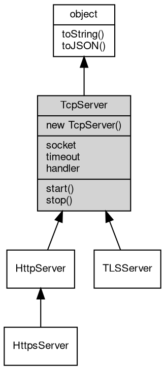

# 对象 TcpServer
TcpServer` 是高并发的 TCP [Socket](Socket.md) 服务器，可以用来创建一个初始状态下已经与客户端建立了 TCP 连接的 TCP 服务器

使用 `TcpServer` 对象可以迅速创建一个多纤程并发处理的 TCP 服务器。当有客户端连接到这个监听的地址时，回调函数会被调用并返回一个新的被连接的 `Socket` 对象，我们可以使用这个对象来往客户端发送或接收 TCP 报文。

下面是一个基于 `TcpServer` 对象来实现的回写客户端 TCP 报文的具体示例：

```JavaScript
const net = require("net");

function onConnect(conn) {
    console.log(`new client accepted! local:${conn.localAddress}, remote:${conn.remoteAddress}`);
    const data = conn.read();
    if (data) {
        console.log(`recv data on fn onConnect: ${data}`);
        conn.write(data);
    }
    conn.close();
}

new net.TcpServer('0.0.0.0', 8080, onConnect).start();
console.log('server is running on port: 8080');
```

在上述代码中，我们创建了一个 `TcpServer` 对象并通过回调函数 `onConnect` 来处理接收到的客户端请求信息，将其中的数据回写到客户端。

当启动这个服务时，它将监听 `8080` 端口上面的所有 IP 地址和请求，当你通过 `telnet` 或者其他客户端工具连接到该服务时，你将会看到服务打印连接信息，并将你发送来的每一条请求原样发送回去。

## 继承关系


## 构造函数
        
### TcpServer
**TcpServer 构造函数，在所有本机地址侦听**

```JavaScript
new TcpServer(Integer port,
    Handler listener);
```

调用参数:
* port: Integer, 指定 tcp 服务器侦听端口
* listener: [Handler](Handler.md), 指定 tcp 接收到的内置消息处理器，处理函数，链式处理数组，路由对象，详见 [mq.Handler](../../module/ifs/mq.md#Handler)

--------------------------
**TcpServer 构造函数**

```JavaScript
new TcpServer(String addr,
    Integer port,
    Handler listener);
```

调用参数:
* addr: String, 指定 tcp 服务器侦听地址，为 "" 则在本机所有地址侦听
* port: Integer, 指定 tcp 服务器侦听端口
* listener: [Handler](Handler.md), 指定 tcp 接收到的连接的内置消息处理器，处理函数，链式处理数组，路由对象，详见 [mq.Handler](../../module/ifs/mq.md#Handler)

--------------------------
**TcpServer 构造函数**

```JavaScript
new TcpServer(String addr,
    Handler listener);
```

调用参数:
* addr: String, 指定 unix socket 或者 Windows pipe 服务器侦听地址
* listener: [Handler](Handler.md), 指定 tcp 接收到的连接的内置消息处理器，处理函数，链式处理数组，路由对象，详见 [mq.Handler](../../module/ifs/mq.md#Handler)

## 成员属性
        
### socket
**[Socket](Socket.md), 服务器当前侦听的 [Socket](Socket.md) 对象**

```JavaScript
readonly Socket TcpServer.socket;
```

--------------------------
### timeout
**Integer, 查询和设置超时时间，单位毫秒，此超时时间用于设置接收到的新连接**

```JavaScript
Integer TcpServer.timeout;
```

--------------------------
### handler
**[Handler](Handler.md), 服务器当前事件处理接口对象**

```JavaScript
Handler TcpServer.handler;
```

## 成员函数
        
### start
**启动当前服务器**

```JavaScript
TcpServer.start();
```

--------------------------
### stop
**关闭 socket中止正在运行的服务器**

```JavaScript
TcpServer.stop() async;
```

--------------------------
### toString
**返回对象的字符串表示，一般返回 "[Native Object]"，对象可以根据自己的特性重新实现**

```JavaScript
String TcpServer.toString();
```

返回结果:
* String, 返回对象的字符串表示

--------------------------
### toJSON
**返回对象的 JSON 格式表示，一般返回对象定义的可读属性集合**

```JavaScript
Value TcpServer.toJSON(String key = "");
```

调用参数:
* key: String, 未使用

返回结果:
* Value, 返回包含可 JSON 序列化的值

