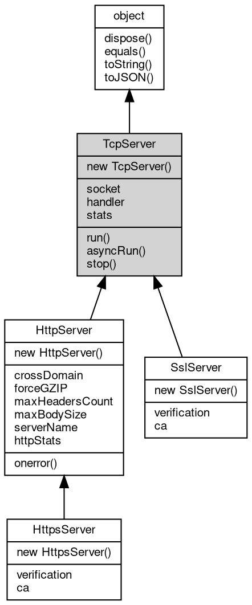

# 对象 TcpServer
tcp 服务器对象，可方便创建一个标准多纤程 tcp 服务器

使用 TcpServer 对象可以迅速创建一个多纤程并发处理的 tcp 服务器。

```JavaScript
function func(conn) {
    var data;

    while (data = conn.read())
        conn.write(data);

    conn.close();
}

new net.TcpServer(8080, func).run();
```

## 继承关系


## 构造函数
        
### TcpServer
**TcpServer 构造函数，在所有本机地址侦听**

```JavaScript
new TcpServer(Integer port,
    Handler listener);
```

调用参数:
* port: Integer, 指定 tcp 服务器侦听端口
* listener: [Handler](Handler.md), 指定 tcp 接收到的内置消息处理器，处理函数，链式处理数组，路由对象，详见 [mq.Handler](../../module/ifs/mq.md#Handler)

--------------------------
**TcpServer 构造函数**

```JavaScript
new TcpServer(String addr,
    Integer port,
    Handler listener);
```

调用参数:
* addr: String, 指定 tcp 服务器侦听地址，为 "" 则在本机所有地址侦听
* port: Integer, 指定 tcp 服务器侦听端口
* listener: [Handler](Handler.md), 指定 tcp 接收到的连接的内置消息处理器，处理函数，链式处理数组，路由对象，详见 [mq.Handler](../../module/ifs/mq.md#Handler)

## 成员属性
        
### socket
**[Socket](Socket.md), 服务器当前侦听的 [Socket](Socket.md) 对象**

```JavaScript
readonly Socket TcpServer.socket;
```

--------------------------
### handler
**[Handler](Handler.md), 服务器当前事件处理接口对象**

```JavaScript
Handler TcpServer.handler;
```

--------------------------
### stats
**[Stats](Stats.md), 查询当前服务器运行状态**

```JavaScript
readonly Stats TcpServer.stats;
```

返回的结果为一个 [Stats](Stats.md) 对象，初始化计数器如下：

```JavaScript
{
    total: 1000, // 总计处理的连接
    connections: 100, // 当前正在处理的连接
    accept: 10, // 上次查询后新建的连接
    close: 10 // 上次查询后关闭的连接
}
```

## 成员函数
        
### run
**运行服务器并开始接收和分发连接，此函数不会返回**

```JavaScript
TcpServer.run() async;
```

--------------------------
### asyncRun
**异步运行服务器并开始接收和分发连接，调用后立即返回，服务器在后台运行**

```JavaScript
TcpServer.asyncRun();
```

--------------------------
### stop
**关闭 socket中止正在运行的服务器**

```JavaScript
TcpServer.stop() async;
```

--------------------------
### dispose
**强制回收对象，调用此方法后，对象资源将立即释放**

```JavaScript
TcpServer.dispose();
```

--------------------------
### equals
**比较当前对象与给定的对象是否相等**

```JavaScript
Boolean TcpServer.equals(object expected);
```

调用参数:
* expected: [object](object.md), 制定比较的目标对象

返回结果:
* Boolean, 返回对象比较的结果

--------------------------
### toString
**返回对象的字符串表示，一般返回 "[Native Object]"，对象可以根据自己的特性重新实现**

```JavaScript
String TcpServer.toString();
```

返回结果:
* String, 返回对象的字符串表示

--------------------------
### toJSON
**返回对象的 JSON 格式表示，一般返回对象定义的可读属性集合**

```JavaScript
Value TcpServer.toJSON(String key = "");
```

调用参数:
* key: String, 未使用

返回结果:
* Value, 返回包含可 JSON 序列化的值

