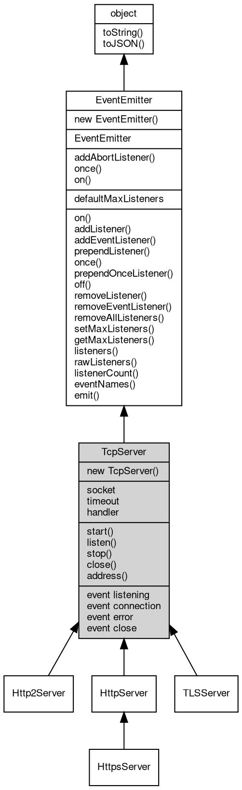

# 对象 TcpServer
TcpServer` 是高并发的 TCP [Socket](Socket.md) 服务器，可以用来创建一个初始状态下已经与客户端建立了 TCP 连接的 TCP 服务器

使用 `TcpServer` 对象可以迅速创建一个多纤程并发处理的 TCP 服务器。当有客户端连接到这个监听的地址时，回调函数会被调用并返回一个新的被连接的 `Socket` 对象，我们可以使用这个对象来往客户端发送或接收 TCP 报文。

下面是一个基于 `TcpServer` 对象来实现的回写客户端 TCP 报文的具体示例：

```JavaScript
const net = require("net");

function onConnect(conn) {
    console.log(`new client accepted! local:${conn.localAddress}, remote:${conn.remoteAddress}`);
    const data = conn.read();
    if (data) {
        console.log(`recv data on fn onConnect: ${data}`);
        conn.write(data);
    }
    conn.close();
}

new net.TcpServer('0.0.0.0', 8080, onConnect).start();
console.log('server is running on port: 8080');
```

在上述代码中，我们创建了一个 `TcpServer` 对象并通过回调函数 `onConnect` 来处理接收到的客户端请求信息，将其中的数据回写到客户端。

当启动这个服务时，它将监听 `8080` 端口上面的所有 IP 地址和请求，当你通过 `telnet` 或者其他客户端工具连接到该服务时，你将会看到服务打印连接信息，并将你发送来的每一条请求原样发送回去。

## 继承关系

```dot
digraph {
    node [fontname="Helvetica,sans-Serif", fontsize=10, shape="record", style="filled", fillcolor="white"];

    object [tooltip="object", URL="object.md", label="{object|toString()\ltoJSON()\l}"];
    EventEmitter [tooltip="EventEmitter", URL="EventEmitter.md", label="{EventEmitter|new EventEmitter()\l|EventEmitter\l|addAbortListener()\lonce()\lon()\l|defaultMaxListeners\l|on()\laddListener()\laddEventListener()\lprependListener()\lonce()\lprependOnceListener()\loff()\lremoveListener()\lremoveEventListener()\lremoveAllListeners()\lsetMaxListeners()\lgetMaxListeners()\llisteners()\lrawListeners()\llistenerCount()\leventNames()\lemit()\l}"];
    TcpServer [tooltip="TcpServer", fillcolor="lightgray", id="me", label="{TcpServer|new TcpServer()\l|socket\ltimeout\lhandler\l|start()\llisten()\lstop()\lclose()\laddress()\l|event listening\levent connection\levent error\levent close\l}"];
    Http2Server [tooltip="Http2Server", URL="Http2Server.md", label="{Http2Server}"];
    HttpServer [tooltip="HttpServer", URL="HttpServer.md", label="{HttpServer}"];
    HttpsServer [tooltip="HttpsServer", URL="HttpsServer.md", label="{HttpsServer}"];
    TLSServer [tooltip="TLSServer", URL="TLSServer.md", label="{TLSServer}"];

    object -> EventEmitter [dir=back];
    EventEmitter -> TcpServer [dir=back];
    TcpServer -> Http2Server [dir=back];
    TcpServer -> HttpServer [dir=back];
    HttpServer -> HttpsServer [dir=back];
    TcpServer -> TLSServer [dir=back];
}
```

## 构造函数
        
### TcpServer
**TcpServer 构造函数，在所有本机地址侦听**

```JavaScript
new TcpServer(Integer port,
    Handler listener);
```

调用参数:
* port: Integer, 指定 tcp 服务器侦听端口
* listener: [Handler](Handler.md), 指定 tcp 接收到的内置消息处理器，处理函数，链式处理数组，路由对象，详见 [mq.Handler](../../module/ifs/mq.md#Handler)

--------------------------
**TcpServer 构造函数**

```JavaScript
new TcpServer(String addr,
    Integer port,
    Handler listener);
```

调用参数:
* addr: String, 指定 tcp 服务器侦听地址，为 "" 则在本机所有地址侦听
* port: Integer, 指定 tcp 服务器侦听端口
* listener: [Handler](Handler.md), 指定 tcp 接收到的连接的内置消息处理器，处理函数，链式处理数组，路由对象，详见 [mq.Handler](../../module/ifs/mq.md#Handler)

--------------------------
**TcpServer 构造函数**

```JavaScript
new TcpServer(Object options,
    Handler listener);
```

调用参数:
* options: Object, 服务器选项
* listener: [Handler](Handler.md), 指定 tcp 接收到的连接的内置消息处理器，处理函数，链式处理数组，路由对象，详见 [mq.Handler](../../module/ifs/mq.md#Handler)

 options 支持以下属性：
 - address: 指定监听的地址，可选，默认在所有地址监听
 - port: 指定监听的端口，可选，不提供时需调用 listen() 启动

--------------------------
**TcpServer 构造函数**

```JavaScript
new TcpServer(String addr,
    Handler listener);
```

调用参数:
* addr: String, 指定 unix socket 或者 Windows pipe 服务器侦听地址
* listener: [Handler](Handler.md), 指定 tcp 接收到的连接的内置消息处理器，处理函数，链式处理数组，路由对象，详见 [mq.Handler](../../module/ifs/mq.md#Handler)

--------------------------
**TcpServer 构造函数，不绑定端口，需调用 listen() 启动**

```JavaScript
new TcpServer(Handler listener);
```

调用参数:
* listener: [Handler](Handler.md), 指定 tcp 接收到的连接的内置消息处理器，处理函数，链式处理数组，路由对象，详见 [mq.Handler](../../module/ifs/mq.md#Handler)

## 静态函数
        
### addAbortListener
**监听一个 [AbortSignal](AbortSignal.md) 的 abort 事件，返回一个可释放的对象**

```JavaScript
static Object TcpServer.addAbortListener(EventEmitter signal,
    Function func);
```

调用参数:
* signal: [EventEmitter](EventEmitter.md), 要监听的 [AbortSignal](AbortSignal.md) 对象
* func: Function, abort 事件的处理函数

返回结果:
* Object, 返回一个包含 `[Symbol.dispose]` 方法的 Disposable 对象

返回的对象包含 `[Symbol.dispose]()` 方法，调用后将移除监听器。如果信号已中止，则监听器会被立即调用。

--------------------------
### once
**创建一个 Promise，等待指定事件触发一次后解析**

```JavaScript
static Object TcpServer.once(EventEmitter emitter,
    Value ev,
    Object options = {});
```

调用参数:
* emitter: [EventEmitter](EventEmitter.md), 要监听的事件触发器对象
* ev: Value, 指定事件的名称
* options: Object, 可选参数对象

返回结果:
* Object, 返回 Promise，以事件参数数组解析

返回一个 Promise，当目标事件触发时以事件参数数组解析。如果在此期间触发 'error' 事件（且监听的不是 'error' 事件本身），Promise 将被拒绝。

options 参数可包含：
- signal: [AbortSignal](AbortSignal.md)，用于取消等待

--------------------------
### on
**创建一个异步迭代器，持续监听指定事件**

```JavaScript
static Object TcpServer.on(EventEmitter emitter,
    Value ev,
    Object options = {});
```

调用参数:
* emitter: [EventEmitter](EventEmitter.md), 要监听的事件触发器对象
* ev: Value, 指定事件的名称
* options: Object, 可选参数对象

返回结果:
* Object, 返回 AsyncIterator 对象

返回一个 AsyncIterator，每次事件触发时产出事件参数数组。如果触发 'error' 事件，迭代器将抛出错误。

options 参数可包含：
- signal: [AbortSignal](AbortSignal.md)，用于取消迭代
- close: 字符串数组，指定结束迭代的事件名称

## 静态属性
        
### defaultMaxListeners
**Integer, 默认全局最大监听器数**

```JavaScript
static Integer TcpServer.defaultMaxListeners;
```

## 成员属性
        
### socket
**[Socket](Socket.md), 服务器当前侦听的 [Socket](Socket.md) 对象**

```JavaScript
readonly Socket TcpServer.socket;
```

--------------------------
### timeout
**Integer, 查询和设置超时时间，单位毫秒，此超时时间用于设置接收到的新连接**

```JavaScript
Integer TcpServer.timeout;
```

--------------------------
### handler
**[Handler](Handler.md), 服务器当前事件处理接口对象**

```JavaScript
Handler TcpServer.handler;
```

## 成员函数
        
### start
**启动当前服务器**

```JavaScript
TcpServer.start();
```

--------------------------
### listen
**绑定地址和端口并开始侦听连接**

```JavaScript
TcpServer.listen(Integer port,
    String addr = "",
    Integer backlog = -1) async;
```

调用参数:
* port: Integer, 指定 TCP 服务器侦听端口
* addr: String, 指定 TCP 服务器侦听地址，"" 表示侦听本机所有地址
* backlog: Integer, 指定连接队列的最大长度，-1 表示使用系统默认值

--------------------------
### stop
**关闭 socket中止正在运行的服务器**

```JavaScript
TcpServer.stop() async;
```

--------------------------
### close
**关闭 socket中止正在运行的服务器，stop() 的别名**

```JavaScript
TcpServer.close() async;
```

--------------------------
### address
**返回一个包含服务器绑定地址、地址族和端口的对象。用于获取操作系统分配的地址时查找实际端口。**

```JavaScript
(String address, String family, Integer port) TcpServer.address();
```

返回结果:
* (String address, String family, Integer port), 返回服务器绑定的地址、地址族和端口

--------------------------
### on
**绑定一个事件处理函数到对象**

```JavaScript
Object TcpServer.on(Value ev,
    Function func);
```

调用参数:
* ev: Value, 指定事件的名称
* func: Function, 指定事件处理函数

返回结果:
* Object, 返回事件对象本身，便于链式调用

--------------------------
**绑定一个事件处理函数到对象**

```JavaScript
Object TcpServer.on(Object map);
```

调用参数:
* map: Object, 指定事件映射关系，对象属性名称将作为事件名称，属性的值将作为事件处理函数

返回结果:
* Object, 返回事件对象本身，便于链式调用

--------------------------
### addListener
**绑定一个事件处理函数到对象**

```JavaScript
Object TcpServer.addListener(Value ev,
    Function func);
```

调用参数:
* ev: Value, 指定事件的名称
* func: Function, 指定事件处理函数

返回结果:
* Object, 返回事件对象本身，便于链式调用

--------------------------
**绑定一个事件处理函数到对象**

```JavaScript
Object TcpServer.addListener(Object map);
```

调用参数:
* map: Object, 指定事件映射关系，对象属性名称将作为事件名称，属性的值将作为事件处理函数

返回结果:
* Object, 返回事件对象本身，便于链式调用

--------------------------
### addEventListener
**绑定一个事件处理函数到对象**

```JavaScript
Object TcpServer.addEventListener(Value ev,
    Function func,
    Object options = {});
```

调用参数:
* ev: Value, 指定事件的名称
* func: Function, 指定事件处理函数
* options: Object, 指定事件处理函数的选项

返回结果:
* Object, 返回事件对象本身，便于链式调用

options 参数是一个对象，它可以包含以下属性：
- once: 如果为 true，则事件处理函数只会触发一次，触发后会被移除

--------------------------
### prependListener
**绑定一个事件处理函数到对象起始**

```JavaScript
Object TcpServer.prependListener(Value ev,
    Function func);
```

调用参数:
* ev: Value, 指定事件的名称
* func: Function, 指定事件处理函数

返回结果:
* Object, 返回事件对象本身，便于链式调用

--------------------------
**绑定一个事件处理函数到对象起始**

```JavaScript
Object TcpServer.prependListener(Object map);
```

调用参数:
* map: Object, 指定事件映射关系，对象属性名称将作为事件名称，属性的值将作为事件处理函数

返回结果:
* Object, 返回事件对象本身，便于链式调用

--------------------------
### once
**绑定一个一次性事件处理函数到对象，一次性处理函数只会触发一次**

```JavaScript
Object TcpServer.once(Value ev,
    Function func);
```

调用参数:
* ev: Value, 指定事件的名称
* func: Function, 指定事件处理函数

返回结果:
* Object, 返回事件对象本身，便于链式调用

--------------------------
**绑定一个一次性事件处理函数到对象，一次性处理函数只会触发一次**

```JavaScript
Object TcpServer.once(Object map);
```

调用参数:
* map: Object, 指定事件映射关系，对象属性名称将作为事件名称，属性的值将作为事件处理函数

返回结果:
* Object, 返回事件对象本身，便于链式调用

--------------------------
### prependOnceListener
**绑定一个事件处理函数到对象起始**

```JavaScript
Object TcpServer.prependOnceListener(Value ev,
    Function func);
```

调用参数:
* ev: Value, 指定事件的名称
* func: Function, 指定事件处理函数

返回结果:
* Object, 返回事件对象本身，便于链式调用

--------------------------
**绑定一个事件处理函数到对象起始**

```JavaScript
Object TcpServer.prependOnceListener(Object map);
```

调用参数:
* map: Object, 指定事件映射关系，对象属性名称将作为事件名称，属性的值将作为事件处理函数

返回结果:
* Object, 返回事件对象本身，便于链式调用

--------------------------
### off
**从对象处理队列中取消指定函数**

```JavaScript
Object TcpServer.off(Value ev,
    Function func);
```

调用参数:
* ev: Value, 指定事件的名称
* func: Function, 指定事件处理函数

返回结果:
* Object, 返回事件对象本身，便于链式调用

--------------------------
**取消对象处理队列中的全部函数**

```JavaScript
Object TcpServer.off(Value ev);
```

调用参数:
* ev: Value, 指定事件的名称

返回结果:
* Object, 返回事件对象本身，便于链式调用

--------------------------
**从对象处理队列中取消指定函数**

```JavaScript
Object TcpServer.off(Object map);
```

调用参数:
* map: Object, 指定事件映射关系，对象属性名称作为事件名称，属性的值作为事件处理函数

返回结果:
* Object, 返回事件对象本身，便于链式调用

--------------------------
### removeListener
**从对象处理队列中取消指定函数**

```JavaScript
Object TcpServer.removeListener(Value ev,
    Function func);
```

调用参数:
* ev: Value, 指定事件的名称
* func: Function, 指定事件处理函数

返回结果:
* Object, 返回事件对象本身，便于链式调用

--------------------------
**取消对象处理队列中的全部函数**

```JavaScript
Object TcpServer.removeListener(Value ev);
```

调用参数:
* ev: Value, 指定事件的名称

返回结果:
* Object, 返回事件对象本身，便于链式调用

--------------------------
**从对象处理队列中取消指定函数**

```JavaScript
Object TcpServer.removeListener(Object map);
```

调用参数:
* map: Object, 指定事件映射关系，对象属性名称作为事件名称，属性的值作为事件处理函数

返回结果:
* Object, 返回事件对象本身，便于链式调用

--------------------------
### removeEventListener
**从对象处理队列中取消指定函数**

```JavaScript
Object TcpServer.removeEventListener(Value ev,
    Function func,
    Object options = {});
```

调用参数:
* ev: Value, 指定事件的名称
* func: Function, 指定事件处理函数
* options: Object, 指定事件处理函数的选项

返回结果:
* Object, 返回事件对象本身，便于链式调用

--------------------------
### removeAllListeners
**从对象处理队列中取消所有事件的所有监听器， 如果指定事件，则移除指定事件的所有监听器。**

```JavaScript
Object TcpServer.removeAllListeners(Value ev);
```

调用参数:
* ev: Value, 指定事件的名称

返回结果:
* Object, 返回事件对象本身，便于链式调用

--------------------------
**从对象处理队列中取消所有事件的所有监听器， 如果指定事件，则移除指定事件的所有监听器。**

```JavaScript
Object TcpServer.removeAllListeners(Array evs = []);
```

调用参数:
* evs: Array, 指定事件的名称

返回结果:
* Object, 返回事件对象本身，便于链式调用

--------------------------
### setMaxListeners
**监听器的默认限制的数量，仅用于兼容**

```JavaScript
TcpServer.setMaxListeners(Integer n);
```

调用参数:
* n: Integer, 指定事件的数量

--------------------------
### getMaxListeners
**获取监听器的默认限制的数量，仅用于兼容**

```JavaScript
Integer TcpServer.getMaxListeners();
```

返回结果:
* Integer, 返回默认限制数量

--------------------------
### listeners
**查询对象指定事件的监听器数组**

```JavaScript
Array TcpServer.listeners(Value ev);
```

调用参数:
* ev: Value, 指定事件的名称

返回结果:
* Array, 返回指定事件的监听器数组

--------------------------
### rawListeners
**查询对象指定事件的监听器数组，包含 once 包装函数**

```JavaScript
Array TcpServer.rawListeners(Value ev);
```

调用参数:
* ev: Value, 指定事件的名称

返回结果:
* Array, 返回指定事件的监听器数组

--------------------------
### listenerCount
**查询对象指定事件的监听器数量**

```JavaScript
Integer TcpServer.listenerCount(Value ev);
```

调用参数:
* ev: Value, 指定事件的名称

返回结果:
* Integer, 返回指定事件的监听器数量

--------------------------
**查询对象指定事件的监听器数量**

```JavaScript
Integer TcpServer.listenerCount(Value o,
    Value ev);
```

调用参数:
* o: Value, 指定查询的对象
* ev: Value, 指定事件的名称

返回结果:
* Integer, 返回指定事件的监听器数量

--------------------------
### eventNames
**查询监听器事件名称**

```JavaScript
Array TcpServer.eventNames();
```

返回结果:
* Array, 返回事件名称数组

--------------------------
### emit
**主动触发一个事件**

```JavaScript
Boolean TcpServer.emit(Value ev,
    ...args);
```

调用参数:
* ev: Value, 事件名称
* args: ..., 事件参数，将会传递给事件处理函数

返回结果:
* Boolean, 返回事件触发状态，有响应事件返回 true，否则返回 false

--------------------------
### toString
**返回对象的字符串表示，一般返回 "[Native Object]"，对象可以根据自己的特性重新实现**

```JavaScript
String TcpServer.toString();
```

返回结果:
* String, 返回对象的字符串表示

--------------------------
### toJSON
**返回对象的 JSON 格式表示，一般返回对象定义的可读属性集合**

```JavaScript
Value TcpServer.toJSON(String key = "");
```

调用参数:
* key: String, 未使用

返回结果:
* Value, 返回包含可 JSON 序列化的值

## 事件
        
### listening
**调用 start() 并完成绑定后触发**

```JavaScript
event TcpServer.listening();
```

--------------------------
### connection
**建立新 TCP 连接时触发**

```JavaScript
event TcpServer.connection(Socket socket);
```

调用参数:
* socket: [Socket](Socket.md), 新建立的 [Socket](Socket.md) 连接对象

--------------------------
### error
**发生错误时触发**

```JavaScript
event TcpServer.error();
```

--------------------------
### close
**服务器关闭后触发**

```JavaScript
event TcpServer.close();
```

