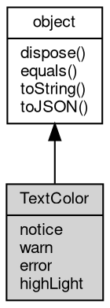

# 对象 TextColor
终端输出颜色配置对象

## 继承关系


## 成员属性
        
### notice
**String, 指定 [console.notice](../../module/ifs/console.md#notice) 颜色**

```JavaScript
String TextColor.notice;
```

--------------------------
### warn
**String, 指定 [console.warn](../../module/ifs/console.md#warn) 颜色**

```JavaScript
String TextColor.warn;
```

--------------------------
### error
**String, 指定 [console.error](../../module/ifs/console.md#error) 颜色**

```JavaScript
String TextColor.error;
```

--------------------------
### highLight
**String, 指定 highLight 颜色**

```JavaScript
String TextColor.highLight;
```

## 成员函数
        
### dispose
**强制回收对象，调用此方法后，对象资源将立即释放**

```JavaScript
TextColor.dispose();
```

--------------------------
### equals
**比较当前对象与给定的对象是否相等**

```JavaScript
Boolean TextColor.equals(object expected);
```

调用参数:
* expected: [object](object.md), 制定比较的目标对象

返回结果:
* Boolean, 返回对象比较的结果

--------------------------
### toString
**返回对象的字符串表示，一般返回 "[Native Object]"，对象可以根据自己的特性重新实现**

```JavaScript
String TextColor.toString();
```

返回结果:
* String, 返回对象的字符串表示

--------------------------
### toJSON
**返回对象的 JSON 格式表示，一般返回对象定义的可读属性集合**

```JavaScript
Value TextColor.toJSON(String key = "");
```

调用参数:
* key: String, 未使用

返回结果:
* Value, 返回包含可 JSON 序列化的值

