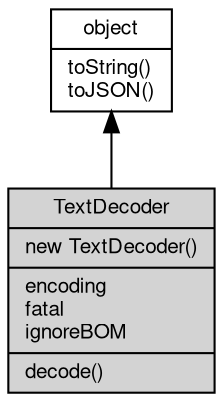

# Object TextDecoder
Decodes bytes into JavaScript strings, the Web TextDecoder API of fibjs

TextDecoder is available both as the [global](../../module/ifs/global.md) TextDecoder and as [util.TextDecoder](../../module/ifs/util.md#TextDecoder) (the same
class). It converts a byte sequence of a selected character [encoding](../../module/ifs/encoding.md) into a string, with an
optional streaming mode for data that arrives in chunks and with configurable error
handling. Use [TextEncoder](TextEncoder.md) for the reverse direction.

The decoder supports the WHATWG labels (utf-8, utf-16le/be, gbk, big5, euc-jp, euc-kr,
shift_jis, iso-2022-jp, windows-125x, iso-8859-x, ...) and falls back to any ICU charset
name, so legacy encodings can be decoded as easily as utf-8.

Concepts:

- **fatal and ignoreBOM**: fatal=false (default) replaces an invalid sequence with the
  replacement character U+FFFD; fatal=true throws `TypeError: The encoded data was not
  valid.` (a plain TypeError without an error code). ignoreBOM=false (default) strips one
  leading byte order mark; ignoreBOM=true keeps it as the first character U+FEFF.
- **Streaming**: decode(chunk, { stream: true }) holds back the trailing bytes of an
  incomplete character and returns only complete characters; decode(chunk) or decode() ends
  the stream, flushes the held bytes and resets the decoder, so a fresh decoder is needed
  for each independent stream.
- **Input**: a [Buffer](Buffer.md), string, [Blob](Blob.md), TypedArray or ArrayBuffer. A string argument is first
  encoded as utf-8 bytes and then decoded with the selected codec, so passing a string to a
  non-utf-8 decoder transcodes it.
- **Constructor errors**: an unknown label throws `RangeError [20004]
  ERR_ENCODING_NOT_SUPPORTED`.

Obtained from:
- `new TextDecoder()` / `new TextDecoder(codec[, opts])` — the constructor, as the [global](../../module/ifs/global.md)
  TextDecoder or as `require('[util](../../module/ifs/util.md)').TextDecoder`.

Example 1 — decode utf-8 bytes and read the resolved label:

```JavaScript
const decoder = new TextDecoder('utf8');

console.log(decoder.encoding); // utf-8
console.log(decoder.decode(Buffer.from('héllo'))); // héllo
console.log(decoder.decode(new Uint8Array([0x41]))); // A
```

Example 2 — decode a character split across two chunks:

```JavaScript
const decoder = new TextDecoder('utf-8');
const bytes = Buffer.from('中文');

const first = decoder.decode(bytes.slice(0, 2), {
    stream: true
});
const second = decoder.decode(bytes.slice(2));
console.log(JSON.stringify(first)); // "" (the character is incomplete)
console.log(second); // 中文
console.log(decoder.decode(bytes)); // 中文 (the stream was reset)
```

Example 3 — fatal and ignoreBOM options:

```JavaScript
const strict = new TextDecoder('utf-8', {
    fatal: true
});
const lenient = new TextDecoder('utf-8');
const withBOM = new TextDecoder('utf-8', {
    ignoreBOM: true
});

try {
    strict.decode(Buffer.from([0xff]));
} catch (e) {
    console.log(e.name);
} // TypeError
console.log(JSON.stringify(lenient.decode(Buffer.from([0xff])))); // "�"
const bom = Buffer.from([0xef, 0xbb, 0xbf, 0x41]);
console.log(JSON.stringify(new TextDecoder().decode(bom))); // "A"
console.log(Buffer.from(withBOM.decode(bom), 'utf8').toString('hex')); // efbbbf41
```

## Inheritance


## Constructors
        
### TextDecoder
**Creates a decoder for a character [encoding](../../module/ifs/encoding.md)**

```JavaScript
new TextDecoder(String codec = "utf8",
    Object opts = {});
```

Parameters:
* codec: String, the [encoding](../../module/ifs/encoding.md) label, default "utf8"
* opts: Object, optional decoder options

codec is a WHATWG label (utf8, gbk, latin1, utf-16be, ...) or any ICU charset name and
defaults to utf8. The label is resolved to its canonical name, exposed by the [encoding](../../module/ifs/encoding.md)
property; an unknown label throws `RangeError [20004] ERR_ENCODING_NOT_SUPPORTED`.

opts supports the following options:

```JavaScript
// fragment: options
({
    "fatal": false, // true: throw TypeError on invalid input; false: use U+FFFD
    "ignoreBOM": false // true: keep a leading BOM as U+FEFF; false: strip it
})
```

Unknown properties are ignored; a non-[object](object.md) opts (a number or a string) throws TypeError
20005.

Example — a strict decoder:

```JavaScript
const decoder = new TextDecoder('utf-8', {
    fatal: true
});

console.log(decoder.fatal, decoder.ignoreBOM); // true false
try {
    decoder.decode(Buffer.from([0xff]));
} catch (e) {
    console.log(e.name);
} // TypeError
```

## Properties
        
### encoding
**String, The resolved [encoding](../../module/ifs/encoding.md) name of the decoder, read-only**

```JavaScript
readonly String TextDecoder.encoding;
```

The WHATWG canonical name of the constructor label: "utf-8" for utf8, "windows-1252"
for latin1, "gbk", "utf-16le", ... For labels outside the WHATWG list the lowercased ICU
name is exposed. The value is fixed at construction.

--------------------------
### fatal
**Boolean, Whether invalid input throws instead of producing U+FFFD, read-only**

```JavaScript
readonly Boolean TextDecoder.fatal;
```

Set from the `fatal` option at construction, default false. With fatal=true an invalid
byte sequence makes decode() throw `TypeError: The encoded data was not valid.` (a plain
TypeError without an error code); with fatal=false the invalid bytes become U+FFFD and
decoding continues.

--------------------------
### ignoreBOM
**Boolean, Whether a leading byte order mark is kept in the output, read-only**

```JavaScript
readonly Boolean TextDecoder.ignoreBOM;
```

Set from the `ignoreBOM` option at construction, default false. With the default the
decoder removes one leading BOM (U+FEFF) from the first chunk of a stream; with
ignoreBOM=true the BOM stays in the returned string, which is what the Web standard calls
ignoring the BOM.

## Methods
        
### decode
**Decodes bytes or a string into text**

```JavaScript
String TextDecoder.decode(Buffer | String data,
    Object opts = {});
```

Parameters:
* data: [Buffer](Buffer.md) | String, the bytes to decode: a [Buffer](Buffer.md), string, [Blob](Blob.md), TypedArray or ArrayBuffer
* opts: Object, optional decode options

Returns:
* String, the decoded text

data may be a [Buffer](Buffer.md), a string, a [Blob](Blob.md), a TypedArray or an ArrayBuffer; a string is
encoded as utf-8 bytes first and then decoded with the selected codec. opts supports one
property:

```JavaScript
// fragment: options
({
    "stream": false // true: keep trailing incomplete bytes for the next call
})
```

stream=true returns the characters completed so far and holds back a trailing partial
character, which a later call continues; stream=false (the default) finishes the stream,
replaces an incomplete tail with U+FFFD when fatal is false and resets the decoder.
Calling decode() with no arguments performs the no-data finish of this overload. With
fatal=true an invalid sequence throws `TypeError: The encoded data was not valid.`

Example — decode two chunks of one utf-8 character:

```JavaScript
const decoder = new TextDecoder('utf-8');
const bytes = Buffer.from('中');

console.log(JSON.stringify(decoder.decode(bytes.slice(0, 2), {
    stream: true
}))); // ""
console.log(decoder.decode(bytes.slice(2))); // 中
```

--------------------------
**Finishes a streaming decode and returns the remaining text**

```JavaScript
String TextDecoder.decode();
```

Returns:
* String, the remaining decoded text, or an empty string

The no-argument form is the finish of decode(data, { stream: false }): it returns the
characters completed by the bytes held from previous stream=true calls, replaces an
incomplete trailing character with U+FFFD (or throws TypeError when fatal is true) and
resets the decoder, so the next decode() starts a new stream. On a decoder that was not
used for streaming it returns an empty string.

Example — flush a held partial character:

```JavaScript
const decoder = new TextDecoder('utf-8');
decoder.decode(Buffer.from([0xe4, 0xb8]), {
    stream: true
});

console.log(JSON.stringify(decoder.decode())); // "�"
```

--------------------------
### toString
**Returns the string form of the [object](object.md)**

```JavaScript
String TextDecoder.toString();
```

Returns:
* String, returns the string form of the [object](object.md)

The base implementation reports an error: a native [object](object.md) has no implicit
text form, and only the classes whose value can be written as a string
override the member. [Buffer](Buffer.md) returns its content decoded with the given
[encoding](../../module/ifs/encoding.md), [HttpCookie](HttpCookie.md) returns "name=value", and so on; an override commonly
accepts optional arguments ([Buffer.toString](Buffer.md#toString) takes [encoding](../../module/ifs/encoding.md), start and
end) that are not part of this declaration.

Calling the member on a class that does not override it throws
"<Class>: the [object](object.md) can not be converted to string.", which is the
behavior to rely on when probing whether a value has a string form. See
toJSON for the serialization hook.

--------------------------
### toJSON
**Returns the JSON representation of the [object](object.md)**

```JavaScript
Value TextDecoder.toJSON(String key = "");
```

Parameters:
* key: String, the property name of the value being serialized

Returns:
* Value, returns the JSON-serializable value

JSON.stringify(value) calls value.toJSON(key) when the member exists and
serializes the returned value in its place; the key argument carries the
property name of the value inside its parent [object](object.md) (an empty string at
the top level) and may be used to build a keyed form. The base
implementation returns a plain [object](object.md) holding the readable properties of
the instance, so a native [object](object.md) serializes without per-class code; a
class with a portable shape such as [Buffer](Buffer.md) overrides it, and a JavaScript
class may override it in the same way.

The member is normally reached through JSON.stringify rather than called
directly; calling it returns the same value JSON.stringify would
serialize.

