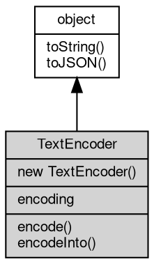

# Object TextEncoder
Encodes JavaScript strings into bytes, the Web TextEncoder API of fibjs

TextEncoder is available both as the [global](../../module/ifs/global.md) TextEncoder and as [util.TextEncoder](../../module/ifs/util.md#TextEncoder) (the same
class). It converts a string into a byte sequence of a selected character [encoding](../../module/ifs/encoding.md) and
returns a [Buffer](Buffer.md); utf-8, the default, is the only [encoding](../../module/ifs/encoding.md) of the Web standard and is
converted with a direct copy of the internal utf-8 string.

fibjs extension: the constructor also accepts other charset labels (gbk, big5, euc-jp,
utf-16le, windows-125x, ...) and produces bytes in that [encoding](../../module/ifs/encoding.md), while the Web standard and
Node.js ignore the label and always encode utf-8. An unknown label raises `RangeError [20004]
ERR_ENCODING_NOT_SUPPORTED`.

Concepts:

- **Encoding labels**: WHATWG names and labels are resolved to a canonical name (utf8 and
  UTF-8 become utf-8, latin1 becomes windows-1252) with an ICU lookup as fallback for
  charsets outside the WHATWG list. The resolved name is exposed by the [encoding](../../module/ifs/encoding.md) property.
- **Output type**: encode() returns a [Buffer](Buffer.md), a Uint8Array subclass, so the result can be
  used anywhere a BufferSource is expected; Node.js returns a plain Uint8Array.
- **Partial writes**: encodeInto() writes into a caller-provided buffer and reports how much
  of the source (in UTF-16 code units) and how many bytes were written. A character is never
  split, so a small destination stops at the last complete character.
- **Strings**: the input is a fibjs string; undefined and null are treated as an empty
  input, while the Web standard converts them with the USVString rules ("null").

Obtained from:
- `new TextEncoder()` / `new TextEncoder(codec)` — the constructor, as the [global](../../module/ifs/global.md) TextEncoder
  or as `require('[util](../../module/ifs/util.md)').TextEncoder`.

Example 1 — encode utf-8 and inspect the bytes:

```JavaScript
const encoder = new TextEncoder();

console.log(encoder.encoding); // utf-8
const bytes = encoder.encode('héllo');
console.log(bytes.length); // 6 (é is two bytes in utf-8)
console.log(bytes.toString('hex')); // 68c3a96c6c6f
console.log(encoder.encode('').length); // 0
```

Example 2 — write into a destination with encodeInto:

```JavaScript
const encoder = new TextEncoder();
const destination = Buffer.alloc(4);

const result = encoder.encodeInto('héllo', destination);
console.log(result.read, result.written); // 3 4
console.log(destination.toString()); // hél (the bytes that fit)
```

Example 3 — a non-utf-8 codec is a fibjs extension:

```JavaScript
const encoder = new TextEncoder('gbk');
const decoder = new TextDecoder('gbk');

console.log(encoder.encoding); // gbk
console.log(encoder.encode('中文').toString('hex')); // d6d0cec4
console.log(decoder.decode(encoder.encode('中文'))); // 中文
```

## Inheritance


## Constructors
        
### TextEncoder
**Creates an encoder for a character [encoding](../../module/ifs/encoding.md)**

```JavaScript
new TextEncoder(String codec = "utf8",
    Object opts = {});
```

Parameters:
* codec: String, the [encoding](../../module/ifs/encoding.md) label, default "utf8"
* opts: Object, reserved; ignored

codec is a WHATWG label or any ICU charset name; the default utf-8 is the only [encoding](../../module/ifs/encoding.md)
of the Web standard and the others are a fibjs extension. An unknown label, or a label
containing characters outside printable ASCII, throws `RangeError [20004]
ERR_ENCODING_NOT_SUPPORTED`. The opts argument is accepted for signature compatibility
and ignored, because no encoder options are defined.

Example — select a legacy codec:

```JavaScript
const encoder = new TextEncoder('latin1');

console.log(encoder.encoding); // windows-1252 (canonical name)
console.log(encoder.encode('é').toString('hex')); // e9
try {
    new TextEncoder('no-such-codec');
} catch (e) {
    console.log(e.code);
}
// ERR_ENCODING_NOT_SUPPORTED
```

## Properties
        
### encoding
**String, The resolved [encoding](../../module/ifs/encoding.md) name of the encoder, read-only**

```JavaScript
readonly String TextEncoder.encoding;
```

The WHATWG canonical name of the constructor label: "utf-8" by default, "windows-1252"
for latin1, "gbk" for gbk. The value is fixed at construction.

## Methods
        
### encode
**Encodes a string into a [Buffer](Buffer.md)**

```JavaScript
Buffer TextEncoder.encode(String data = "",
    Object opts = {});
```

Parameters:
* data: String, the text to encode, default ""
* opts: Object, reserved; ignored

Returns:
* [Buffer](Buffer.md), the encoded bytes as a [Buffer](Buffer.md)

The text is converted with the [encoding](../../module/ifs/encoding.md) selected at construction; for utf-8 the internal
string is copied straight into the [Buffer](Buffer.md) and other codecs go through the charset
converter. A missing, undefined or null argument, and an empty string, yield a
zero-length [Buffer](Buffer.md). A [Buffer](Buffer.md) argument is accepted through its string form, while a value
without a string form (a number) throws TypeError 20005. The opts argument is accepted
for signature compatibility and ignored.

Example — encode and round trip through [TextDecoder](TextDecoder.md):

```JavaScript
const bytes = new TextEncoder().encode('fibjs');

console.log(Buffer.isBuffer(bytes), bytes.toString()); // true fibjs
console.log(new TextDecoder().decode(bytes)); // fibjs
```

--------------------------
### encodeInto
**Encodes into an existing buffer**

```JavaScript
(Number read, Number written) TextEncoder.encodeInto(String source,
    Buffer destination);
```

Parameters:
* source: String, the text to encode
* destination: [Buffer](Buffer.md), the [Buffer](Buffer.md) receiving the bytes

Returns:
* (Number read, Number written), an [object](object.md) with the `read` (source UTF-16 units) and `written` (bytes) counts

source is encoded into destination, which must be a [Buffer](Buffer.md) or another JS buffer. The
returned [object](object.md) has `read` (UTF-16 code units of source consumed) and `written` (bytes
stored); a character is never split, so the method writes as many complete characters as
fit and stops - with a 4-byte destination, "héllo" reports read 3, written 4 and stores
"hél". An empty destination reports read 0, written 0, and a destination that is not a
buffer throws TypeError 20005.

Example — a character that does not fit is not written:

```JavaScript
const destination = Buffer.alloc(1);
const result = new TextEncoder().encodeInto('中a', destination);

console.log(result.read, result.written); // 0 0 (中 needs 3 bytes)
```

--------------------------
### toString
**Returns the string form of the [object](object.md)**

```JavaScript
String TextEncoder.toString();
```

Returns:
* String, returns the string form of the [object](object.md)

The base implementation reports an error: a native [object](object.md) has no implicit
text form, and only the classes whose value can be written as a string
override the member. [Buffer](Buffer.md) returns its content decoded with the given
[encoding](../../module/ifs/encoding.md), [HttpCookie](HttpCookie.md) returns "name=value", and so on; an override commonly
accepts optional arguments ([Buffer.toString](Buffer.md#toString) takes [encoding](../../module/ifs/encoding.md), start and
end) that are not part of this declaration.

Calling the member on a class that does not override it throws
"<Class>: the [object](object.md) can not be converted to string.", which is the
behavior to rely on when probing whether a value has a string form. See
toJSON for the serialization hook.

--------------------------
### toJSON
**Returns the JSON representation of the [object](object.md)**

```JavaScript
Value TextEncoder.toJSON(String key = "");
```

Parameters:
* key: String, the property name of the value being serialized

Returns:
* Value, returns the JSON-serializable value

JSON.stringify(value) calls value.toJSON(key) when the member exists and
serializes the returned value in its place; the key argument carries the
property name of the value inside its parent [object](object.md) (an empty string at
the top level) and may be used to build a keyed form. The base
implementation returns a plain [object](object.md) holding the readable properties of
the instance, so a native [object](object.md) serializes without per-class code; a
class with a portable shape such as [Buffer](Buffer.md) overrides it, and a JavaScript
class may override it in the same way.

The member is normally reached through JSON.stringify rather than called
directly; calling it returns the same value JSON.stringify would
serialize.

