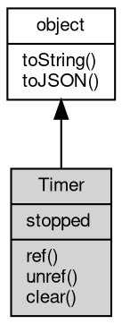

# Object Timer
Timer is the handle returned by every timer scheduling function; it controls the timer lifecycle: keep-alive, cancellation and state

A Timer represents one scheduled callback. The same class is used for a one-time timeout, a
repeating interval, a high-resolution interval and an immediate, and each scheduling function
returns it so the callback can be cancelled or detached from the [process](../../module/ifs/process.md) lifetime.

The callback of a one-time timer runs with `this` set to the Timer [object](object.md), so it can clear
itself, and the `stopped` property reports whether the callback has fired or the timer has
been cleared.

Concepts:

- **Keep-alive**: a pending timer keeps the [process](../../module/ifs/process.md) alive, so a script whose only pending work is
  a timer exits after the timer has fired. `unref` drops that hold without cancelling the timer:
  the callback then runs only when something else keeps the [process](../../module/ifs/process.md) running. `ref` restores the
  default; both return the timer itself, so calls can be chained with the scheduling function.
- **Stopping**: `clear` cancels a pending timer whether it is one-time or repeating. It is
  idempotent and has no effect after the timer has fired; the standalone clear functions of the
  [timers](../../module/ifs/timers.md) [module](../../module/ifs/module.md) are equivalent to it.
- **State**: `stopped` is false while the timer is pending, becomes true when it is cleared or
  after a one-time callback returns, and stays false inside the callback itself while it runs.

Obtained from:
- `setTimeout(callback[, timeout[, ...args]])` — one-time timer;
- `setInterval(callback, timeout[, ...args])` and `setHrInterval(...)` — repeating [timers](../../module/ifs/timers.md);
- `setImmediate(callback[, ...args])` — immediate timer;
- `v8.start(...)` — sampling timer (stop it with `clear()`).

Example 1 — one-time timer lifecycle:

```JavaScript
const timers = require('timers');

const timer = timers.setTimeout(() => console.log('fired'), 10);
console.log(timer.stopped); // false

const canceled = timers.setTimeout(() => console.log('never printed'), 10);
canceled.clear();
console.log(canceled.stopped); // true
```

Example 2 — reference counting with unref and ref:

```JavaScript
const timers = require('timers');

const timer = timers.setTimeout(() => console.log('printed if referenced'), 30);

// unref/ref return the timer itself and can be chained
if (timer.unref().ref() === timer) {
    console.log('still referenced'); // printed
}
timer.unref(); // the process may exit before the callback runs
```

## Inheritance


## Properties
        
### stopped
**Boolean, Queries whether the current timer has been stopped**

```JavaScript
readonly Boolean Timer.stopped;
```

The value is false while the timer is pending. It becomes true after the timer is cleared or,
for a one-time timer, after the callback returns; inside the callback itself it is still false
for a one-time timer and can be set to true by `clear` while a repeating callback is running.
Node.js exposes no equivalent property on `Timeout`/`Immediate`.

## Methods
        
### ref
**Keeps the fibjs [process](../../module/ifs/process.md) alive; prevents the fibjs [process](../../module/ifs/process.md) from exiting during the timer wait**

```JavaScript
Timer Timer.ref();
```

Returns:
* Timer, returns the timer [object](object.md)

A timer keeps the [process](../../module/ifs/process.md) alive by default, so ref is normally needed only after an `unref`
call to restore the default behavior; repeated calls have no additional effect. The method
returns the timer itself, which makes it chainable with the scheduling function (for example
`setTimeout(...).unref()`). Node.js `Timeout#ref` behaves the same way.

--------------------------
### unref
**Allows the fibjs [process](../../module/ifs/process.md) to exit; permits the fibjs [process](../../module/ifs/process.md) to exit during the timer wait**

```JavaScript
Timer Timer.unref();
```

Returns:
* Timer, returns the timer [object](object.md)

The timer is not cancelled: the callback still runs if some other timer, socket or fiber keeps
the [process](../../module/ifs/process.md) alive long enough, but the [process](../../module/ifs/process.md) is allowed to exit while this timer is pending.
Repeated calls have no additional effect, and `ref` undoes it. This is the usual way to let a
periodic maintenance timer run only while the rest of the program is busy.

Example — a periodic timer that does not keep the [process](../../module/ifs/process.md) alive by itself:

```JavaScript
const timers = require('timers');

let n = 0;
const maintenance = timers.setInterval(() => n++, 1000);
maintenance.unref(); // the process exits when nothing else is left
console.log(maintenance.stopped); // false, the timer is still scheduled
```

--------------------------
### clear
**Cancels the current timer**

```JavaScript
Timer.clear();
```

Cancels a pending one-time or repeating timer; the callback will not run and `stopped` becomes
true. It is idempotent, has no effect on a timer that already fired, and is equivalent to the
matching clear function of the [timers](../../module/ifs/timers.md) [module](../../module/ifs/module.md) (`clearTimeout`, `clearInterval`, `clearImmediate`
or `clearHrInterval`), which all accept any Timer [object](object.md).

Example — cancel a pending timer and observe the state:

```JavaScript
const timers = require('timers');

const timer = timers.setTimeout(() => console.log('never printed'), 20);
timer.clear();
console.log(timer.stopped); // true
```

--------------------------
### toString
**Returns the string form of the [object](object.md)**

```JavaScript
String Timer.toString();
```

Returns:
* String, returns the string form of the [object](object.md)

The base implementation reports an error: a native [object](object.md) has no implicit
text form, and only the classes whose value can be written as a string
override the member. [Buffer](Buffer.md) returns its content decoded with the given
[encoding](../../module/ifs/encoding.md), [HttpCookie](HttpCookie.md) returns "name=value", and so on; an override commonly
accepts optional arguments ([Buffer.toString](Buffer.md#toString) takes [encoding](../../module/ifs/encoding.md), start and
end) that are not part of this declaration.

Calling the member on a class that does not override it throws
"<Class>: the [object](object.md) can not be converted to string.", which is the
behavior to rely on when probing whether a value has a string form. See
toJSON for the serialization hook.

--------------------------
### toJSON
**Returns the JSON representation of the [object](object.md)**

```JavaScript
Value Timer.toJSON(String key = "");
```

Parameters:
* key: String, the property name of the value being serialized

Returns:
* Value, returns the JSON-serializable value

JSON.stringify(value) calls value.toJSON(key) when the member exists and
serializes the returned value in its place; the key argument carries the
property name of the value inside its parent [object](object.md) (an empty string at
the top level) and may be used to build a keyed form. The base
implementation returns a plain [object](object.md) holding the readable properties of
the instance, so a native [object](object.md) serializes without per-class code; a
class with a portable shape such as [Buffer](Buffer.md) overrides it, and a JavaScript
class may override it in the same way.

The member is normally reached through JSON.stringify rather than called
directly; calling it returns the same value JSON.stringify would
serialize.

