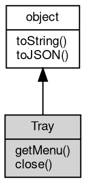

# 对象 Tray
系统状态图标，用于在系统托盘中显示一个图标

## 继承关系


## 成员函数
        
### getMenu
**查询状态图标的菜单**

```JavaScript
Menu Tray.getMenu();
```

返回结果:
* [Menu](Menu.md), 返回状态图标的菜单

--------------------------
### close
**关闭状态图标**

```JavaScript
Tray.close() async;
```

--------------------------
### toString
**返回对象的字符串表示，一般返回 "[Native Object]"，对象可以根据自己的特性重新实现**

```JavaScript
String Tray.toString();
```

返回结果:
* String, 返回对象的字符串表示

--------------------------
### toJSON
**返回对象的 JSON 格式表示，一般返回对象定义的可读属性集合**

```JavaScript
Value Tray.toJSON(String key = "");
```

调用参数:
* key: String, 未使用

返回结果:
* Value, 返回包含可 JSON 序列化的值

