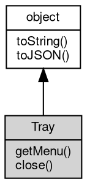

# Object Tray
System tray icon with an optional menu, created by [gui.createTray](../../module/ifs/gui.md#createTray)

A Tray shows an icon in the desktop status area: the notification area on
Windows, the status bar on macOS and the indicator area on Linux. The icon file
is read when the tray is created; the native icon is then created asynchronously
on the GUI thread, so a desktop session is required.

Obtained from:
- `gui.createTray(options)` — the only way to create a tray icon.

Concepts:

- **Icon and text**: `icon` is required and must be a PNG file. `title` and
  `tooltip` are optional and their effect is platform dependent: Linux uses the
  title as the indicator label and the tooltip as its title, macOS shows the
  title next to the icon and the tooltip on hover, and Windows ignores both
  (the icon always carries a fixed tooltip).
- **[Menu](Menu.md)**: the `menu` option accepts a [Menu](Menu.md) [object](object.md) or a template array; the tray
  keeps the resulting [Menu](Menu.md) and `getMenu` returns it (null when no menu was
  given). The menu is attached to the tray and can no longer be edited.
- **Lifetime**: createTray returns as soon as the [object](object.md) exists while the native
  icon is built asynchronously; `close` waits for it and then removes the icon.
  A second close throws "Tray: tray is closed", and after close the [object](object.md)
  cannot be shown again. The tray [object](object.md) does not expose the [EventEmitter](EventEmitter.md)
  interface, so the internal click and close notifications of the native
  implementations cannot be observed from JavaScript.

Example 1 — create a tray icon with a menu (requires a desktop session):

```JavaScript
// requires: long-running
const gui = require('gui');
const path = require('path');

const tray = gui.createTray({
    icon: path.join(__dirname, 'icon.png'),
    title: 'My App',
    tooltip: 'fibjs tray icon',
    menu: [{
            label: 'Show',
            onclick: function() {
                console.log('show');
            }
        },
        {
            type: 'separator'
        },
        {
            label: 'Quit',
            onclick: function() {
                console.log('quit');
            }
        }
    ]
});

console.log(tray.getMenu().length); // 3
tray.close();
```

Example 2 — the menu is optional and the icon can be removed at any time:

```JavaScript
// requires: long-running
const gui = require('gui');
const path = require('path');

const tray = gui.createTray({
    icon: path.join(__dirname, 'icon.png')
});

console.log(tray.getMenu()); // null

tray.close();
console.log('tray removed');
```

## Inheritance

```dot
digraph {
    node [fontname="Helvetica,sans-Serif", fontsize=10, shape="record", style="filled", fillcolor="white"];

    object [tooltip="object", URL="object.md", label="{object|toString()\ltoJSON()\l}"];
    Tray [tooltip="Tray", fillcolor="lightgray", id="me", label="{Tray|getMenu()\lclose()\l}"];

    object -> Tray [dir=back];
}
```

## Methods
        
### getMenu
**Returns the menu of the tray icon, or null when it has none**

```JavaScript
Menu Tray.getMenu();
```

Returns:
* [Menu](Menu.md), returns the menu of the tray icon

The value is the [Menu](Menu.md) [object](object.md) kept by the tray (a template array given in
the `menu` option is converted when the tray is created); the lookup does
not depend on the native icon, so it also works after close. When a menu
was given, `tray.getMenu().length` counts its top-level entries.

Example — read the menu back from a tray (requires a desktop session):

```JavaScript
// requires: long-running
const gui = require('gui');
const path = require('path');

const tray = gui.createTray({
    icon: path.join(__dirname, 'icon.png'),
    menu: [{
        label: 'Quit'
    }]
});

console.log(tray.getMenu().length); // 1
tray.close();
```

--------------------------
### close
**Removes the icon from the status area and releases it**

```JavaScript
Tray.close() async;
```

Waits for the native icon and then destroys it; a second close throws
"Tray: tray is closed". The generated closeAsync form returns a Promise
instead of blocking the calling fiber.

Example — remove the tray icon when the application exits (requires a desktop session):

```JavaScript
// requires: long-running
const gui = require('gui');
const path = require('path');

const tray = gui.createTray({
    icon: path.join(__dirname, 'icon.png')
});

tray.close();
console.log('tray removed');
```

--------------------------
### toString
**Returns the string form of the [object](object.md)**

```JavaScript
String Tray.toString();
```

Returns:
* String, returns the string form of the [object](object.md)

The base implementation reports an error: a native [object](object.md) has no implicit
text form, and only the classes whose value can be written as a string
override the member. [Buffer](Buffer.md) returns its content decoded with the given
[encoding](../../module/ifs/encoding.md), [HttpCookie](HttpCookie.md) returns "name=value", and so on; an override commonly
accepts optional arguments ([Buffer.toString](Buffer.md#toString) takes [encoding](../../module/ifs/encoding.md), start and
end) that are not part of this declaration.

Calling the member on a class that does not override it throws
"<Class>: the [object](object.md) can not be converted to string.", which is the
behavior to rely on when probing whether a value has a string form. See
toJSON for the serialization hook.

--------------------------
### toJSON
**Returns the JSON representation of the [object](object.md)**

```JavaScript
Value Tray.toJSON(String key = "");
```

Parameters:
* key: String, the property name of the value being serialized

Returns:
* Value, returns the JSON-serializable value

JSON.stringify(value) calls value.toJSON(key) when the member exists and
serializes the returned value in its place; the key argument carries the
property name of the value inside its parent [object](object.md) (an empty string at
the top level) and may be used to build a keyed form. The base
implementation returns a plain [object](object.md) holding the readable properties of
the instance, so a native [object](object.md) serializes without per-class code; a
class with a portable shape such as [Buffer](Buffer.md) overrides it, and a JavaScript
class may override it in the same way.

The member is normally reached through JSON.stringify rather than called
directly; calling it returns the same value JSON.stringify would
serialize.

