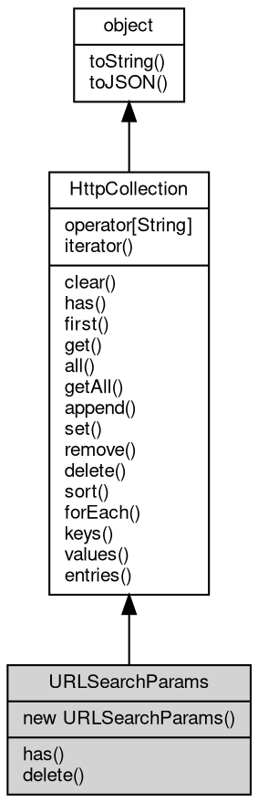

# 对象 URLSearchParams
URLSearchParams 是一个专门用于处理 URL 查询参数的容器类，继承自 [HttpCollection](HttpCollection.md)

URLSearchParams 实现了标准的 URLSearchParams API，用于解析和操作 URL 查询字符串。它提供了完整的查询参数管理功能，支持标准的查询参数操作，继承了 [HttpCollection](HttpCollection.md) 的所有功能，包括添加、设置、查询和删除参数。

URLSearchParams 支持以下几种使用方式：

1. 作为全局 URLSearchParams API 使用（Web 标准）：

```JavaScript
// Create empty URLSearchParams object
const params = new URLSearchParams();

// Initialize with query string
const params = new URLSearchParams('name=John&age=30&city=Beijing');

// Initialize with object
const params = new URLSearchParams({
    name: 'John',
    age: '30',
    city: 'Beijing'
});

// Initialize with array
const params = new URLSearchParams([
    ['name', 'John'],
    ['age', '30'],
    ['city', 'Beijing']
]);

// Copy from another URLSearchParams object
const copy = new URLSearchParams(params);
```

URLSearchParams API 标准方法示例：

```JavaScript
// Standard URLSearchParams API methods
params.set('name', 'Alice');
params.append('hobby', 'reading');
params.append('hobby', 'coding'); // Support multiple parameters with same name
params.get('name'); // 'Alice'
params.getAll('hobby'); // ['reading', 'coding']
params.has('age'); // true
params.has('hobby', 'reading'); // true
params.delete('city');
params.delete('hobby', 'coding');

// Convert to string
params.toString(); // 'name=Alice&hobby=reading&hobby=coding'

// Iterator support
for (const [name, value] of params) {
    console.log(`${name}: ${value}`);
}

// Iterate over keys
for (const name of params.keys()) {
    console.log(name);
}

// Iterate over values
for (const value of params.values()) {
    console.log(value);
}

// forEach method
params.forEach((value, name) => {
    console.log(`${name}: ${value}`);
});

// Sort parameters
params.sort();
```

fibjs 扩展方法示例（继承自 [HttpCollection](HttpCollection.md)）：

```JavaScript
// Add multiple values (without overwriting existing)
params.add('tags', 'javascript');

// Get first value
const firstName = params.first('name');

// Get all values
const allHobbies = params.all('hobby');

// Set multiple values
params.set('colors', ['red', 'green', 'blue']);
```

URLSearchParams 自动处理 URL 编码和解码，完全遵循 Web 标准 URLSearchParams API 规范。

## 继承关系


## 构造函数
        
### URLSearchParams
**URLSearchParams 构造函数，创建一个新的空查询参数容器**

```JavaScript
new URLSearchParams();
```

--------------------------
**URLSearchParams 构造函数，使用给定的查询字符串初始化参数容器**

```JavaScript
new URLSearchParams(String init);
```

调用参数:
* init: String, 初始化用的查询字符串，如 "name=value&key=val"

--------------------------
**URLSearchParams 构造函数，使用给定的对象初始化参数容器**

```JavaScript
new URLSearchParams(Object init);
```

调用参数:
* init: Object, 初始化用的参数对象，键为参数名，值为参数值

--------------------------
**URLSearchParams 构造函数，使用给定的数组初始化参数容器**

```JavaScript
new URLSearchParams(Array init);
```

调用参数:
* init: Array, 初始化用的参数数组，每个元素为一个包含参数名和参数值的数组

--------------------------
**URLSearchParams 构造函数，使用给定的 URLSearchParams 对象初始化参数容器**

```JavaScript
new URLSearchParams(URLSearchParams init);
```

调用参数:
* init: URLSearchParams, 初始化用的 URLSearchParams 对象

## 操作符
        
### @iterator
**查询当前对象元素的迭代器**

```JavaScript
Iterator URLSearchParams.@iterator();
```

返回结果:
* [Iterator](Iterator.md), 返回当前对象元素的迭代器

## 成员函数
        
### has
**检查容器内是否存在指定键值的数据**

```JavaScript
Boolean URLSearchParams.has(String name);
```

调用参数:
* name: String, 指定要检查的键值

返回结果:
* Boolean, 返回键值是否存在

--------------------------
**检查容器内是否存在指定参数名和参数值的组合**

```JavaScript
Boolean URLSearchParams.has(String name,
    Value value);
```

调用参数:
* name: String, 指定要检查的参数名
* value: Value, 指定要检查的参数值，当传入 undefined 时行为与 has(name) 相同

返回结果:
* Boolean, 返回指定参数名和参数值组合是否存在

--------------------------
### delete
**删除指定键值的全部值**

```JavaScript
URLSearchParams.delete(String name);
```

调用参数:
* name: String, 指定要删除的键值

--------------------------
**删除指定参数名和参数值的组合**

```JavaScript
URLSearchParams.delete(String name,
    Value value);
```

调用参数:
* name: String, 指定要删除的参数名
* value: Value, 指定要删除的参数值，当传入 undefined 时行为与 delete(name) 相同

--------------------------
### clear
**清除容器数据**

```JavaScript
URLSearchParams.clear();
```

--------------------------
### first
**查询指定键值的第一个值**

```JavaScript
Variant URLSearchParams.first(String name);
```

调用参数:
* name: String, 指定要查询的键值

返回结果:
* Variant, 返回键值所对应的值，若不存在，则返回 undefined

--------------------------
### get
**查询指定键值的第一个值，等同于 first**

```JavaScript
Variant URLSearchParams.get(String name);
```

调用参数:
* name: String, 指定要查询的键值

返回结果:
* Variant, 返回键值所对应的值，若不存在，则返回 undefined

--------------------------
### all
**查询指定键值的全部值**

```JavaScript
NObject URLSearchParams.all(String name = "");
```

调用参数:
* name: String, 指定要查询的键值，传递空字符串返回全部键值的结果

返回结果:
* NObject, 返回键值所对应全部值的数组，若数据不存在，则返回 null

--------------------------
### getAll
**查询指定键值的全部值**

```JavaScript
NArray URLSearchParams.getAll(String name);
```

调用参数:
* name: String, 指定要查询的键值

返回结果:
* NArray, 返回键值所对应全部值的数组，若数据不存在，则返回 null

--------------------------
### append
**添加一个键值数据，添加数据并不修改已存在的键值的数据**

```JavaScript
URLSearchParams.append(Object map);
```

调用参数:
* map: Object, 指定要添加的键值数据字典

--------------------------
**添加一个键值的一组数据，添加数据并不修改已存在的键值的数据**

```JavaScript
URLSearchParams.append(String name,
    Array values);
```

调用参数:
* name: String, 指定要添加的键值
* values: Array, 指定要添加的一组数据

--------------------------
**添加一组数据，添加数据并不修改已存在的键值的数据**

```JavaScript
URLSearchParams.append(Array entries);
```

调用参数:
* entries: Array, 指定要添加的一组数据，格式为 [[<key>, <value>]]

--------------------------
**添加一个键值数据，添加数据并不修改已存在的键值的数据**

```JavaScript
URLSearchParams.append(String name,
    Variant value);
```

调用参数:
* name: String, 指定要添加的键值
* value: Variant, 指定要添加的数据

--------------------------
### set
**设定一个键值数据，设定数据将修改键值所对应的第一个数值，并清除相同键值的其余数据**

```JavaScript
URLSearchParams.set(Object map);
```

调用参数:
* map: Object, 指定要设定的键值数据字典

--------------------------
**设定一个键值的一组数据，设定数据将修改键值所对应的数值，并清除相同键值的其余数据**

```JavaScript
URLSearchParams.set(String name,
    Array values);
```

调用参数:
* name: String, 指定要设定的键值
* values: Array, 指定要设定的一组数据

--------------------------
**设定一个键值数据，设定数据将修改键值所对应的第一个数值，并清除相同键值的其余数据**

```JavaScript
URLSearchParams.set(String name,
    Variant value);
```

调用参数:
* name: String, 指定要设定的键值
* value: Variant, 指定要设定的数据

--------------------------
### remove
**删除指定键值的全部值**

```JavaScript
URLSearchParams.remove(String name);
```

调用参数:
* name: String, 指定要删除的键值

--------------------------
### sort
**按照键值排序容器内的内容**

```JavaScript
URLSearchParams.sort();
```

--------------------------
### forEach
**遍历容器内的内容**

```JavaScript
URLSearchParams.forEach(Function callback);
```

调用参数:
* callback: Function, 指定遍历时调用的函数，函数参数为 (value, key, [object](object.md))

--------------------------
**遍历容器内的内容**

```JavaScript
URLSearchParams.forEach(Function callback,
    Value thisArg);
```

调用参数:
* callback: Function, 指定遍历时调用的函数，函数参数为 (value, key, [object](object.md))
* thisArg: Value, 指定回调函数的 this 对象

--------------------------
### keys
**查询容器内的键值**

```JavaScript
Iterator URLSearchParams.keys();
```

返回结果:
* [Iterator](Iterator.md), 返回包含所有键值的迭代器

--------------------------
### values
**查询容器内的数值**

```JavaScript
Iterator URLSearchParams.values();
```

返回结果:
* [Iterator](Iterator.md), 返回包含所有数值的迭代器

--------------------------
### entries
**查询容器内的键值和数值**

```JavaScript
Iterator URLSearchParams.entries();
```

返回结果:
* [Iterator](Iterator.md), 返回包含所有键值和数值的迭代器

--------------------------
### toString
**返回对象的字符串表示，一般返回 "[Native Object]"，对象可以根据自己的特性重新实现**

```JavaScript
String URLSearchParams.toString();
```

返回结果:
* String, 返回对象的字符串表示

--------------------------
### toJSON
**返回对象的 JSON 格式表示，一般返回对象定义的可读属性集合**

```JavaScript
Value URLSearchParams.toJSON(String key = "");
```

调用参数:
* key: String, 未使用

返回结果:
* Value, 返回包含可 JSON 序列化的值

