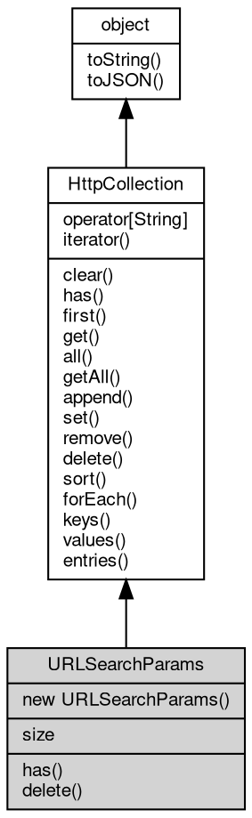

# Object URLSearchParams
The ordered query-parameter collection of the URL Standard, inheriting from

[HttpCollection](HttpCollection.md)

URLSearchParams is both the [global](../../module/ifs/global.md) class and the value behind [http.Request](../../module/ifs/http.md#Request)#query and
[UrlObject](UrlObject.md)#searchParams. It parses, builds and serializes query strings: names and values are
strings, are compared case-sensitively, an empty name is allowed and every pair keeps its
insertion position, so the serialization order follows the input order.

Concepts:

- **Ordered pairs**: size counts pairs, not distinct names. append() adds a pair, set()
  replaces every pair of a name, delete() removes one value or every value of a name and
  sort() reorders in place (stable, byte-wise by name). The inherited [HttpCollection](HttpCollection.md) helpers
  (first, all, getAll, forEach, keys, values, entries, toJSON) are available as well.
- **Encoding**: parsing decodes `+` as a space and percent escapes; toString() serializes
  with the application/x-www-form-urlencoded rules - spaces become `+`, the characters
  `!`, `*`, `'`, `(` and `)` stay literal and everything else is percent-encoded as UTF-8.
  A single leading `?` is stripped by the constructor and `#` is an ordinary character, so
  "a=1#x" stores the value "1#x".
- **Constructors**: a query string, an [object](object.md), an array of pairs, another URLSearchParams or
  any iterable of pairs (a Map, a [Headers](Headers.md), a [FormData](FormData.md) ...); null and undefined create an
  empty collection and other primitives are converted to a string and parsed as a query
  string.
- **Value-aware has/delete**: the optional second argument restricts the operation to the
  pairs with exactly that value; without it (or with undefined) the member works on the name
  alone, like the [HttpCollection](HttpCollection.md) members.

Obtained from:
- `new URLSearchParams()` / `new URLSearchParams(init)` — build from scratch or initialize;
- `[http.Request](../../module/ifs/http.md#Request)#query` — the parsed query of a request;
- `[UrlObject](UrlObject.md)#searchParams` — the parameters of a URL (assigning changes the URL);
- `querystring.parse` — the legacy parser returns an [HttpCollection](HttpCollection.md), not URLSearchParams.

Example 1 — parse a query string and modify it:

```JavaScript
const params = new URLSearchParams('?b=2&a=1&a=3');

console.log(params.size); // 3
console.log(params.get('a')); // 1
console.log(params.getAll('a')); // [ '1', '3' ]

params.append('c', '4');
params.set('a', '9'); // replaces both a=1 and a=3, the name moves to the end
console.log(params.toString()); // b=2&c=4&a=9
```

Example 2 — value-aware has and delete:

```JavaScript
const params = new URLSearchParams('tag=a&tag=b&tag=c');

console.log(params.has('tag', 'b')); // true
console.log(params.has('tag', 'z')); // false
params.delete('tag', 'b');
console.log(params.getAll('tag')); // [ 'a', 'c' ]
params.delete('tag');
console.log(params.size); // 0
```

Example 3 — build from an [object](object.md), pairs or an iterable and serialize:

```JavaScript
const fromObject = new URLSearchParams({
    q: 'a b',
    page: 2
});
const fromPairs = new URLSearchParams([
    ['tag', 'x'],
    ['tag', 'y']
]);
const fromMap = new URLSearchParams(new Map([
    ['m', '1']
]));

console.log(fromObject.toString()); // q=a+b&page=2
console.log(fromPairs.toString()); // tag=x&tag=y
console.log(fromMap.toString()); // m=1
console.log(new URLSearchParams(fromPairs).toString()); // tag=x&tag=y
```

## Inheritance

```dot
digraph {
    node [fontname="Helvetica,sans-Serif", fontsize=10, shape="record", style="filled", fillcolor="white"];

    object [tooltip="object", URL="object.md", label="{object|toString()\ltoJSON()\l}"];
    HttpCollection [tooltip="HttpCollection", URL="HttpCollection.md", label="{HttpCollection|operator[String]\literator()\l|clear()\lhas()\lfirst()\lget()\lall()\lgetAll()\lappend()\lset()\lremove()\ldelete()\lsort()\lforEach()\lkeys()\lvalues()\lentries()\l}"];
    URLSearchParams [tooltip="URLSearchParams", fillcolor="lightgray", id="me", label="{URLSearchParams|new URLSearchParams()\l|size\l|has()\ldelete()\l}"];

    object -> HttpCollection [dir=back];
    HttpCollection -> URLSearchParams [dir=back];
}
```

## Constructors
        
### URLSearchParams
**Creates an empty URLSearchParams collection**

```JavaScript
new URLSearchParams();
```

Equivalent to `new URLSearchParams('')`: size 0 and toString() an empty string.

--------------------------
**Creates a collection from a query string, an [object](object.md), pairs, a container or an**

```JavaScript
new URLSearchParams(Object | Array | URLSearchParams | String | Variant init);
```

Parameters:
* init: Object | Array | URLSearchParams | String | Variant, the initial parameters: a query string, an [object](object.md), an array of pairs, a

iterable

The init argument is converted as follows:
- a string is parsed as a query string with a single leading `?` removed; `+` decodes to
  a space and `#` is an ordinary character;
- an [object](object.md)'s own enumerable properties become pairs in enumeration order, with the
  values converted to strings;
- an array must contain [name, value] pairs of exactly two elements; any other element
  throws `TypeError [20024] Failed to construct 'URLSearchParams': sequence elements must
  be pairs.`;
- another URLSearchParams copies every pair into an independent collection;
- any other iterable of pairs (a Map, a [Headers](Headers.md), a [FormData](FormData.md)) is materialized with
  Array.from and appended;
- null and undefined create an empty collection; other values (a number, a boolean) are
  converted to their string form and parsed as a query string (123 becomes "123=").

Example — the same pairs through different initializers:

```JavaScript
console.log(new URLSearchParams('b=2&a=1').toString()); // b=2&a=1
console.log(new URLSearchParams({
    b: 2,
    a: 1
}).toString()); // b=2&a=1
console.log(new URLSearchParams([
    ['b', '2'],
    ['a', '1']
]).toString()); // b=2&a=1
console.log(new URLSearchParams(new Map([
    ['b', '2']
])).toString()); // b=2
```

## Operators
        
### @iterator
**Returns the default iterator over [name, value] pairs, an alias of entries**

```JavaScript
Iterator URLSearchParams.@iterator();
```

Returns:
* [Iterator](Iterator.md), an iterator with every [name, value] pair

The member is what `for ... of` and the spread syntax use on a collection; it yields
one [name, value] pair per stored entry, so a repeated name appears once per value.
Containers that sort on iteration sort first.

## Properties
        
### size
**Integer, The number of stored name/value pairs, read-only**

```JavaScript
readonly Integer URLSearchParams.size;
```

Pairs, not names: "a=1&a=2" has size 2, every append() increases it by one and set() of
an existing name keeps it unchanged. The Web standard exposes the same property; the
other [HttpCollection](HttpCollection.md) containers do not have it.

## Methods
        
### has
**Checks whether a name is present**

```JavaScript
Boolean URLSearchParams.has(String name);
```

Parameters:
* name: String, name to check

Returns:
* Boolean, true when the name exists

The comparison follows the case rules of the concrete container; [[Headers](Headers.md)](Headers.md) rejects an
empty name with error 20004 while [URLSearchParams](URLSearchParams.md) and [[FormData](FormData.md)](FormData.md) accept it.

Example — check a header through its case-insensitive name:

```JavaScript
const http = require('http');

const headers = new http.Headers({
    'Content-Type': 'text/plain'
});
console.log(headers.has('content-type')); // true
```

--------------------------
**Checks whether a name/value combination is present**

```JavaScript
Boolean URLSearchParams.has(String name,
    Value value);
```

Parameters:
* name: String, the parameter name to check
* value: Value, the parameter value to match, or undefined for the name-only check

Returns:
* Boolean, whether a pair with that name (and value) exists

With a value, only the pairs whose value equals the argument are considered; the value
is converted to a string first, so has('n', 2) matches the pair n=2. With one argument or
undefined the member degrades to the name-only check of [HttpCollection](HttpCollection.md). The comparison
is case-sensitive and exact. Note that [HttpCollection](HttpCollection.md) also declares a one-argument has()
and man only shows this overload; the runtime accepts both call forms.

Example — distinguish a value from the name:

```JavaScript
const params = new URLSearchParams('n=1&n=2');

console.log(params.has('n')); // true (name-only form)
console.log(params.has('n', 2)); // true
console.log(params.has('n', 3)); // false
```

--------------------------
### delete
**Removes every value of a name, an alias of remove**

```JavaScript
URLSearchParams.delete(String name);
```

Parameters:
* name: String, name to remove

See remove. The `delete container[name]` operator removes the same entries, but its
result is always true in the current implementation, so [[test](../../module/ifs/test.md)](../../[module](../../module/ifs/module.md)/ifs/test.md) the removal with has
instead of relying on the return value.

--------------------------
**Removes the pairs of a name, or the pairs with a name/value combination**

```JavaScript
URLSearchParams.delete(String name,
    Value value);
```

Parameters:
* name: String, the parameter name to remove
* value: Value, the parameter value to remove, or undefined to remove every pair of the name

With a value, only the pairs whose value equals the argument are removed and the other
pairs of the name remain; the value is converted to a string like in has(). With one
argument or undefined every pair of the name is removed, exactly like the [HttpCollection](HttpCollection.md)
delete. Removing a name that does not exist is not an error.

Example — remove one value and then the whole name:

```JavaScript
const params = new URLSearchParams('n=1&n=2&n=3');

params.delete('n', 2);
console.log(params.toString()); // n=1&n=3
params.delete('n');
console.log(params.size); // 0
```

--------------------------
### clear
**Removes every entry from the container**

```JavaScript
URLSearchParams.clear();
```

The container becomes empty and the iteration helpers yield nothing afterwards. The
method is available on every concrete container.

--------------------------
### first
**Queries the first value of a name**

```JavaScript
Variant URLSearchParams.first(String name);
```

Parameters:
* name: String, name to query

Returns:
* Variant, the first value, or null when the name does not exist

Values are returned in insertion order, so the first appended value wins. The result
is null when the name does not exist. [Headers](Headers.md) rejects an empty name with error 20004,
while URLSearchParams and [FormData](FormData.md) accept it.

Example — read the first value of a repeated header:

```JavaScript
const http = require('http');

const headers = new http.Headers();
headers.append('X-Tag', 'a');
headers.append('x-tag', 'b');
console.log(headers.first('X-TAG')); // a
console.log(headers.first('missing')); // null
```

--------------------------
### get
**Queries the first value of a name, an alias of first**

```JavaScript
Variant URLSearchParams.get(String name);
```

Parameters:
* name: String, name to query

Returns:
* Variant, the value of the name, or null when it does not exist

[Headers](Headers.md) overrides this member with a different semantic: its get joins every value of
the name with `, ` as required by the Fetch API, while first still returns only the
first raw value. The other containers return the same value as first.

--------------------------
### all
**Queries all values of a name, or the whole container as an [object](object.md)**

```JavaScript
NObject URLSearchParams.all(String name = "");
```

Parameters:
* name: String, name to query; an empty string returns the whole container

Returns:
* NObject, an array of values, or an [object](object.md) with every entry when the name is empty

Called with a non-empty name, the method returns an array with every value of that
name in insertion order and an empty array when the name is missing. Called with an
empty string or without an argument, it returns a plain [object](object.md) with every entry, where
a name that has several values becomes an array. URLSearchParams and [FormData](FormData.md), which
accept an empty name, return the whole container in that case; use getAll('') to read
the values of the empty name.

Example — collect every value of a name:

```JavaScript
const params = new URLSearchParams('tag=a&tag=b&tag=c');
console.log(params.all('tag')); // [ 'a', 'b', 'c' ]
console.log(params.all('missing')); // []
```

--------------------------
### getAll
**Queries all values of a name as an array**

```JavaScript
NArray URLSearchParams.getAll(String name);
```

Parameters:
* name: String, name to query

Returns:
* NArray, an array with every value of the name

Always returns an array, empty when the name is missing and including for the empty
name, so it is the value-oriented counterpart of all. Values keep the insertion order
of the container.

--------------------------
### append
**Appends every entry of an [object](object.md)**

```JavaScript
URLSearchParams.append(Object map);
```

Parameters:
* map: Object, [object](object.md) whose properties are appended

The own enumerable properties are visited in enumeration order; a property whose value
is an array appends every element in order, any other value appends a single entry,
and existing entries are not modified. Values are converted according to the container
([Headers](Headers.md) and URLSearchParams store strings).

Example — append a group of headers:

```JavaScript
const http = require('http');

const headers = new http.Headers();
headers.append({
    'Accept-Encoding': 'gzip',
    'Set-Cookie': ['a=1', 'b=2']
});
console.log(headers.all('set-cookie')); // [ 'a=1', 'b=2' ]
```

--------------------------
**Appends one value, or every element of an array, for a name**

```JavaScript
URLSearchParams.append(String name,
    Array | Variant value);
```

Parameters:
* name: String, name to append
* value: Array | Variant, value, or array of values, to append

An array appends every element in order, any other value appends a single entry, and
existing entries are not modified. An empty name is rejected by [Headers](Headers.md) with error
20004 and accepted by URLSearchParams and [FormData](FormData.md).

Example — append two values of one name:

```JavaScript
const http = require('http');

const headers = new http.Headers();
headers.append('X-Tag', ['a', 'b']);
console.log(headers.all('x-tag')); // [ 'a', 'b' ]
```

--------------------------
**Appends an array of [name, value] entries**

```JavaScript
URLSearchParams.append(Array entries);
```

Parameters:
* entries: Array, array of [name, value] pairs to append

Every element of the argument must be an array of exactly two elements; a different
shape fails with a bad variable type error (20003). Elements are appended in order and
existing entries are not modified.

Example — append pairs through URLSearchParams:

```JavaScript
const params = new URLSearchParams();
params.append([
    ['a', '1'],
    ['b', '2']
]);
console.log(params.toString()); // a=1&b=2
```

--------------------------
### set
**Sets every entry of an [object](object.md), replacing the existing values of each name**

```JavaScript
URLSearchParams.set(Object map);
```

Parameters:
* map: Object, [object](object.md) whose properties are set

The own enumerable properties are visited in enumeration order; a property whose value
is an array sets every element in order, any other value sets a single entry. Every
existing value of a name is removed before its new values are appended.

Example — replace a group of headers:

```JavaScript
const http = require('http');

const headers = new http.Headers({
    Accept: 'text/html',
    'X-Tag': 'old'
});
headers.set({
    Accept: 'application/json',
    'X-Tag': ['a', 'b']
});
console.log(headers.all('accept')); // [ 'application/json' ]
console.log(headers.all('x-tag')); // [ 'a', 'b' ]
```

--------------------------
**Sets one value, or every element of an array, for a name**

```JavaScript
URLSearchParams.set(String name,
    Array | Variant value);
```

Parameters:
* name: String, name to set
* value: Array | Variant, value, or array of values, to set

Every existing value of the name is removed first, then an array appends every element
in order or another value appends a single entry; a name that already existed therefore
moves to the end of the insertion order. An empty name is rejected by [Headers](Headers.md) with
error 20004 and accepted by URLSearchParams and [FormData](FormData.md).

--------------------------
### remove
**Removes every value of a name**

```JavaScript
URLSearchParams.remove(String name);
```

Parameters:
* name: String, name to remove

The name is looked up with the case rules of the container and removing a name that
does not exist is not an error. delete is an alias: the two differ only in that
`delete container[name]` can be used as an operator (its return value is not reliable,
see the operator member).

--------------------------
### sort
**Sorts the entries by name in place**

```JavaScript
URLSearchParams.sort();
```

The sort is stable and compares names byte by byte, so upper-case letters sort before
lower-case ones. Sorting changes the order seen by every later operation, including
all() and toJSON(). The iteration helpers of [Headers](Headers.md) and of the collection returned by
[querystring.parse](../../module/ifs/querystring.md#parse) call sort automatically; URLSearchParams and [FormData](FormData.md) never sort
implicitly.

--------------------------
### forEach
**Visits every entry in order**

```JavaScript
URLSearchParams.forEach(Function(Value value, String key, Object obj) callback);
```

Parameters:
* callback: Function(Value value, String key, Object obj), function called with (value, name, collection)

The callback receives (value, name, collection); returning from the callback does not
stop the iteration. Containers that sort on iteration ([Headers](Headers.md) and the [querystring](../../module/ifs/querystring.md)
collection) sort before the first callback, so the names are visited in sorted order.

Example — list every header:

```JavaScript
const http = require('http');

const headers = new http.Headers({
    'B-Header': '1',
    'A-Header': '2'
});
headers.forEach((value, name) => console.log(name, value));
// a-header 2, then b-header 1 (names are lower-cased and sorted)
```

--------------------------
**Visits every entry in order with an explicit this value**

```JavaScript
URLSearchParams.forEach(Function(Value value, String key, Object obj) callback,
    Value thisArg);
```

Parameters:
* callback: Function(Value value, String key, Object obj), function called with (value, name, thisArg)
* thisArg: Value, value used as `this` inside the callback

Identical to forEach except that the callback runs with thisArg as `this` and receives
thisArg as its third argument instead of the collection.

--------------------------
### keys
**Returns an iterator over the names**

```JavaScript
Iterator URLSearchParams.keys();
```

Returns:
* [Iterator](Iterator.md), an iterator with every name

Repeated names appear once per entry; containers that sort on iteration sort first.
The iterator implements the standard iterator protocol, so it can be used in a
`for ... of` loop or queried with next().

Example — iterate names:

```JavaScript
const http = require('http');

const headers = new http.Headers({
    B: '1',
    A: '2'
});
for (const name of headers.keys())
    console.log(name); // a, then b (Headers sorts on iteration)
```

--------------------------
### values
**Returns an iterator over the values**

```JavaScript
Iterator URLSearchParams.values();
```

Returns:
* [Iterator](Iterator.md), an iterator with every value

Values are visited in the same order as the names of keys(), one value per entry.

--------------------------
### entries
**Returns an iterator over [name, value] pairs**

```JavaScript
Iterator URLSearchParams.entries();
```

Returns:
* [Iterator](Iterator.md), an iterator with every [name, value] pair

This is also the iterator used by `for ... of` and by spread on the container; a name
with several values appears once per value.

Example — turn query parameters into pairs:

```JavaScript
const params = new URLSearchParams('a=1&a=2');
console.log(JSON.stringify([...params])); // [["a","1"],["a","2"]]
```

--------------------------
### toString
**Returns the string form of the [object](object.md)**

```JavaScript
String URLSearchParams.toString();
```

Returns:
* String, returns the string form of the [object](object.md)

The base implementation reports an error: a native [object](object.md) has no implicit
text form, and only the classes whose value can be written as a string
override the member. [Buffer](Buffer.md) returns its content decoded with the given
[encoding](../../module/ifs/encoding.md), [HttpCookie](HttpCookie.md) returns "name=value", and so on; an override commonly
accepts optional arguments ([Buffer.toString](Buffer.md#toString) takes [encoding](../../module/ifs/encoding.md), start and
end) that are not part of this declaration.

Calling the member on a class that does not override it throws
"<Class>: the [object](object.md) can not be converted to string.", which is the
behavior to rely on when probing whether a value has a string form. See
toJSON for the serialization hook.

--------------------------
### toJSON
**Returns the JSON representation of the [object](object.md)**

```JavaScript
Value URLSearchParams.toJSON(String key = "");
```

Parameters:
* key: String, the property name of the value being serialized

Returns:
* Value, returns the JSON-serializable value

JSON.stringify(value) calls value.toJSON(key) when the member exists and
serializes the returned value in its place; the key argument carries the
property name of the value inside its parent [object](object.md) (an empty string at
the top level) and may be used to build a keyed form. The base
implementation returns a plain [object](object.md) holding the readable properties of
the instance, so a native [object](object.md) serializes without per-class code; a
class with a portable shape such as [Buffer](Buffer.md) overrides it, and a JavaScript
class may override it in the same way.

The member is normally reached through JSON.stringify rather than called
directly; calling it returns the same value JSON.stringify would
serialize.

