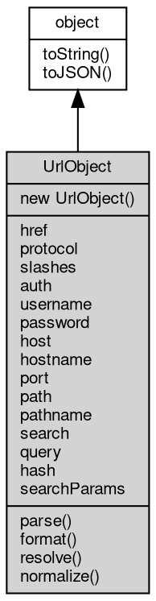

# 对象 UrlObject
UrlObject 是用于表示 URL 信息的一种对象，我们可以方便地使用 UrlObject 对象表示和操作一个 URL 地址。

UrlObject 封装了许多有用的方法和属性，例如 parse 和 format 等方法，可以快速地对 URL 进行解析和格式化。

对于 UrlObject 对象，我们可以通过以下方式进行创建：

1. 使用 [url](../../module/ifs/url.md) 字符串创建 UrlObject。在该方法中，parse 自动将 URL 进行解析，如果 URL 不合法，将抛出异常：

```JavaScript
const url = require('url');

const parsedURL = url.parse('https://www.google.com');
console.log(parsedURL);
```

2. 使用构造参数创建 UrlObject：

```JavaScript
const url = require('url');

const parsedURL = new url.URL({
    protocol: 'https:',
    hostname: 'www.google.com',
    pathname: '/search',
    query: {
        q: 'hello world',
    }
});

console.log(parsedURL);
```

## 继承关系


## 构造函数
        
### UrlObject
**UrlObject 对象构造函数，使用参数构造**

```JavaScript
new UrlObject(Object args);
```

调用参数:
* args: Object, 指定构造参数的字典对象，支持的字段有：protocol, slashes, username, password, hostname, port, pathname, query, hash

--------------------------
**UrlObject 对象构造函数，使用 [url](../../module/ifs/url.md) 字符串构造**

```JavaScript
new UrlObject(String url = "",
    Boolean parseQueryString = false,
    Boolean slashesDenoteHost = false);
```

调用参数:
* url: String, 指定构造 [url](../../module/ifs/url.md) 字符串
* parseQueryString: Boolean, 指定是否解析 query
* slashesDenoteHost: Boolean, 默认为false, 如果设置为true，则从字符串'//'之后到下一个'/'之前的字符串会被解析为host，例如'//foo/bar', 结果应该是{host: 'foo', pathname: '/bar'}而不是{pathname: '//foo/bar'}

## 成员属性
        
### href
**String, 查询和设置当前 UrlObject 对象中的完整 [url](../../module/ifs/url.md) 地址描述，此描述由其他所有属性组装而成**

```JavaScript
String UrlObject.href;
```

--------------------------
### protocol
**String, 查询和设置当前 UrlObject 对象中的协议名称**

```JavaScript
String UrlObject.protocol;
```

--------------------------
### slashes
**Boolean, 查询和设置当前 UrlObject 对象是否包含双斜杠**

```JavaScript
Boolean UrlObject.slashes;
```

--------------------------
### auth
**String, 查询和设置当前 UrlObject 对象中的完整验证字符串，由 username 和 password 属性组装而成**

```JavaScript
String UrlObject.auth;
```

--------------------------
### username
**String, 查询和设置当前 UrlObject 对象中的验证用户**

```JavaScript
String UrlObject.username;
```

--------------------------
### password
**String, 查询和设置当前 UrlObject 对象中的验证密码**

```JavaScript
String UrlObject.password;
```

--------------------------
### host
**String, 查询和设置当前 UrlObject 对象中的完整主机描述，由 hastname 和 port 组装而成**

```JavaScript
String UrlObject.host;
```

--------------------------
### hostname
**String, 查询和设置当前 UrlObject 对象中的主机名**

```JavaScript
String UrlObject.hostname;
```

--------------------------
### port
**String, 查询和设置当前 UrlObject 对象中的端口号**

```JavaScript
String UrlObject.port;
```

--------------------------
### path
**String, 查询和设置当前 UrlObject 对象中的请求完整路径（含请求），由 pathname 和 query 组装而成**

```JavaScript
String UrlObject.path;
```

--------------------------
### pathname
**String, 查询和设置当前 UrlObject 对象中的路径**

```JavaScript
String UrlObject.pathname;
```

--------------------------
### search
**String, 查询和设置当前 UrlObject 对象中的请求字符串（含“?”），等效于“?”+query**

```JavaScript
String UrlObject.search;
```

--------------------------
### query
**Value, 查询和设置当前 UrlObject 对象中的请求字符串（ 不含“?”）**

```JavaScript
Value UrlObject.query;
```

--------------------------
### hash
**String, 查询和设置当前 UrlObject 对象中的请求锚点（含“\#”）**

```JavaScript
String UrlObject.hash;
```

--------------------------
### searchParams
**[HttpCollection](HttpCollection.md), 查询当前 UrlObject 对象中的请求字符串（ 不含“?”）**

```JavaScript
readonly HttpCollection UrlObject.searchParams;
```

## 成员函数
        
### parse
**解析一个 [url](../../module/ifs/url.md) 字符串**

```JavaScript
UrlObject.parse(String url,
    Boolean parseQueryString = false,
    Boolean slashesDenoteHost = false);
```

调用参数:
* url: String, 指定需要解析的 [url](../../module/ifs/url.md) 字符串
* parseQueryString: Boolean, 指定是否解析 query
* slashesDenoteHost: Boolean, 默认为false, 如果设置为true，则从字符串'//'之后到下一个'/'之前的字符串会被解析为host，例如'//foo/bar', 结果应该是{host: 'foo', pathname: '/bar'}而不是{pathname: '//foo/bar'}

--------------------------
### format
**使用指定的参数构造 UrlObject**

```JavaScript
UrlObject.format(Object args);
```

调用参数:
* args: Object, 指定构造参数的字典对象，支持的字段有：protocol, slashes, username, password, hostname, port, pathname, query, hash

--------------------------
### resolve
**重定位 [url](../../module/ifs/url.md) 路径，自动识别新路径为相对路径还是绝对路径**

```JavaScript
UrlObject UrlObject.resolve(String url);
```

调用参数:
* url: String, 指定新的路径

返回结果:
* UrlObject, 返回包含重定位数据的对象

--------------------------
### normalize
**标准化路径**

```JavaScript
UrlObject.normalize();
```

--------------------------
### toString
**返回对象的字符串表示，一般返回 "[Native Object]"，对象可以根据自己的特性重新实现**

```JavaScript
String UrlObject.toString();
```

返回结果:
* String, 返回对象的字符串表示

--------------------------
### toJSON
**返回对象的 JSON 格式表示，一般返回对象定义的可读属性集合**

```JavaScript
Value UrlObject.toJSON(String key = "");
```

调用参数:
* key: String, 未使用

返回结果:
* Value, 返回包含可 JSON 序列化的值

