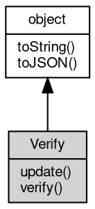

# Object Verify
Streaming signature verifier

A Verify checks a signature over data fed with update(); [crypto.createVerify](../../module/ifs/crypto.md#createVerify)(algorithm)
is the factory and [crypto.verify](../../module/ifs/crypto.md#verify)(algorithm, data, key, signature) the one-shot
equivalent. The signer side is [Sign](Sign.md) or [crypto.sign](../../module/ifs/crypto.md#sign).

Concepts:
- **Algorithm selection**: the algorithm is a digest name from [crypto.getHashes](../../module/ifs/crypto.md#getHashes) and
  must match the one used to sign. The key type selects the scheme (RSA PKCS#1 v1.5
  or PSS, ECDSA/DSA with DER or IEEE P1363 signatures), exactly as for [Sign](Sign.md).
- **Keys**: the key argument accepts a [KeyObject](KeyObject.md), a PEM/DER string or [Buffer](Buffer.md), or an
  options [object](object.md). Because a public key can be derived from a private key, a private
  key is also accepted and verifies with its public part; a secret key is rejected
  with "Verify: invalid key type, expected a public or private key". The parameter
  is named privateKey for historical reasons.
- **Signatures**: a [Buffer](Buffer.md) or a string decoded with [encoding](../../module/ifs/encoding.md). The default [encoding](../../module/ifs/encoding.md)
  "buffer" is not a character set, so a string signature must pass an explicit
  [encoding](../../module/ifs/encoding.md) ('[hex](../../module/ifs/hex.md)', '[base64](../../module/ifs/base64.md)', 'utf8'); Node.js decodes a string as utf8 when no
  [encoding](../../module/ifs/encoding.md) is given. Ed25519/Ed448 are one-shot algorithms and are rejected by this
  class; use [crypto.verify](../../module/ifs/crypto.md#verify)(null, data, key, signature) for them.
- **Result**: verify() returns true or false and finalizes the [object](object.md); a malformed
  signature normally returns false, while an invalid key or an unsupported algorithm
  throws. Create a new Verify for each check, as Node.js requires.

Obtained from:
- `crypto.createVerify(algorithm)` — the streaming factory; its optional options are
  not used by fibjs;
- `crypto.verify(algorithm, data, key, signature[, callback])` — one-shot
  verification, required for Ed25519/Ed448.

Example 1 — RSA: valid, tampered data and a wrong signature:

```JavaScript
const crypto = require('crypto');

const {
    privateKey,
    publicKey
} = crypto.generateKeyPairSync('rsa', {
    modulusLength: 1024
});
const signature = crypto.createSign('SHA256').update('data').sign(privateKey);

console.log(crypto.createVerify('SHA256').update('data').verify(publicKey, signature));
// true
console.log(crypto.createVerify('SHA256').update('data!').verify(publicKey, signature));
// false
console.log(crypto.createVerify('SHA256').update('data')
    .verify(publicKey, Buffer.alloc(signature.length))); // false
```

Example 2 — verifying with a PEM public key:

```JavaScript
const crypto = require('crypto');

const {
    privateKey,
    publicKey
} = crypto.generateKeyPairSync('rsa', {
    modulusLength: 1024
});
const publicPem = publicKey.export({
    format: 'pem',
    type: 'spki'
});
const signature = crypto.createSign('SHA256').update('data').sign(privateKey);

// The verifier never needs the private key, only the public PEM text.
console.log(crypto.createVerify('SHA256').update('data').verify(publicPem, signature));
// true
```

Example 3 — ECDSA IEEE P1363 and a private key as the verification key:

```JavaScript
const crypto = require('crypto');

const {
    privateKey,
    publicKey
} = crypto.generateKeyPairSync('ec', {
    namedCurve: 'prime256v1'
});
const signature = crypto.createSign('SHA256').update('data')
    .sign({
        key: privateKey,
        dsaEncoding: 'ieee-p1363'
    });

const valid = crypto.createVerify('SHA256').update('data')
    .verify({
        key: publicKey,
        dsaEncoding: 'ieee-p1363'
    }, signature);
console.log(valid); // true

// A private key is also accepted: its public part is derived for the check.
const same = crypto.createVerify('SHA256').update('data')
    .verify({
        key: privateKey,
        dsaEncoding: 'ieee-p1363'
    }, signature);
console.log(same); // true
```

## Inheritance

```dot
digraph {
    node [fontname="Helvetica,sans-Serif", fontsize=10, shape="record", style="filled", fillcolor="white"];

    object [tooltip="object", URL="object.md", label="{object|toString()\ltoJSON()\l}"];
    Verify [tooltip="Verify", fillcolor="lightgray", id="me", label="{Verify|update()\lverify()\l}"];

    object -> Verify [dir=back];
}
```

## Methods
        
### update
**Updates the Verify content with the given data**

```JavaScript
Verify Verify.update(Buffer | String data,
    String codec = "utf8");
```

Parameters:
* data: [Buffer](Buffer.md) | String, the data to update with
* codec: String, the [encoding](../../module/ifs/encoding.md) of a string data, default "utf8"

Returns:
* Verify, returns the Verify [object](object.md) itself

data may be a [Buffer](Buffer.md) or a string decoded with codec (default "utf8"); a [Buffer](Buffer.md)
ignores codec. Returns the Verify [object](object.md), so calls can be chained, and it may be
called any number of times before verify(). An unknown codec throws "[encoding](../../module/ifs/encoding.md):
Unknown charset". Calling update() after verify() is not supported; discard the
[object](object.md) and create a new Verify instead.

--------------------------
### verify
**Verifies the signature of all the data passed in**

```JavaScript
Boolean Verify.verify(Buffer | KeyObject | Object | String privateKey,
    Buffer | String signature,
    String encoding = "buffer");
```

Parameters:
* privateKey: [Buffer](Buffer.md) | [KeyObject](KeyObject.md) | Object | String, the public key used for verification
* signature: [Buffer](Buffer.md) | String, the signature to verify
* encoding: String, the [encoding](../../module/ifs/encoding.md) of a string signature, default "buffer"

Returns:
* Boolean, returns true if the signature is valid, false otherwise

privateKey accepts a [KeyObject](KeyObject.md), a PEM/DER string or [Buffer](Buffer.md), or an options [object](object.md)
with the same entries as [Sign.sign](Sign.md#sign) (key, format, type, passphrase, dsaEncoding,
padding, saltLength); a private key is accepted because its public part can be
derived. Signing and verification must use the same dsaEncoding and RSA padding.

signature may be a [Buffer](Buffer.md) or a string decoded with [encoding](../../module/ifs/encoding.md); passing a string
without an explicit [encoding](../../module/ifs/encoding.md) throws "[encoding](../../module/ifs/encoding.md): Unknown charset: 'buffer'", which
differs from Node.js (utf8), so decode the string yourself or pass '[hex](../../module/ifs/hex.md)',
'[base64](../../module/ifs/base64.md)' or 'utf8'. The call finalizes the [object](object.md) and returns true when the
signature is valid, false for a wrong signature; an invalid key or an
unsupported algorithm throws.

Example: a [base64](../../module/ifs/base64.md) string signature verifies with the matching [encoding](../../module/ifs/encoding.md):

```JavaScript
const crypto = require('crypto');

const {
    privateKey,
    publicKey
} = crypto.generateKeyPairSync('rsa', {
    modulusLength: 1024
});
const signature = crypto.createSign('SHA256').update('data').sign(privateKey, 'base64');

// The string form needs the encoding explicitly.
const valid = crypto.createVerify('SHA256').update('data')
    .verify(publicKey, signature, 'base64');
console.log(valid); // true

// Decoding manually avoids the encoding rule.
const same = crypto.createVerify('SHA256').update('data')
    .verify(publicKey, Buffer.from(signature, 'base64'));
console.log(same); // true
```

--------------------------
### toString
**Returns the string form of the [object](object.md)**

```JavaScript
String Verify.toString();
```

Returns:
* String, returns the string form of the [object](object.md)

The base implementation reports an error: a native [object](object.md) has no implicit
text form, and only the classes whose value can be written as a string
override the member. [Buffer](Buffer.md) returns its content decoded with the given
[encoding](../../module/ifs/encoding.md), [HttpCookie](HttpCookie.md) returns "name=value", and so on; an override commonly
accepts optional arguments ([Buffer.toString](Buffer.md#toString) takes [encoding](../../module/ifs/encoding.md), start and
end) that are not part of this declaration.

Calling the member on a class that does not override it throws
"<Class>: the [object](object.md) can not be converted to string.", which is the
behavior to rely on when probing whether a value has a string form. See
toJSON for the serialization hook.

--------------------------
### toJSON
**Returns the JSON representation of the [object](object.md)**

```JavaScript
Value Verify.toJSON(String key = "");
```

Parameters:
* key: String, the property name of the value being serialized

Returns:
* Value, returns the JSON-serializable value

JSON.stringify(value) calls value.toJSON(key) when the member exists and
serializes the returned value in its place; the key argument carries the
property name of the value inside its parent [object](object.md) (an empty string at
the top level) and may be used to build a keyed form. The base
implementation returns a plain [object](object.md) holding the readable properties of
the instance, so a native [object](object.md) serializes without per-class code; a
class with a portable shape such as [Buffer](Buffer.md) overrides it, and a JavaScript
class may override it in the same way.

The member is normally reached through JSON.stringify rather than called
directly; calling it returns the same value JSON.stringify would
serialize.

