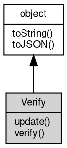

# 对象 Verify
用于验证签名的实用程序

[crypto.createVerify](../../module/ifs/crypto.md#createVerify)() 方法用于创建 Verify 实例。Verify 对象不能直接使用 new 关键字创建。

示例:

```JavaScript
const {
    generateKeyPairSync,
    createSign,
    createVerify,
} = require('crypto');

const {
    privateKey,
    publicKey
} = generateKeyPairSync('rsa', {
    modulusLength: 2048,
});

const sign = createSign('SHA256');
sign.update('some data to sign');
const signature = sign.sign(privateKey);

const verify = createVerify('SHA256');
verify.update('some data to sign');
console.log(verify.verify(publicKey, signature));
```

## 继承关系


## 成员函数
        
### update
**使用给定的 data 更新 Verify 内容**

```JavaScript
Verify Verify.update(Buffer data);
```

调用参数:
* data: [Buffer](Buffer.md), 要更新的数据

返回结果:
* Verify, 返回 Verify 对象本身

--------------------------
**使用给定的 data 更新 Verify 内容**

```JavaScript
Verify Verify.update(String data,
    String codec = "utf8");
```

调用参数:
* data: String, 要更新的数据
* codec: String, data 的编码方式

返回结果:
* Verify, 返回 Verify 对象本身

--------------------------
### verify
**验证传递的所有数据的签名**

```JavaScript
Boolean Verify.verify(Buffer privateKey,
    Buffer signature);
```

调用参数:
* privateKey: [Buffer](Buffer.md), 用于验证的公钥
* signature: [Buffer](Buffer.md), 要验证的签名

返回结果:
* Boolean, 如果签名有效，则返回 true，否则返回 false

--------------------------
**验证传递的所有数据的签名**

```JavaScript
Boolean Verify.verify(KeyObject privateKey,
    Buffer signature);
```

调用参数:
* privateKey: [KeyObject](KeyObject.md), 用于验证的公钥
* signature: [Buffer](Buffer.md), 要验证的签名

返回结果:
* Boolean, 如果签名有效，则返回 true，否则返回 false

--------------------------
**验证传递的所有数据的签名**

```JavaScript
Boolean Verify.verify(Object key,
    Buffer signature);
```

调用参数:
* key: Object, 用于签名的私钥
* signature: [Buffer](Buffer.md), 要验证的签名

返回结果:
* Boolean, 如果签名有效，则返回 true，否则返回 false

key 内的参数会用于调用 [crypto.createPrivateKey](../../module/ifs/crypto.md#createPrivateKey) 创建私钥对象，此外还支持以下签名参数：
- dsaEncoding 对于 DSA 和 ECDSA，此选项指定生成的签名的格式。它可以是以下之一:
 - 'der'（默认）: DER 编码的 ASN.1 签名结构编码 (r, s)
 - 'ieee-p1363' : IEEE-P1363 中提议的签名格式 r || s
- padding RSA 的可选填充值，以下之一:
 - RSA_PKCS1_PADDING（默认）
 - RSA_PKCS1_PSS_PADDING，RSA_PKCS1_PSS_PADDING 将使用 MGF1，其哈希函数与用于对 RFC 4055 第 3.1 节中指定的消息进行签名的哈希函数相同
- saltLength 当填充为 RSA_PKCS1_PSS_PADDING 时的盐长度。特殊值 RSA_PSS_SALTLEN_DIGEST 将盐长度设置为摘要大小，RSA_PSS_SALTLEN_MAX_SIGN（默认）将其设置为最大允许值

--------------------------
**验证传递的所有数据的签名**

```JavaScript
Boolean Verify.verify(Buffer privateKey,
    String signature,
    String encoding = "buffer");
```

调用参数:
* privateKey: [Buffer](Buffer.md), 用于验证的公钥
* signature: String, 要验证的签名
* encoding: String, signature 的编码方式

返回结果:
* Boolean, 如果签名有效，则返回 true，否则返回 false

--------------------------
**验证传递的所有数据的签名**

```JavaScript
Boolean Verify.verify(KeyObject privateKey,
    String signature,
    String encoding = "buffer");
```

调用参数:
* privateKey: [KeyObject](KeyObject.md), 用于验证的公钥
* signature: String, 要验证的签名
* encoding: String, signature 的编码方式

返回结果:
* Boolean, 如果签名有效，则返回 true，否则返回 false

--------------------------
**验证传递的所有数据的签名**

```JavaScript
Boolean Verify.verify(Object key,
    String signature,
    String encoding = "buffer");
```

调用参数:
* key: Object, 用于签名的私钥
* signature: String, 要验证的签名
* encoding: String, signature 的编码方式

返回结果:
* Boolean, 如果签名有效，则返回 true，否则返回 false

key 内的参数会用于调用 [crypto.createPrivateKey](../../module/ifs/crypto.md#createPrivateKey) 创建私钥对象，此外还支持以下签名参数：
- dsaEncoding 对于 DSA 和 ECDSA，此选项指定生成的签名的格式。它可以是以下之一:
 - 'der'（默认）: DER 编码的 ASN.1 签名结构编码 (r, s)
 - 'ieee-p1363' : IEEE-P1363 中提议的签名格式 r || s
- padding RSA 的可选填充值，以下之一:
 - RSA_PKCS1_PADDING（默认）
 - RSA_PKCS1_PSS_PADDING，RSA_PKCS1_PSS_PADDING 将使用 MGF1，其哈希函数与用于对 RFC 4055 第 3.1 节中指定的消息进行签名的哈希函数相同
- saltLength 当填充为 RSA_PKCS1_PSS_PADDING 时的盐长度。特殊值 RSA_PSS_SALTLEN_DIGEST 将盐长度设置为摘要大小，RSA_PSS_SALTLEN_MAX_SIGN（默认）将其设置为最大允许值

--------------------------
### toString
**返回对象的字符串表示，一般返回 "[Native Object]"，对象可以根据自己的特性重新实现**

```JavaScript
String Verify.toString();
```

返回结果:
* String, 返回对象的字符串表示

--------------------------
### toJSON
**返回对象的 JSON 格式表示，一般返回对象定义的可读属性集合**

```JavaScript
Value Verify.toJSON(String key = "");
```

调用参数:
* key: String, 未使用

返回结果:
* Value, 返回包含可 JSON 序列化的值

