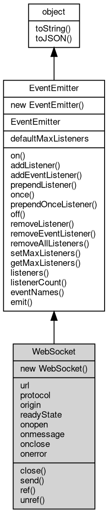

# 对象 WebSocket
WebSocket 是一种基于 TCP 协议的全双工通信协议，在浏览器和服务器之间建立起一个不断开的连接，可以实现实时双向数据传输，并且可以支持任意格式的数据传输。在 fibjs 中，WebSocket 支持模块提供了相应的 API 接口，可以实现 WebSocket 服务器端和客户端的开发

WebSocket 支持模块只是 WebSocket 协议的一个实现，需要在 HTTP 协议之上才能工作。在服务器端，可以通过 upgrade 函数将 HTTP 请求转换为 WebSocket 连接，而在客户端，则需要通过 WebSocket 协议的 URL 来指定需要连接的服务器地址。

启动WebSocket服务器示例：

```JavaScript
var ws = require('ws');
var http = require('http');

var svr = new http.Server(80, {
    '/ws': ws.upgrade(conn => {
        conn.onmessage = e => {
            conn.send('fibjs:' + e.data);
        };
    })
});
svr.start();
```

在客户端中与上述服务器建立连接的示例：

```JavaScript
var ws = require("ws");

var conn = new ws.Socket("ws://127.0.0.1/ws");
// emit open event
conn.onopen = () => {
    console.log("websocket connected");
    conn.send("hi");
};
// emit close event
conn.onmessage = evt => {
    console.log("websocket receive: " + evt.data);
};
```

## 继承关系


## 构造函数
        
### WebSocket
**WebSocket 构造函数**

```JavaScript
new WebSocket(String url,
    String protocol = "",
    String origin = "");
```

调用参数:
* url: String, 指定连接的服务器
* protocol: String, 指定握手协议，缺省为 ""
* origin: String, 指定握手时模拟的源，缺省为 ""

--------------------------
**WebSocket 构造函数**

```JavaScript
new WebSocket(String url,
    Object opts);
```

调用参数:
* url: String, 指定连接的服务器
* opts: Object, 连接选项，缺省是 {}

opts 包含请求的附加选项，支持的内容如下：

```JavaScript
{
    "protocol": "", // specify the sub-protocol, default is ""
    "origin": "", // specify the origin, default is ""
    "perMessageDeflate": false, // specify whether to enable permessage-deflate, default is false
    "maxPayload": 67108864, // specify the max payload size, default is 64MB
    "httpClient": hc, // specify the http client, default is null, use the global http client
    "headers": // specify the http headers, default is {}
}
```

## 静态属性
        
### defaultMaxListeners
**Integer, 默认全局最大监听器数**

```JavaScript
static Integer WebSocket.defaultMaxListeners;
```

## 成员属性
        
### url
**String, 查询当前对象连接的服务器**

```JavaScript
readonly String WebSocket.url;
```

--------------------------
### protocol
**String, 查询当前对象连接时的协议**

```JavaScript
readonly String WebSocket.protocol;
```

--------------------------
### origin
**String, 查询当前对象连接的源**

```JavaScript
readonly String WebSocket.origin;
```

--------------------------
### readyState
**Integer, 查询当前对象的连接状态，参见 [ws](../../module/ifs/ws.md)**

```JavaScript
readonly Integer WebSocket.readyState;
```

--------------------------
### onopen
**Function, 查询和绑定连接成功事件，相当于 on("open", func);**

```JavaScript
Function WebSocket.onopen;
```

--------------------------
### onmessage
**Function, 查询和绑定接受到对方消息的事件，相当于 on("message", func);**

```JavaScript
Function WebSocket.onmessage;
```

--------------------------
### onclose
**Function, 查询和绑定连接关闭的事件，相当于 on("close", func);**

```JavaScript
Function WebSocket.onclose;
```

--------------------------
### onerror
**Function, 查询和绑定错误发生的事件，相当于 on("error", func);**

```JavaScript
Function WebSocket.onerror;
```

## 成员函数
        
### close
**关闭当前连接，此操作会向对方发送 CLOSE 数据包，并等待对方响应**

```JavaScript
WebSocket.close(Integer code = 1000,
    String reason = "");
```

调用参数:
* code: Integer, 指定关闭的代码，允许值为 3000-4999 或者 1000，缺省为 1000
* reason: String, 指定关闭的原因，缺省为 ""

--------------------------
### send
**向对方发送一段文本**

```JavaScript
WebSocket.send(String data);
```

调用参数:
* data: String, 指定发送的文本

--------------------------
**向对方发送一段二进制数据**

```JavaScript
WebSocket.send(Buffer data);
```

调用参数:
* data: [Buffer](Buffer.md), 指定发送的二进制数据

--------------------------
### ref
**维持 fibjs 进程不退出，在对象绑定期间阻止 fibjs 进程退出**

```JavaScript
WebSocket WebSocket.ref();
```

返回结果:
* WebSocket, 返回当前对象

--------------------------
### unref
**允许 fibjs 进程退出，在对象绑定期间允许 fibjs 进程退出**

```JavaScript
WebSocket WebSocket.unref();
```

返回结果:
* WebSocket, 返回当前对象

--------------------------
### on
**绑定一个事件处理函数到对象**

```JavaScript
Object WebSocket.on(String ev,
    Function func);
```

调用参数:
* ev: String, 指定事件的名称
* func: Function, 指定事件处理函数

返回结果:
* Object, 返回事件对象本身，便于链式调用

--------------------------
**绑定一个事件处理函数到对象**

```JavaScript
Object WebSocket.on(Object map);
```

调用参数:
* map: Object, 指定事件映射关系，对象属性名称将作为事件名称，属性的值将作为事件处理函数

返回结果:
* Object, 返回事件对象本身，便于链式调用

--------------------------
### addListener
**绑定一个事件处理函数到对象**

```JavaScript
Object WebSocket.addListener(String ev,
    Function func);
```

调用参数:
* ev: String, 指定事件的名称
* func: Function, 指定事件处理函数

返回结果:
* Object, 返回事件对象本身，便于链式调用

--------------------------
**绑定一个事件处理函数到对象**

```JavaScript
Object WebSocket.addListener(Object map);
```

调用参数:
* map: Object, 指定事件映射关系，对象属性名称将作为事件名称，属性的值将作为事件处理函数

返回结果:
* Object, 返回事件对象本身，便于链式调用

--------------------------
### addEventListener
**绑定一个事件处理函数到对象**

```JavaScript
Object WebSocket.addEventListener(String ev,
    Function func,
    Object options = {});
```

调用参数:
* ev: String, 指定事件的名称
* func: Function, 指定事件处理函数
* options: Object, 指定事件处理函数的选项

返回结果:
* Object, 返回事件对象本身，便于链式调用

options 参数是一个对象，它可以包含以下属性：
- once: 如果为 true，则事件处理函数只会触发一次，触发后会被移除

--------------------------
### prependListener
**绑定一个事件处理函数到对象起始**

```JavaScript
Object WebSocket.prependListener(String ev,
    Function func);
```

调用参数:
* ev: String, 指定事件的名称
* func: Function, 指定事件处理函数

返回结果:
* Object, 返回事件对象本身，便于链式调用

--------------------------
**绑定一个事件处理函数到对象起始**

```JavaScript
Object WebSocket.prependListener(Object map);
```

调用参数:
* map: Object, 指定事件映射关系，对象属性名称将作为事件名称，属性的值将作为事件处理函数

返回结果:
* Object, 返回事件对象本身，便于链式调用

--------------------------
### once
**绑定一个一次性事件处理函数到对象，一次性处理函数只会触发一次**

```JavaScript
Object WebSocket.once(String ev,
    Function func);
```

调用参数:
* ev: String, 指定事件的名称
* func: Function, 指定事件处理函数

返回结果:
* Object, 返回事件对象本身，便于链式调用

--------------------------
**绑定一个一次性事件处理函数到对象，一次性处理函数只会触发一次**

```JavaScript
Object WebSocket.once(Object map);
```

调用参数:
* map: Object, 指定事件映射关系，对象属性名称将作为事件名称，属性的值将作为事件处理函数

返回结果:
* Object, 返回事件对象本身，便于链式调用

--------------------------
### prependOnceListener
**绑定一个事件处理函数到对象起始**

```JavaScript
Object WebSocket.prependOnceListener(String ev,
    Function func);
```

调用参数:
* ev: String, 指定事件的名称
* func: Function, 指定事件处理函数

返回结果:
* Object, 返回事件对象本身，便于链式调用

--------------------------
**绑定一个事件处理函数到对象起始**

```JavaScript
Object WebSocket.prependOnceListener(Object map);
```

调用参数:
* map: Object, 指定事件映射关系，对象属性名称将作为事件名称，属性的值将作为事件处理函数

返回结果:
* Object, 返回事件对象本身，便于链式调用

--------------------------
### off
**从对象处理队列中取消指定函数**

```JavaScript
Object WebSocket.off(String ev,
    Function func);
```

调用参数:
* ev: String, 指定事件的名称
* func: Function, 指定事件处理函数

返回结果:
* Object, 返回事件对象本身，便于链式调用

--------------------------
**取消对象处理队列中的全部函数**

```JavaScript
Object WebSocket.off(String ev);
```

调用参数:
* ev: String, 指定事件的名称

返回结果:
* Object, 返回事件对象本身，便于链式调用

--------------------------
**从对象处理队列中取消指定函数**

```JavaScript
Object WebSocket.off(Object map);
```

调用参数:
* map: Object, 指定事件映射关系，对象属性名称作为事件名称，属性的值作为事件处理函数

返回结果:
* Object, 返回事件对象本身，便于链式调用

--------------------------
### removeListener
**从对象处理队列中取消指定函数**

```JavaScript
Object WebSocket.removeListener(String ev,
    Function func);
```

调用参数:
* ev: String, 指定事件的名称
* func: Function, 指定事件处理函数

返回结果:
* Object, 返回事件对象本身，便于链式调用

--------------------------
**取消对象处理队列中的全部函数**

```JavaScript
Object WebSocket.removeListener(String ev);
```

调用参数:
* ev: String, 指定事件的名称

返回结果:
* Object, 返回事件对象本身，便于链式调用

--------------------------
**从对象处理队列中取消指定函数**

```JavaScript
Object WebSocket.removeListener(Object map);
```

调用参数:
* map: Object, 指定事件映射关系，对象属性名称作为事件名称，属性的值作为事件处理函数

返回结果:
* Object, 返回事件对象本身，便于链式调用

--------------------------
### removeEventListener
**从对象处理队列中取消指定函数**

```JavaScript
Object WebSocket.removeEventListener(String ev,
    Function func,
    Object options = {});
```

调用参数:
* ev: String, 指定事件的名称
* func: Function, 指定事件处理函数
* options: Object, 指定事件处理函数的选项

返回结果:
* Object, 返回事件对象本身，便于链式调用

--------------------------
### removeAllListeners
**从对象处理队列中取消所有事件的所有监听器， 如果指定事件，则移除指定事件的所有监听器。**

```JavaScript
Object WebSocket.removeAllListeners(String ev);
```

调用参数:
* ev: String, 指定事件的名称

返回结果:
* Object, 返回事件对象本身，便于链式调用

--------------------------
**从对象处理队列中取消所有事件的所有监听器， 如果指定事件，则移除指定事件的所有监听器。**

```JavaScript
Object WebSocket.removeAllListeners(Array evs = []);
```

调用参数:
* evs: Array, 指定事件的名称

返回结果:
* Object, 返回事件对象本身，便于链式调用

--------------------------
### setMaxListeners
**监听器的默认限制的数量，仅用于兼容**

```JavaScript
WebSocket.setMaxListeners(Integer n);
```

调用参数:
* n: Integer, 指定事件的数量

--------------------------
### getMaxListeners
**获取监听器的默认限制的数量，仅用于兼容**

```JavaScript
Integer WebSocket.getMaxListeners();
```

返回结果:
* Integer, 返回默认限制数量

--------------------------
### listeners
**查询对象指定事件的监听器数组**

```JavaScript
Array WebSocket.listeners(String ev);
```

调用参数:
* ev: String, 指定事件的名称

返回结果:
* Array, 返回指定事件的监听器数组

--------------------------
### listenerCount
**查询对象指定事件的监听器数量**

```JavaScript
Integer WebSocket.listenerCount(String ev);
```

调用参数:
* ev: String, 指定事件的名称

返回结果:
* Integer, 返回指定事件的监听器数量

--------------------------
**查询对象指定事件的监听器数量**

```JavaScript
Integer WebSocket.listenerCount(Value o,
    String ev);
```

调用参数:
* o: Value, 指定查询的对象
* ev: String, 指定事件的名称

返回结果:
* Integer, 返回指定事件的监听器数量

--------------------------
### eventNames
**查询监听器事件名称**

```JavaScript
Array WebSocket.eventNames();
```

返回结果:
* Array, 返回事件名称数组

--------------------------
### emit
**主动触发一个事件**

```JavaScript
Boolean WebSocket.emit(String ev,
    ...args);
```

调用参数:
* ev: String, 事件名称
* args: ..., 事件参数，将会传递给事件处理函数

返回结果:
* Boolean, 返回事件触发状态，有响应事件返回 true，否则返回 false

--------------------------
### toString
**返回对象的字符串表示，一般返回 "[Native Object]"，对象可以根据自己的特性重新实现**

```JavaScript
String WebSocket.toString();
```

返回结果:
* String, 返回对象的字符串表示

--------------------------
### toJSON
**返回对象的 JSON 格式表示，一般返回对象定义的可读属性集合**

```JavaScript
Value WebSocket.toJSON(String key = "");
```

调用参数:
* key: String, 未使用

返回结果:
* Value, 返回包含可 JSON 序列化的值

