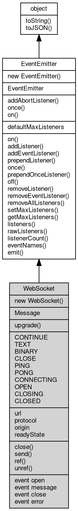

# Object WebSocket
A WebSocket client and server endpoint, the fibjs implementation of the WebSocket API

A WebSocket connection starts as an HTTP/1.1 request carrying an Upgrade
handshake and, after the server answers 101, becomes a full-duplex message
channel between exactly two peers. fibjs exposes both ends of the protocol
through this interface:

- a client is created by the `WebSocket` constructor with a `ws://` or
  `wss://` URL; the handshake runs asynchronously and the `open` event
  reports success;
- a server [object](object.md) is produced by the `WebSocket.upgrade` handler, which
  converts matching HTTP upgrade requests into connected sockets.

Concepts:
- Handshake: the client sends `Upgrade: websocket`, `Connection: Upgrade`,
  `Sec-WebSocket-Version: 13` and a random `Sec-WebSocket-Key`; the server
  answers 101 with the matching `Sec-WebSocket-Accept` header. A failed
  handshake raises the `error` event and then the `close` event.
- Frame [types](../../module/ifs/types.md): TEXT (1), BINARY (2), CLOSE (8), PING (9), PONG (10) and
  CONTINUE (0) fragments. Received fragments are re-assembled into one
  [WebSocketMessage](WebSocketMessage.md) before the `message` event fires.
- Text and binary data: `msg.data` is a String for TEXT messages and a
  [Buffer](Buffer.md) for BINARY messages. `send` accepts a [Buffer](Buffer.md), a typed array, an
  ArrayBuffer or a [Blob](Blob.md) and sends a BINARY frame; every other value is
  sent as its string form in a TEXT frame, so `send(null)` sends the text
  "null" and `send(123)` sends "123".
- Ping/pong keep-alive: a PING frame from the peer is answered with a PONG
  frame automatically and PONG frames are consumed silently; there is no
  manual ping API.
- Closing: `close(code, reason)` sends a CLOSE frame; close codes are
  limited to 1000 or 3000-4999. When the peer drops the connection without
  a close handshake, the `close` event reports code 1006, "Abnormal
  Closure".
- permessage-deflate: compression is negotiated only when the client
  enables the `perMessageDeflate` option and the server enables it in
  `WebSocket.upgrade`; on a compressed connection a compressed message
  reports `WebSocketMessage.compress` as true.
- Sub-protocols: the client may offer a list of protocols and the server
  selects one of its own; the selected value is available as `protocol`.
  When the client offers protocols and the server does not select one, the
  client aborts the handshake.
- Server-side sockets have empty `url` and `origin`; the handshake request
  received by the accept callback carries the original header values.
- Node.js and the DOM expose only the client role, so the
  `WebSocket.upgrade` handler is a fibjs extension. The `message` event
  delivers the [WebSocketMessage](WebSocketMessage.md) [object](object.md) itself rather than a DOM
  [MessageEvent](MessageEvent.md), and binary payloads are Buffers rather than ArrayBuffers.

Obtained from:
- `new WebSocket([url](../../module/ifs/url.md), ...)` — client connection; `[url](../../module/ifs/url.md)` must use the `ws://`
  or `wss://` scheme;
- `WebSocket.upgrade(opts, accept)` — protocol handler for an [HttpServer](HttpServer.md)
  route, a [Routing](Routing.md) table or a [Chain](Chain.md); the accept callback receives the
  connected WebSocket.

Notes:
- An `error` event with no registered listener is re-thrown as an unhandled
  error, so bind `onerror` whenever the handshake may fail.

Example 1 — an echo server and a client exchanging text and binary frames:

```JavaScript
const http = require('http');

const server = new http.Server(0, {
    '/ws': WebSocket.upgrade((conn) => {
        conn.onmessage = (msg) => conn.send(msg.data); // echo the payload as it arrived
    })
});
server.start();
const port = server.socket.localPort;

const sock = new WebSocket('ws://127.0.0.1:' + port + '/ws');
let count = 0;
sock.onopen = () => sock.send('hello');
sock.onmessage = (msg) => {
    console.log(typeof msg.data, msg.data); // string hello on the first call
    if (count++ === 0)
        sock.send(Buffer.from([1, 2, 3]));
    else
        sock.close(1000, 'done');
};
sock.onclose = (ev) => {
    console.log(ev.code, ev.reason); // 1000 done
    server.stop();
};
```

Example 2 — sub-protocol selection and permessage-deflate compression:

```JavaScript
const http = require('http');

const server = new http.Server(0, {
    '/ws': WebSocket.upgrade({
        protocols: ['json', 'text'],
        perMessageDeflate: true
    }, (conn) => {
        console.log(conn.protocol); // json: selected from the client offer
        conn.onmessage = (msg) => {
            console.log(msg.compress, msg.data.length); // true 88
            conn.send(msg.data);
        };
    })
});
server.start();
const port = server.socket.localPort;

const sock = new WebSocket('ws://127.0.0.1:' + port + '/ws', {
    protocols: ['json', 'text'],
    perMessageDeflate: true
});
sock.onopen = () => sock.send('deflate me '.repeat(8)); // 88 characters
sock.onmessage = (msg) => {
    console.log(sock.protocol, msg.compress); // json true
    sock.close();
};
sock.onclose = () => server.stop();
```

Example 3 — a failed handshake reported through error and close:

```JavaScript
const http = require('http');

const server = new http.Server(0, (req) => {
    req.response.write('plain HTTP, not a websocket endpoint');
});
server.start();
const port = server.socket.localPort;

const sock = new WebSocket('ws://127.0.0.1:' + port + '/');
sock.onopen = () => console.log('never fires');
sock.onerror = (ev) => console.log('error', ev.code, ev.reason); // 1002 server error.
sock.onclose = (ev) => {
    console.log('close', ev.code, ev.reason); // 1006 Abnormal Closure
    server.stop();
};
```

## Inheritance

```dot
digraph {
    node [fontname="Helvetica,sans-Serif", fontsize=10, shape="record", style="filled", fillcolor="white"];

    object [tooltip="object", URL="object.md", label="{object|toString()\ltoJSON()\l}"];
    EventEmitter [tooltip="EventEmitter", URL="EventEmitter.md", label="{EventEmitter|new EventEmitter()\l|EventEmitter\l|addAbortListener()\lonce()\lon()\l|defaultMaxListeners\l|on()\laddListener()\laddEventListener()\lprependListener()\lonce()\lprependOnceListener()\loff()\lremoveListener()\lremoveEventListener()\lremoveAllListeners()\lsetMaxListeners()\lgetMaxListeners()\llisteners()\lrawListeners()\llistenerCount()\leventNames()\lemit()\l}"];
    WebSocket [tooltip="WebSocket", fillcolor="lightgray", id="me", label="{WebSocket|new WebSocket()\l|Message\l|upgrade()\l|CONTINUE\lTEXT\lBINARY\lCLOSE\lPING\lPONG\lCONNECTING\lOPEN\lCLOSING\lCLOSED\l|url\lprotocol\lorigin\lreadyState\l|close()\lsend()\lref()\lunref()\l|event open\levent message\levent close\levent error\l}"];

    object -> EventEmitter [dir=back];
    EventEmitter -> WebSocket [dir=back];
}
```

## Constructors
        
### WebSocket
**Creates a client and starts the handshake with a list of sub-protocols**

```JavaScript
new WebSocket(String url,
    String protocols[],
    String origin = "");
```

Parameters:
* url: String, the server address, using the `ws://` or `wss://` scheme
* protocols[]: String, the list of sub-protocols offered to the server
* origin: String, the origin to simulate during the handshake, "" by default

The connection is asynchronous: the constructor returns with readyState
CONNECTING, the handshake runs in the background and `open` fires after
the server accepted. A rejected upgrade, a missing Sec-WebSocket-Accept
header, or a server that does not select one of the offered protocols
raises `error` and then `close` instead.

The three constructor forms differ only in how the handshake is
described: this one offers a protocol list, the single-protocol form
offers one value and the options form collects everything in one
[object](object.md). When the server selects a protocol it is reported by the
`protocol` property.

`origin` is sent as the `Origin` header and stored in the `origin`
property; an empty string omits the header.

--------------------------
**Creates a client with all handshake options in one [object](object.md)**

```JavaScript
new WebSocket(String url,
    Object opts);
```

Parameters:
* url: String, the server address, using the `ws://` or `wss://` scheme
* opts: Object, connection options, {} by default

opts contains additional options for the request, the supported contents are as follows:

```JavaScript
// fragment: options
({
    "protocol": "", // a single sub-protocol, "" when omitted
    "protocols": [], // a list of sub-protocols, takes precedence over protocol
    "origin": "", // the value of the Origin header, "" when omitted
    "perMessageDeflate": false, // request permessage-deflate compression
    "maxPayload": 67108864, // max accepted message size in bytes (64 MB)
    "httpClient": null, // the HttpClient used for the handshake, the global one by default
    "headers": {} // extra headers sent with the handshake request
})
```

Both protocol forms end up in the `Sec-WebSocket-Protocol` request
header and the server may select one of them. `maxPayload` limits
incoming messages; a larger message fails the connection with error
code 1009 (see the [WebSocketMessage](WebSocketMessage.md) maxSize property).

--------------------------
**Creates a client and starts the handshake with a single sub-protocol**

```JavaScript
new WebSocket(String url,
    String protocol = "",
    String origin = "");
```

Parameters:
* url: String, the server address, using the `ws://` or `wss://` scheme
* protocol: String, the single sub-protocol offered to the server, "" by default
* origin: String, the origin to simulate during the handshake, "" by default

This form is equivalent to passing a one-element protocols array to the
first constructor, and the selected protocol is reported by `protocol`.
Unlike the options form, `perMessageDeflate` and extra headers cannot be
set here.

## Objects
        
### Message
**The [WebSocketMessage](WebSocketMessage.md) class, reachable as `WebSocket.Message`**

```JavaScript
WebSocketMessage WebSocket.Message;
```

The class is not a [global](../../module/ifs/global.md) variable; use this property (or
`new [WebSocket.Message](WebSocket.md#Message)()`) to build protocol messages by hand, as the
[WebSocketMessage](WebSocketMessage.md) examples do.

## Static Methods
        
### upgrade
**Creates a WebSocket protocol handler with default options**

```JavaScript
static Handler WebSocket.upgrade(Function(WebSocket conn, HttpRequest req) accept);
```

Parameters:
* accept: Function(WebSocket conn, [HttpRequest](HttpRequest.md) req), called with the connected WebSocket and the handshake [HttpRequest](HttpRequest.md)

Returns:
* [Handler](Handler.md), the protocol handler

The returned handler turns an HTTP upgrade request into a connected
WebSocket and calls accept(conn, req) after the 101 response has been
sent. A request without a valid WebSocket handshake is answered with an
error status. When accept runs, `conn.protocol` is already final and
`req` is the [HttpRequest](HttpRequest.md) of the handshake, useful to read headers such as
Origin or the requested address.

The handler is a routing handler: use it as the value of an [HttpServer](HttpServer.md)
route, inside a [Routing](Routing.md) table or in a [Chain](Chain.md).

--------------------------
**Creates a WebSocket protocol handler with explicit options**

```JavaScript
static Handler WebSocket.upgrade(Object opts,
    Function(WebSocket conn, HttpRequest req) accept);
```

Parameters:
* opts: Object, connection options, {} by default
* accept: Function(WebSocket conn, [HttpRequest](HttpRequest.md) req), called with the connected WebSocket and the handshake [HttpRequest](HttpRequest.md)

Returns:
* [Handler](Handler.md), the protocol handler

opts contains additional options for the handshake, the supported contents are as follows:

```JavaScript
// fragment: options
({
    "protocol": "", // a single sub-protocol accepted by the server
    "protocols": [], // a list of accepted sub-protocols, takes precedence over protocol
    "perMessageDeflate": false, // accept permessage-deflate compression
    "maxPayload": 67108864 // max accepted message size in bytes (64 MB)
})
```

The server selects the first protocol of the client offer that appears
in its own list and echoes it in `Sec-WebSocket-Protocol`; when nothing
matches, the handshake succeeds without a sub-protocol and a client that
offered one aborts the connection. permessage-deflate is enabled only
when the client requests it too. A message larger than maxPayload fails
the connection: the local `error` event reports code 1009 and `close`
reports 1006.

--------------------------
### addAbortListener
**Registers a one-shot abort handler on an [AbortSignal](AbortSignal.md)**

```JavaScript
static Object WebSocket.addAbortListener(EventEmitter signal,
    Function(Object ev) func);
```

Parameters:
* signal: [EventEmitter](EventEmitter.md), the [AbortSignal](AbortSignal.md) [object](object.md) to listen to
* func: Function(Object ev), the handler for the abort event

Returns:
* Object, returns a Disposable [object](object.md) containing a `[Symbol.dispose]` method

The handler is called at most once when the signal is aborted, and it is removed from the
signal afterwards. If the signal is already aborted the handler is invoked synchronously.
The returned [object](object.md) has a `[Symbol.dispose]()` method that removes the handler, so it can be
released before the abort happens.

Example — abort handling with automatic cleanup:

```JavaScript
const events = require('events');

const controller = new AbortController();
const disposable = events.addAbortListener(controller.signal,
    () => console.log('aborted'));

controller.abort(); // aborted
disposable[Symbol.dispose](); // safe to call after the listener fired
console.log(controller.signal.listenerCount('abort')); // 0
```

--------------------------
### once
**Creates a Promise resolved by the next occurrence of an event**

```JavaScript
static Object WebSocket.once(EventEmitter emitter,
    Value ev,
    Object options = {});
```

Parameters:
* emitter: [EventEmitter](EventEmitter.md), the event emitter [object](object.md) to listen to
* ev: Value, the event name to listen for
* options: Object, optional parameter [object](object.md)

Returns:
* Object, returns a Promise that resolves with the array of event parameters

The Promise resolves with the array of the emit arguments when the event fires; it rejects
when `error` is emitted while waiting, unless the waited event is `error` itself, or when
the signal option aborts. The temporary listeners are removed when the Promise settles.

options supports the following option:

```JavaScript
// fragment: options
({
    "signal": null // AbortSignal; aborting rejects the Promise with an AbortError
});
```

Example — awaiting the next occurrence of an event:

```JavaScript
const EventEmitter = require('events');

(async () => {
    const emitter = new EventEmitter();
    const waiting = EventEmitter.once(emitter, 'ready');

    emitter.emit('ready', 200, 'ok');
    console.log(JSON.stringify(await waiting)); // [200,"ok"]
})();
```

--------------------------
### on
**Creates an async iterator that yields event occurrences**

```JavaScript
static Object WebSocket.on(EventEmitter emitter,
    Value ev,
    Object options = {});
```

Parameters:
* emitter: [EventEmitter](EventEmitter.md), the event emitter [object](object.md) to listen to
* ev: Value, the event name to listen for
* options: Object, optional parameter [object](object.md)

Returns:
* Object, returns an AsyncIterator [object](object.md)

Each next() resolves with `{ value: [args...], done: false }` when the event fires and with
`{ done: true }` after an event named in the `close` option fires or the signal aborts; an
`error` event rejects the pending call. The listeners are registered when the iterator is
created and removed when the iteration ends or the signal aborts.

options supports the following options:

```JavaScript
// fragment: options
({
    "signal": null, // AbortSignal; aborting rejects pending and future next() calls
    "close": [] // event names; the first one to fire ends the iteration
});
```

Example — iterating the occurrences of an event:

```JavaScript
const EventEmitter = require('events');

(async () => {
    const emitter = new EventEmitter();
    const iterator = EventEmitter.on(emitter, 'data', {
        close: ['end']
    });

    emitter.emit('data', 1);
    emitter.emit('data', 2);
    emitter.emit('end');

    for await (const args of iterator)
    console.log(JSON.stringify(args)); // [1] then [2]
})();
```

## Static Properties
        
### defaultMaxListeners
**Integer, The [process](../../module/ifs/process.md)-wide default listener limit reported by getMaxListeners()**

```JavaScript
static Integer WebSocket.defaultMaxListeners;
```

Defaults to 10. Assigning a value changes getMaxListeners() for every emitter that never
called setMaxListeners(); an emitter with an explicit limit keeps it. The limit is
informational: fibjs never warns when the number of listeners exceeds it.

## Constants
        
### CONTINUE
**Frame type of a continuation frame; fragments carry the rest of a message**

```JavaScript
const WebSocket.CONTINUE = 0;
```

--------------------------
### TEXT
**Frame type of a text frame whose payload is a UTF-8 string**

```JavaScript
const WebSocket.TEXT = 1;
```

--------------------------
### BINARY
**Frame type of a binary frame whose payload is binary data**

```JavaScript
const WebSocket.BINARY = 2;
```

--------------------------
### CLOSE
**Frame type of a close frame carrying the close code and reason**

```JavaScript
const WebSocket.CLOSE = 8;
```

--------------------------
### PING
**Frame type of a ping frame, answered with a pong frame automatically**

```JavaScript
const WebSocket.PING = 9;
```

--------------------------
### PONG
**Frame type of a pong frame, consumed silently by the protocol layer**

```JavaScript
const WebSocket.PONG = 10;
```

--------------------------
### CONNECTING
**Connection state: the handshake is in progress (0)**

```JavaScript
const WebSocket.CONNECTING = 0;
```

--------------------------
### OPEN
**Connection state: the handshake completed and data can be exchanged (1)**

```JavaScript
const WebSocket.OPEN = 1;
```

--------------------------
### CLOSING
**Connection state: a close frame is being exchanged (2)**

```JavaScript
const WebSocket.CLOSING = 2;
```

--------------------------
### CLOSED
**Connection state: the connection is closed and no more data can be exchanged (3)**

```JavaScript
const WebSocket.CLOSED = 3;
```

## Properties
        
### url
**String, Queries the URL of the server the client connected to**

```JavaScript
readonly String WebSocket.url;
```

For a client socket this is the URL passed to the constructor. A socket
created by `WebSocket.upgrade` has no URL of its own and reports "";
read the requested address from the [HttpRequest](HttpRequest.md) received by the accept
callback instead.

--------------------------
### protocol
**String, Queries the sub-protocol negotiated during the handshake**

```JavaScript
readonly String WebSocket.protocol;
```

The value is "" before the handshake completes and stays "" when no
sub-protocol was selected. On a client it comes from the
`Sec-WebSocket-Protocol` response header; on a server socket it is the
protocol selected by `WebSocket.upgrade` from the client offer.

--------------------------
### origin
**String, Queries the origin used during the handshake**

```JavaScript
readonly String WebSocket.origin;
```

The value is the `origin` constructor argument or option, which is also
sent as the `Origin` request header. Server-side sockets report "";
read the `Origin` header from the handshake [HttpRequest](HttpRequest.md) instead.

--------------------------
### readyState
**Integer, Queries the connection state: CONNECTING, OPEN, CLOSING or CLOSED**

```JavaScript
readonly Integer WebSocket.readyState;
```

A client starts in CONNECTING, becomes OPEN when the handshake completes
and moves to CLOSING while a close frame is exchanged. The state is
CLOSED after a normal close, after a failed handshake and after an
abnormal loss of the connection, once the `close` event has fired.

## Methods
        
### close
**Closes the connection by sending a CLOSE frame to the peer**

```JavaScript
WebSocket.close(Integer code = 1000,
    String reason = "");
```

Parameters:
* code: Integer, the close code: 1000 or 3000-4999, 1000 by default
* reason: String, the close reason carried by the CLOSE frame, "" by default

The close code must be 1000 or a value between 3000 and 4999; any other
value throws. The call returns immediately and the socket is released in
the background, then the `close` event reports the code and the reason.

Calling close() when the socket is not OPEN is a no-op: in particular a
close() during CONNECTING does not cancel the handshake, and calling
close() a second time after it started is harmless.

--------------------------
### send
**Sends data to the peer; binary values use a BINARY frame, other values a text frame**

```JavaScript
WebSocket.send(Value data);
```

Parameters:
* data: Value, the data to send

A [Buffer](Buffer.md), a typed array, an ArrayBuffer or a [Blob](Blob.md) is sent as a BINARY
frame; every other value is converted to its string form and sent as a
TEXT frame, so `send(123)` sends the text "123", `send(null)` sends
"null" and `send(['a', 'b'])` sends "a,b". Frames are queued and sent
in call order; there is no per-message completion callback and failures
of the local state (for example when the socket is not OPEN) throw.

Sending while the socket is CONNECTING, CLOSING or CLOSED throws, the
same restriction the DOM WebSocket has.

Example — the accepted data forms and the frame each one produces:

```JavaScript
const http = require('http');

const server = new http.Server(0, {
    '/ws': WebSocket.upgrade((conn) => {
        conn.onmessage = (msg) => console.log(msg.type, String(msg.data));
    })
});
server.start();
const port = server.socket.localPort;

const sock = new WebSocket('ws://127.0.0.1:' + port + '/ws');
sock.onopen = () => {
    sock.send('text'); // WebSocket.TEXT "text"
    sock.send(Buffer.from('binary')); // WebSocket.BINARY "binary"
    sock.send(new Uint8Array([65, 66])); // WebSocket.BINARY "AB"
    sock.send(null); // WebSocket.TEXT "null"
    sock.close();
};
sock.onclose = () => server.stop();
```

--------------------------
### ref
**Keeps the fibjs [process](../../module/ifs/process.md) alive while this socket is bound**

```JavaScript
WebSocket WebSocket.ref();
```

Returns:
* WebSocket, the socket itself

The socket holds the event loop open until it is closed; `unref` releases
it again. Returns the socket itself, so calls can be chained.

--------------------------
### unref
**Allows the fibjs [process](../../module/ifs/process.md) to exit while this socket is bound**

```JavaScript
WebSocket WebSocket.unref();
```

Returns:
* WebSocket, the socket itself

The socket no longer holds the event loop open; `ref` restores the
default. Returns the socket itself, so calls can be chained.

--------------------------
### on
**Appends an event handler to the emitter**

```JavaScript
Object WebSocket.on(Value ev,
    Function(...args) func);
```

Parameters:
* ev: Value, the event name to bind
* func: Function(...args), the event handler function, called with the emit arguments

Returns:
* Object, returns the event [object](object.md) itself for chaining

The listener is called with the arguments of emit() and `this` set to the emitter; the
emitter itself is returned so registrations can be chained. The same function may be
registered several times for one event and each copy is called. See the class documentation
for the dispatch order.

--------------------------
**Appends several event handlers to the emitter**

```JavaScript
Object WebSocket.on(Object map);
```

Parameters:
* map: Object, the event mapping; [object](object.md) property names are used as event names

Returns:
* Object, returns the event [object](object.md) itself for chaining

Every enumerable property of the map whose value is a function is registered under its
property name. Properties are processed in order; a value that is not a function makes the
call fail with an invalid-type error while entries processed before it stay registered.

Example — registering several handlers at once:

```JavaScript
const EventEmitter = require('events');

const emitter = new EventEmitter();
emitter.on({
    connect: () => console.log('connect'),
    close: () => console.log('close')
});

emitter.emit('connect'); // connect
emitter.emit('close'); // close
```

--------------------------
### addListener
**Appends an event handler to the emitter**

```JavaScript
Object WebSocket.addListener(Value ev,
    Function(...args) func);
```

Parameters:
* ev: Value, the event name to bind
* func: Function(...args), the event handler function

Returns:
* Object, returns the event [object](object.md) itself for chaining

Alias of on(ev, func), provided for Node.js compatibility.

--------------------------
**Appends several event handlers to the emitter**

```JavaScript
Object WebSocket.addListener(Object map);
```

Parameters:
* map: Object, the event mapping; [object](object.md) property names are used as event names

Returns:
* Object, returns the event [object](object.md) itself for chaining

Alias of on(map), provided for Node.js compatibility.

--------------------------
### addEventListener
**Appends an event handler to the emitter with an options [object](object.md)**

```JavaScript
Object WebSocket.addEventListener(Value ev,
    Function(...args) func,
    Object options = {});
```

Parameters:
* ev: Value, the event name to bind
* func: Function(...args), the event handler function, called with the emit arguments
* options: Object, the options of the event handler

Returns:
* Object, returns the event [object](object.md) itself for chaining

Web-style alias of on(); the only supported option is `once`, which registers a one-shot
handler exactly like once(). The listener receives the plain emit arguments and not an [Event](Event.md)
[object](object.md); see the [DOMEvent](DOMEvent.md) class for the DOM-style event [object](object.md) used by [AbortSignal](AbortSignal.md) and
fetch-style APIs.

options supports the following option:

```JavaScript
// fragment: options
({
    "once": false // when true, the handler is removed before its single invocation
});
```

Example — a one-shot DOM-style registration:

```JavaScript
const EventEmitter = require('events');

const emitter = new EventEmitter();
emitter.addEventListener('ping', () => console.log('ping'), {
    once: true
});

emitter.emit('ping'); // ping
console.log(emitter.emit('ping')); // false
console.log(emitter.listenerCount('ping')); // 0
```

--------------------------
### prependListener
**Inserts an event handler at the front of the queue**

```JavaScript
Object WebSocket.prependListener(Value ev,
    Function(...args) func);
```

Parameters:
* ev: Value, the event name to bind
* func: Function(...args), the event handler function

Returns:
* Object, returns the event [object](object.md) itself for chaining

The listener is called before the listeners registered with on()/addListener() the next time
the event is emitted. When several prependListener() calls are made, the last one registered
is called first, because every call inserts at the same position.

Example — insertion at the front of the queue:

```JavaScript
const EventEmitter = require('events');

const emitter = new EventEmitter();
emitter.on('order', () => console.log('on'));
emitter.prependListener('order', () => console.log('prepend'));

emitter.emit('order'); // prepend, then on
```

--------------------------
**Inserts several event handlers at the front of the queue**

```JavaScript
Object WebSocket.prependListener(Object map);
```

Parameters:
* map: Object, the event mapping; [object](object.md) property names are used as event names

Returns:
* Object, returns the event [object](object.md) itself for chaining

Map form of prependListener(); every function property is inserted at the front, so the
properties of the map are called in reverse order.

--------------------------
### once
**Appends a one-shot event handler to the emitter**

```JavaScript
Object WebSocket.once(Value ev,
    Function(...args) func);
```

Parameters:
* ev: Value, the event name to bind
* func: Function(...args), the event handler function

Returns:
* Object, returns the event [object](object.md) itself for chaining

The handler is wrapped and removes itself from the queue before it is called, so it runs at
most once. off() removes it when passed the original function, listeners() returns the
original function, and rawListeners() returns the internal wrapper whose `_func` property
holds the original. See Example 2 in the class documentation.

--------------------------
**Appends several one-shot event handlers to the emitter**

```JavaScript
Object WebSocket.once(Object map);
```

Parameters:
* map: Object, the event mapping; [object](object.md) property names are used as event names

Returns:
* Object, returns the event [object](object.md) itself for chaining

Map form of once(); every function property is registered as a one-shot listener under its
property name.

--------------------------
### prependOnceListener
**Inserts a one-shot event handler at the front of the queue**

```JavaScript
Object WebSocket.prependOnceListener(Value ev,
    Function(...args) func);
```

Parameters:
* ev: Value, the event name to bind
* func: Function(...args), the event handler function

Returns:
* Object, returns the event [object](object.md) itself for chaining

Combines prependListener() and once(): the handler is called first and only once, and it is
removed before its invocation.

--------------------------
**Inserts several one-shot event handlers at the front of the queue**

```JavaScript
Object WebSocket.prependOnceListener(Object map);
```

Parameters:
* map: Object, the event mapping; [object](object.md) property names are used as event names

Returns:
* Object, returns the event [object](object.md) itself for chaining

Map form of prependOnceListener(); every function property is inserted as a one-shot
listener, and the properties of the map are called in reverse order.

--------------------------
### off
**Removes an event handler from the emitter**

```JavaScript
Object WebSocket.off(Value ev,
    Function(...args) func);
```

Parameters:
* ev: Value, the event name to unbind
* func: Function(...args), the event handler function

Returns:
* Object, returns the event [object](object.md) itself for chaining

The first matching listener is removed; when the same function was registered several times
only one copy is removed per call, so repeat the call to remove the others. A once() wrapper
is matched by its original function as well. Removing a listener emits the `removeListener`
meta event after the removal.

--------------------------
**Removes all event handlers of one event**

```JavaScript
Object WebSocket.off(Value ev);
```

Parameters:
* ev: Value, the event name to unbind

Returns:
* Object, returns the event [object](object.md) itself for chaining

Every listener of the event is removed and `removeListener` is emitted once per removed
listener. The call succeeds when the event has no listener.

Example — removing every listener of one event:

```JavaScript
const EventEmitter = require('events');

const emitter = new EventEmitter();
emitter.on('data', () => console.log('first'));
emitter.on('data', () => console.log('second'));

emitter.off('data');
console.log(emitter.emit('data')); // false
```

--------------------------
**Removes several event handlers from the emitter**

```JavaScript
Object WebSocket.off(Object map);
```

Parameters:
* map: Object, the event mapping; [object](object.md) property names are used as event names

Returns:
* Object, returns the event [object](object.md) itself for chaining

Every enumerable property of the map whose value is a function names an event from which
that function is removed (one copy per event). A value that is not a function makes the call
fail with an invalid-type error.

--------------------------
### removeListener
**Removes an event handler from the emitter**

```JavaScript
Object WebSocket.removeListener(Value ev,
    Function(...args) func);
```

Parameters:
* ev: Value, the event name to unbind
* func: Function(...args), the event handler function

Returns:
* Object, returns the event [object](object.md) itself for chaining

Alias of off(ev, func), provided for Node.js compatibility.

--------------------------
**Removes all event handlers of one event**

```JavaScript
Object WebSocket.removeListener(Value ev);
```

Parameters:
* ev: Value, the event name to unbind

Returns:
* Object, returns the event [object](object.md) itself for chaining

Alias of off(ev), provided for Node.js compatibility.

--------------------------
**Removes several event handlers from the emitter**

```JavaScript
Object WebSocket.removeListener(Object map);
```

Parameters:
* map: Object, the event mapping; [object](object.md) property names are used as event names

Returns:
* Object, returns the event [object](object.md) itself for chaining

Alias of off(map), provided for Node.js compatibility.

--------------------------
### removeEventListener
**Removes an event handler with an options [object](object.md)**

```JavaScript
Object WebSocket.removeEventListener(Value ev,
    Function(...args) func,
    Object options = {});
```

Parameters:
* ev: Value, the event name to unbind
* func: Function(...args), the event handler function
* options: Object, the options of the event handler, ignored

Returns:
* Object, returns the event [object](object.md) itself for chaining

Web-style alias of off(ev, func); the options [object](object.md) is accepted and ignored, and a once()
wrapper is matched by its original function like off().

--------------------------
### removeAllListeners
**Removes all listeners of one event**

```JavaScript
Object WebSocket.removeAllListeners(Value ev);
```

Parameters:
* ev: Value, the event name to remove

Returns:
* Object, returns the event [object](object.md) itself for chaining

Equivalent to off(ev): every listener of the event is removed, including once() wrappers
matched by their original function, and `removeListener` is emitted once per removal.

--------------------------
**Removes all listeners of the given events, or of the whole emitter**

```JavaScript
Object WebSocket.removeAllListeners(Array evs = []);
```

Parameters:
* evs: Array, the event names to remove

Returns:
* Object, returns the event [object](object.md) itself for chaining

An empty array — including the no-argument call, because the parameter defaults to [] —
clears every string-keyed event; symbol-keyed listeners are left in place, unlike Node.js
which removes them too. A non-empty array clears each named event as
removeAllListeners(ev) does.

Example — clearing selected events and the whole emitter:

```JavaScript
const EventEmitter = require('events');

const emitter = new EventEmitter();
emitter.on('a', () => {});
emitter.on('b', () => {});
emitter.on('c', () => {});

emitter.removeAllListeners(['a', 'b']);
console.log(emitter.listenerCount('a'), emitter.listenerCount('c')); // 0 1

emitter.removeAllListeners();
console.log(emitter.eventNames().length); // 0
```

--------------------------
### setMaxListeners
**Stores a per-emitter listener limit**

```JavaScript
WebSocket.setMaxListeners(Integer n);
```

Parameters:
* n: Integer, the number of events

The value is reported by getMaxListeners() and is otherwise informational: fibjs never warns
when the number of listeners exceeds it. This member exists for Node.js compatibility. A
negative value throws; 0 is accepted and stored as-is, while Node.js treats 0 as unlimited.

--------------------------
### getMaxListeners
**Returns the listener limit of the emitter**

```JavaScript
Integer WebSocket.getMaxListeners();
```

Returns:
* Integer, returns the default limit

Returns the value set by setMaxListeners(), or the [process](../../module/ifs/process.md)-wide defaultMaxListeners (10)
when no explicit value was set.

--------------------------
### listeners
**Returns a copy of the listener array of an event**

```JavaScript
Array WebSocket.listeners(Value ev);
```

Parameters:
* ev: Value, the event name to query

Returns:
* Array, returns the listener array of the specified event

One-shot wrappers are unwrapped, so the result contains the functions passed to
on()/once() and can be passed to off(); an unknown event produces an empty array.

Example — once() listeners are returned unwrapped:

```JavaScript
const EventEmitter = require('events');

const emitter = new EventEmitter();

function onTick() {
    console.log('tick');
}

emitter.once('tick', onTick);
console.log(emitter.listeners('tick')[0] === onTick); // true
console.log(emitter.rawListeners('tick')[0] === onTick); // false
```

--------------------------
### rawListeners
**Returns the internal listener array of an event**

```JavaScript
Array WebSocket.rawListeners(Value ev);
```

Parameters:
* ev: Value, the event name to query

Returns:
* Array, returns the listener array of the specified event

The array is not unwrapped: a listener registered with once() appears as the internal
wrapper function whose `_func` property holds the original function. An unknown event
produces an empty array.

--------------------------
### listenerCount
**Returns the number of listeners of an event**

```JavaScript
Integer WebSocket.listenerCount(Value ev);
```

Parameters:
* ev: Value, the event name to query

Returns:
* Integer, returns the number of listeners of the specified event

One-shot listeners count as one and an unknown event returns 0.

--------------------------
**Returns the number of listeners of an event on another [object](object.md)**

```JavaScript
Integer WebSocket.listenerCount(Value o,
    Value ev);
```

Parameters:
* o: Value, the [object](object.md) to query
* ev: Value, the event name to query

Returns:
* Integer, returns the number of listeners of the specified event

Counts without requiring the target to be an [EventEmitter](EventEmitter.md): any [object](object.md) with registered
events can be queried. The call is normally written as
`EventEmitter.listenerCount(target, 'data')`.

Example — counting the listeners of another [object](object.md):

```JavaScript
const EventEmitter = require('events');

const emitter = new EventEmitter();
emitter.on('data', () => {});
emitter.on('data', () => {});

console.log(EventEmitter.listenerCount(emitter, 'data')); // 2
```

--------------------------
### eventNames
**Returns the names of the events with at least one listener**

```JavaScript
Array WebSocket.eventNames();
```

Returns:
* Array, returns the array of event names

Only string-keyed events are reported; symbol-keyed events are omitted and numeric event
names are returned as numbers (Node.js also reports symbol events).

--------------------------
### emit
**Emits an event and returns whether a listener was called**

```JavaScript
Boolean WebSocket.emit(Value ev,
    ...args);
```

Parameters:
* ev: Value, event name
* args: ..., event parameters, which are passed to the event handler

Returns:
* Boolean, returns whether the event had a listener to respond to it

Listeners are called as described by the dispatch model in the class documentation: the
first one runs synchronously on the current fiber, the remaining ones run in parallel
fibers, and the call returns after all of them finish; an exception raised by a listener is
thrown back to the caller. Emitting `error` with no listener throws instead of returning
false: an Error argument is thrown as-is and any other value is wrapped in
`Error("Unhandled error. (...)")`. [Event](Event.md) names are strings or symbols; `emit()` does not
match a listener registered with a numeric name.

--------------------------
### toString
**Returns the string form of the [object](object.md)**

```JavaScript
String WebSocket.toString();
```

Returns:
* String, returns the string form of the [object](object.md)

The base implementation reports an error: a native [object](object.md) has no implicit
text form, and only the classes whose value can be written as a string
override the member. [Buffer](Buffer.md) returns its content decoded with the given
[encoding](../../module/ifs/encoding.md), [HttpCookie](HttpCookie.md) returns "name=value", and so on; an override commonly
accepts optional arguments ([Buffer.toString](Buffer.md#toString) takes [encoding](../../module/ifs/encoding.md), start and
end) that are not part of this declaration.

Calling the member on a class that does not override it throws
"<Class>: the [object](object.md) can not be converted to string.", which is the
behavior to rely on when probing whether a value has a string form. See
toJSON for the serialization hook.

--------------------------
### toJSON
**Returns the JSON representation of the [object](object.md)**

```JavaScript
Value WebSocket.toJSON(String key = "");
```

Parameters:
* key: String, the property name of the value being serialized

Returns:
* Value, returns the JSON-serializable value

JSON.stringify(value) calls value.toJSON(key) when the member exists and
serializes the returned value in its place; the key argument carries the
property name of the value inside its parent [object](object.md) (an empty string at
the top level) and may be used to build a keyed form. The base
implementation returns a plain [object](object.md) holding the readable properties of
the instance, so a native [object](object.md) serializes without per-class code; a
class with a portable shape such as [Buffer](Buffer.md) overrides it, and a JavaScript
class may override it in the same way.

The member is normally reached through JSON.stringify rather than called
directly; calling it returns the same value JSON.stringify would
serialize.

## Events
        
### open
**Queries and binds the open event, equivalent to on("open", func)**

```JavaScript
event WebSocket.open();
```

The listener receives no argument. On a client the handshake completed
and `protocol` is final; on a server socket the connection is ready when
the accept callback runs.

--------------------------
### message
**Queries and binds the message event, equivalent to on("message", func)**

```JavaScript
event WebSocket.message(WebSocketMessage msg);
```

Parameters:
* msg: [WebSocketMessage](WebSocketMessage.md), the received message

The listener receives the received [WebSocketMessage](WebSocketMessage.md) itself, not a DOM
[MessageEvent](MessageEvent.md): `msg.type` is the frame type and `msg.data` is a String for
TEXT messages or a [Buffer](Buffer.md) for BINARY messages. PING and PONG frames are
handled by the protocol layer and never reach this event.

--------------------------
### close
**Queries and binds the close event, equivalent to on("close", func)**

```JavaScript
event WebSocket.close(Object ev);
```

Parameters:
* ev: Object, the event [object](object.md) carrying the close code and reason

The listener receives the fibjs event [object](object.md): `ev.code` is the close code
reported by the peer (1000 or 3000-4999) or 1006 when the connection was
lost without a closing handshake, and `ev.reason` is the close reason or
"Abnormal Closure". readyState is CLOSED when the event fires.

--------------------------
### error
**Queries and binds the error event, equivalent to on("error", func)**

```JavaScript
event WebSocket.error(Object ev);
```

Parameters:
* ev: Object, the event [object](object.md) carrying the error code and reason

The listener receives the fibjs event [object](object.md): `ev.code` is the protocol or
transport error code (1001 going away, 1002 protocol error, 1007 invalid
payload, 1009 message too big, for example) and `ev.reason` describes the
failure when the protocol layer supplies one. Transport failures also
carry fields such as `errno`, `syscall` and `hostname`. The event fires
before `close`, and an error event with no listener registered is
re-thrown as an unhandled error.

