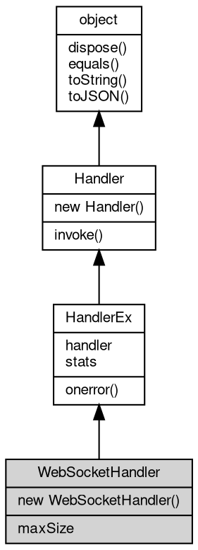

# 对象 WebSocketHandler
[WebSocket](WebSocket.md) 包协议转换处理器

用以将 Http 协议转换为 [WebSocket](WebSocket.md) 包协议消息。创建方式：

```JavaScript
var ws = require("ws");

var pkghdlr = new ws.WebSocketHandler(...);
```

## 继承关系


## 构造函数
        
### WebSocketHandler
**[WebSocket](WebSocket.md) 包处理器构造函数**

```JavaScript
new WebSocketHandler(Handler hdlr);
```

调用参数:
* hdlr: [Handler](Handler.md), 内置消息处理器，处理函数，链式处理数组，路由对象，详见 [mq.Handler](../../module/ifs/mq.md#Handler)

## 成员属性
        
### maxSize
**Integer, 查询和设置最大包尺寸，以 MB 为单位，缺省为 64**

```JavaScript
Integer WebSocketHandler.maxSize;
```

--------------------------
### handler
**[Handler](Handler.md), [WebSocket](WebSocket.md) 协议转换处理器当前事件处理接口对象**

```JavaScript
Handler WebSocketHandler.handler;
```

--------------------------
### stats
**[Stats](Stats.md), 查询 [WebSocket](WebSocket.md) 包协议转换处理器的工作状态**

```JavaScript
readonly Stats WebSocketHandler.stats;
```

返回的结果为一个 [Stats](Stats.md) 对象，结构如下：

```JavaScript
{
    total: 1000, // 总计处理的请求
    pendding: 100, // 当前正在处理的请求
    request: 10, // 新建的请求
    response: 10, // 发送的响应
    error: 100 // 发生的错误
}
```

## 成员函数
        
### onerror
**设置错误处理器**

```JavaScript
WebSocketHandler.onerror(Object hdlrs);
```

调用参数:
* hdlrs: Object, 指定不同的错误的处理器，key 是错误号，value 是处理器，可以是内置消息处理器，处理函数，链式处理数组，路由对象，详见 [mq.Handler](../../module/ifs/mq.md#Handler)

使用方式：

```JavaScript
hdlr.onerror({
    "404": function(v) {
        ...
    },
    "500": new mq.Routing(...)
})
```

--------------------------
### invoke
**处理一个消息或对象**

```JavaScript
Handler WebSocketHandler.invoke(object v) async;
```

调用参数:
* v: [object](object.md), 指定处理的消息或对象

返回结果:
* [Handler](Handler.md), 返回下一步的处理器

--------------------------
### dispose
**强制回收对象，调用此方法后，对象资源将立即释放**

```JavaScript
WebSocketHandler.dispose();
```

--------------------------
### equals
**比较当前对象与给定的对象是否相等**

```JavaScript
Boolean WebSocketHandler.equals(object expected);
```

调用参数:
* expected: [object](object.md), 制定比较的目标对象

返回结果:
* Boolean, 返回对象比较的结果

--------------------------
### toString
**返回对象的字符串表示，一般返回 "[Native Object]"，对象可以根据自己的特性重新实现**

```JavaScript
String WebSocketHandler.toString();
```

返回结果:
* String, 返回对象的字符串表示

--------------------------
### toJSON
**返回对象的 JSON 格式表示，一般返回对象定义的可读属性集合**

```JavaScript
Value WebSocketHandler.toJSON(String key = "");
```

调用参数:
* key: String, 未使用

返回结果:
* Value, 返回包含可 JSON 序列化的值

