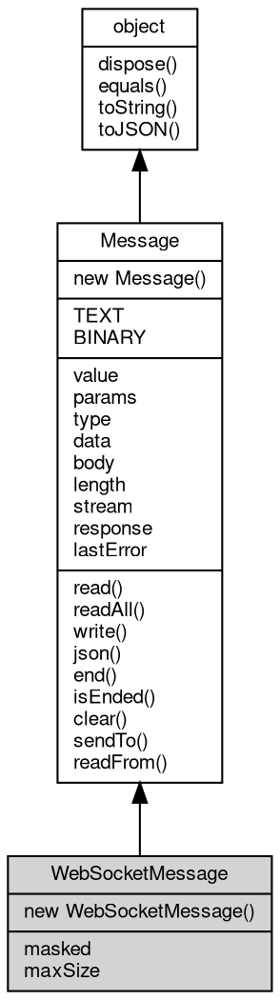

# 对象 WebSocketMessage
websocket 消息对象

创建方法：

```JavaScript
var ws = require("ws");

var msg = new ws.Message();
```

## 继承关系


## 构造函数
        
### WebSocketMessage
**包处理消息对象构造函数**

```JavaScript
new WebSocketMessage(Integer type = ws.BINARY,
    Boolean masked = true,
    Integer maxSize = 67108864);
```

调用参数:
* type: Integer, websocket 消息类型，缺省为 websocket.BINARY
* masked: Boolean, websocket 消息掩码，缺省为 true
* maxSize: Integer, 最大包尺寸，以 MB 为单位，缺省为 67108864(64M)

## 常量
        
### TEXT
**指定消息类型 1，代表一个文本类型**

```JavaScript
const WebSocketMessage.TEXT = 1;
```

--------------------------
### BINARY
**指定消息类型 2，代表一个二进制类型**

```JavaScript
const WebSocketMessage.BINARY = 2;
```

## 成员属性
        
### masked
**Boolean, 查询和读取 websocket 掩码标记，缺省为 true**

```JavaScript
Boolean WebSocketMessage.masked;
```

--------------------------
### maxSize
**Integer, 查询和设置最大包尺寸，以字节为单位，缺省为 67108864(64M)**

```JavaScript
Integer WebSocketMessage.maxSize;
```

--------------------------
### value
**String, 消息的基本内容**

```JavaScript
String WebSocketMessage.value;
```

--------------------------
### params
**[List](List.md), 消息的基本参数**

```JavaScript
List WebSocketMessage.params;
```

--------------------------
### type
**Integer, 消息类型**

```JavaScript
Integer WebSocketMessage.type;
```

--------------------------
### data
**Value, 查询消息的数据**

```JavaScript
readonly Value WebSocketMessage.data;
```

--------------------------
### body
**[SeekableStream](SeekableStream.md), 包含消息数据部分的流对象**

```JavaScript
SeekableStream WebSocketMessage.body;
```

--------------------------
### length
**Long, 消息数据部分的长度**

```JavaScript
readonly Long WebSocketMessage.length;
```

--------------------------
### stream
**[Stream](Stream.md), 查询消息 readFrom 时的流对象**

```JavaScript
readonly Stream WebSocketMessage.stream;
```

--------------------------
### response
**[Message](Message.md), 获取响应消息对象**

```JavaScript
readonly Message WebSocketMessage.response;
```

--------------------------
### lastError
**String, 查询和设置消息处理的最后错误**

```JavaScript
String WebSocketMessage.lastError;
```

## 成员函数
        
### read
**从流内读取指定大小的数据，此方法为 body 相应方法的别名**

```JavaScript
Buffer WebSocketMessage.read(Integer bytes = -1) async;
```

调用参数:
* bytes: Integer, 指定要读取的数据量，缺省为读取随机大小的数据块，读出的数据尺寸取决于设备

返回结果:
* [Buffer](Buffer.md), 返回从流内读取的数据，若无数据可读，或者连接中断，则返回 null

--------------------------
### readAll
**从流内读取剩余的全部数据，此方法为 body 相应方法的别名**

```JavaScript
Buffer WebSocketMessage.readAll() async;
```

返回结果:
* [Buffer](Buffer.md), 返回从流内读取的数据，若无数据可读，或者连接中断，则返回 null

--------------------------
### write
**写入给定的数据，此方法为 body 相应方法的别名**

```JavaScript
WebSocketMessage.write(Buffer data) async;
```

调用参数:
* data: [Buffer](Buffer.md), 给定要写入的数据

--------------------------
### json
**以 JSON 编码写入给定的数据**

```JavaScript
Value WebSocketMessage.json(Value data);
```

调用参数:
* data: Value, 给定要写入的数据

返回结果:
* Value, 此方法不会返回数据

--------------------------
**以 JSON 编码解析消息中的数据**

```JavaScript
Value WebSocketMessage.json();
```

返回结果:
* Value, 返回解析的结果

--------------------------
### end
**设置当前消息处理结束，[Chain](Chain.md) 处理器不再继续后面的事务**

```JavaScript
WebSocketMessage.end();
```

--------------------------
### isEnded
**查询当前消息是否结束**

```JavaScript
Boolean WebSocketMessage.isEnded();
```

返回结果:
* Boolean, 结束则返回 true

--------------------------
### clear
**清除消息的内容**

```JavaScript
WebSocketMessage.clear();
```

--------------------------
### sendTo
**发送格式化消息到给定的流对象**

```JavaScript
WebSocketMessage.sendTo(Stream stm) async;
```

调用参数:
* stm: [Stream](Stream.md), 指定接收格式化消息的流对象

--------------------------
### readFrom
**从给定的缓存流对象中读取格式化消息，并解析填充对象**

```JavaScript
WebSocketMessage.readFrom(Stream stm) async;
```

调用参数:
* stm: [Stream](Stream.md), 指定读取格式化消息的流对象

--------------------------
### dispose
**强制回收对象，调用此方法后，对象资源将立即释放**

```JavaScript
WebSocketMessage.dispose();
```

--------------------------
### equals
**比较当前对象与给定的对象是否相等**

```JavaScript
Boolean WebSocketMessage.equals(object expected);
```

调用参数:
* expected: [object](object.md), 制定比较的目标对象

返回结果:
* Boolean, 返回对象比较的结果

--------------------------
### toString
**返回对象的字符串表示，一般返回 "[Native Object]"，对象可以根据自己的特性重新实现**

```JavaScript
String WebSocketMessage.toString();
```

返回结果:
* String, 返回对象的字符串表示

--------------------------
### toJSON
**返回对象的 JSON 格式表示，一般返回对象定义的可读属性集合**

```JavaScript
Value WebSocketMessage.toJSON(String key = "");
```

调用参数:
* key: String, 未使用

返回结果:
* Value, 返回包含可 JSON 序列化的值

