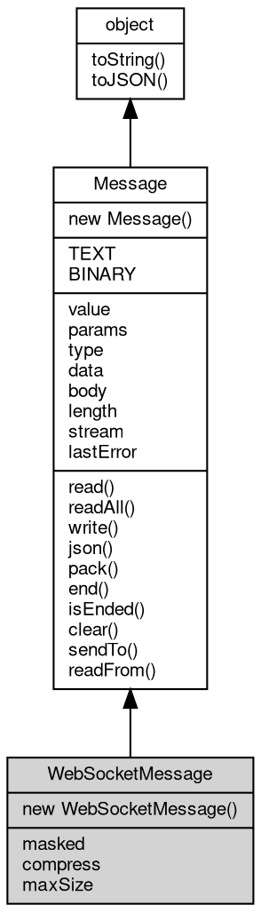

# 对象 WebSocketMessage
`WebSocketMessage` 是 [WebSocket](WebSocket.md) 协议中的一种消息类型，它封装了 [WebSocket](WebSocket.md) 传输协议中各类消息的数据格式和处理方式，可用于 [WebSocket](WebSocket.md) 客户端和服务端双方通信。

类的构造函数 `WebSocketMessage` 支持指定的消息类型参数 `type`，该参数有三个可选值：

- `ws.TEXT`：代表文本类型的消息，内容为字符串。
- `ws.BINARY`：代表二进制类型的消息，内容为二进制数据。

另外，还可以通过修改 `WebSocketMessage.masked` 属性指定是否需要应用掩码，通过 `WebSocketMessage.compress` 属性指定是否需要压缩。

以下代码是一个 websocket 服务器的示例，当有客户端连接进来之后，服务器会把收到的消息 echo 回去给客户端：

```JavaScript
var ws = require('ws');
var http = require('http');

var svr = new http.Server(8080, {
    '/websocket': ws.upgrade((conn, req) => {
        // 这里发生了客户端连接
        conn.onmessage = e => {
            if (e.data.type == ws.TEXT) {
                console.log(`接收到客户端发来的消息 ${e.data}`);
                conn.send(e.data);
            } else {
                console.error(`收到未知类型消息 ${e.data.type}`);
            }
        }
        conn.onclose = e => console.log('离开了一个客户端');
    })
});
svr.start();
```

在这个程序中，首先加载了 websocket 支持模块和内置的 [http](../../module/ifs/http.md) 模块，然后创建了 [http](../../module/ifs/http.md) 服务对象，并指定了要处理的请求路径，调用了 [ws.upgrade](../../module/ifs/ws.md#upgrade) 函数将对应路径的请求升级成 websocket 连接。
创建 websocket 连接之后，服务器会自动为每个连接创建一个 [ws.Socket](../../module/ifs/ws.md#Socket) 对象，并提供了 onopen、onmessage、onclose 等 API，用来处理当有客户端连接、收到消息以及关闭事件。
在收到消息时，服务器会判断消息的类型，如果是文本类型，就会将收到的消息 echo 回去。
以上是一个简单的 websocket 服务器的处理流程，适当根据实际需求进行修改即可。

## 继承关系


## 构造函数
        
### WebSocketMessage
**包处理消息对象构造函数**

```JavaScript
new WebSocketMessage(Integer type = ws.BINARY,
    Boolean masked = true,
    Boolean compress = false,
    Integer maxSize = 67108864);
```

调用参数:
* type: Integer, websocket 消息类型，缺省为 websocket.BINARY
* masked: Boolean, websocket 消息掩码，缺省为 true
* compress: Boolean, 标记消息是否压缩，缺省为 false
* maxSize: Integer, 最大包尺寸，以 MB 为单位，缺省为 67108864(64M)

## 常量
        
### TEXT
**指定消息类型 1，代表一个文本类型**

```JavaScript
const WebSocketMessage.TEXT = 1;
```

--------------------------
### BINARY
**指定消息类型 2，代表一个二进制类型**

```JavaScript
const WebSocketMessage.BINARY = 2;
```

## 成员属性
        
### masked
**Boolean, 查询和读取 websocket 掩码标记，缺省为 true**

```JavaScript
Boolean WebSocketMessage.masked;
```

--------------------------
### compress
**Boolean, 查询和读取 websocket 压缩状态，缺省为 false**

```JavaScript
Boolean WebSocketMessage.compress;
```

--------------------------
### maxSize
**Integer, 查询和设置最大包尺寸，以字节为单位，缺省为 67108864(64M)**

```JavaScript
Integer WebSocketMessage.maxSize;
```

--------------------------
### value
**String, 消息的基本内容**

```JavaScript
String WebSocketMessage.value;
```

--------------------------
### params
**NArray, 消息的基本参数**

```JavaScript
readonly NArray WebSocketMessage.params;
```

--------------------------
### type
**Integer, 消息类型**

```JavaScript
Integer WebSocketMessage.type;
```

--------------------------
### data
**Value, 查询消息的数据，此属性会根据 content-type 返回不同数据，为 text 时，返回文本，为 [json](../../module/ifs/json.md) 时返回 [json](../../module/ifs/json.md)，其它时候返回二进制**

```JavaScript
readonly Value WebSocketMessage.data;
```

--------------------------
### body
**[SeekableStream](SeekableStream.md), 包含消息数据部分的流对象**

```JavaScript
SeekableStream WebSocketMessage.body;
```

--------------------------
### length
**Long, 消息数据部分的长度**

```JavaScript
readonly Long WebSocketMessage.length;
```

--------------------------
### stream
**[Stream](Stream.md), 查询消息 readFrom 时的流对象**

```JavaScript
readonly Stream WebSocketMessage.stream;
```

--------------------------
### lastError
**String, 查询和设置消息处理的最后错误**

```JavaScript
String WebSocketMessage.lastError;
```

## 成员函数
        
### read
**从流内读取指定大小的数据，此方法为 body 相应方法的别名**

```JavaScript
Buffer WebSocketMessage.read(Integer bytes = -1) async;
```

调用参数:
* bytes: Integer, 指定要读取的数据量，缺省为读取随机大小的数据块，读出的数据尺寸取决于设备

返回结果:
* [Buffer](Buffer.md), 返回从流内读取的数据，若无数据可读，或者连接中断，则返回 null

--------------------------
### readAll
**从流内读取剩余的全部数据，此方法为 body 相应方法的别名**

```JavaScript
Buffer WebSocketMessage.readAll() async;
```

返回结果:
* [Buffer](Buffer.md), 返回从流内读取的数据，若无数据可读，或者连接中断，则返回 null

--------------------------
### write
**写入给定的数据，此方法为 body 相应方法的别名**

```JavaScript
WebSocketMessage.write(Buffer data) async;
```

调用参数:
* data: [Buffer](Buffer.md), 给定要写入的数据

--------------------------
### json
**以 JSON 编码写入给定的数据**

```JavaScript
Value WebSocketMessage.json(Value data);
```

调用参数:
* data: Value, 给定要写入的数据

返回结果:
* Value, 此方法不会返回数据

--------------------------
**以 JSON 编码解析消息中的数据**

```JavaScript
Value WebSocketMessage.json();
```

返回结果:
* Value, 返回解析的结果

--------------------------
### pack
**以 [msgpack](../../module/ifs/msgpack.md) 编码写入给定的数据**

```JavaScript
Value WebSocketMessage.pack(Value data);
```

调用参数:
* data: Value, 给定要写入的数据

返回结果:
* Value, 此方法不会返回数据

--------------------------
**以 [msgpack](../../module/ifs/msgpack.md) 编码解析消息中的数据**

```JavaScript
Value WebSocketMessage.pack();
```

返回结果:
* Value, 返回解析的结果

--------------------------
### end
**设置当前消息处理结束，[Chain](Chain.md) 处理器不再继续后面的事务**

```JavaScript
WebSocketMessage.end();
```

--------------------------
### isEnded
**查询当前消息是否结束**

```JavaScript
Boolean WebSocketMessage.isEnded();
```

返回结果:
* Boolean, 结束则返回 true

--------------------------
### clear
**清除消息的内容**

```JavaScript
WebSocketMessage.clear();
```

--------------------------
### sendTo
**发送格式化消息到给定的流对象**

```JavaScript
WebSocketMessage.sendTo(Stream stm) async;
```

调用参数:
* stm: [Stream](Stream.md), 指定接收格式化消息的流对象

--------------------------
### readFrom
**从给定的缓存流对象中读取格式化消息，并解析填充对象**

```JavaScript
WebSocketMessage.readFrom(Stream stm) async;
```

调用参数:
* stm: [Stream](Stream.md), 指定读取格式化消息的流对象

--------------------------
### toString
**返回对象的字符串表示，一般返回 "[Native Object]"，对象可以根据自己的特性重新实现**

```JavaScript
String WebSocketMessage.toString();
```

返回结果:
* String, 返回对象的字符串表示

--------------------------
### toJSON
**返回对象的 JSON 格式表示，一般返回对象定义的可读属性集合**

```JavaScript
Value WebSocketMessage.toJSON(String key = "");
```

调用参数:
* key: String, 未使用

返回结果:
* Value, 返回包含可 JSON 序列化的值

