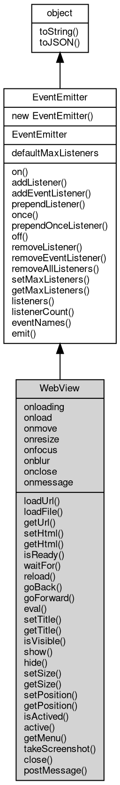

# 对象 WebView
WebView 对象，嵌入式浏览器窗口组件。

WebView 是一个嵌入浏览器的窗口组件。由于 WebView 内的 JavaScript 程序与 fibjs 并不在同一个引擎内，所以需要通过消息进行通讯。

WebView 内可以通过 window 与 fibjs 进行消息通讯，支持 postMessage 方法和 message 事件。

以下是一个简单的通讯示例代码：

```JavaScript
// index.js
var gui = require('gui');
var webview = gui.open('https://fibjs.org/index.html');

webview.addEventListener("message", function(msg) {
    console.log(msg);
});

webview.postMessage("hello from fibjs");
```

index.html 的内容如下：
```html
<script>
    window.addEventListener("message", function (msg) {
        window.postMessage("send back: " + msg);
    });
</script>
```

WebView 还支持更方便的 app API 接口。WebView 内用于 API 调用的对象是 window.app，可以在创建 WebView 时通过 app 参数指定 API 接口，API 接口的方法可以在 WebView 内通过 await window.app... 调用。

以下是一个简单的调用示例代码：

```JavaScript
const gui = require('gui');
const coroutine = require('coroutine');

const win = gui.open({
    devtools: true,
    app: {
        test: async function(a, b, c, d) {
            console.log('test', a, b, c, d);
            await coroutine.sleepAsync(1000);
            return a + b + c + d + 1000;
        },
        test1: {
            test2: function(a, b, c, d) {
                console.log('test2', a, b, c, d);
                coroutine.sleep(1000);
                return a + b + c + d + 2000;
            }
        }
    }
});

win.eval(`
(async function test() {
console.log("test(1,2,3,4): " + await window.app.test(1,2,3,4));
console.log("test1.test2(1,2,3,4): " + await window.app.test1.test2(1,2,3,4));
console.log('test');
})();`);
```

如果需要在 WebView 内关闭窗口，可以调用 window.close。需要注意，在 macOS 下的全屏窗口会因为 macOS 的机制而阻止关闭。
```html
<script lang="JavaScript">
   document.getElementById('close').addEventListener('click', function () {
       window.close();
   });
</script>
```
在某些应用中，需要在 WebView 内实现拖动窗口的功能，可以通过以下代码实现：
```html
<script>
   document.getElementById('dragRegion').addEventListener('mousedown', function (event) {
       if (event.button === 0) { // 检查是否按下了左键
           window.drag();
       }
   });
</script>
```

## 继承关系


## 静态属性
        
### defaultMaxListeners
**Integer, 默认全局最大监听器数**

```JavaScript
static Integer WebView.defaultMaxListeners;
```

## 成员属性
        
### onloading
**Function, 查询和绑定窗口开始加载事件，相当于 on("loading", func);**

```JavaScript
Function WebView.onloading;
```

--------------------------
### onload
**Function, 查询和绑定窗口加载 完成事件，相当于 on("load", func);**

```JavaScript
Function WebView.onload;
```

--------------------------
### onmove
**Function, 查询和绑定窗口移动事件，相当于 on("move", func);**

```JavaScript
Function WebView.onmove;
```

以下示例会在窗口移动时输出窗口的左上角坐标：

```JavaScript
var gui = require('gui');
var webview = gui.open('fs://index.html');

webview.onmove = evt => console.log(evt.left, evt.top);
```

--------------------------
### onresize
**Function, 查询和绑定窗口尺寸改变事件，相当于 on("size", func);**

```JavaScript
Function WebView.onresize;
```

以下示例会在窗口改变大小时输出窗口的尺寸：

```JavaScript
var gui = require('gui');
var webview = gui.open('fs://index.html');

webview.onresize = evt => console.log(evt.width, evt.height);
```

--------------------------
### onfocus
**Function, 查询和绑定窗口获得焦点事件，相当于 on("focus", func);**

```JavaScript
Function WebView.onfocus;
```

--------------------------
### onblur
**Function, 查询和绑定窗口失去焦点事件，相当于 on("blur", func);**

```JavaScript
Function WebView.onblur;
```

--------------------------
### onclose
**Function, 查询和绑定窗口关闭事件，WebView 关闭后会触发此时间，相当于 on("closed", func);**

```JavaScript
Function WebView.onclose;
```

--------------------------
### onmessage
**Function, 查询和绑定接受 webview 内 postMessage 消息事件，相当于 on("message", func);**

```JavaScript
Function WebView.onmessage;
```

## 成员函数
        
### loadUrl
**加载指定 [url](../../module/ifs/url.md) 的页面**

```JavaScript
WebView.loadUrl(String url) async;
```

调用参数:
* url: String, 指定的 [url](../../module/ifs/url.md)

--------------------------
### loadFile
**加载指定文件的页面**

```JavaScript
WebView.loadFile(String file) async;
```

调用参数:
* file: String, 指定的文件

--------------------------
### getUrl
**查询当前页面的 [url](../../module/ifs/url.md)**

```JavaScript
String WebView.getUrl() async;
```

返回结果:
* String, 返回当前页面的 [url](../../module/ifs/url.md)

--------------------------
### setHtml
**设置 webview 的页面 html**

```JavaScript
WebView.setHtml(String html) async;
```

调用参数:
* html: String, 设置的 html

--------------------------
### getHtml
**获取 webview 的页面 html**

```JavaScript
String WebView.getHtml() async;
```

返回结果:
* String, 返回 webview 的页面 html

--------------------------
### isReady
**查询当前页面是否加载完成**

```JavaScript
Boolean WebView.isReady() async;
```

返回结果:
* Boolean, 返回当前页面是否加载完成

--------------------------
### waitFor
**等待当前页面加载完成**

```JavaScript
WebView.waitFor(String url = "") async;
```

调用参数:
* url: String, 指定等待的 [url](../../module/ifs/url.md)，为空表示等待当前页面

--------------------------
### reload
**刷新当前页面**

```JavaScript
WebView.reload() async;
```

--------------------------
### goBack
**退回到上一个页面**

```JavaScript
WebView.goBack() async;
```

--------------------------
### goForward
**前进到下一个页面**

```JavaScript
WebView.goForward() async;
```

--------------------------
### eval
**在当前窗口运行一段 JavaScript 代码**

```JavaScript
Variant WebView.eval(String code) async;
```

调用参数:
* code: String, 指定要执行的 JavaScript 代码

返回结果:
* Variant, 返回执行结果

--------------------------
### setTitle
**设置窗口的标题**

```JavaScript
WebView.setTitle(String title) async;
```

调用参数:
* title: String, 指定窗口的标题

--------------------------
### getTitle
**查询窗口的标题**

```JavaScript
String WebView.getTitle() async;
```

返回结果:
* String, 返回窗口的标题

--------------------------
### isVisible
**设置窗口是否可见**

```JavaScript
Boolean WebView.isVisible() async;
```

返回结果:
* Boolean, 返回窗口是否可见

--------------------------
### show
**显示窗口**

```JavaScript
WebView.show() async;
```

--------------------------
### hide
**隐藏窗口**

```JavaScript
WebView.hide() async;
```

--------------------------
### setSize
**设置窗口的尺寸**

```JavaScript
WebView.setSize(Integer width,
    Integer height) async;
```

调用参数:
* width: Integer, 指定窗口的宽度
* height: Integer, 指定窗口的高度

--------------------------
### getSize
**查询窗口的尺寸**

```JavaScript
NArray WebView.getSize() async;
```

返回结果:
* NArray, 返回窗口的尺寸，返回值为一个数组，第一个元素为宽度，第二个元素为高度

--------------------------
### setPosition
**设置窗口的位置**

```JavaScript
WebView.setPosition(Integer left,
    Integer top) async;
```

调用参数:
* left: Integer, 指定窗口的左上角 x 坐标
* top: Integer, 指定窗口的左上角 y 坐标

--------------------------
### getPosition
**查询窗口的位置**

```JavaScript
NArray WebView.getPosition() async;
```

返回结果:
* NArray, 返回窗口的位置，返回值为一个数组，第一个元素为 x 坐标，第二个元素为 y 坐标

--------------------------
### isActived
**查询窗口是否是激活窗口**

```JavaScript
Boolean WebView.isActived() async;
```

返回结果:
* Boolean, 返回窗口是否是激活窗口

--------------------------
### active
**激活窗口**

```JavaScript
WebView.active() async;
```

--------------------------
### getMenu
**查询窗口的菜单**

```JavaScript
Menu WebView.getMenu();
```

返回结果:
* [Menu](Menu.md), 返回窗口的菜单

--------------------------
### takeScreenshot
**截取当前窗口的图像**

```JavaScript
Buffer WebView.takeScreenshot() async;
```

返回结果:
* [Buffer](Buffer.md), 返回截取的图像

--------------------------
### close
**关闭当前窗口**

```JavaScript
WebView.close() async;
```

--------------------------
### postMessage
**向 webview 内发送消息**

```JavaScript
WebView.postMessage(String msg) async;
```

调用参数:
* msg: String, 要发送的消息

     postMessage 需要在窗口加载完成后发送消息，在此之前发送的消息会丢失。因此建议在 onload 事件触发后再调用此方法。

--------------------------
### on
**绑定一个事件处理函数到对象**

```JavaScript
Object WebView.on(String ev,
    Function func);
```

调用参数:
* ev: String, 指定事件的名称
* func: Function, 指定事件处理函数

返回结果:
* Object, 返回事件对象本身，便于链式调用

--------------------------
**绑定一个事件处理函数到对象**

```JavaScript
Object WebView.on(Object map);
```

调用参数:
* map: Object, 指定事件映射关系，对象属性名称将作为事件名称，属性的值将作为事件处理函数

返回结果:
* Object, 返回事件对象本身，便于链式调用

--------------------------
### addListener
**绑定一个事件处理函数到对象**

```JavaScript
Object WebView.addListener(String ev,
    Function func);
```

调用参数:
* ev: String, 指定事件的名称
* func: Function, 指定事件处理函数

返回结果:
* Object, 返回事件对象本身，便于链式调用

--------------------------
**绑定一个事件处理函数到对象**

```JavaScript
Object WebView.addListener(Object map);
```

调用参数:
* map: Object, 指定事件映射关系，对象属性名称将作为事件名称，属性的值将作为事件处理函数

返回结果:
* Object, 返回事件对象本身，便于链式调用

--------------------------
### addEventListener
**绑定一个事件处理函数到对象**

```JavaScript
Object WebView.addEventListener(String ev,
    Function func,
    Object options = {});
```

调用参数:
* ev: String, 指定事件的名称
* func: Function, 指定事件处理函数
* options: Object, 指定事件处理函数的选项

返回结果:
* Object, 返回事件对象本身，便于链式调用

options 参数是一个对象，它可以包含以下属性：
- once: 如果为 true，则事件处理函数只会触发一次，触发后会被移除

--------------------------
### prependListener
**绑定一个事件处理函数到对象起始**

```JavaScript
Object WebView.prependListener(String ev,
    Function func);
```

调用参数:
* ev: String, 指定事件的名称
* func: Function, 指定事件处理函数

返回结果:
* Object, 返回事件对象本身，便于链式调用

--------------------------
**绑定一个事件处理函数到对象起始**

```JavaScript
Object WebView.prependListener(Object map);
```

调用参数:
* map: Object, 指定事件映射关系，对象属性名称将作为事件名称，属性的值将作为事件处理函数

返回结果:
* Object, 返回事件对象本身，便于链式调用

--------------------------
### once
**绑定一个一次性事件处理函数到对象，一次性处理函数只会触发一次**

```JavaScript
Object WebView.once(String ev,
    Function func);
```

调用参数:
* ev: String, 指定事件的名称
* func: Function, 指定事件处理函数

返回结果:
* Object, 返回事件对象本身，便于链式调用

--------------------------
**绑定一个一次性事件处理函数到对象，一次性处理函数只会触发一次**

```JavaScript
Object WebView.once(Object map);
```

调用参数:
* map: Object, 指定事件映射关系，对象属性名称将作为事件名称，属性的值将作为事件处理函数

返回结果:
* Object, 返回事件对象本身，便于链式调用

--------------------------
### prependOnceListener
**绑定一个事件处理函数到对象起始**

```JavaScript
Object WebView.prependOnceListener(String ev,
    Function func);
```

调用参数:
* ev: String, 指定事件的名称
* func: Function, 指定事件处理函数

返回结果:
* Object, 返回事件对象本身，便于链式调用

--------------------------
**绑定一个事件处理函数到对象起始**

```JavaScript
Object WebView.prependOnceListener(Object map);
```

调用参数:
* map: Object, 指定事件映射关系，对象属性名称将作为事件名称，属性的值将作为事件处理函数

返回结果:
* Object, 返回事件对象本身，便于链式调用

--------------------------
### off
**从对象处理队列中取消指定函数**

```JavaScript
Object WebView.off(String ev,
    Function func);
```

调用参数:
* ev: String, 指定事件的名称
* func: Function, 指定事件处理函数

返回结果:
* Object, 返回事件对象本身，便于链式调用

--------------------------
**取消对象处理队列中的全部函数**

```JavaScript
Object WebView.off(String ev);
```

调用参数:
* ev: String, 指定事件的名称

返回结果:
* Object, 返回事件对象本身，便于链式调用

--------------------------
**从对象处理队列中取消指定函数**

```JavaScript
Object WebView.off(Object map);
```

调用参数:
* map: Object, 指定事件映射关系，对象属性名称作为事件名称，属性的值作为事件处理函数

返回结果:
* Object, 返回事件对象本身，便于链式调用

--------------------------
### removeListener
**从对象处理队列中取消指定函数**

```JavaScript
Object WebView.removeListener(String ev,
    Function func);
```

调用参数:
* ev: String, 指定事件的名称
* func: Function, 指定事件处理函数

返回结果:
* Object, 返回事件对象本身，便于链式调用

--------------------------
**取消对象处理队列中的全部函数**

```JavaScript
Object WebView.removeListener(String ev);
```

调用参数:
* ev: String, 指定事件的名称

返回结果:
* Object, 返回事件对象本身，便于链式调用

--------------------------
**从对象处理队列中取消指定函数**

```JavaScript
Object WebView.removeListener(Object map);
```

调用参数:
* map: Object, 指定事件映射关系，对象属性名称作为事件名称，属性的值作为事件处理函数

返回结果:
* Object, 返回事件对象本身，便于链式调用

--------------------------
### removeEventListener
**从对象处理队列中取消指定函数**

```JavaScript
Object WebView.removeEventListener(String ev,
    Function func,
    Object options = {});
```

调用参数:
* ev: String, 指定事件的名称
* func: Function, 指定事件处理函数
* options: Object, 指定事件处理函数的选项

返回结果:
* Object, 返回事件对象本身，便于链式调用

--------------------------
### removeAllListeners
**从对象处理队列中取消所有事件的所有监听器， 如果指定事件，则移除指定事件的所有监听器。**

```JavaScript
Object WebView.removeAllListeners(String ev);
```

调用参数:
* ev: String, 指定事件的名称

返回结果:
* Object, 返回事件对象本身，便于链式调用

--------------------------
**从对象处理队列中取消所有事件的所有监听器， 如果指定事件，则移除指定事件的所有监听器。**

```JavaScript
Object WebView.removeAllListeners(Array evs = []);
```

调用参数:
* evs: Array, 指定事件的名称

返回结果:
* Object, 返回事件对象本身，便于链式调用

--------------------------
### setMaxListeners
**监听器的默认限制的数量，仅用于兼容**

```JavaScript
WebView.setMaxListeners(Integer n);
```

调用参数:
* n: Integer, 指定事件的数量

--------------------------
### getMaxListeners
**获取监听器的默认限制的数量，仅用于兼容**

```JavaScript
Integer WebView.getMaxListeners();
```

返回结果:
* Integer, 返回默认限制数量

--------------------------
### listeners
**查询对象指定事件的监听器数组**

```JavaScript
Array WebView.listeners(String ev);
```

调用参数:
* ev: String, 指定事件的名称

返回结果:
* Array, 返回指定事件的监听器数组

--------------------------
### listenerCount
**查询对象指定事件的监听器数量**

```JavaScript
Integer WebView.listenerCount(String ev);
```

调用参数:
* ev: String, 指定事件的名称

返回结果:
* Integer, 返回指定事件的监听器数量

--------------------------
**查询对象指定事件的监听器数量**

```JavaScript
Integer WebView.listenerCount(Value o,
    String ev);
```

调用参数:
* o: Value, 指定查询的对象
* ev: String, 指定事件的名称

返回结果:
* Integer, 返回指定事件的监听器数量

--------------------------
### eventNames
**查询监听器事件名称**

```JavaScript
Array WebView.eventNames();
```

返回结果:
* Array, 返回事件名称数组

--------------------------
### emit
**主动触发一个事件**

```JavaScript
Boolean WebView.emit(String ev,
    ...args);
```

调用参数:
* ev: String, 事件名称
* args: ..., 事件参数，将会传递给事件处理函数

返回结果:
* Boolean, 返回事件触发状态，有响应事件返回 true，否则返回 false

--------------------------
### toString
**返回对象的字符串表示，一般返回 "[Native Object]"，对象可以根据自己的特性重新实现**

```JavaScript
String WebView.toString();
```

返回结果:
* String, 返回对象的字符串表示

--------------------------
### toJSON
**返回对象的 JSON 格式表示，一般返回对象定义的可读属性集合**

```JavaScript
Value WebView.toJSON(String key = "");
```

调用参数:
* key: String, 未使用

返回结果:
* Value, 返回包含可 JSON 序列化的值

