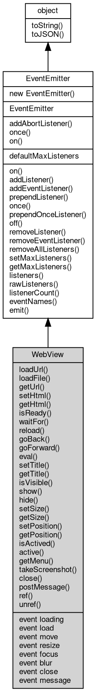

# Object WebView
WebView [object](object.md), an embedded browser view owned by a desktop application window

A WebView is a native window whose content is rendered by a platform browser
engine (WebKitGTK on Linux, WKWebView on macOS, WebView2 on Windows). It is the
[object](object.md) returned by `gui.open` and `gui.openFile` and the only way to show web
content in fibjs: the [gui](../../module/ifs/gui.md) [module](../../module/ifs/module.md) creates windows, menus and trays, while the
WebView [object](object.md) drives one window - navigation, page execution, native window
state, and the JavaScript bridge between the page and fibjs.

The page runs in the browser engine, not in the fibjs isolate, so the two sides
share no objects: they exchange strings through messages and calls through the
`app` bridge. The page keeps its own DOM, [timers](../../module/ifs/timers.md) and origin model, and fibjs
keeps its fibers and native handles.

Obtained from:
- `gui.open([url](../../module/ifs/url.md)[, options])` — open a window and navigate to `[url](../../module/ifs/url.md)`;
- `gui.open(options)` — open a window; the `url` or `file` property selects the
  initial content (`about:blank` when neither is set);
- `gui.openFile(file[, options])` — open a window and load a local file or a
  [path](../../module/ifs/path.md) inside a [zip](../../module/ifs/zip.md) archive.

`new WebView()` is not supported ("not a constructor"): the constructor belongs
to the [gui](../../module/ifs/gui.md) [module](../../module/ifs/module.md). The [object](object.md) is returned immediately while the native window is
created asynchronously on the GUI thread, so `isReady()` is false until the
window exists and the members that need it wait for the window in the calling
fiber.

Concepts:

- **Document model**: the page is an ordinary web document in its own engine.
  DOM APIs, CSS, fetch/XHR, [WebSocket](WebSocket.md), IndexedDB and Web Crypto behave as in a
  standalone browser (each platform engine has its own version and feature
  set), and fibjs objects are not visible from the page.
- **Navigation lifecycle**: navigation is asynchronous. `loadUrl`, `loadFile`,
  `setHtml`, `reload`, `goBack` and `goForward` start it; the `loading` event
  marks the start, the `load` event the end; `isReady` polls the state and
  `waitFor` blocks the calling fiber until the document is ready. Each window
  keeps a browsing history, so back/forward and `reload` behave like a browser.
- **JavaScript bridge**: `postMessage` sends a string into the page, where it
  arrives as a DOM `message` event; the page's own `window.postMessage` is
  rewired by fibjs and sends a string back, which arrives as the `message`
  event on the fibjs side. Only strings cross the bridge, so encode structured
  data with JSON.stringify/JSON.parse. The `app` option of [gui.open](../../module/ifs/gui.md#open) installs
  `window.app` in the page: `window.app.name(...)` performs an RPC into fibjs
  and returns a Promise. Host methods run synchronously and must return a
  JSON-serializable value - a Promise returned by an async host function does
  not resolve through the bridge (it serializes as an empty [object](object.md)) - and a
  thrown exception rejects the page-side Promise with the error message.
- **Resource loading**: the engine loads `[http](../../module/ifs/http.md):`/`https:` URLs over the
  network and `data:`/`about:blank` inline; local content goes through the
  internal `[fs](../../module/ifs/fs.md):` scheme registered by the [gui](../../module/ifs/gui.md) [module](../../module/ifs/module.md), which serves plain files
  and paths inside [zip](../../module/ifs/zip.md) archives (`app.zip$/index.html`). `loadFile` converts a
  [path](../../module/ifs/path.md) to such an `[fs](../../module/ifs/fs.md):` URL. Cookies and site storage belong to the browser
  engine; the `devtools` option of [gui.open](../../module/ifs/gui.md#open) enables the engine developer tools.
- **Window and [process](../../module/ifs/process.md) lifetime**: the WebView also owns the native window -
  title, size, position, visibility, activation, menu and screenshots. An open
  window references the isolate, so the fibjs [process](../../module/ifs/process.md) stays alive until the
  window is closed; `ref`/`unref` adjust that reference. The `close` event
  fires once the native window is gone, after which every member that needs the
  window throws.

Example 1 — open a window and exchange a message with the page:

```JavaScript
// requires: long-running
const gui = require('gui');

const win = gui.open({
    width: 480,
    height: 320
});

win.setHtml(`<html><body><script>
window.addEventListener('message', function (ev) {
window.postMessage('pong: ' + ev.data);
});
</script></body></html>`);

win.waitFor();

win.on('message', function(ev) {
    console.log(ev.data); // pong: ping
    win.close();
});

win.postMessage('ping');
```

Example 2 — expose host functions to the page through the app option:

```JavaScript
// requires: long-running
const gui = require('gui');

const win = gui.open({
    width: 480,
    height: 320,
    app: {
        math: {
            add: function(a, b) {
                return a + b; // synchronous method, JSON-serializable result
            }
        }
    }
});

win.setHtml(`<html><body><script>
window.app.math.add(1, 2).then(function (sum) {
window.postMessage('sum=' + sum);
});
</script></body></html>`);

win.on('message', function(ev) {
    console.log(ev.data); // sum=3
    win.close();
});

win.waitFor();
```

Example 3 — follow the navigation lifecycle and change the window state:

```JavaScript
// requires: long-running
const gui = require('gui');

const win = gui.open({
    width: 320,
    height: 200
});

win.on('loading', function(ev) {
    console.log('loading ' + ev.url);
});

win.on('load', function(ev) {
    console.log('loaded ' + ev.url);
});

win.loadUrl('data:text/html;charset=utf-8,<title>Done</title><p>ok</p>');
win.waitFor();

console.log(win.isReady()); // true
console.log(win.eval('document.querySelector("p").textContent')); // ok

win.setTitle('fibjs');
win.setSize(640, 400);
win.setPosition(120, 80);
console.log(JSON.stringify(win.getSize()));
console.log(JSON.stringify(win.getPosition()));

win.close();
```

Notes:

- Desktop builds only: the Linux (GTK/WebKitGTK), macOS and Windows builds
  provide WebView; the iOS/embedded stub answers every [gui](../../module/ifs/gui.md) call with
  "Webview not supported in this platform".
- A display server is required on Linux (X11 or Wayland). Without one the GUI
  cannot initialize: window creation fails with "Unable to init server: Could
  not connect: Connection refused" and calls that wait for the window block.
- The gtk4 implementation does not support the `icon`, `left` and `top`
  options of [gui.open](../../module/ifs/gui.md#open); on macOS a full-page screenshot is not supported and a
  fullscreen window cannot be closed by the page.
- The browser engine is provided by the host, so page behavior (codecs, fonts,
  user agent, available Web APIs) follows that engine rather than fibjs.

## Inheritance

```dot
digraph {
    node [fontname="Helvetica,sans-Serif", fontsize=10, shape="record", style="filled", fillcolor="white"];

    object [tooltip="object", URL="object.md", label="{object|toString()\ltoJSON()\l}"];
    EventEmitter [tooltip="EventEmitter", URL="EventEmitter.md", label="{EventEmitter|new EventEmitter()\l|EventEmitter\l|addAbortListener()\lonce()\lon()\l|defaultMaxListeners\l|on()\laddListener()\laddEventListener()\lprependListener()\lonce()\lprependOnceListener()\loff()\lremoveListener()\lremoveEventListener()\lremoveAllListeners()\lsetMaxListeners()\lgetMaxListeners()\llisteners()\lrawListeners()\llistenerCount()\leventNames()\lemit()\l}"];
    WebView [tooltip="WebView", fillcolor="lightgray", id="me", label="{WebView|loadUrl()\lloadFile()\lgetUrl()\lsetHtml()\lgetHtml()\lisReady()\lwaitFor()\lreload()\lgoBack()\lgoForward()\leval()\lsetTitle()\lgetTitle()\lisVisible()\lshow()\lhide()\lsetSize()\lgetSize()\lsetPosition()\lgetPosition()\lisActived()\lactive()\lgetMenu()\ltakeScreenshot()\lclose()\lpostMessage()\lref()\lunref()\l|event loading\levent load\levent move\levent resize\levent focus\levent blur\levent close\levent message\l}"];

    object -> EventEmitter [dir=back];
    EventEmitter -> WebView [dir=back];
}
```

## Static Methods
        
### addAbortListener
**Registers a one-shot abort handler on an [AbortSignal](AbortSignal.md)**

```JavaScript
static Object WebView.addAbortListener(EventEmitter signal,
    Function(Object ev) func);
```

Parameters:
* signal: [EventEmitter](EventEmitter.md), the [AbortSignal](AbortSignal.md) [object](object.md) to listen to
* func: Function(Object ev), the handler for the abort event

Returns:
* Object, returns a Disposable [object](object.md) containing a `[Symbol.dispose]` method

The handler is called at most once when the signal is aborted, and it is removed from the
signal afterwards. If the signal is already aborted the handler is invoked synchronously.
The returned [object](object.md) has a `[Symbol.dispose]()` method that removes the handler, so it can be
released before the abort happens.

Example — abort handling with automatic cleanup:

```JavaScript
const events = require('events');

const controller = new AbortController();
const disposable = events.addAbortListener(controller.signal,
    () => console.log('aborted'));

controller.abort(); // aborted
disposable[Symbol.dispose](); // safe to call after the listener fired
console.log(controller.signal.listenerCount('abort')); // 0
```

--------------------------
### once
**Creates a Promise resolved by the next occurrence of an event**

```JavaScript
static Object WebView.once(EventEmitter emitter,
    Value ev,
    Object options = {});
```

Parameters:
* emitter: [EventEmitter](EventEmitter.md), the event emitter [object](object.md) to listen to
* ev: Value, the event name to listen for
* options: Object, optional parameter [object](object.md)

Returns:
* Object, returns a Promise that resolves with the array of event parameters

The Promise resolves with the array of the emit arguments when the event fires; it rejects
when `error` is emitted while waiting, unless the waited event is `error` itself, or when
the signal option aborts. The temporary listeners are removed when the Promise settles.

options supports the following option:

```JavaScript
// fragment: options
({
    "signal": null // AbortSignal; aborting rejects the Promise with an AbortError
});
```

Example — awaiting the next occurrence of an event:

```JavaScript
const EventEmitter = require('events');

(async () => {
    const emitter = new EventEmitter();
    const waiting = EventEmitter.once(emitter, 'ready');

    emitter.emit('ready', 200, 'ok');
    console.log(JSON.stringify(await waiting)); // [200,"ok"]
})();
```

--------------------------
### on
**Creates an async iterator that yields event occurrences**

```JavaScript
static Object WebView.on(EventEmitter emitter,
    Value ev,
    Object options = {});
```

Parameters:
* emitter: [EventEmitter](EventEmitter.md), the event emitter [object](object.md) to listen to
* ev: Value, the event name to listen for
* options: Object, optional parameter [object](object.md)

Returns:
* Object, returns an AsyncIterator [object](object.md)

Each next() resolves with `{ value: [args...], done: false }` when the event fires and with
`{ done: true }` after an event named in the `close` option fires or the signal aborts; an
`error` event rejects the pending call. The listeners are registered when the iterator is
created and removed when the iteration ends or the signal aborts.

options supports the following options:

```JavaScript
// fragment: options
({
    "signal": null, // AbortSignal; aborting rejects pending and future next() calls
    "close": [] // event names; the first one to fire ends the iteration
});
```

Example — iterating the occurrences of an event:

```JavaScript
const EventEmitter = require('events');

(async () => {
    const emitter = new EventEmitter();
    const iterator = EventEmitter.on(emitter, 'data', {
        close: ['end']
    });

    emitter.emit('data', 1);
    emitter.emit('data', 2);
    emitter.emit('end');

    for await (const args of iterator)
    console.log(JSON.stringify(args)); // [1] then [2]
})();
```

## Static Properties
        
### defaultMaxListeners
**Integer, The [process](../../module/ifs/process.md)-wide default listener limit reported by getMaxListeners()**

```JavaScript
static Integer WebView.defaultMaxListeners;
```

Defaults to 10. Assigning a value changes getMaxListeners() for every emitter that never
called setMaxListeners(); an emitter with an explicit limit keeps it. The limit is
informational: fibjs never warns when the number of listeners exceeds it.

## Methods
        
### loadUrl
**Loads the page at the specified [url](../../module/ifs/url.md)**

```JavaScript
WebView.loadUrl(String url) async;
```

Parameters:
* url: String, the [url](../../module/ifs/url.md) to load

Starts a navigation and returns when the browser engine has been asked to
load the [url](../../module/ifs/url.md); the page is not ready yet. Wait for the `load` event or call
`waitFor` before reading the document. Any scheme understood by the
platform engine works (`[http](../../module/ifs/http.md):`, `https:`, `data:`, `about:blank`), and the
internal `[fs](../../module/ifs/fs.md):` scheme opens local files and paths inside [zip](../../module/ifs/zip.md) archives. The
navigation replaces the current document and adds a history entry, so the
previous page stays reachable with `goBack`.

--------------------------
### loadFile
**Loads the page of the specified file**

```JavaScript
WebView.loadFile(String file) async;
```

Parameters:
* file: String, the file to load

Converts the [path](../../module/ifs/path.md) to an `[fs](../../module/ifs/fs.md):` URL with [url.pathToFileURL](../../module/ifs/url.md#pathToFileURL) and navigates to
it, so a plain file or a [path](../../module/ifs/path.md) inside a [zip](../../module/ifs/zip.md) archive (`app.zip$/page.html`)
can be loaded without building a URL by hand. Relative resources of the
page resolve against the file. The call is asynchronous like `loadUrl`:
wait for the `load` event or call `waitFor` before reading the document.

Example — load a local file and read a value from it:

```JavaScript
// requires: long-running
const fs = require('fs');
const os = require('os');
const path = require('path');
const gui = require('gui');

const file = path.join(fs.mkdtempSync(path.join(os.tmpdir(), 'webview-')), 'page.html');
fs.writeFileSync(file, '<html><body><h1>local</h1></body></html>');

const win = gui.open({
    width: 320,
    height: 200
});
win.loadFile(file);
win.waitFor();

console.log(win.eval('document.querySelector("h1").textContent')); // local
win.close();
```

--------------------------
### getUrl
**Queries the [url](../../module/ifs/url.md) of the current page**

```JavaScript
String WebView.getUrl() async;
```

Returns:
* String, returns the [url](../../module/ifs/url.md) of the current page

Returns the URL of the document loaded in the window, as reported by the
browser engine; before the first navigation it is `about:blank`. The value
is the engine-normalized form and can differ from the input: a host root
gains a trailing slash and `loadFile` produces an `[fs](../../module/ifs/fs.md):` URL. Read it after
the `load` event to identify the page that actually loaded.

--------------------------
### setHtml
**Sets the page html of the webview**

```JavaScript
WebView.setHtml(String html) async;
```

Parameters:
* html: String, the html to set

Replaces the current document with the given HTML text. The engine parses
the string as a document and wraps plain text, so `setHtml("hello")`
produces `<html><head></head><body>hello</body></html>`. The base URL is
empty, so relative URLs do not resolve to a useful location; include a
`<base>` element or absolute URLs when the page needs subresources. The
load is submitted asynchronously: wait for `load` or call `waitFor`.

--------------------------
### getHtml
**Gets the page html of the webview**

```JavaScript
String WebView.getHtml() async;
```

Returns:
* String, returns the page html of the webview

Runs `document.documentElement.outerHTML.toString()` in the page and
returns the serialized live DOM, including the mutations made by page
scripts. It is the counterpart of `setHtml`; wait for the `load` event or
call `waitFor` first, otherwise the query can run against the previous
document or an incomplete page.

--------------------------
### isReady
**Queries whether the current page has finished loading**

```JavaScript
Boolean WebView.isReady() async;
```

Returns:
* Boolean, returns whether the current page has finished loading

Returns false while a navigation is in progress and also before the native
window has been created; true once the current document has finished
loading. It is the non-blocking companion of `waitFor`. After the window
was closed the call throws "WebView: webview is closed" like the other
members that need the window.

--------------------------
### waitFor
**Waits for the current page to finish loading**

```JavaScript
WebView.waitFor(String url = "") async;
```

Parameters:
* url: String, the [url](../../module/ifs/url.md) to wait for; empty means waiting for the current page

Blocks the calling fiber until the document named by [url](../../module/ifs/url.md) finished loading.
An empty [url](../../module/ifs/url.md) waits for the next load of any document; a [url](../../module/ifs/url.md) waits for that
URL in its engine-normalized form (a host root gains a trailing slash). If
the page is already ready and its URL matches, the call returns at once.
There is no timeout: a URL that never loads waits forever, so wrap the
call in a [coroutine](../../module/ifs/coroutine.md) timeout when the page may fail.

--------------------------
### reload
**Refreshes the current page**

```JavaScript
WebView.reload() async;
```

Reloads the current URL from its source and keeps its history entry, as
the browser reload button does. The `loading` and `load` events fire again
and new `waitFor` calls are resolved by the new load.

--------------------------
### goBack
**Goes back to the previous page**

```JavaScript
WebView.goBack() async;
```

Moves to the previous entry of this window's browsing history and starts
the navigation; it does nothing when there is no previous entry. The
`loading`/`load` events fire for the restored document and `getUrl`
reports its URL; wait for `load` or call `waitFor` before reading it.

--------------------------
### goForward
**Goes forward to the next page**

```JavaScript
WebView.goForward() async;
```

Moves to the next entry of this window's browsing history and starts the
navigation; it does nothing when the window is already at the latest
entry. Like `goBack`, the restored document emits the navigation events
and can be awaited with `load` or `waitFor`.

--------------------------
### eval
**Runs a piece of JavaScript code in the current window**

```JavaScript
Variant WebView.eval(String code) async;
```

Parameters:
* code: String, the JavaScript code to execute

Returns:
* Variant, returns the execution result

Executes code in the page's own JavaScript engine and returns the result
as a fibjs value. Booleans, numbers, strings, null, arrays and plain
objects survive the round trip; values that cannot be serialized (a DOM
node, function, RegExp, Promise, ...) become an empty [object](object.md) or undefined
depending on the engine instead of raising, so return plain data. A
syntax error or an exception in the code is thrown to the caller. The
code shares no objects with fibjs: exchange data through `postMessage` or
`window.app`, and await Promises there rather than inside `eval`.

Example — evaluate expressions and read a DOM value:

```JavaScript
// requires: long-running
const gui = require('gui');

const win = gui.open({
    width: 320,
    height: 200
});

win.setHtml('<html><body><p id="p">42</p></body></html>');
win.waitFor();

console.log(win.eval('1 + 1')); // 2
console.log(win.eval('document.getElementById("p").textContent')); // 42
console.log(JSON.stringify(win.eval('[1, 2, 3]'))); // [1,2,3]

win.close();
```

--------------------------
### setTitle
**Sets the title of the window**

```JavaScript
WebView.setTitle(String title) async;
```

Parameters:
* title: String, the title of the window

Sets the native window title directly. The window title is normally owned
by the page: the engine mirrors `document.title` into the window title, so
a later page-side change overwrites this value, and the page can in turn
be overwritten by a new `setTitle` call. `getTitle` reads the value back.

--------------------------
### getTitle
**Queries the title of the window**

```JavaScript
String WebView.getTitle() async;
```

Returns:
* String, returns the title of the window

Returns the native window title, which the engine keeps in sync with the
page's `document.title`; it is an empty string before the first document
sets one. The value is the exact Unicode string, so non-ASCII titles round
trip unchanged. See `setTitle` for the ownership of the value.

--------------------------
### isVisible
**Queries whether the window is visible**

```JavaScript
Boolean WebView.isVisible() async;
```

Returns:
* Boolean, returns whether the window is visible

Returns the native window visibility, not the Page Visibility API of the
document. A window created with `visible: false` reports false until
`show` is called, and `hide` makes it false again; page scripts keep
running and content keeps loading while the window is hidden.

--------------------------
### show
**Shows the window**

```JavaScript
WebView.show() async;
```

Makes the window visible and brings it to the front; it is a no-op when
the window is already visible. A window created with `visible: false` can
be shown later, and its page has been loading in the background all along.

--------------------------
### hide
**Hides the window**

```JavaScript
WebView.hide() async;
```

Hides the native window without closing it: the page keeps running and its
events keep firing, and `show` makes the window visible again. Hiding is
not a close, so the `close` event does not fire and the [object](object.md) stays
usable.

--------------------------
### setSize
**Sets the size of the window**

```JavaScript
WebView.setSize(Integer width,
    Integer height) async;
```

Parameters:
* width: Integer, the width of the window
* height: Integer, the height of the window

Resizes the native window to the given width and height in window pixels.
The requested size is clamped by the `minWidth`/`minHeight` and
`maxWidth`/`maxHeight` options given to [gui.open](../../module/ifs/gui.md#open). The web content is
resized with the window (`window.innerWidth`/`innerHeight` change), the
page reflows, and a `resize` event is emitted.

--------------------------
### getSize
**Queries the size of the window**

```JavaScript
NArray WebView.getSize() async;
```

Returns:
* NArray, returns the size of the window as an array whose first element is the width

Returns the current window size as [width, height] in logical window
pixels. The page uses CSS pixels scaled by `window.devicePixelRatio`, so a
screenshot of the visible area measures this size multiplied by that
ratio. The window manager can adjust the value shortly after `setSize`
while it applies its constraints.

--------------------------
### setPosition
**Sets the position of the window**

```JavaScript
WebView.setPosition(Integer left,
    Integer top) async;
```

Parameters:
* left: Integer, the x coordinate of the top-left corner of the window
* top: Integer, the y coordinate of the top-left corner of the window

Moves the window so that its top-left corner is at (left, top) in screen
coordinates; where the native API uses a different origin the platform
layer translates the coordinates. The window manager can adjust the
position, and a `move` event is emitted for the resulting placement.

--------------------------
### getPosition
**Queries the position of the window**

```JavaScript
NArray WebView.getPosition() async;
```

Returns:
* NArray, returns the position of the window as an array whose first element is the x

Returns [left, top] in screen coordinates as currently reported by the
platform. The value can differ from the last `setPosition` request when
the window manager repositions, snaps or decorates the window.

--------------------------
### isActived
**Queries whether the window is the active window**

```JavaScript
Boolean WebView.isActived() async;
```

Returns:
* Boolean, returns whether the window is the active window

Returns whether this window currently has the desktop focus; the name
keeps the runtime's historic spelling of "activated". The focus events are
the reliable way to track focus: on Windows the foreground rules can keep
a focused window false for a while, and virtual desktops or CI sessions
can suppress activation entirely.

--------------------------
### active
**Activates the window**

```JavaScript
WebView.active() async;
```

Asks the window manager to focus and raise the window, the programmatic
equivalent of clicking it: this window receives `focus` and the previously
active window receives `blur`. A window manager can refuse the request,
for example when the application is not allowed to steal focus.

--------------------------
### getMenu
**Queries the menu of the window**

```JavaScript
Menu WebView.getMenu();
```

Returns:
* [Menu](Menu.md), returns the menu of the window

Returns the [Menu](Menu.md) [object](object.md) passed with the `menu` option of [gui.open](../../module/ifs/gui.md#open), or null
when the window was created without one. The accessor is synchronous and
there is no setter: the menu of a window is fixed at creation time. See
the [gui](../../module/ifs/gui.md) [module](../../module/ifs/module.md)'s createMenu for the menu item format.

--------------------------
### takeScreenshot
**Captures an image of the current window**

```JavaScript
Buffer WebView.takeScreenshot(Boolean fullPage = false) async;
```

Parameters:
* fullPage: Boolean, true captures the whole document, false (default) captures the visible area

Returns:
* [Buffer](Buffer.md), returns the captured image

Captures the rendered window as PNG bytes. With fullPage = false (the
default) only the visible viewport is captured, at window size multiplied
by `window.devicePixelRatio`; with fullPage = true the whole document is
captured, which is not supported on macOS (the call throws there). Capture
works for most pages, but lazily loaded content can be missing from a
full-page shot: [test](../../module/ifs/test.md) on the target page and resize or scroll the window to
trigger the loading before capturing.

Example — capture the window into a PNG file:

```JavaScript
// requires: long-running
const fs = require('fs');
const os = require('os');
const path = require('path');
const gui = require('gui');

const win = gui.open({
    width: 320,
    height: 200
});
win.setHtml('<html><body style="margin:0"><h1>shot</h1></body></html>');
win.waitFor();

const png = win.takeScreenshot();
fs.writeFileSync(path.join(os.tmpdir(), 'webview-shot.png'), png);
console.log(png.read(0, 8).toString('hex')); // 89504e470d0a1a0a

win.close();
```

--------------------------
### close
**Closes the current window**

```JavaScript
WebView.close() async;
```

Destroys the native window and releases its page; the `close` event fires
once the window is gone. A window opened with `hideOnClose: true` only
hides when the user closes it with the window manager, while this call
overrides that and destroys the window. After the call every member that
needs the window throws "WebView: webview is closed", including a second
`close`; the page can close its own window with `window.close`, which
follows the same [path](../../module/ifs/path.md) and emits the same event.

Example — observe the close event of a window closed from fibjs:

```JavaScript
// requires: long-running
const gui = require('gui');

const win = gui.open({
    width: 320,
    height: 200
});

win.on('close', function() {
    console.log('window closed');
});

win.close();
```

--------------------------
### postMessage
**Sends a message into the webview**

```JavaScript
WebView.postMessage(String msg) async;
```

Parameters:
* msg: String, the message to send

Sends a string into the page, where it is delivered as a DOM `message`
event whose `data` property is the message; the page listens with
`window.addEventListener('message', ...)`. The document must be loaded
first - the delivery is a script call against the current page, so
messages sent before `load` are lost. Only strings cross the bridge:
encode structured data with JSON.stringify in fibjs and parse it in the
page, or use the `app` bridge for calls. The reverse direction is the
`message` event.

Example — send a message and receive the page's reply:

```JavaScript
// requires: long-running
const gui = require('gui');

const win = gui.open({
    width: 320,
    height: 200
});

win.eval(`
window.addEventListener('message', function (ev) {
window.postMessage('echo: ' + ev.data);
});
`);

win.on('message', function(ev) {
    console.log(ev.data); // echo: hello
    win.close();
});

win.postMessage('hello');
```

--------------------------
### ref
**Keeps the fibjs [process](../../module/ifs/process.md) alive; prevents exit while the [object](object.md) is bound**

```JavaScript
WebView WebView.ref();
```

Returns:
* WebView, returns the current [object](object.md)

Increases the keep-alive reference of the isolate: while the reference is
held, a finished script does not let the [process](../../module/ifs/process.md) exit. An open WebView
already takes such a reference when it is created and releases it when the
window closes, so `ref` is mainly used to re-arm the [process](../../module/ifs/process.md) after an
explicit `unref`. Returns the [object](object.md) itself, so calls can be chained.

--------------------------
### unref
**Allows the fibjs [process](../../module/ifs/process.md) to exit while the [object](object.md) is bound**

```JavaScript
WebView WebView.unref();
```

Returns:
* WebView, returns the current [object](object.md)

Releases the keep-alive reference taken when the window was created or by
a previous `ref`: the [process](../../module/ifs/process.md) can then exit even while the window is open,
and pending events or window output may be cut short. Returns the [object](object.md)
itself, so calls can be chained.

--------------------------
### on
**Appends an event handler to the emitter**

```JavaScript
Object WebView.on(Value ev,
    Function(...args) func);
```

Parameters:
* ev: Value, the event name to bind
* func: Function(...args), the event handler function, called with the emit arguments

Returns:
* Object, returns the event [object](object.md) itself for chaining

The listener is called with the arguments of emit() and `this` set to the emitter; the
emitter itself is returned so registrations can be chained. The same function may be
registered several times for one event and each copy is called. See the class documentation
for the dispatch order.

--------------------------
**Appends several event handlers to the emitter**

```JavaScript
Object WebView.on(Object map);
```

Parameters:
* map: Object, the event mapping; [object](object.md) property names are used as event names

Returns:
* Object, returns the event [object](object.md) itself for chaining

Every enumerable property of the map whose value is a function is registered under its
property name. Properties are processed in order; a value that is not a function makes the
call fail with an invalid-type error while entries processed before it stay registered.

Example — registering several handlers at once:

```JavaScript
const EventEmitter = require('events');

const emitter = new EventEmitter();
emitter.on({
    connect: () => console.log('connect'),
    close: () => console.log('close')
});

emitter.emit('connect'); // connect
emitter.emit('close'); // close
```

--------------------------
### addListener
**Appends an event handler to the emitter**

```JavaScript
Object WebView.addListener(Value ev,
    Function(...args) func);
```

Parameters:
* ev: Value, the event name to bind
* func: Function(...args), the event handler function

Returns:
* Object, returns the event [object](object.md) itself for chaining

Alias of on(ev, func), provided for Node.js compatibility.

--------------------------
**Appends several event handlers to the emitter**

```JavaScript
Object WebView.addListener(Object map);
```

Parameters:
* map: Object, the event mapping; [object](object.md) property names are used as event names

Returns:
* Object, returns the event [object](object.md) itself for chaining

Alias of on(map), provided for Node.js compatibility.

--------------------------
### addEventListener
**Appends an event handler to the emitter with an options [object](object.md)**

```JavaScript
Object WebView.addEventListener(Value ev,
    Function(...args) func,
    Object options = {});
```

Parameters:
* ev: Value, the event name to bind
* func: Function(...args), the event handler function, called with the emit arguments
* options: Object, the options of the event handler

Returns:
* Object, returns the event [object](object.md) itself for chaining

Web-style alias of on(); the only supported option is `once`, which registers a one-shot
handler exactly like once(). The listener receives the plain emit arguments and not an [Event](Event.md)
[object](object.md); see the [DOMEvent](DOMEvent.md) class for the DOM-style event [object](object.md) used by [AbortSignal](AbortSignal.md) and
fetch-style APIs.

options supports the following option:

```JavaScript
// fragment: options
({
    "once": false // when true, the handler is removed before its single invocation
});
```

Example — a one-shot DOM-style registration:

```JavaScript
const EventEmitter = require('events');

const emitter = new EventEmitter();
emitter.addEventListener('ping', () => console.log('ping'), {
    once: true
});

emitter.emit('ping'); // ping
console.log(emitter.emit('ping')); // false
console.log(emitter.listenerCount('ping')); // 0
```

--------------------------
### prependListener
**Inserts an event handler at the front of the queue**

```JavaScript
Object WebView.prependListener(Value ev,
    Function(...args) func);
```

Parameters:
* ev: Value, the event name to bind
* func: Function(...args), the event handler function

Returns:
* Object, returns the event [object](object.md) itself for chaining

The listener is called before the listeners registered with on()/addListener() the next time
the event is emitted. When several prependListener() calls are made, the last one registered
is called first, because every call inserts at the same position.

Example — insertion at the front of the queue:

```JavaScript
const EventEmitter = require('events');

const emitter = new EventEmitter();
emitter.on('order', () => console.log('on'));
emitter.prependListener('order', () => console.log('prepend'));

emitter.emit('order'); // prepend, then on
```

--------------------------
**Inserts several event handlers at the front of the queue**

```JavaScript
Object WebView.prependListener(Object map);
```

Parameters:
* map: Object, the event mapping; [object](object.md) property names are used as event names

Returns:
* Object, returns the event [object](object.md) itself for chaining

Map form of prependListener(); every function property is inserted at the front, so the
properties of the map are called in reverse order.

--------------------------
### once
**Appends a one-shot event handler to the emitter**

```JavaScript
Object WebView.once(Value ev,
    Function(...args) func);
```

Parameters:
* ev: Value, the event name to bind
* func: Function(...args), the event handler function

Returns:
* Object, returns the event [object](object.md) itself for chaining

The handler is wrapped and removes itself from the queue before it is called, so it runs at
most once. off() removes it when passed the original function, listeners() returns the
original function, and rawListeners() returns the internal wrapper whose `_func` property
holds the original. See Example 2 in the class documentation.

--------------------------
**Appends several one-shot event handlers to the emitter**

```JavaScript
Object WebView.once(Object map);
```

Parameters:
* map: Object, the event mapping; [object](object.md) property names are used as event names

Returns:
* Object, returns the event [object](object.md) itself for chaining

Map form of once(); every function property is registered as a one-shot listener under its
property name.

--------------------------
### prependOnceListener
**Inserts a one-shot event handler at the front of the queue**

```JavaScript
Object WebView.prependOnceListener(Value ev,
    Function(...args) func);
```

Parameters:
* ev: Value, the event name to bind
* func: Function(...args), the event handler function

Returns:
* Object, returns the event [object](object.md) itself for chaining

Combines prependListener() and once(): the handler is called first and only once, and it is
removed before its invocation.

--------------------------
**Inserts several one-shot event handlers at the front of the queue**

```JavaScript
Object WebView.prependOnceListener(Object map);
```

Parameters:
* map: Object, the event mapping; [object](object.md) property names are used as event names

Returns:
* Object, returns the event [object](object.md) itself for chaining

Map form of prependOnceListener(); every function property is inserted as a one-shot
listener, and the properties of the map are called in reverse order.

--------------------------
### off
**Removes an event handler from the emitter**

```JavaScript
Object WebView.off(Value ev,
    Function(...args) func);
```

Parameters:
* ev: Value, the event name to unbind
* func: Function(...args), the event handler function

Returns:
* Object, returns the event [object](object.md) itself for chaining

The first matching listener is removed; when the same function was registered several times
only one copy is removed per call, so repeat the call to remove the others. A once() wrapper
is matched by its original function as well. Removing a listener emits the `removeListener`
meta event after the removal.

--------------------------
**Removes all event handlers of one event**

```JavaScript
Object WebView.off(Value ev);
```

Parameters:
* ev: Value, the event name to unbind

Returns:
* Object, returns the event [object](object.md) itself for chaining

Every listener of the event is removed and `removeListener` is emitted once per removed
listener. The call succeeds when the event has no listener.

Example — removing every listener of one event:

```JavaScript
const EventEmitter = require('events');

const emitter = new EventEmitter();
emitter.on('data', () => console.log('first'));
emitter.on('data', () => console.log('second'));

emitter.off('data');
console.log(emitter.emit('data')); // false
```

--------------------------
**Removes several event handlers from the emitter**

```JavaScript
Object WebView.off(Object map);
```

Parameters:
* map: Object, the event mapping; [object](object.md) property names are used as event names

Returns:
* Object, returns the event [object](object.md) itself for chaining

Every enumerable property of the map whose value is a function names an event from which
that function is removed (one copy per event). A value that is not a function makes the call
fail with an invalid-type error.

--------------------------
### removeListener
**Removes an event handler from the emitter**

```JavaScript
Object WebView.removeListener(Value ev,
    Function(...args) func);
```

Parameters:
* ev: Value, the event name to unbind
* func: Function(...args), the event handler function

Returns:
* Object, returns the event [object](object.md) itself for chaining

Alias of off(ev, func), provided for Node.js compatibility.

--------------------------
**Removes all event handlers of one event**

```JavaScript
Object WebView.removeListener(Value ev);
```

Parameters:
* ev: Value, the event name to unbind

Returns:
* Object, returns the event [object](object.md) itself for chaining

Alias of off(ev), provided for Node.js compatibility.

--------------------------
**Removes several event handlers from the emitter**

```JavaScript
Object WebView.removeListener(Object map);
```

Parameters:
* map: Object, the event mapping; [object](object.md) property names are used as event names

Returns:
* Object, returns the event [object](object.md) itself for chaining

Alias of off(map), provided for Node.js compatibility.

--------------------------
### removeEventListener
**Removes an event handler with an options [object](object.md)**

```JavaScript
Object WebView.removeEventListener(Value ev,
    Function(...args) func,
    Object options = {});
```

Parameters:
* ev: Value, the event name to unbind
* func: Function(...args), the event handler function
* options: Object, the options of the event handler, ignored

Returns:
* Object, returns the event [object](object.md) itself for chaining

Web-style alias of off(ev, func); the options [object](object.md) is accepted and ignored, and a once()
wrapper is matched by its original function like off().

--------------------------
### removeAllListeners
**Removes all listeners of one event**

```JavaScript
Object WebView.removeAllListeners(Value ev);
```

Parameters:
* ev: Value, the event name to remove

Returns:
* Object, returns the event [object](object.md) itself for chaining

Equivalent to off(ev): every listener of the event is removed, including once() wrappers
matched by their original function, and `removeListener` is emitted once per removal.

--------------------------
**Removes all listeners of the given events, or of the whole emitter**

```JavaScript
Object WebView.removeAllListeners(Array evs = []);
```

Parameters:
* evs: Array, the event names to remove

Returns:
* Object, returns the event [object](object.md) itself for chaining

An empty array — including the no-argument call, because the parameter defaults to [] —
clears every string-keyed event; symbol-keyed listeners are left in place, unlike Node.js
which removes them too. A non-empty array clears each named event as
removeAllListeners(ev) does.

Example — clearing selected events and the whole emitter:

```JavaScript
const EventEmitter = require('events');

const emitter = new EventEmitter();
emitter.on('a', () => {});
emitter.on('b', () => {});
emitter.on('c', () => {});

emitter.removeAllListeners(['a', 'b']);
console.log(emitter.listenerCount('a'), emitter.listenerCount('c')); // 0 1

emitter.removeAllListeners();
console.log(emitter.eventNames().length); // 0
```

--------------------------
### setMaxListeners
**Stores a per-emitter listener limit**

```JavaScript
WebView.setMaxListeners(Integer n);
```

Parameters:
* n: Integer, the number of events

The value is reported by getMaxListeners() and is otherwise informational: fibjs never warns
when the number of listeners exceeds it. This member exists for Node.js compatibility. A
negative value throws; 0 is accepted and stored as-is, while Node.js treats 0 as unlimited.

--------------------------
### getMaxListeners
**Returns the listener limit of the emitter**

```JavaScript
Integer WebView.getMaxListeners();
```

Returns:
* Integer, returns the default limit

Returns the value set by setMaxListeners(), or the [process](../../module/ifs/process.md)-wide defaultMaxListeners (10)
when no explicit value was set.

--------------------------
### listeners
**Returns a copy of the listener array of an event**

```JavaScript
Array WebView.listeners(Value ev);
```

Parameters:
* ev: Value, the event name to query

Returns:
* Array, returns the listener array of the specified event

One-shot wrappers are unwrapped, so the result contains the functions passed to
on()/once() and can be passed to off(); an unknown event produces an empty array.

Example — once() listeners are returned unwrapped:

```JavaScript
const EventEmitter = require('events');

const emitter = new EventEmitter();

function onTick() {
    console.log('tick');
}

emitter.once('tick', onTick);
console.log(emitter.listeners('tick')[0] === onTick); // true
console.log(emitter.rawListeners('tick')[0] === onTick); // false
```

--------------------------
### rawListeners
**Returns the internal listener array of an event**

```JavaScript
Array WebView.rawListeners(Value ev);
```

Parameters:
* ev: Value, the event name to query

Returns:
* Array, returns the listener array of the specified event

The array is not unwrapped: a listener registered with once() appears as the internal
wrapper function whose `_func` property holds the original function. An unknown event
produces an empty array.

--------------------------
### listenerCount
**Returns the number of listeners of an event**

```JavaScript
Integer WebView.listenerCount(Value ev);
```

Parameters:
* ev: Value, the event name to query

Returns:
* Integer, returns the number of listeners of the specified event

One-shot listeners count as one and an unknown event returns 0.

--------------------------
**Returns the number of listeners of an event on another [object](object.md)**

```JavaScript
Integer WebView.listenerCount(Value o,
    Value ev);
```

Parameters:
* o: Value, the [object](object.md) to query
* ev: Value, the event name to query

Returns:
* Integer, returns the number of listeners of the specified event

Counts without requiring the target to be an [EventEmitter](EventEmitter.md): any [object](object.md) with registered
events can be queried. The call is normally written as
`EventEmitter.listenerCount(target, 'data')`.

Example — counting the listeners of another [object](object.md):

```JavaScript
const EventEmitter = require('events');

const emitter = new EventEmitter();
emitter.on('data', () => {});
emitter.on('data', () => {});

console.log(EventEmitter.listenerCount(emitter, 'data')); // 2
```

--------------------------
### eventNames
**Returns the names of the events with at least one listener**

```JavaScript
Array WebView.eventNames();
```

Returns:
* Array, returns the array of event names

Only string-keyed events are reported; symbol-keyed events are omitted and numeric event
names are returned as numbers (Node.js also reports symbol events).

--------------------------
### emit
**Emits an event and returns whether a listener was called**

```JavaScript
Boolean WebView.emit(Value ev,
    ...args);
```

Parameters:
* ev: Value, event name
* args: ..., event parameters, which are passed to the event handler

Returns:
* Boolean, returns whether the event had a listener to respond to it

Listeners are called as described by the dispatch model in the class documentation: the
first one runs synchronously on the current fiber, the remaining ones run in parallel
fibers, and the call returns after all of them finish; an exception raised by a listener is
thrown back to the caller. Emitting `error` with no listener throws instead of returning
false: an Error argument is thrown as-is and any other value is wrapped in
`Error("Unhandled error. (...)")`. [Event](Event.md) names are strings or symbols; `emit()` does not
match a listener registered with a numeric name.

--------------------------
### toString
**Returns the string form of the [object](object.md)**

```JavaScript
String WebView.toString();
```

Returns:
* String, returns the string form of the [object](object.md)

The base implementation reports an error: a native [object](object.md) has no implicit
text form, and only the classes whose value can be written as a string
override the member. [Buffer](Buffer.md) returns its content decoded with the given
[encoding](../../module/ifs/encoding.md), [HttpCookie](HttpCookie.md) returns "name=value", and so on; an override commonly
accepts optional arguments ([Buffer.toString](Buffer.md#toString) takes [encoding](../../module/ifs/encoding.md), start and
end) that are not part of this declaration.

Calling the member on a class that does not override it throws
"<Class>: the [object](object.md) can not be converted to string.", which is the
behavior to rely on when probing whether a value has a string form. See
toJSON for the serialization hook.

--------------------------
### toJSON
**Returns the JSON representation of the [object](object.md)**

```JavaScript
Value WebView.toJSON(String key = "");
```

Parameters:
* key: String, the property name of the value being serialized

Returns:
* Value, returns the JSON-serializable value

JSON.stringify(value) calls value.toJSON(key) when the member exists and
serializes the returned value in its place; the key argument carries the
property name of the value inside its parent [object](object.md) (an empty string at
the top level) and may be used to build a keyed form. The base
implementation returns a plain [object](object.md) holding the readable properties of
the instance, so a native [object](object.md) serializes without per-class code; a
class with a portable shape such as [Buffer](Buffer.md) overrides it, and a JavaScript
class may override it in the same way.

The member is normally reached through JSON.stringify rather than called
directly; calling it returns the same value JSON.stringify would
serialize.

## Events
        
### loading
**Queries and binds the window load start event, equivalent to on("loading", func);**

```JavaScript
event WebView.loading(Object ev);
```

Parameters:
* ev: Object, the event [object](object.md), carrying the loading [url](../../module/ifs/url.md) in its [url](../../module/ifs/url.md) property

Fired when a navigation starts, before the new document replaces the
current one. `ev.url` carries the target URL and `ev.type`/`ev.target`
identify the event and the WebView. Every navigation emits it - the first
load, `reload`, history moves and page-initiated navigation - so it can be
paired with `load` to bracket a navigation for progress UI.

Example — follow a navigation from start to finish:

```JavaScript
// requires: long-running
const gui = require('gui');

const win = gui.open({
    width: 320,
    height: 200
});

win.on('loading', function(ev) {
    console.log('loading: ' + ev.url);
});

win.on('load', function(ev) {
    console.log('loaded: ' + ev.url);
    win.close();
});

win.loadUrl('data:text/html;charset=utf-8,<p>hi</p>');
```

--------------------------
### load
**Queries and binds the window load completed event, equivalent to on("load", func);**

```JavaScript
event WebView.load(Object ev);
```

Parameters:
* ev: Object, the event [object](object.md), carrying the loaded [url](../../module/ifs/url.md) in its [url](../../module/ifs/url.md) property

Fired when the main document finished loading. `ev.url` carries the loaded
URL and `ev.type`/`ev.target` identify the event and the WebView. The
event also resolves the `waitFor` calls waiting for that URL, so it marks
the point where the DOM can be read with `eval` or `getHtml`.

--------------------------
### move
**Queries and binds the window move event, equivalent to on("move", func);**

```JavaScript
event WebView.move(Object ev);
```

Parameters:
* ev: Object, the event [object](object.md), carrying the position of the window

Fired when the window moves, both for a user drag and for `setPosition`.
`ev.left` and `ev.top` carry the new top-left corner in screen
coordinates, and `ev.type`/`ev.target` identify the event and the WebView.

Example — follow the window position:

```JavaScript
// requires: long-running
const gui = require('gui');

const win = gui.open({
    width: 320,
    height: 200
});

win.on('move', function(ev) {
    console.log(ev.left, ev.top);
});

win.setPosition(120, 80);
win.close();
```

--------------------------
### resize
**Queries and binds the window size change event, equivalent to on("resize", func);**

```JavaScript
event WebView.resize(Object ev);
```

Parameters:
* ev: Object, the event [object](object.md), carrying the size of the window

Fired when the window is resized, whether by the user, by the window
manager or by `setSize`. `ev.width` and `ev.height` carry the new size in
window pixels, and `ev.type`/`ev.target` identify the event and the
WebView; the page is resized together with the window.

Example — follow the window size:

```JavaScript
// requires: long-running
const gui = require('gui');

const win = gui.open({
    width: 320,
    height: 200
});

win.on('resize', function(ev) {
    console.log(ev.width, ev.height);
});

win.setSize(640, 400);
win.close();
```

--------------------------
### focus
**Queries and binds the window focus event, equivalent to on("focus", func);**

```JavaScript
event WebView.focus(Object ev);
```

Parameters:
* ev: Object, the event [object](object.md)

Fired when this window becomes the active window, either because the user
activated it or because `active` was called. The event [object](object.md) carries the
usual `type` and `target` fields; no extra data is attached. Pair it with
`blur` to track whether the window is in the foreground.

--------------------------
### blur
**Queries and binds the window blur event, equivalent to on("blur", func);**

```JavaScript
event WebView.blur(Object ev);
```

Parameters:
* ev: Object, the event [object](object.md)

Fired when this window loses the desktop focus to another window. The
event [object](object.md) carries the usual `type` and `target` fields; no extra data is
attached. It is the counterpart of the `focus` event.

--------------------------
### close
**Queries and binds the window close event, equivalent to on("close", func);**

```JavaScript
event WebView.close();
```

Fired once after the native window has been destroyed, whatever closed it:
`close`, the user's window-manager button or the page's `window.close`.
The event [object](object.md) is otherwise empty apart from `type` and `target`. After
it fires the WebView [object](object.md) is unusable - its members throw - so release
any state kept for the window here.

--------------------------
### message
**Queries and binds the webview message event, equivalent to on("message", func);**

```JavaScript
event WebView.message(Object ev);
```

Parameters:
* ev: Object, the event [object](object.md), carrying the received message in its data property

Fired when the page sends a message to fibjs through its
`window.postMessage` (rewired by the injected bridge). `ev.data` carries
the received string, so JSON-encode structured data in the page; the
event has no other payload. The host-to-page direction is `postMessage`.

