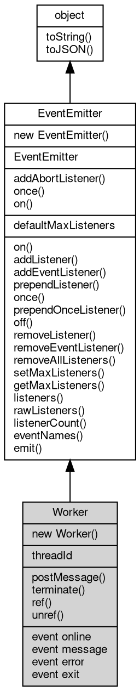

# Object Worker
Worker creates a JavaScript child thread and controls it; use it for CPU-bound work that would block the fiber scheduler of the main isolate

A Worker is a separate OS thread with its own V8 isolate: it shares no JavaScript objects with the
creator and never blocks it, which makes it the heavyweight but truly parallel option next to the
lightweight fibers of the [coroutine](../../module/ifs/coroutine.md) [module](../../module/ifs/module.md). Communication is message-based: the parent posts to the
Worker [object](object.md), the worker posts to `parentPort`, and both sides listen for message events.

Obtained from:
- `new Worker([path](../../module/ifs/path.md), opts)` — starts a thread from a script [path](../../module/ifs/path.md), a `file://` URL or inline source
  (`eval: true`); the class is also installed as the [global](../../module/ifs/global.md) `Worker`.

Concepts:

- **[Script](Script.md) source**: without `eval`, `path` must be absolute, start with `./`/`../` (resolved
  against the current working directory) or be a `file://` URL; a bare relative [path](../../module/ifs/path.md) throws
  `TypeError` with code `ERR_WORKER_PATH`. With `eval: true`, `path` is the program text.
- **Lifecycle and events**: `online` (isolate started), zero or more `message`, then `error` for an
  uncaught exception, and `exit` once with the exit code. `terminate()` stops the thread and
  resolves with that code.
- **Messages**: `postMessage` structured-clones the value, so the receiver gets an independent
  copy. On the worker side `parentPort` delivers and accepts messages; the parent reads them with
  `worker.on('message')` (or the `onmessage` property) and receives the raw value, not a
  [MessageEvent](MessageEvent.md).
- **Transferables**: the second argument of `postMessage` is a transfer list; fibjs detaches
  ArrayBuffer entries and ignores all other entries.
- **Keep-alive**: a Worker refs the [process](../../module/ifs/process.md) by default; `unref()` lets the parent exit without
  waiting and `ref()` restores the default. Messages queue until the first `message` listener is
  attached.
- **Exit codes**: 0 for a script that finished, N for `process.exit(N)` inside the worker, 1 for an
  uncaught exception or for terminate().

Example 1 — compute on a temporary worker script and read the result:

```JavaScript
const fs = require('fs');
const os = require('os');
const path = require('path');
const {
    Worker
} = require('worker_threads');

const dir = fs.mkdtempSync(path.join(os.tmpdir(), 'fibjs-worker-'));
const script = path.join(dir, 'sum.js');
fs.writeFile(script,
    'const { parentPort, workerData } = require("worker_threads");\n' +
    'parentPort.postMessage(workerData.reduce((a, b) => a + b, 0));\n');

const worker = new Worker(script, {
    workerData: [1, 2, 3, 4]
});
worker.on('message', (total) => console.log(total)); // 10
worker.on('exit', (code) => {
    console.log('exit code', code); // exit code 0
    fs.rmSync(dir, {
        recursive: true,
        force: true
    });
});
```

Example 2 — terminate a running worker and await its exit code:

```JavaScript
const {
    Worker
} = require('worker_threads');

const worker = new Worker('setInterval(() => {}, 1000);', {
    eval: true
});
worker.on('online', async () => {
    console.log('exit code', await worker.terminate()); // exit code 1
});
```

Example 3 — observe an uncaught worker exception:

```JavaScript
const {
    Worker
} = require('worker_threads');

const worker = new Worker('throw new Error("worker failed");', {
    eval: true
});
worker.on('error', (err) => console.log('error:', err.message)); // error: worker failed
worker.on('exit', (code) => console.log('exit code', code)); // exit code 1
```

Notes:

- Node.js members that fibjs does not provide: `worker.exitCode`, `worker.stdin`, `worker.stdout`
  and `worker.stderr`.
- fibjs implements the constructor options `eval` and `workerData`, plus the fibjs-only
  `file_system` and `safe_buffer`; the remaining Node.js options (`argv`, `env`, `execArgv`,
  `resourceLimits`, `trackUnmanagedFds`, `signal`) are not read.
- The `on<event>` properties (`ononline`, `onmessage`, `onerror`, `onexit`) are a fibjs
  convenience provided by [EventEmitter](EventEmitter.md); they carry the same payloads as `on('<event>')`.

## Inheritance

```dot
digraph {
    node [fontname="Helvetica,sans-Serif", fontsize=10, shape="record", style="filled", fillcolor="white"];

    object [tooltip="object", URL="object.md", label="{object|toString()\ltoJSON()\l}"];
    EventEmitter [tooltip="EventEmitter", URL="EventEmitter.md", label="{EventEmitter|new EventEmitter()\l|EventEmitter\l|addAbortListener()\lonce()\lon()\l|defaultMaxListeners\l|on()\laddListener()\laddEventListener()\lprependListener()\lonce()\lprependOnceListener()\loff()\lremoveListener()\lremoveEventListener()\lremoveAllListeners()\lsetMaxListeners()\lgetMaxListeners()\llisteners()\lrawListeners()\llistenerCount()\leventNames()\lemit()\l}"];
    Worker [tooltip="Worker", fillcolor="lightgray", id="me", label="{Worker|new Worker()\l|threadId\l|postMessage()\lterminate()\lref()\lunref()\l|event online\levent message\levent error\levent exit\l}"];

    object -> EventEmitter [dir=back];
    EventEmitter -> Worker [dir=back];
}
```

## Constructors
        
### Worker
**Creates a worker and starts its thread**

```JavaScript
new Worker(String path,
    Object opts = {});
```

Parameters:
* path: String, the Worker entry script; accepts an absolute [path](../../module/ifs/path.md), a relative [path](../../module/ifs/path.md) starting with ./ or ../, or the source code directly when opts.eval = true
* opts: Object, construction options, supports eval, workerData, file_system and safe_buffer

The `path` argument selects the source:

- a script [path](../../module/ifs/path.md): absolute, starting with `./` or `../` (resolved against the current working
  directory), or a `file://` URL; a bare relative [path](../../module/ifs/path.md) such as `'worker.js'` throws `TypeError`
  with code `ERR_WORKER_PATH`, as in Node.js;
- JavaScript source when `opts.eval` is true; the source runs with the filename
  `[worker eval].js`.

`opts` accepts the following options:

```JavaScript
// fragment: constructor options
({
    "eval": false, // true: path holds JavaScript source instead of a file name
    "workerData": null, // value cloned into the worker; read as worker_threads.workerData
    "file_system": true, // fibjs extension: false makes real-file access throw [20009]
    "safe_buffer": false // fibjs extension: true restricts Buffer codecs to native ones
})
```

`workerData` is cloned synchronously in the constructor; a value that cannot be cloned (for
example a [MessagePort](MessagePort.md) or a SharedArrayBuffer) makes the constructor throw. Messages posted
immediately after construction are queued until the worker starts.

## Static Methods
        
### addAbortListener
**Registers a one-shot abort handler on an [AbortSignal](AbortSignal.md)**

```JavaScript
static Object Worker.addAbortListener(EventEmitter signal,
    Function(Object ev) func);
```

Parameters:
* signal: [EventEmitter](EventEmitter.md), the [AbortSignal](AbortSignal.md) [object](object.md) to listen to
* func: Function(Object ev), the handler for the abort event

Returns:
* Object, returns a Disposable [object](object.md) containing a `[Symbol.dispose]` method

The handler is called at most once when the signal is aborted, and it is removed from the
signal afterwards. If the signal is already aborted the handler is invoked synchronously.
The returned [object](object.md) has a `[Symbol.dispose]()` method that removes the handler, so it can be
released before the abort happens.

Example — abort handling with automatic cleanup:

```JavaScript
const events = require('events');

const controller = new AbortController();
const disposable = events.addAbortListener(controller.signal,
    () => console.log('aborted'));

controller.abort(); // aborted
disposable[Symbol.dispose](); // safe to call after the listener fired
console.log(controller.signal.listenerCount('abort')); // 0
```

--------------------------
### once
**Creates a Promise resolved by the next occurrence of an event**

```JavaScript
static Object Worker.once(EventEmitter emitter,
    Value ev,
    Object options = {});
```

Parameters:
* emitter: [EventEmitter](EventEmitter.md), the event emitter [object](object.md) to listen to
* ev: Value, the event name to listen for
* options: Object, optional parameter [object](object.md)

Returns:
* Object, returns a Promise that resolves with the array of event parameters

The Promise resolves with the array of the emit arguments when the event fires; it rejects
when `error` is emitted while waiting, unless the waited event is `error` itself, or when
the signal option aborts. The temporary listeners are removed when the Promise settles.

options supports the following option:

```JavaScript
// fragment: options
({
    "signal": null // AbortSignal; aborting rejects the Promise with an AbortError
});
```

Example — awaiting the next occurrence of an event:

```JavaScript
const EventEmitter = require('events');

(async () => {
    const emitter = new EventEmitter();
    const waiting = EventEmitter.once(emitter, 'ready');

    emitter.emit('ready', 200, 'ok');
    console.log(JSON.stringify(await waiting)); // [200,"ok"]
})();
```

--------------------------
### on
**Creates an async iterator that yields event occurrences**

```JavaScript
static Object Worker.on(EventEmitter emitter,
    Value ev,
    Object options = {});
```

Parameters:
* emitter: [EventEmitter](EventEmitter.md), the event emitter [object](object.md) to listen to
* ev: Value, the event name to listen for
* options: Object, optional parameter [object](object.md)

Returns:
* Object, returns an AsyncIterator [object](object.md)

Each next() resolves with `{ value: [args...], done: false }` when the event fires and with
`{ done: true }` after an event named in the `close` option fires or the signal aborts; an
`error` event rejects the pending call. The listeners are registered when the iterator is
created and removed when the iteration ends or the signal aborts.

options supports the following options:

```JavaScript
// fragment: options
({
    "signal": null, // AbortSignal; aborting rejects pending and future next() calls
    "close": [] // event names; the first one to fire ends the iteration
});
```

Example — iterating the occurrences of an event:

```JavaScript
const EventEmitter = require('events');

(async () => {
    const emitter = new EventEmitter();
    const iterator = EventEmitter.on(emitter, 'data', {
        close: ['end']
    });

    emitter.emit('data', 1);
    emitter.emit('data', 2);
    emitter.emit('end');

    for await (const args of iterator)
    console.log(JSON.stringify(args)); // [1] then [2]
})();
```

## Static Properties
        
### defaultMaxListeners
**Integer, The [process](../../module/ifs/process.md)-wide default listener limit reported by getMaxListeners()**

```JavaScript
static Integer Worker.defaultMaxListeners;
```

Defaults to 10. Assigning a value changes getMaxListeners() for every emitter that never
called setMaxListeners(); an emitter with an explicit limit keeps it. The limit is
informational: fibjs never warns when the number of listeners exceeds it.

## Properties
        
### threadId
**Integer, Queries the logical worker id of the target worker**

```JavaScript
readonly Integer Worker.threadId;
```

Assigned when the Worker is created; the same number is available inside the thread as
`require('[worker_threads](../../module/ifs/worker_threads.md)').threadId`. The main thread has id 0 and worker ids are positive and
increasing, but they are logical fibjs isolate ids, not OS thread ids, and are not stable
across runs.

## Methods
        
### postMessage
**Sends a message to the peer thread**

```JavaScript
Worker.postMessage(Value data);
```

Parameters:
* data: Value, the message content to send

The value is structured-cloned, so the worker receives an independent copy; delivery is
asynchronous and ordered, and messages posted before the worker started are queued until the
first `message` listener is attached. Inside the worker the message arrives as the raw value
on `parentPort`; posting to a Worker whose thread has already exited is a silent no-op. Use
the transfer overload to move an ArrayBuffer instead of copying it.

Example — post to an eval worker and read the reply:

```JavaScript
const {
    Worker
} = require('worker_threads');

const worker = new Worker(
    'const { parentPort } = require("worker_threads");\n' +
    'parentPort.on("message", (value) => parentPort.postMessage(value * 2));', {
        eval: true
    });
worker.on('message', (doubled) => {
    console.log(doubled); // 8
    worker.terminate();
});
worker.postMessage(4);
```

--------------------------
**Sends a message to the peer thread and transfers the specified objects**

```JavaScript
Worker.postMessage(Value data,
    Array transfer);
```

Parameters:
* data: Value, the message content to send
* transfer: Array, the array of objects to transfer (ArrayBuffer, etc.); after transfer, the original objects can no longer be used by the sender

Every `ArrayBuffer` in `transfer` is detached on the sender before the message is queued (its
`byteLength` becomes 0) and arrives usable in the worker; the message and the buffers are
delivered together. fibjs only detaches ArrayBuffer entries: any other value, including a
[MessagePort](MessagePort.md) that Node.js can transfer, is silently ignored and stays usable on the sender.

Example — transfer an ArrayBuffer to the worker:

```JavaScript
const {
    Worker
} = require('worker_threads');

const worker = new Worker(
    'const { parentPort } = require("worker_threads");\n' +
    'parentPort.on("message", (buffer) => ' +
    'parentPort.postMessage(new Uint8Array(buffer)[0]));', {
        eval: true
    });
const buffer = new ArrayBuffer(1);
new Uint8Array(buffer)[0] = 7;
worker.on('message', (value) => {
    console.log(value, buffer.byteLength); // 7 0
    worker.terminate();
});
worker.postMessage(buffer, [buffer]);
```

--------------------------
### terminate
**Terminates the worker and resolves with its exit code**

```JavaScript
Integer Worker.terminate() promise;
```

Returns:
* Integer, returns the exit code of the worker

The termination starts synchronously and the returned promise resolves when the worker emits
`exit`, with the same code. A worker that has already exited resolves immediately with its
recorded code, and calling terminate() twice is safe. A worker stopped by terminate() reports
exit code 1, including a worker that was terminated before it went online (Node.js reports 0
for that case); no `error` event is emitted for the interruption and the worker's pending
`beforeExit`/`exit` handlers do not run.

Example — stop a worker that would otherwise run forever:

```JavaScript
const {
    Worker
} = require('worker_threads');

const worker = new Worker('setInterval(() => {}, 1000);', {
    eval: true
});
worker.on('online', async () => {
    console.log(await worker.terminate()); // 1
});
```

--------------------------
### ref
**Keeps the fibjs [process](../../module/ifs/process.md) from exiting**

```JavaScript
Worker.ref();
```

A Worker refs the [process](../../module/ifs/process.md) from creation, so the parent waits for the worker; the method is
idempotent and returns undefined. Call `unref()` to drop that reference again.

--------------------------
### unref
**Allows the fibjs [process](../../module/ifs/process.md) to exit**

```JavaScript
Worker.unref();
```

After the call the worker no longer keeps the [process](../../module/ifs/process.md) alive: pending `beforeExit` handlers can
run and the [process](../../module/ifs/process.md) may exit while the worker is still running. The worker keeps running as long
as the [process](../../module/ifs/process.md) lives for other reasons. Idempotent, returns undefined; `ref()` restores the
reference.

--------------------------
### on
**Appends an event handler to the emitter**

```JavaScript
Object Worker.on(Value ev,
    Function(...args) func);
```

Parameters:
* ev: Value, the event name to bind
* func: Function(...args), the event handler function, called with the emit arguments

Returns:
* Object, returns the event [object](object.md) itself for chaining

The listener is called with the arguments of emit() and `this` set to the emitter; the
emitter itself is returned so registrations can be chained. The same function may be
registered several times for one event and each copy is called. See the class documentation
for the dispatch order.

--------------------------
**Appends several event handlers to the emitter**

```JavaScript
Object Worker.on(Object map);
```

Parameters:
* map: Object, the event mapping; [object](object.md) property names are used as event names

Returns:
* Object, returns the event [object](object.md) itself for chaining

Every enumerable property of the map whose value is a function is registered under its
property name. Properties are processed in order; a value that is not a function makes the
call fail with an invalid-type error while entries processed before it stay registered.

Example — registering several handlers at once:

```JavaScript
const EventEmitter = require('events');

const emitter = new EventEmitter();
emitter.on({
    connect: () => console.log('connect'),
    close: () => console.log('close')
});

emitter.emit('connect'); // connect
emitter.emit('close'); // close
```

--------------------------
### addListener
**Appends an event handler to the emitter**

```JavaScript
Object Worker.addListener(Value ev,
    Function(...args) func);
```

Parameters:
* ev: Value, the event name to bind
* func: Function(...args), the event handler function

Returns:
* Object, returns the event [object](object.md) itself for chaining

Alias of on(ev, func), provided for Node.js compatibility.

--------------------------
**Appends several event handlers to the emitter**

```JavaScript
Object Worker.addListener(Object map);
```

Parameters:
* map: Object, the event mapping; [object](object.md) property names are used as event names

Returns:
* Object, returns the event [object](object.md) itself for chaining

Alias of on(map), provided for Node.js compatibility.

--------------------------
### addEventListener
**Appends an event handler to the emitter with an options [object](object.md)**

```JavaScript
Object Worker.addEventListener(Value ev,
    Function(...args) func,
    Object options = {});
```

Parameters:
* ev: Value, the event name to bind
* func: Function(...args), the event handler function, called with the emit arguments
* options: Object, the options of the event handler

Returns:
* Object, returns the event [object](object.md) itself for chaining

Web-style alias of on(); the only supported option is `once`, which registers a one-shot
handler exactly like once(). The listener receives the plain emit arguments and not an [Event](Event.md)
[object](object.md); see the [DOMEvent](DOMEvent.md) class for the DOM-style event [object](object.md) used by [AbortSignal](AbortSignal.md) and
fetch-style APIs.

options supports the following option:

```JavaScript
// fragment: options
({
    "once": false // when true, the handler is removed before its single invocation
});
```

Example — a one-shot DOM-style registration:

```JavaScript
const EventEmitter = require('events');

const emitter = new EventEmitter();
emitter.addEventListener('ping', () => console.log('ping'), {
    once: true
});

emitter.emit('ping'); // ping
console.log(emitter.emit('ping')); // false
console.log(emitter.listenerCount('ping')); // 0
```

--------------------------
### prependListener
**Inserts an event handler at the front of the queue**

```JavaScript
Object Worker.prependListener(Value ev,
    Function(...args) func);
```

Parameters:
* ev: Value, the event name to bind
* func: Function(...args), the event handler function

Returns:
* Object, returns the event [object](object.md) itself for chaining

The listener is called before the listeners registered with on()/addListener() the next time
the event is emitted. When several prependListener() calls are made, the last one registered
is called first, because every call inserts at the same position.

Example — insertion at the front of the queue:

```JavaScript
const EventEmitter = require('events');

const emitter = new EventEmitter();
emitter.on('order', () => console.log('on'));
emitter.prependListener('order', () => console.log('prepend'));

emitter.emit('order'); // prepend, then on
```

--------------------------
**Inserts several event handlers at the front of the queue**

```JavaScript
Object Worker.prependListener(Object map);
```

Parameters:
* map: Object, the event mapping; [object](object.md) property names are used as event names

Returns:
* Object, returns the event [object](object.md) itself for chaining

Map form of prependListener(); every function property is inserted at the front, so the
properties of the map are called in reverse order.

--------------------------
### once
**Appends a one-shot event handler to the emitter**

```JavaScript
Object Worker.once(Value ev,
    Function(...args) func);
```

Parameters:
* ev: Value, the event name to bind
* func: Function(...args), the event handler function

Returns:
* Object, returns the event [object](object.md) itself for chaining

The handler is wrapped and removes itself from the queue before it is called, so it runs at
most once. off() removes it when passed the original function, listeners() returns the
original function, and rawListeners() returns the internal wrapper whose `_func` property
holds the original. See Example 2 in the class documentation.

--------------------------
**Appends several one-shot event handlers to the emitter**

```JavaScript
Object Worker.once(Object map);
```

Parameters:
* map: Object, the event mapping; [object](object.md) property names are used as event names

Returns:
* Object, returns the event [object](object.md) itself for chaining

Map form of once(); every function property is registered as a one-shot listener under its
property name.

--------------------------
### prependOnceListener
**Inserts a one-shot event handler at the front of the queue**

```JavaScript
Object Worker.prependOnceListener(Value ev,
    Function(...args) func);
```

Parameters:
* ev: Value, the event name to bind
* func: Function(...args), the event handler function

Returns:
* Object, returns the event [object](object.md) itself for chaining

Combines prependListener() and once(): the handler is called first and only once, and it is
removed before its invocation.

--------------------------
**Inserts several one-shot event handlers at the front of the queue**

```JavaScript
Object Worker.prependOnceListener(Object map);
```

Parameters:
* map: Object, the event mapping; [object](object.md) property names are used as event names

Returns:
* Object, returns the event [object](object.md) itself for chaining

Map form of prependOnceListener(); every function property is inserted as a one-shot
listener, and the properties of the map are called in reverse order.

--------------------------
### off
**Removes an event handler from the emitter**

```JavaScript
Object Worker.off(Value ev,
    Function(...args) func);
```

Parameters:
* ev: Value, the event name to unbind
* func: Function(...args), the event handler function

Returns:
* Object, returns the event [object](object.md) itself for chaining

The first matching listener is removed; when the same function was registered several times
only one copy is removed per call, so repeat the call to remove the others. A once() wrapper
is matched by its original function as well. Removing a listener emits the `removeListener`
meta event after the removal.

--------------------------
**Removes all event handlers of one event**

```JavaScript
Object Worker.off(Value ev);
```

Parameters:
* ev: Value, the event name to unbind

Returns:
* Object, returns the event [object](object.md) itself for chaining

Every listener of the event is removed and `removeListener` is emitted once per removed
listener. The call succeeds when the event has no listener.

Example — removing every listener of one event:

```JavaScript
const EventEmitter = require('events');

const emitter = new EventEmitter();
emitter.on('data', () => console.log('first'));
emitter.on('data', () => console.log('second'));

emitter.off('data');
console.log(emitter.emit('data')); // false
```

--------------------------
**Removes several event handlers from the emitter**

```JavaScript
Object Worker.off(Object map);
```

Parameters:
* map: Object, the event mapping; [object](object.md) property names are used as event names

Returns:
* Object, returns the event [object](object.md) itself for chaining

Every enumerable property of the map whose value is a function names an event from which
that function is removed (one copy per event). A value that is not a function makes the call
fail with an invalid-type error.

--------------------------
### removeListener
**Removes an event handler from the emitter**

```JavaScript
Object Worker.removeListener(Value ev,
    Function(...args) func);
```

Parameters:
* ev: Value, the event name to unbind
* func: Function(...args), the event handler function

Returns:
* Object, returns the event [object](object.md) itself for chaining

Alias of off(ev, func), provided for Node.js compatibility.

--------------------------
**Removes all event handlers of one event**

```JavaScript
Object Worker.removeListener(Value ev);
```

Parameters:
* ev: Value, the event name to unbind

Returns:
* Object, returns the event [object](object.md) itself for chaining

Alias of off(ev), provided for Node.js compatibility.

--------------------------
**Removes several event handlers from the emitter**

```JavaScript
Object Worker.removeListener(Object map);
```

Parameters:
* map: Object, the event mapping; [object](object.md) property names are used as event names

Returns:
* Object, returns the event [object](object.md) itself for chaining

Alias of off(map), provided for Node.js compatibility.

--------------------------
### removeEventListener
**Removes an event handler with an options [object](object.md)**

```JavaScript
Object Worker.removeEventListener(Value ev,
    Function(...args) func,
    Object options = {});
```

Parameters:
* ev: Value, the event name to unbind
* func: Function(...args), the event handler function
* options: Object, the options of the event handler, ignored

Returns:
* Object, returns the event [object](object.md) itself for chaining

Web-style alias of off(ev, func); the options [object](object.md) is accepted and ignored, and a once()
wrapper is matched by its original function like off().

--------------------------
### removeAllListeners
**Removes all listeners of one event**

```JavaScript
Object Worker.removeAllListeners(Value ev);
```

Parameters:
* ev: Value, the event name to remove

Returns:
* Object, returns the event [object](object.md) itself for chaining

Equivalent to off(ev): every listener of the event is removed, including once() wrappers
matched by their original function, and `removeListener` is emitted once per removal.

--------------------------
**Removes all listeners of the given events, or of the whole emitter**

```JavaScript
Object Worker.removeAllListeners(Array evs = []);
```

Parameters:
* evs: Array, the event names to remove

Returns:
* Object, returns the event [object](object.md) itself for chaining

An empty array — including the no-argument call, because the parameter defaults to [] —
clears every string-keyed event; symbol-keyed listeners are left in place, unlike Node.js
which removes them too. A non-empty array clears each named event as
removeAllListeners(ev) does.

Example — clearing selected events and the whole emitter:

```JavaScript
const EventEmitter = require('events');

const emitter = new EventEmitter();
emitter.on('a', () => {});
emitter.on('b', () => {});
emitter.on('c', () => {});

emitter.removeAllListeners(['a', 'b']);
console.log(emitter.listenerCount('a'), emitter.listenerCount('c')); // 0 1

emitter.removeAllListeners();
console.log(emitter.eventNames().length); // 0
```

--------------------------
### setMaxListeners
**Stores a per-emitter listener limit**

```JavaScript
Worker.setMaxListeners(Integer n);
```

Parameters:
* n: Integer, the number of events

The value is reported by getMaxListeners() and is otherwise informational: fibjs never warns
when the number of listeners exceeds it. This member exists for Node.js compatibility. A
negative value throws; 0 is accepted and stored as-is, while Node.js treats 0 as unlimited.

--------------------------
### getMaxListeners
**Returns the listener limit of the emitter**

```JavaScript
Integer Worker.getMaxListeners();
```

Returns:
* Integer, returns the default limit

Returns the value set by setMaxListeners(), or the [process](../../module/ifs/process.md)-wide defaultMaxListeners (10)
when no explicit value was set.

--------------------------
### listeners
**Returns a copy of the listener array of an event**

```JavaScript
Array Worker.listeners(Value ev);
```

Parameters:
* ev: Value, the event name to query

Returns:
* Array, returns the listener array of the specified event

One-shot wrappers are unwrapped, so the result contains the functions passed to
on()/once() and can be passed to off(); an unknown event produces an empty array.

Example — once() listeners are returned unwrapped:

```JavaScript
const EventEmitter = require('events');

const emitter = new EventEmitter();

function onTick() {
    console.log('tick');
}

emitter.once('tick', onTick);
console.log(emitter.listeners('tick')[0] === onTick); // true
console.log(emitter.rawListeners('tick')[0] === onTick); // false
```

--------------------------
### rawListeners
**Returns the internal listener array of an event**

```JavaScript
Array Worker.rawListeners(Value ev);
```

Parameters:
* ev: Value, the event name to query

Returns:
* Array, returns the listener array of the specified event

The array is not unwrapped: a listener registered with once() appears as the internal
wrapper function whose `_func` property holds the original function. An unknown event
produces an empty array.

--------------------------
### listenerCount
**Returns the number of listeners of an event**

```JavaScript
Integer Worker.listenerCount(Value ev);
```

Parameters:
* ev: Value, the event name to query

Returns:
* Integer, returns the number of listeners of the specified event

One-shot listeners count as one and an unknown event returns 0.

--------------------------
**Returns the number of listeners of an event on another [object](object.md)**

```JavaScript
Integer Worker.listenerCount(Value o,
    Value ev);
```

Parameters:
* o: Value, the [object](object.md) to query
* ev: Value, the event name to query

Returns:
* Integer, returns the number of listeners of the specified event

Counts without requiring the target to be an [EventEmitter](EventEmitter.md): any [object](object.md) with registered
events can be queried. The call is normally written as
`EventEmitter.listenerCount(target, 'data')`.

Example — counting the listeners of another [object](object.md):

```JavaScript
const EventEmitter = require('events');

const emitter = new EventEmitter();
emitter.on('data', () => {});
emitter.on('data', () => {});

console.log(EventEmitter.listenerCount(emitter, 'data')); // 2
```

--------------------------
### eventNames
**Returns the names of the events with at least one listener**

```JavaScript
Array Worker.eventNames();
```

Returns:
* Array, returns the array of event names

Only string-keyed events are reported; symbol-keyed events are omitted and numeric event
names are returned as numbers (Node.js also reports symbol events).

--------------------------
### emit
**Emits an event and returns whether a listener was called**

```JavaScript
Boolean Worker.emit(Value ev,
    ...args);
```

Parameters:
* ev: Value, event name
* args: ..., event parameters, which are passed to the event handler

Returns:
* Boolean, returns whether the event had a listener to respond to it

Listeners are called as described by the dispatch model in the class documentation: the
first one runs synchronously on the current fiber, the remaining ones run in parallel
fibers, and the call returns after all of them finish; an exception raised by a listener is
thrown back to the caller. Emitting `error` with no listener throws instead of returning
false: an Error argument is thrown as-is and any other value is wrapped in
`Error("Unhandled error. (...)")`. [Event](Event.md) names are strings or symbols; `emit()` does not
match a listener registered with a numeric name.

--------------------------
### toString
**Returns the string form of the [object](object.md)**

```JavaScript
String Worker.toString();
```

Returns:
* String, returns the string form of the [object](object.md)

The base implementation reports an error: a native [object](object.md) has no implicit
text form, and only the classes whose value can be written as a string
override the member. [Buffer](Buffer.md) returns its content decoded with the given
[encoding](../../module/ifs/encoding.md), [HttpCookie](HttpCookie.md) returns "name=value", and so on; an override commonly
accepts optional arguments ([Buffer.toString](Buffer.md#toString) takes [encoding](../../module/ifs/encoding.md), start and
end) that are not part of this declaration.

Calling the member on a class that does not override it throws
"<Class>: the [object](object.md) can not be converted to string.", which is the
behavior to rely on when probing whether a value has a string form. See
toJSON for the serialization hook.

--------------------------
### toJSON
**Returns the JSON representation of the [object](object.md)**

```JavaScript
Value Worker.toJSON(String key = "");
```

Parameters:
* key: String, the property name of the value being serialized

Returns:
* Value, returns the JSON-serializable value

JSON.stringify(value) calls value.toJSON(key) when the member exists and
serializes the returned value in its place; the key argument carries the
property name of the value inside its parent [object](object.md) (an empty string at
the top level) and may be used to build a keyed form. The base
implementation returns a plain [object](object.md) holding the readable properties of
the instance, so a native [object](object.md) serializes without per-class code; a
class with a portable shape such as [Buffer](Buffer.md) overrides it, and a JavaScript
class may override it in the same way.

The member is normally reached through JSON.stringify rather than called
directly; calling it returns the same value JSON.stringify would
serialize.

## Events
        
### online
**Queries and binds the worker ready event, equivalent to on("online", func);**

```JavaScript
event Worker.online();
```

Emitted once the worker thread has started and before it runs its script; the listener gets no
argument. It is not emitted when the worker is terminated before starting, so do not use it as
the only completion signal. The `ononline` property is the same binding.

--------------------------
### message
**Queries and binds the postMessage message event, equivalent to on("message", func);**

```JavaScript
event Worker.message(Value data);
```

Parameters:
* data: Value, the message sent by the worker thread

The listener receives the deserialized value itself (a structured clone), not a [MessageEvent](MessageEvent.md);
`worker.onmessage` behaves identically. Messages posted by the worker before the listener is
attached are queued and delivered once the listener is added, because the first `message`
listener starts the implicit port automatically.

--------------------------
### error
**Queries and binds the error message event, equivalent to on("error", func);**

```JavaScript
event Worker.error(Value err);
```

Parameters:
* err: Value, the uncaught error of the worker thread

Emitted when the worker script throws an uncaught exception; the listener receives an Error
carrying the original message and the worker-side stack. The worker then exits with code 1 and
emits `exit`, so attach this listener together with `exit`. terminate() does not emit `error`.

--------------------------
### exit
**Queries and binds the worker exit event, equivalent to on("exit", func);**

```JavaScript
event Worker.exit(Integer code);
```

Parameters:
* code: Integer, the exit code of the worker thread

Emitted exactly once when the thread ends, after `error` if there was one. The argument is the
numeric exit code: 0 for a script that finished, N for `process.exit(N)` inside the worker and 1
for an uncaught exception or terminate(). The terminate() promise resolves right after this
event.

