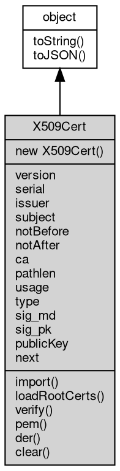

# 对象 X509Cert
X509Cert 是 [crypto](../../module/ifs/crypto.md) 模块中表示 x509 证书的对象，这个对象主要包括了从一个 DER 或者 PEM 格式的证书数据以及证书链数据构建出来的证书信息和方法，可以进行证书的解析和验证等操作

通过 X509Cert 对象可以获取到证书的主题名称，颁发者名称，通过时间，到期时间，ca 验证等等信息，还可以导出证书的 DER 编码，获取证书的公钥以及签名算法等等信息。

如果想要加载一个证书，可以使用如下代码从 DER/PEM 格式的证书数据中创建 X509Cert 对象：

```JavaScript
const crypto = require('crypto');

const certData = require('fs').readFile('server.crt');
const cert = new crypto.X509Cert(certData);
```

当然，X509Cert 对象也提供了直接导入证书的方法：

```JavaScript
const cert = crypto.X509Cert.import(certData);
```

然后你就可以通过 cert 进行各种证书的操作，例如获取证书的有效期时间：

```JavaScript
var strDate = cert.notBefore.toLocaleTimeString() + " " + cert.notBefore.toLocaleDateString() + " ~ " + cert.notAfter.toLocaleTimeString() + " " + cert.notAfter.toLocaleDateString();
console.log(`证书有效时间: ${strDate}`)
```

## 继承关系


## 构造函数
        
### X509Cert
**X509Cert 构造函数**

```JavaScript
new X509Cert();
```

--------------------------
**X509Cert 构造函数，加载一个 DER 格式的证书**

```JavaScript
new X509Cert(Buffer derCert);
```

调用参数:
* derCert: [Buffer](Buffer.md), DER 格式的证书

--------------------------
**X509Cert 构造函数，加载一个 CRT/PEM 格式的证书**

```JavaScript
new X509Cert(String txtCert);
```

调用参数:
* txtCert: String, CRT/PEM 格式的证书

## 成员属性
        
### version
**Integer, 获取证书的版本**

```JavaScript
readonly Integer X509Cert.version;
```

--------------------------
### serial
**String, 获取证书的序列号**

```JavaScript
readonly String X509Cert.serial;
```

--------------------------
### issuer
**String, 获取证书颁发者的可分辨名称**

```JavaScript
readonly String X509Cert.issuer;
```

--------------------------
### subject
**String, 获取证书的主题可分辨名称**

```JavaScript
readonly String X509Cert.subject;
```

--------------------------
### notBefore
**Date, 获取证书的生效时间**

```JavaScript
readonly Date X509Cert.notBefore;
```

--------------------------
### notAfter
**Date, 获取证书的到期时间**

```JavaScript
readonly Date X509Cert.notAfter;
```

--------------------------
### ca
**Boolean, 获取证书是否是 ca 证书**

```JavaScript
readonly Boolean X509Cert.ca;
```

--------------------------
### pathlen
**Integer, 获取证书的 pathlen**

```JavaScript
readonly Integer X509Cert.pathlen;
```

--------------------------
### usage
**String, 获取证书的使用范围**

```JavaScript
readonly String X509Cert.usage;
```

结果为全部或部分以下内容：digitalSignature, nonRepudiation, keyEncipherment, dataEncipherment, keyAgreement, keyCertSign, cRLSign

--------------------------
### type
**String, 获取证书的 Netscape 证书类型**

```JavaScript
readonly String X509Cert.type;
```

结果为全部或部分以下内容：client, server, email, objsign, reserved, sslCA, emailCA, objCA

--------------------------
### sig_md
**Integer, 获取证书的摘要算法**

```JavaScript
readonly Integer X509Cert.sig_md;
```

--------------------------
### sig_pk
**Integer, 获取证书的签名算法**

```JavaScript
readonly Integer X509Cert.sig_pk;
```

--------------------------
### publicKey
**[PKey](PKey.md), 获取证书的公钥**

```JavaScript
readonly PKey X509Cert.publicKey;
```

--------------------------
### next
**X509Cert, 获取证书链中得下一个证书**

```JavaScript
readonly X509Cert X509Cert.next;
```

## 成员函数
        
### import
**加载一个 DER 格式的证书，可多次调用**

```JavaScript
X509Cert.import(Buffer derCert);
```

调用参数:
* derCert: [Buffer](Buffer.md), DER 格式的证书

--------------------------
**加载一个 CRT/PEM 格式的证书，可多次调用**

```JavaScript
X509Cert.import(String txtCert);
```

调用参数:
* txtCert: String, CRT/PEM 格式的证书

--------------------------
### loadRootCerts
**加载自带的缺省根证书**

```JavaScript
X509Cert.loadRootCerts();
```

此证书内容源自：http://hg.mozilla.org/releases/mozilla-release/raw-file/default/security/nss/lib/ckfw/builtins/certdata.txt

--------------------------
### verify
**使用当前证书链验证给定的证书**

```JavaScript
Boolean X509Cert.verify(X509Cert cert) async;
```

调用参数:
* cert: X509Cert, 给定需要验证的证书

返回结果:
* Boolean, 如果验证成功则返回 True

--------------------------
### pem
**以 PEM 格式导出已经加载的证书**

```JavaScript
String X509Cert.pem(Boolean all = true);
```

调用参数:
* all: Boolean, 指定是否输出全部证书，缺省为 true

返回结果:
* String, 以数组方式导出证书链

--------------------------
### der
**以 DER 格式导出已经加载的证书**

```JavaScript
Buffer X509Cert.der();
```

返回结果:
* [Buffer](Buffer.md), 以数组方式导出证书链

--------------------------
### clear
**清空已经加载的证书**

```JavaScript
X509Cert.clear();
```

--------------------------
### toString
**返回对象的字符串表示，一般返回 "[Native Object]"，对象可以根据自己的特性重新实现**

```JavaScript
String X509Cert.toString();
```

返回结果:
* String, 返回对象的字符串表示

--------------------------
### toJSON
**返回对象的 JSON 格式表示，一般返回对象定义的可读属性集合**

```JavaScript
Value X509Cert.toJSON(String key = "");
```

调用参数:
* key: String, 未使用

返回结果:
* Value, 返回包含可 JSON 序列化的值

