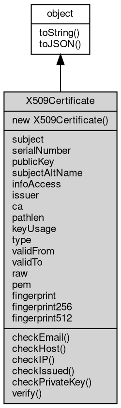

# 对象 X509Certificate
封装 X509 证书并提供信息读取

```JavaScript
const crypto = require('crypto');
const cert = new crypto.X509Certificate(Buffer.from('...'));
```

## 继承关系


## 构造函数
        
### X509Certificate
**从证书创建一个 X509Certificate 对象**

```JavaScript
new X509Certificate(Buffer cert);
```

调用参数:
* cert: [Buffer](Buffer.md), 证书的二进制数据

返回结果:
* 返回一个 X509Certificate 对象

## 成员属性
        
### subject
**String, 证书的主题**

```JavaScript
readonly String X509Certificate.subject;
```

--------------------------
### serialNumber
**String, 证书的序列号**

```JavaScript
readonly String X509Certificate.serialNumber;
```

--------------------------
### publicKey
**[KeyObject](KeyObject.md), 证书的认证的公钥**

```JavaScript
readonly KeyObject X509Certificate.publicKey;
```

--------------------------
### subjectAltName
**String, 证书的主题备用名称**

```JavaScript
readonly String X509Certificate.subjectAltName;
```

--------------------------
### infoAccess
**String, 证书的信息访问扩展，返回一个换行分隔的访问描述列表。每行开头为访问方法和访问位置的类型，后跟冒号和与访问位置关联的值**

```JavaScript
readonly String X509Certificate.infoAccess;
```

--------------------------
### issuer
**String, 证书的颁发者**

```JavaScript
readonly String X509Certificate.issuer;
```

--------------------------
### ca
**Boolean, 证书是否是 CA 证书**

```JavaScript
readonly Boolean X509Certificate.ca;
```

--------------------------
### pathlen
**Integer, 证书的路径长度约束**

```JavaScript
readonly Integer X509Certificate.pathlen;
```

--------------------------
### keyUsage
**Array, 证书的密钥用法**

```JavaScript
readonly Array X509Certificate.keyUsage;
```

--------------------------
### type
**Array, 证书的 Netscape 类型**

```JavaScript
readonly Array X509Certificate.type;
```

--------------------------
### validFrom
**String, 证书的有效期开始时间**

```JavaScript
readonly String X509Certificate.validFrom;
```

--------------------------
### validTo
**String, 证书的有效期结束时间**

```JavaScript
readonly String X509Certificate.validTo;
```

--------------------------
### raw
**[Buffer](Buffer.md), 证书的原始二进制数据**

```JavaScript
readonly Buffer X509Certificate.raw;
```

--------------------------
### pem
**String, 证书的 PEM 编码**

```JavaScript
readonly String X509Certificate.pem;
```

--------------------------
### fingerprint
**String, 证书的 SHA-1 指纹**

```JavaScript
readonly String X509Certificate.fingerprint;
```

--------------------------
### fingerprint256
**String, 证书的 SHA-256 指纹**

```JavaScript
readonly String X509Certificate.fingerprint256;
```

--------------------------
### fingerprint512
**String, 证书的 SHA-512 指纹**

```JavaScript
readonly String X509Certificate.fingerprint512;
```

## 成员函数
        
### checkEmail
**检查证书是否与给定的电子邮件地址匹配**

```JavaScript
String X509Certificate.checkEmail(String email,
    Object options = {});
```

调用参数:
* email: String, 电子邮件地址
* options: Object, 选项

返回结果:
* String, 如果证书匹配，则返回 email，如果不匹配，则返回 undefined

如果 options.subject 选项未定义或设置为 'default'，则仅当主题备用名称扩展不存在或不包含任何电子邮件地址时才考虑证书主题。

如果 options.subject 选项设置为 'always' 并且主题备用名称扩展不存在或不包含匹配的电子邮件地址，则考虑证书主题。

如果 options.subject 选项设置为 'never'，则永远不会考虑证书主题，即使证书不包含主题备用名称。

--------------------------
### checkHost
**检查证书是否与给定的主机名匹配**

```JavaScript
String X509Certificate.checkHost(String name,
    Object options = {});
```

调用参数:
* name: String, 主机名
* options: Object, 选项

返回结果:
* String, 返回与 name 匹配的主题名称，如果没有主题名称与 name 匹配，则返回 undefined

如果证书与给定的主机名匹配，则返回匹配的主题名称。返回的名称可能是完全匹配的（foo.example.com），也可能包含通配符（*.example.com ）。由于主机名比较不区分大小写，因此返回的使用者名称的大小写也可能与给定的 name 不同。

options 支持一下属性：
 - subject: 'default'、'always' 或 'never'。默认值：'default'。
 - wildcards: 默认值 true。
 - partialWildcards: 默认值 true。
 - multiLabelWildcards: 默认值 false。
 - singleLabelSubdomains: 默认值 false。

如果 options.subject 选项未定义或设置为 'default'，则仅当使用者备用名称扩展不存在或不包含任何 DNS 名称时才考虑证书使用者。

如果 options.subject 选项设置为 'always' 并且使用者备用名称扩展不存在或不包含匹配的 DNS 名称，则将考虑证书使用者。

如果 options.subject 选项设置为 'never'，则永远不会考虑证书主题，即使证书不包含主题备用名称。

--------------------------
### checkIP
**检查证书是否与给定的 IP 地址（IPv4 或 IPv6）匹配**

```JavaScript
String X509Certificate.checkIP(String ip);
```

调用参数:
* ip: String, IP 地址

返回结果:
* String, 如果证书匹配，则返回 ip ，如果不匹配，则返回 undefined

--------------------------
### checkIssued
**检查此证书是否由给定的 issuer 颁发**

```JavaScript
Boolean X509Certificate.checkIssued(X509Certificate issuer);
```

调用参数:
* issuer: X509Certificate, 颁发者证书

返回结果:
* Boolean, 如果证书由 issuer 颁发，则返回 true，否则返回 false

--------------------------
### checkPrivateKey
**检查证书的公钥是否与给定的私钥签名匹配**

```JavaScript
Boolean X509Certificate.checkPrivateKey(KeyObject privateKey);
```

调用参数:
* privateKey: [KeyObject](KeyObject.md), 私钥

返回结果:
* Boolean, 如果匹配，则返回 true，否则返回 false

--------------------------
### verify
**验证此证书是否由给定的公钥签名。不对证书执行任何其他验证检查**

```JavaScript
Boolean X509Certificate.verify(KeyObject publicKey);
```

调用参数:
* publicKey: [KeyObject](KeyObject.md), 公钥

返回结果:
* Boolean, 如果验证成功，则返回 true，否则返回 false

--------------------------
### toString
**返回对象的字符串表示，一般返回 "[Native Object]"，对象可以根据自己的特性重新实现**

```JavaScript
String X509Certificate.toString();
```

返回结果:
* String, 返回对象的字符串表示

--------------------------
### toJSON
**返回对象的 JSON 格式表示，一般返回对象定义的可读属性集合**

```JavaScript
Value X509Certificate.toJSON(String key = "");
```

调用参数:
* key: String, 未使用

返回结果:
* Value, 返回包含可 JSON 序列化的值

