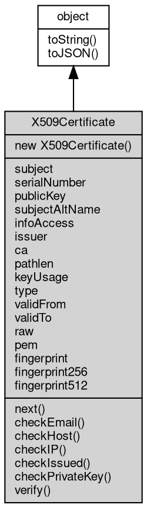

# Object X509Certificate
A parsed X.509 certificate: reads the subject, issuer, validity, extensions,

public key and fingerprints, and checks host names, IP addresses, e-mail addresses and
signatures

An X509Certificate wraps one certificate, plus the rest of the chain when the input holds
several certificates (walk it with next()). It is the [object](object.md) fibjs hands back wherever a
certificate is read: the TLS layer exposes the peer certificate through
[TLSSocket](TLSSocket.md)#getPeerX509Certificate(), a [SecureContext](SecureContext.md) exposes its leaf chain and trusted CAs
through cert and ca, and [X509CertificateRequest](X509CertificateRequest.md)#issue() returns the certificate it signed.
The getters only read; trust decisions are made by the explicit check and verify members.

Concepts:

- **Subject and issuer**: each is a distinguished name (DN) printed as one RDN per line
  with short attribute names (`C=CN`, `O=Example`, `CN=example.com`, `emailAddress=...`).
  The subject names the owner, the issuer names the signer; they are equal for a
  self-signed certificate. Reading an empty DN throws instead of returning an empty string.
- **Validity window**: validFrom and validTo are UTC timestamps formatted as
  `Mmm d HH:MM:SS YYYY GMT` and accepted by `new Date(...)`. No member enforces the window.
- **Subject alternative names**: the SAN extension is the authoritative source for host
  names, IP addresses, e-mail addresses and URIs; the CN is only a legacy fallback used
  when the relevant SAN entry type is absent. checkHost('a.example.com') returns the
  matching name (for example `*.example.com`) or undefined.
- **Fingerprints**: SHA-1, SHA-256 and SHA-512 digests of the DER [encoding](../../module/ifs/encoding.md), printed as
  uppercase [hex](../../module/ifs/hex.md) bytes separated by colons (59, 95 and 191 characters long).
- **PEM and DER**: fibjs parses PEM only, in the constructor and in checkIssued alike; a
  DER [Buffer](Buffer.md) is rejected with ERR_OSSL_NO_START_LINE. raw returns the DER of the first
  certificate, pem returns the PEM of the whole chain.
- **Explicit trust**: checkIssued compares the issuer name, the key identifiers and (when
  the issuer asserts one) its key usage, but does not verify the signature; verify checks
  the signature with a public key; checkPrivateKey proves that a private key belongs to
  the certified public key. Expiry, revocation and the chain are never validated here.

Obtained from:
- `new [crypto.X509Certificate](../../module/ifs/crypto.md#X509Certificate)(pem)` — one PEM string or [Buffer](Buffer.md), possibly holding several
  certificates; the first is returned and next() walks the rest;
- `new [crypto.X509Certificate](../../module/ifs/crypto.md#X509Certificate)([pem1, pem2, ...])` — a chain built from PEM strings and
  Buffers, in order;
- `[X509CertificateRequest](X509CertificateRequest.md)#issue(options)` — the certificate created from a request;
- `[TLSSocket](TLSSocket.md)#getPeerX509Certificate()` / `[TLSSocket](TLSSocket.md)#getX509Certificate()` — the peer and
  local certificates of a TLS connection;
- `[SecureContext](SecureContext.md)#cert` / `[SecureContext](SecureContext.md)#ca` — the leaf chain and trusted CAs of a context;
- `crypto.X509Certificate` — the class reference on the [crypto](../../module/ifs/crypto.md) [module](../../module/ifs/module.md).

Example 1 — create a self-signed certificate and read its fields:

```JavaScript
const crypto = require('crypto');

const {
    privateKey
} = crypto.generateKeyPair('ec', {
    namedCurve: 'prime256v1'
});
const req = crypto.createCertificateRequest({
    key: privateKey,
    subject: {
        C: 'CN',
        O: 'Example',
        CN: 'example.com'
    }
});
const cert = req.issue({
    key: privateKey,
    issuer: {
        C: 'CN',
        O: 'Example',
        CN: 'example.com'
    },
    days: 30,
    ca: true,
    keyUsage: ['digitalSignature', 'keyCertSign']
});

console.log(cert.subject.includes('CN=example.com')); // true
console.log(cert.ca, cert.pathlen); // true -1
console.log(Math.round((new Date(cert.validTo) - new Date(cert.validFrom)) / 86400000)); // 30
console.log(/^[0-9A-F]+$/.test(cert.serialNumber)); // true
console.log(cert.keyUsage); // [ 'digitalSignature', 'keyCertSign' ]
console.log(cert.publicKey.type, cert.publicKey.asymmetricKeyType); // public ec
console.log(cert.checkPrivateKey(privateKey)); // true
console.log(cert.fingerprint.length, cert.fingerprint256.length,
    cert.fingerprint512.length); // 59 95 191
console.log(new crypto.X509Certificate(cert.pem).raw.equals(cert.raw)); // true
```

Example 2 — assemble a chain and check signatures:

```JavaScript
const crypto = require('crypto');

const caKeys = crypto.generateKeyPair('ec', {
    namedCurve: 'prime256v1'
});
const caCert = crypto.createCertificateRequest({
        key: caKeys.privateKey,
        subject: {
            CN: 'Demo CA'
        }
    })
    .issue({
        key: caKeys.privateKey,
        issuer: {
            CN: 'Demo CA'
        },
        ca: true,
        pathlen: 0
    });

const leafKeys = crypto.generateKeyPair('ec', {
    namedCurve: 'prime256v1'
});
const leafCert = crypto.createCertificateRequest({
        key: leafKeys.privateKey,
        subject: {
            CN: 'leaf.example.com'
        }
    })
    .issue({
        key: caKeys.privateKey,
        issuer: {
            CN: 'Demo CA'
        }
    });

console.log(leafCert.issuer.includes('CN=Demo CA')); // true
console.log(leafCert.checkIssued(caCert)); // true
console.log(leafCert.verify(caKeys.publicKey)); // true
console.log(leafCert.checkPrivateKey(leafKeys.privateKey)); // true

const chain = new crypto.X509Certificate([leafCert.pem, caCert.pem]);
console.log(chain.pem === leafCert.pem + caCert.pem); // true
console.log(chain.next().subject.includes('CN=Demo CA')); // true
console.log(chain.next().next()); // undefined
console.log(chain.raw.equals(leafCert.raw)); // true
```

Example 3 — parse a certificate with subject alternative names:

```JavaScript
const crypto = require('crypto');

// A certificate issued outside fibjs, with DNS, IP and e-mail subjectAltName entries
const PEM = `-----BEGIN CERTIFICATE-----
MIIB2DCCAX6gAwIBAgIUdetNWr4pDA8JQT1XAQ9AVkPm9d8wCgYIKoZIzj0EAwIw
HTEbMBkGA1UEAwwSc2FuLWNuLmV4YW1wbGUuY29tMB4XDTI2MTAwNjA1MDc0MloX
DTI5MTAwNTA1MDc0MlowHTEbMBkGA1UEAwwSc2FuLWNuLmV4YW1wbGUuY29tMFkw
EwYHKoZIzj0CAQYIKoZIzj0DAQcDQgAEhP/TRsA3cf3NqxwJEh6+wf2IBaqy1WWx
fxDRuE1448Q2dxl180VtZlKEdn63LsGrMXFEqHHUj7ryx3Lk8tDA6aOBmzCBmDAd
BgNVHQ4EFgQU91b+ED5YvlkahKXdCJJPYAU7/vEwHwYDVR0jBBgwFoAU91b+ED5Y
vlkahKXdCJJPYAU7/vEwDwYDVR0TAQH/BAUwAwEB/zBFBgNVHREEPjA8gg9zYW4u
ZXhhbXBsZS5jb22HBH8AAAGHEAAAAAAAAAAAAAAAAAAAAAGBEWFkbWluQGV4YW1w
bGUuY29tMAoGCCqGSM49BAMCA0gAMEUCIQCLlHxsdz8hVv4qfcjwdjM3OPJg48dL
ZMILA2v12CInzwIgbUAH+Xpk9fXMhvJ0i8qVx9WRMF9Fv4tt6N7jsNWfomw=
-----END CERTIFICATE-----`;

const cert = new crypto.X509Certificate(PEM);
console.log(cert.subject); // CN=san-cn.example.com
console.log(cert.subjectAltName.includes('IP Address:127.0.0.1')); // true
console.log(cert.checkHost('san.example.com')); // san.example.com
console.log(cert.checkHost('san-cn.example.com')); // undefined, SAN wins
console.log(cert.checkHost('san-cn.example.com', {
    subject: 'always'
})); // san-cn.example.com
console.log(cert.checkIP('127.0.0.1'), cert.checkIP('::1')); // 127.0.0.1 ::1
console.log(cert.checkEmail('admin@example.com')); // admin@example.com
```

Compared with Node.js, fibjs parses PEM only (Node.js accepts PEM or DER as well), adds
the pem member, next(), the Netscape type and pathlen, and accepts PEM text or a PEM
[Buffer](Buffer.md) in checkIssued instead of requiring an X509Certificate. Node.js members that fibjs
does not provide: issuerCertificate, validFromDate, validToDate, signatureAlgorithm,
signatureAlgorithmOid and toLegacyObject; use validFrom/validTo with `new Date(...)` and
pem instead.

## Inheritance

```dot
digraph {
    node [fontname="Helvetica,sans-Serif", fontsize=10, shape="record", style="filled", fillcolor="white"];

    object [tooltip="object", URL="object.md", label="{object|toString()\ltoJSON()\l}"];
    X509Certificate [tooltip="X509Certificate", fillcolor="lightgray", id="me", label="{X509Certificate|new X509Certificate()\l|subject\lserialNumber\lpublicKey\lsubjectAltName\linfoAccess\lissuer\lca\lpathlen\lkeyUsage\ltype\lvalidFrom\lvalidTo\lraw\lpem\lfingerprint\lfingerprint256\lfingerprint512\l|next()\lcheckEmail()\lcheckHost()\lcheckIP()\lcheckIssued()\lcheckPrivateKey()\lverify()\l}"];

    object -> X509Certificate [dir=back];
}
```

## Constructors
        
### X509Certificate
**Creates an X509Certificate from PEM data**

```JavaScript
new X509Certificate(Buffer | String cert);
```

Parameters:
* cert: [Buffer](Buffer.md) | String, the certificate data as PEM text or PEM bytes

The string form is encoded as UTF-8 and parsed as PEM, so a [Buffer](Buffer.md) holding PEM text
works as well. When the input contains several concatenated certificates the [object](object.md) is
the first one and next() returns the others. DER is not accepted: a DER [Buffer](Buffer.md) throws
ERR_OSSL_NO_START_LINE, exactly like invalid or empty data. Use PEM text or PEM bytes,
for example `new [crypto.X509Certificate](../../module/ifs/crypto.md#X509Certificate)(fs.readFileSync('cert.pem'))`.

--------------------------
**Creates an X509Certificate chain from a list of PEM certificates**

```JavaScript
new X509Certificate(Buffer | String certs[]);
```

Parameters:
* certs[]: [Buffer](Buffer.md) | String, the array of certificates as PEM text or PEM bytes

The entries are parsed in order and concatenated, so the [object](object.md) is the first
certificate and next() walks the rest. The list may mix strings and Buffers, and empty
entries are skipped. An empty array or a list without a valid certificate throws
ERR_OSSL_NO_START_LINE. Use this form when the chain pieces are kept apart; the
single-argument form accepts the same chain concatenated into one PEM text.

## Properties
        
### subject
**String, The subject distinguished name of the certificate**

```JavaScript
readonly String X509Certificate.subject;
```

One RDN per line in RFC 2253 form with short attribute names, in the order they appear
in the certificate, for example `C=US\nO=Example\nCN=example.com`. Reading an empty
subject throws error 20024 instead of returning an empty string. Node.js prints the
same format.

--------------------------
### serialNumber
**String, The serial number of the certificate as uppercase hexadecimal**

```JavaScript
readonly String X509Certificate.serialNumber;
```

Produced by OpenSSL from the DER integer, so leading zero bytes are dropped and the
length is not fixed, for example `CDC1903C210924D7`. Together with the issuer name it
identifies a certificate in OCSP and CRL exchanges.

--------------------------
### publicKey
**[KeyObject](KeyObject.md), The public key certified by this certificate**

```JavaScript
readonly KeyObject X509Certificate.publicKey;
```

Returned as a public [KeyObject](KeyObject.md): type is 'public' and asymmetricKeyType reports the
algorithm. The [object](object.md) is created on first access and cached, so repeated reads return
the same instance. Pass it to verify, to createPublicKey, or export it with
`KeyObject.export`.

--------------------------
### subjectAltName
**String, The subject alternative names as a single comma-separated line**

```JavaScript
readonly String X509Certificate.subjectAltName;
```

The OpenSSL text form: `DNS:name`, `IP Address:1.2.3.4`, `email:...`, `URI:...`,
`DirName:...`, `Registered ID:...` and `othername:...`, for example
`DNS:example.com, IP Address:127.0.0.1, email:admin@example.com`. Values that contain
separators or control characters are quoted and escaped as `\uXXXX`. Returns undefined
when the extension is absent, which is the common case for the certificates created by
[X509CertificateRequest.issue](X509CertificateRequest.md#issue), since it does not add SAN entries.

--------------------------
### infoAccess
**String, The authority information access extension, one entry per line**

```JavaScript
readonly String X509Certificate.infoAccess;
```

Each line is `<method> - <location>`, for example
`OCSP - URI:http://ocsp.example.com/` or
`CA Issuers - URI:http://ca.example.com/ca.cert`; several entries are separated by
newlines. Returns undefined when the extension is absent. Node.js exposes the same
text under the same member name.

--------------------------
### issuer
**String, The issuer distinguished name of the certificate**

```JavaScript
readonly String X509Certificate.issuer;
```

Same one-RDN-per-line format as subject, and equal to the subject for a self-signed
certificate. The issuer is metadata of the signature: it says who signed the
certificate, not whether the signer is trusted. Reading a certificate whose issuer
name is empty (an issue call without an issuer) throws error 20024.

--------------------------
### ca
**Boolean, Whether the certificate is a CA certificate**

```JavaScript
readonly Boolean X509Certificate.ca;
```

True when the basic constraints extension marks the certificate as a CA (CA:TRUE),
false when the extension is absent or marks a leaf. X.509 requires the CA flag on
certificates that sign other certificates; a certificate made by
[X509CertificateRequest.issue](X509CertificateRequest.md#issue) is not a CA unless the ca option is passed.

--------------------------
### pathlen
**Integer, The [path](../../module/ifs/path.md) length constraint of the CA certificate**

```JavaScript
readonly Integer X509Certificate.pathlen;
```

The `pathlen` value of the basic constraints extension: the number of intermediate CA
certificates allowed below this one. Returns -1 when the extension or the constraint
is absent, and 0 when the certificate must sign end-entity certificates directly.
Meaningful only when ca is true.

--------------------------
### keyUsage
**String, The key usage extension as an array of names**

```JavaScript
readonly String X509Certificate.keyUsage;
```

Values follow the OpenSSL bit order, so the array is sorted by bit position and not by
the order given to [X509CertificateRequest.issue](X509CertificateRequest.md#issue): 'digitalSignature', 'nonRepudiation',
'keyEncipherment', 'dataEncipherment', 'keyAgreement', 'keyCertSign', 'cRLSign' and
'encipherOnly'. Returns undefined when the extension is absent. 'decipherOnly' is
listed by older documentation but is rejected by issue as an unknown item.

--------------------------
### type
**String, The Netscape certificate type extension as an array of names**

```JavaScript
readonly String X509Certificate.type;
```

The legacy Netscape type list, in bit order: 'client', 'server', 'email', 'objsign',
'reserved', 'sslCA', 'emailCA' and 'objCA'. Returns undefined when the extension is
absent; set it with the type option of [X509CertificateRequest.issue](X509CertificateRequest.md#issue). This member is a
fibjs extension: Node.js only exposes the raw fields through toLegacyObject.

--------------------------
### validFrom
**String, The start of the validity period as a UTC timestamp**

```JavaScript
readonly String X509Certificate.validFrom;
```

The OpenSSL text form `Mmm d HH:MM:SS YYYY GMT`, already in UTC and accepted by
`new Date(...)`. The window is not enforced anywhere: compare the value with the
current time yourself when validity matters.

--------------------------
### validTo
**String, The end of the validity period as a UTC timestamp**

```JavaScript
readonly String X509Certificate.validTo;
```

Same format as validFrom. For certificates created by [X509CertificateRequest.issue](X509CertificateRequest.md#issue) it
is controlled by the validTo option, or by days when validTo is not given. Expiry is
not enforced: a TLS handshake checks it, these getters do not.

--------------------------
### raw
**[Buffer](Buffer.md), The DER [encoding](../../module/ifs/encoding.md) of the first certificate**

```JavaScript
readonly Buffer X509Certificate.raw;
```

A [Buffer](Buffer.md) with the raw certificate, independent of the input form. For a chain only the
first certificate is returned; use pem for the whole chain. The DER can be written to
a file or embedded in a protocol, but it cannot be passed back to the constructor,
which accepts PEM only.

--------------------------
### pem
**String, The PEM [encoding](../../module/ifs/encoding.md) of the certificate, or of the whole chain**

```JavaScript
readonly String X509Certificate.pem;
```

For a certificate built from one PEM block this is that block; for a chain (array input
or several concatenated PEM blocks) all certificates are re-encoded and concatenated in
order, so the value can be passed back to the constructor. toString() and toJSON()
return the same text. Node.js has no pem member: its toString() and toJSON() print a
single certificate.

--------------------------
### fingerprint
**String, The SHA-1 fingerprint of the DER [encoding](../../module/ifs/encoding.md)**

```JavaScript
readonly String X509Certificate.fingerprint;
```

Uppercase hexadecimal bytes separated by colons, 59 characters long, for example
`B0:69:4C:35:...`. Fingerprints are stable identifiers used to pin a certificate;
prefer fingerprint256 for new code because SHA-1 is no longer collision resistant.

--------------------------
### fingerprint256
**String, The SHA-256 fingerprint of the DER [encoding](../../module/ifs/encoding.md)**

```JavaScript
readonly String X509Certificate.fingerprint256;
```

Uppercase hexadecimal bytes separated by colons, 95 characters long. This is the
fingerprint to pin or compare in new code; Node.js reports it in the same form.

--------------------------
### fingerprint512
**String, The SHA-512 fingerprint of the DER [encoding](../../module/ifs/encoding.md)**

```JavaScript
readonly String X509Certificate.fingerprint512;
```

Uppercase hexadecimal bytes separated by colons, 191 characters long. Node.js exposes
the same member, added in v17.2.0 and v16.14.0, with the same format.

## Methods
        
### next
**Returns the next certificate in the chain**

```JavaScript
X509Certificate X509Certificate.next();
```

Returns:
* X509Certificate, returns the next certificate, or undefined at the end of the chain

Chains come from the array constructor or from several concatenated PEM blocks, in the
parsed order. Returns undefined at the end of the chain and for a single certificate.
This member is a fibjs extension: Node.js has no next(), and its pem/toString output
covers only the certificate it parsed.

--------------------------
### checkEmail
**Checks whether the certificate matches an e-mail address**

```JavaScript
String X509Certificate.checkEmail(String email,
    Object options = {});
```

Parameters:
* email: String, the e-mail address to match
* options: Object, the options

Returns:
* String, returns email on a match, undefined otherwise

Returns email when the address matches and undefined when it does not. By default the
SAN e-mail entries are tried first and the e-mailAddress RDN of the subject is used
only when the SAN extension carries no e-mail address at all; 'always' consults the
subject as well, and 'never' disables the subject fallback (SAN entries are still
matched). A non-matching address, even one that is not a valid mailbox, simply returns
undefined; only an address holding an embedded NUL byte throws `Invalid email
address`. An unknown options.subject value throws error 20024. Node.js matches the
same way.

options supports the following properties:
- subject: 'default', 'always' or 'never'. Default: 'default'.

Example: the subject e-mailAddress entry is the fallback when the SAN has none:

```JavaScript
const crypto = require('crypto');

const {
    privateKey
} = crypto.generateKeyPair('ec', {
    namedCurve: 'prime256v1'
});
const cert = crypto.createCertificateRequest({
    key: privateKey,
    subject: {
        CN: 'mailer',
        emailAddress: 'admin@example.com'
    }
}).issue({
    key: privateKey,
    issuer: {
        CN: 'Demo CA'
    }
});

// No SAN e-mail address: the subject emailAddress entry is the fallback
console.log(cert.checkEmail('admin@example.com')); // admin@example.com
console.log(cert.checkEmail('other@example.com')); // undefined
console.log(cert.checkEmail('admin@example.com', {
    subject: 'never'
})); // undefined
```

--------------------------
### checkHost
**Checks whether the certificate matches a host name**

```JavaScript
String X509Certificate.checkHost(String name,
    Object options = {});
```

Parameters:
* name: String, the host name to match
* options: Object, the options

Returns:
* String, returns the matching name from the certificate, undefined otherwise

Returns the name that matched (the exact name or the wildcard pattern as stored in the
certificate) or undefined. Matching is case-insensitive and uses the SAN DNS entries
first; the CN of the subject is a fallback consulted only when the SAN extension
contains no DNS names. A leading `*.` matches a single label and `foo*` is a partial
wildcard; both are matched against the certificate text, not the queried name.

options supports the following properties:
- subject: 'default', 'always' or 'never'. Default: 'default'.
- wildcards: allow wildcard patterns. Default: true.
- partialWildcards: allow partial patterns such as `foo*`. Default: true.
- multiLabelWildcards: accepted for Node.js compatibility, but it does not enable
  multi-label matching: `*.example.com` never matches `a.b.example.com` in fibjs.
  Default: false.
- singleLabelSubdomains: restrict wildcards to one label, which is already the
  effective behavior. Default: false.

A name holding an embedded NUL byte throws `Invalid host name` (error 20024), while
other non-matching names, malformed or not, return undefined; an unknown subject
value throws error 20024. The boolean options reject non-boolean values with a
TypeError [20005].

Example: wildcard and partial wildcard matching:

```JavaScript
const crypto = require('crypto');

const {
    privateKey
} = crypto.generateKeyPair('ec', {
    namedCurve: 'prime256v1'
});
const wildcard = crypto.createCertificateRequest({
        key: privateKey,
        subject: {
            CN: '*.example.com'
        }
    })
    .issue({
        key: privateKey,
        issuer: {
            CN: 'Demo CA'
        }
    });

console.log(wildcard.checkHost('a.example.com')); // *.example.com
console.log(wildcard.checkHost('A.EXAMPLE.COM')); // *.example.com
console.log(wildcard.checkHost('a.b.example.com')); // undefined
console.log(wildcard.checkHost('a.example.com', {
    wildcards: false
})); // undefined

const partial = crypto.createCertificateRequest({
        key: privateKey,
        subject: {
            CN: 'foo*.example.com'
        }
    })
    .issue({
        key: privateKey,
        issuer: {
            CN: 'Demo CA'
        }
    });
console.log(partial.checkHost('foobar.example.com')); // foo*.example.com
console.log(partial.checkHost('foobar.example.com', {
    partialWildcards: false
})); // undefined
```

--------------------------
### checkIP
**Checks whether the certificate matches an IP address**

```JavaScript
String X509Certificate.checkIP(String ip);
```

Parameters:
* ip: String, the IPv4 or IPv6 address to match

Returns:
* String, returns ip on a match, undefined otherwise

The address must appear as an iPAddress entry of the SAN extension; the subject is
never consulted, so a certificate that only carries a CN does not match any address and
address checking always requires a certificate built with IP SAN entries. IPv4 and IPv6
accept their usual text forms ('127.0.0.1', '::1'). Returns ip on a match and undefined
otherwise; a malformed address throws error 20024. Node.js behaves the same way.

--------------------------
### checkIssued
**Checks whether the certificate claims to be issued by another one**

```JavaScript
Boolean X509Certificate.checkIssued(X509Certificate | Buffer | String issuer);
```

Parameters:
* issuer: X509Certificate | [Buffer](Buffer.md) | String, the issuer certificate, PEM text or PEM bytes

Returns:
* Boolean, returns true when the issuer matches, false otherwise

The issuer may be an X509Certificate, a PEM string or a [Buffer](Buffer.md) holding PEM text. The
check compares the issuer name and key identifiers and rejects an issuer whose key
usage extension asserts no certificate signing, but the signature, the validity
window and the chain are not verified, so a certificate that carries the same issuer
name but was signed by another key still passes. Use verify with the issuer public key
to check the signature. A [Buffer](Buffer.md) is parsed as PEM, so DER bytes are rejected; Node.js
accepts only an X509Certificate [object](object.md) here.

Example: the issuer name matches even when the signature does not:

```JavaScript
const crypto = require('crypto');

const caKeys = crypto.generateKeyPair('ec', {
    namedCurve: 'prime256v1'
});
const leafKeys = crypto.generateKeyPair('ec', {
    namedCurve: 'prime256v1'
});
const leaf = crypto.createCertificateRequest({
        key: leafKeys.privateKey,
        subject: {
            CN: 'leaf.example.com'
        }
    })
    .issue({
        key: caKeys.privateKey,
        issuer: {
            CN: 'Demo CA'
        }
    });

// Another certificate that uses the same issuer name but a different key
const sameName = crypto.createCertificateRequest({
        key: leafKeys.privateKey,
        subject: {
            CN: 'Demo CA'
        }
    })
    .issue({
        key: leafKeys.privateKey,
        issuer: {
            CN: 'Demo CA'
        },
        ca: true
    });

console.log(leaf.checkIssued(sameName)); // true, the issuer name matches
console.log(leaf.checkIssued(sameName.pem)); // true, PEM strings are accepted
console.log(leaf.verify(caKeys.publicKey)); // true, the real signature verifies
console.log(leaf.verify(sameName.publicKey)); // false, the key does not match
```

--------------------------
### checkPrivateKey
**Checks whether a private key belongs to the certificate**

```JavaScript
Boolean X509Certificate.checkPrivateKey(KeyObject privateKey);
```

Parameters:
* privateKey: [KeyObject](KeyObject.md), the private key to check

Returns:
* Boolean, returns true when the key matches, false otherwise

Returns true when privateKey is the private half of the public key certified by this
certificate, false for another private key. The argument must be a private [KeyObject](KeyObject.md):
a public or secret key throws TypeError [20004]. A TLS server performs this check at
configuration time; see verify for signatures over the certificate.

--------------------------
### verify
**Verifies the certificate signature with a public key**

```JavaScript
Boolean X509Certificate.verify(KeyObject publicKey);
```

Parameters:
* publicKey: [KeyObject](KeyObject.md), the public key to verify the signature with

Returns:
* Boolean, returns true when the signature verifies, false otherwise

Returns true when the signature over the certificate was made by the private key that
matches publicKey, false otherwise. The key must be a public [KeyObject](KeyObject.md): a private key
throws TypeError [20004]. Only the signature is checked - the issuer name, the validity
window and the chain are not inspected - so combine it with checkIssued or an explicit
policy when validating a certificate.

--------------------------
### toString
**Returns the string form of the [object](object.md)**

```JavaScript
String X509Certificate.toString();
```

Returns:
* String, returns the string form of the [object](object.md)

The base implementation reports an error: a native [object](object.md) has no implicit
text form, and only the classes whose value can be written as a string
override the member. [Buffer](Buffer.md) returns its content decoded with the given
[encoding](../../module/ifs/encoding.md), [HttpCookie](HttpCookie.md) returns "name=value", and so on; an override commonly
accepts optional arguments ([Buffer.toString](Buffer.md#toString) takes [encoding](../../module/ifs/encoding.md), start and
end) that are not part of this declaration.

Calling the member on a class that does not override it throws
"<Class>: the [object](object.md) can not be converted to string.", which is the
behavior to rely on when probing whether a value has a string form. See
toJSON for the serialization hook.

--------------------------
### toJSON
**Returns the JSON representation of the [object](object.md)**

```JavaScript
Value X509Certificate.toJSON(String key = "");
```

Parameters:
* key: String, the property name of the value being serialized

Returns:
* Value, returns the JSON-serializable value

JSON.stringify(value) calls value.toJSON(key) when the member exists and
serializes the returned value in its place; the key argument carries the
property name of the value inside its parent [object](object.md) (an empty string at
the top level) and may be used to build a keyed form. The base
implementation returns a plain [object](object.md) holding the readable properties of
the instance, so a native [object](object.md) serializes without per-class code; a
class with a portable shape such as [Buffer](Buffer.md) overrides it, and a JavaScript
class may override it in the same way.

The member is normally reached through JSON.stringify rather than called
directly; calling it returns the same value JSON.stringify would
serialize.

