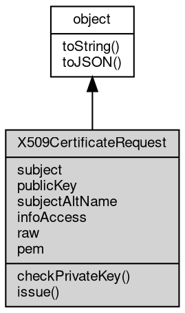

# 对象 X509CertificateRequest
X509CertificateRequest 对象是用于创建 x509 证书请求的对象，属于 [crypto](../../module/ifs/crypto.md) 模块

可以使用 crpto.createCertificateRequest 创建证书请求，例如：

```JavaScript
var crypto = require('crypto');

var pk = crypto.createPrivateKey(rsa4096_pem);
var req = crypto.createCertificateRequest({
    key: pk,
    subject: {
        C: "CN",
        O: "baoz.cn",
        CN: "baoz.me"
    }
});
```

通过调用 X509CertificateRequest 的 issue 方法可以生成正式的证书对象，例如：

```JavaScript
let crt = req.issue({
    key: issuer_pk,
    issuer: {
        C: "CN",
        O: "baoz.cn",
        CN: "baoz.me"
    }
});
```

需要注意的是，X509CertificateRequest 对象的作用是创建 x509 证书请求，而不是证书本身，要想获得有效的证书还需要对其进行签名。同时，签名证书所使用的公钥必须和证书请求中使用的公钥一致。

## 继承关系


## 成员属性
        
### subject
**String, 证书请求的主题**

```JavaScript
readonly String X509CertificateRequest.subject;
```

--------------------------
### publicKey
**[KeyObject](KeyObject.md), 证书请求认证的公钥**

```JavaScript
readonly KeyObject X509CertificateRequest.publicKey;
```

--------------------------
### subjectAltName
**String, 证书请求的主题备用名称**

```JavaScript
readonly String X509CertificateRequest.subjectAltName;
```

--------------------------
### infoAccess
**String, 证书请求的信息访问扩展，返回一个换行分隔的访问描述列表。每行开头为访问方法和访问位置的类型，后跟冒号和与访问位置关联的值**

```JavaScript
readonly String X509CertificateRequest.infoAccess;
```

--------------------------
### raw
**[Buffer](Buffer.md), 证书请求的原始二进制数据**

```JavaScript
readonly Buffer X509CertificateRequest.raw;
```

--------------------------
### pem
**String, 证书请求的 PEM 编码**

```JavaScript
readonly String X509CertificateRequest.pem;
```

## 成员函数
        
### checkPrivateKey
**检查证书请求的公钥是否与给定的私钥签名匹配**

```JavaScript
Boolean X509CertificateRequest.checkPrivateKey(KeyObject privateKey);
```

调用参数:
* privateKey: [KeyObject](KeyObject.md), 私钥

返回结果:
* Boolean, 如果匹配，则返回 true，否则返回 false

--------------------------
### issue
**根据请求内容签发正式证书**

```JavaScript
X509Certificate X509CertificateRequest.issue(Object options);
```

调用参数:
* options: Object, 证书签发选项

返回结果:
* [X509Certificate](X509Certificate.md), 返回签发的证书对象

options 内的参数会用于调用 [crypto.createPrivateKey](../../module/ifs/crypto.md#createPrivateKey) 创建私钥对象，此外还支持以下签名参数：
 - issuer: 签发者的主题信息，包含 key/value 对的 subject 信息
 - ca: 是否是 CA 证书，缺省为 false
 - pathlen: 证书链的最大长度，缺省为 -1
 - validFrom: 证书的生效时间，缺省为当前时间
 - validTo: 证书的失效时间，如果同时设定 days，则以 validTo 为准
 - days: 证书有效期，缺省为 100 天
 - hashAlgorithm: 签名的 hash 算法，缺省为 'sha256'
 - keyUsage: 证书的密钥用途，以数组形式提供，缺省为 []，支持的值有：
   - 'digitalSignature': 数字签名
   - 'nonRepudiation': 非否认
   - 'keyEncipherment': 密钥加密
   - 'dataEncipherment': 数据加密
   - 'keyAgreement': 密钥协商
   - 'keyCertSign': 证书签名
   - 'cRLSign': CRL 签名
   - 'encipherOnly': 加密
   - 'decipherOnly': 解密

- type: 证书的 Nescape 类型，以数组形式提供，缺省为 []，支持的值有：
   - 'client': 客户端
   - 'server': 服务器
   - 'email': 电子邮件
   - 'objsign': 对象签名
   - 'reserved': 保留
   - 'sslCA': SSL CA
   - 'emailCA': 电子邮件 CA
   - 'objCA': 对象 CA

--------------------------
### toString
**返回对象的字符串表示，一般返回 "[Native Object]"，对象可以根据自己的特性重新实现**

```JavaScript
String X509CertificateRequest.toString();
```

返回结果:
* String, 返回对象的字符串表示

--------------------------
### toJSON
**返回对象的 JSON 格式表示，一般返回对象定义的可读属性集合**

```JavaScript
Value X509CertificateRequest.toJSON(String key = "");
```

调用参数:
* key: String, 未使用

返回结果:
* Value, 返回包含可 JSON 序列化的值

