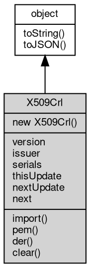

# 对象 X509Crl
X509Crl 对象是 [crypto](../../module/ifs/crypto.md) 模块中的一个对象，用来表示 X509 撤销证书，即证书的吊销列表，与 CA 相关的操作如 X509 证书链的验证都会用到撤销列表信息

X509Crl 在 [crypto](../../module/ifs/crypto.md) 模块声明，故可以通过下面的代码来引入：

```JavaScript
const crypto = require('crypto');
```

用户可以通过新建 X509Crl 类对象，调用对象的 import 方法加载一个 DER 或 PEM 格式的证书。可以通过 clear 方法清除已经加载的撤销证书列表信息，控制加载状态，以支持重复的证书加载工作。然后可以使用 nextUpdate 方法获取撤销列表的下次更新时间，调用 serials 获取证书吊销序列号列表等。

下面这个示例演示如何从文件中导入一个撤销证 ，并将其列表在控制台输出：

```JavaScript
const crypto = require('crypto');
const fs = require('fs');

// load a PEM format CRL
var pemFile = './mycrl.pem';
var pemText = fs.readFile(pemFile).toString();
var crl = new crypto.X509Crl(pemText);

// output serials of revoked certificates
for (var i = 0; i < crl.serials.length; i++) {
    console.log(crl.serials[i]);
}
```

## 继承关系


## 构造函数
        
### X509Crl
**X509Crl 构造函数**

```JavaScript
new X509Crl();
```

--------------------------
**X509Crl 构造函数,加载一个 DER 格式的撤销证书**

```JavaScript
new X509Crl(Buffer derCrl);
```

调用参数:
* derCrl: [Buffer](Buffer.md), DER 格式的撤销证书

--------------------------
**X509Crl 构造函数,加载一个 PEM 格式的撤销证书**

```JavaScript
new X509Crl(String pemCrl);
```

调用参数:
* pemCrl: String, PEM 格式的撤销证书

## 成员属性
        
### version
**Integer, 获取证书的版本**

```JavaScript
readonly Integer X509Crl.version;
```

--------------------------
### issuer
**String, 获取证书颁发者的可分辨名称**

```JavaScript
readonly String X509Crl.issuer;
```

--------------------------
### serials
**Array, 获取证书吊销序列号列表**

```JavaScript
readonly Array X509Crl.serials;
```

--------------------------
### thisUpdate
**Date, 获取证书的本次更新时间**

```JavaScript
readonly Date X509Crl.thisUpdate;
```

--------------------------
### nextUpdate
**Date, 获取证书的下次更新时间**

```JavaScript
readonly Date X509Crl.nextUpdate;
```

--------------------------
### next
**X509Crl, 获取证书链中得下一个证书**

```JavaScript
readonly X509Crl X509Crl.next;
```

## 成员函数
        
### import
**加载一个 DER 格式的撤销证书，可多次调用**

```JavaScript
X509Crl.import(Buffer derCrl);
```

调用参数:
* derCrl: [Buffer](Buffer.md), DER 格式的撤销证书

--------------------------
**加载一个 PEM 格式的撤销证书，可多次调用**

```JavaScript
X509Crl.import(String pemCrl);
```

调用参数:
* pemCrl: String, PEM 格式的撤销证书

--------------------------
### pem
**以 PEM 格式导出已经加载的撤销证书**

```JavaScript
String X509Crl.pem(Boolean all = true);
```

调用参数:
* all: Boolean, 指定是否输出全部证书，缺省为 true

返回结果:
* String, 以数组方式导出撤销证书链

--------------------------
### der
**以 DER 格式导出已经加载的撤销证书**

```JavaScript
Buffer X509Crl.der();
```

返回结果:
* [Buffer](Buffer.md), 以数组方式导出撤销证书链

--------------------------
### clear
**清空已经加载的撤销证书**

```JavaScript
X509Crl.clear();
```

--------------------------
### toString
**返回对象的字符串表示，一般返回 "[Native Object]"，对象可以根据自己的特性重新实现**

```JavaScript
String X509Crl.toString();
```

返回结果:
* String, 返回对象的字符串表示

--------------------------
### toJSON
**返回对象的 JSON 格式表示，一般返回对象定义的可读属性集合**

```JavaScript
Value X509Crl.toJSON(String key = "");
```

调用参数:
* key: String, 未使用

返回结果:
* Value, 返回包含可 JSON 序列化的值

