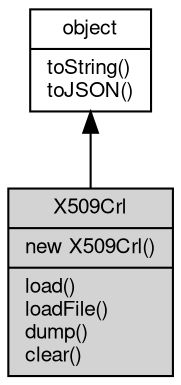

# 对象 X509Crl
x509 撤销证书对象

X509Crl 对象属于 [crypto](../../module/ifs/crypto.md) 模块，创建：

```JavaScript
var k = new crypto.X509Crl();
```

## 继承关系


## 构造函数
        
### X509Crl
**X509Crl 构造函数**

```JavaScript
new X509Crl();
```

## 成员函数
        
### load
**加载一个 DER 格式的撤销证书，可多次调用**

```JavaScript
X509Crl.load(Buffer derCrl);
```

调用参数:
* derCrl: [Buffer](Buffer.md), DER 格式的撤销证书

--------------------------
**加载一个 PEM 格式的撤销证书，可多次调用**

```JavaScript
X509Crl.load(String pemCrl);
```

调用参数:
* pemCrl: String, PEM 格式的撤销证书

--------------------------
### loadFile
**加载一个 PEM/DER 格式的撤销证书，可多次调用**

```JavaScript
X509Crl.loadFile(String filename);
```

调用参数:
* filename: String, 撤销证书文件名

--------------------------
### dump
**导出已经加载的撤销证书**

```JavaScript
Array X509Crl.dump();
```

返回结果:
* Array, 以数组方式导出撤销证书链

--------------------------
### clear
**清空已经加载的撤销证书**

```JavaScript
X509Crl.clear();
```

--------------------------
### toString
**返回对象的字符串表示，一般返回 "[Native Object]"，对象可以根据自己的特性重新实现**

```JavaScript
String X509Crl.toString();
```

返回结果:
* String, 返回对象的字符串表示

--------------------------
### toJSON
**返回对象的 JSON 格式表示，一般返回对象定义的可读属性集合**

```JavaScript
Value X509Crl.toJSON(String key = "");
```

调用参数:
* key: String, 未使用

返回结果:
* Value, 返回包含可 JSON 序列化的值

