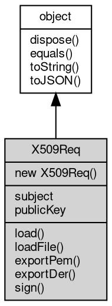

# 对象 X509Req
x509 证书请求对象

X509Req 对象属于 [crypto](../../module/ifs/crypto.md) 模块，创建：

```JavaScript
var k = new crypto.X509Req();
```

## 继承关系


## 构造函数
        
### X509Req
**X509Req 构造函数**

```JavaScript
new X509Req();
```

--------------------------
**X509Req 构造函数，根据给定的信息创建一个证书请求**

```JavaScript
new X509Req(String subject,
    PKey key,
    Integer hash = hash.SHA1);
```

调用参数:
* subject: String, 证书的主题可分辨名称
* key: [PKey](PKey.md), 证书的公钥
* hash: Integer, 证书摘要算法，缺省为 [hash.SHA1](../../module/ifs/hash.md#SHA1)

## 成员属性
        
### subject
**String, 获取证书的主题可分辨名称**

```JavaScript
readonly String X509Req.subject;
```

--------------------------
### publicKey
**[PKey](PKey.md), 获取证书的公钥**

```JavaScript
readonly PKey X509Req.publicKey;
```

## 成员函数
        
### load
**加载一个 DER 格式的证书请求**

```JavaScript
X509Req.load(Buffer derReq);
```

调用参数:
* derReq: [Buffer](Buffer.md), DER 格式的证书请求

--------------------------
**加载一个 PEM 格式的证书请求**

```JavaScript
X509Req.load(String pemReq);
```

调用参数:
* pemReq: String, PEM 格式的证书请求

--------------------------
### loadFile
**加载一个 PEM/DER 格式的证书请求，可多次调用**

```JavaScript
X509Req.loadFile(String filename);
```

调用参数:
* filename: String, 证书请求文件名

--------------------------
### exportPem
**返回当前证书请求的 PEM 格式编码**

```JavaScript
String X509Req.exportPem();
```

返回结果:
* String, 当前证书请求的 PEM 格式编码

--------------------------
### exportDer
**返回当前证书请求的 DER 格式编码**

```JavaScript
Buffer X509Req.exportDer();
```

返回结果:
* [Buffer](Buffer.md), 当前证书请求的 DER 格式编码

--------------------------
### sign
**签名当前证书请求为正式证书**

```JavaScript
X509Cert X509Req.sign(String issuer,
    PKey key,
    Object opts = {}) async;
```

调用参数:
* issuer: String, 签名机构的可分辨名称
* key: [PKey](PKey.md), 签名机构的私钥
* opts: Object, 其他可选参数

返回结果:
* [X509Cert](X509Cert.md), 返回签名后的正式证书

opts 接收的字段如下：

```JavaScript
{
    ca: false, // 证书为 ca，缺省为 false
    pathlen: -1, // 证书深度，缺省为 -1
    notBefore: "", // 证书生效时间，缺省为当前时间
    notAfter: "", // 证书失效时间，缺省为 notBefore 后一年
    usage: "", // 证书使用范围，接收：digitalSignature, nonRepudiation, keyEncipherment, dataEncipherment, keyAgreement, keyCertSign, cRLSign
    type: "" // 证书 Netscape 证书类型，接收：client, server, email, objsign, reserved, sslCA, emailCA, objCA
}
```

--------------------------
### dispose
**强制回收对象，调用此方法后，对象资源将立即释放**

```JavaScript
X509Req.dispose();
```

--------------------------
### equals
**比较当前对象与给定的对象是否相等**

```JavaScript
Boolean X509Req.equals(object expected);
```

调用参数:
* expected: [object](object.md), 制定比较的目标对象

返回结果:
* Boolean, 返回对象比较的结果

--------------------------
### toString
**返回对象的字符串表示，一般返回 "[Native Object]"，对象可以根据自己的特性重新实现**

```JavaScript
String X509Req.toString();
```

返回结果:
* String, 返回对象的字符串表示

--------------------------
### toJSON
**返回对象的 JSON 格式表示，一般返回对象定义的可读属性集合**

```JavaScript
Value X509Req.toJSON(String key = "");
```

调用参数:
* key: String, 未使用

返回结果:
* Value, 返回包含可 JSON 序列化的值

